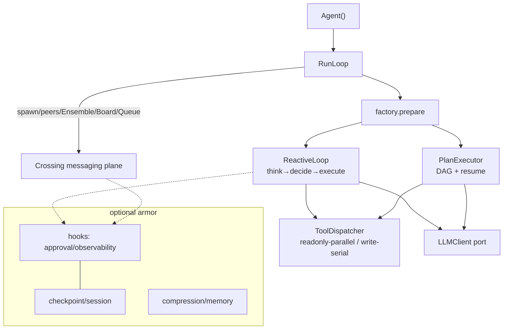

# prodagent

> An industrial-grade LLM agent implementation you can actually **finish reading**. 25,000 lines, 13 packages, 1,182 offline tests — loop, budgets, recovery, HITL approval, multi-agent collaboration; every mechanism small enough to read in one sitting, complete enough to run in production.

[](https://pypi.org/project/prodagent/)
[](https://github.com/limenagent/prodagent/actions/workflows/ci.yml)
[](https://www.python.org/downloads/)
[](LICENSE)

[中文](README.md) · **English** · Companion to the GeekTime column (Chinese) [《生产级 Agent 排雷实战》](http://gk.link/a/12L6Q)

## Why this codebase is worth your time

The barrier to agent development isn't the demo — it's everything after it. Runaway loops, state lost to crashes, ungated side effects, exploding contexts: every team that ships to production hits this same batch of problems, yet the solutions are scattered across papers, issue threads, and hundreds of thousands of lines of industrial source.

This repo puts them in one place you can finish reading. But reading is just the start; the real value comes in three layers:

**First, you can debug it live.** The whole framework runs offline: tests need no network, and every turn of the nine examples' model behavior is a reproducible script. You can set a breakpoint inside the `chat()` call chain, change a budget parameter and watch it halt, rip out the approval gate and see what happens — the deepest way to understand a mechanism is to debug it, not to memorize its conclusions.

**Second, the production features go straight into your work.** This is a `pip install`-able library, not a teaching toy. Budgets, approval, crash recovery, context compression, multi-agent governance — each mechanism is an independent module; take whichever piece your project is missing.

**Third, it's the dividing line between junior and senior.** Plenty of people can write an agent demo; few know what comes after the demo, why, and at what cost. That judgment normally only comes from production scars. Here it's compressed into 25,000 lines across thirteen packages, ordered from vocabulary to collaboration, with one design principle running throughout.

By the end of this codebase and its docs, what you gain isn't familiarity with one framework — it's **the ability to design a production-grade agent framework of your own**.

[→ Start your production-grade agent design: Part I, seven stations through the lifecycle of a single call](docs/tour/index.md)


## Quickstart

```python
import asyncio

from prodagent import Agent, ExecutionMode, tool

@tool(name="search", readonly=True)
async def search(query: str) -> str:
    return f"results for: {query}"

agent = Agent("demo", system_prompt="Find answers.", tools=[search],
              mode=ExecutionMode.REACTIVE)

asyncio.run(agent.chat("What's the weather in Paris?"))   # zero files
```

Full production stack (durable recovery, span tracing, HITL gate on HIGH tools, LLM cache, context compression):

```python
from prodagent.core.config import production

agent = Agent("demo", ..., config=AgentConfig(name="demo", framework=production()))
```

Visual playground (runs all 9 examples offline):

```bash
make playground
```

<details>
<summary>Install & model config</summary>

```bash
pip install prodagent
# 4 core deps: anyio/httpx/pydantic/typing-extensions. Opt-ins:
pip install "prodagent[openai,anthropic]"      # providers
pip install "prodagent[playground]"             # visual UI
pip install "prodagent[postgres,redis,neo4j]"   # prod backends (file+memory by default)
```

Model config, one of: `USE_FAKE_LLM=1` (offline); `LLM_BASE_URL` / `LLM_API_KEY` /
`LLM_MODEL` for any OpenAI-compatible endpoint; `ANTHROPIC_API_KEY`.

</details>

**[→ Full docs: learning path · a call's lifecycle · topics · examples](https://limenagent.github.io/prodagent/)**

## Capabilities

| Capability | One line | Source |
|---|---|---|
| **Bare-kernel default** | `Agent()` touches zero files; `production()` restores the stack | `core/config.py` |
| **Four-axis hard budget** | turns/seconds/tokens/cost, any breach halts; child spend rolls up | `core/budget.py`, `coordination/budget_ledger.py` |
| **Crash recovery** | checkpoints + optimistic versions; resume after kill -9 | `ports/checkpoint.py`, `backends/file/` |
| **HITL approval** | HIGH side-effect tools suspend for a human; rejection triggers incremental replan | `hooks/approval/` |
| **Three execution modes** | REACTIVE / PLAN_FIRST (dynamic DAG) / Workflow (static DAG) | `runtime/`, `plan/` |
| **Five collaboration primitives** | agents= delegation, peers= relay, Ensemble / Blackboard / WorkQueue | `coordination/` |
| **Unified messaging plane** | every cross-agent crossing through one pipeline: dedupe→contract→gate→audit→dead letter | `coordination/messaging/` |
| **Five-level compression** | graded sacrifice by token usage, each level with a defined semantic loss | `cognition/context/` |
| **Four-channel memory** | rule/entity/exact/semantic parallel recall + conflict resolution + decay | `cognition/memory/` |
| **Pluggable backends** | 14 Protocol ports; file+memory default, Postgres/Redis/Neo4j swappable | `ports/`, `backends/factory.py` |
| **Skills loop** | successful runs distill into runbooks, loaded on demand | `skills/` |
| **MCP bridge** | external tools over stdio/HTTP | `mcp/` |

## Architecture



The package tree is the learning order: `core → ports → llm → tooling → runtime → plan → coordination → cognition → hooks → skills → backends → mcp → playground`.

## Nine end-to-end examples

| # | Example | Scenario | Teaches |
|---|---|---|---|
| 1 | [greeter](examples/greeter) | minimal agent | `@tool` + `Agent` + REACTIVE |
| 2 | [trader](examples/trader) | bubble-tea negotiation | multi-turn + memory constraints + HIGH approval |
| 3 | [deep_research](examples/deep_research) | exploratory research | REACTIVE tree + five-level compression |
| 4 | [compliance_audit](examples/compliance_audit) | financial audit | dynamic DAG + reject→incremental replan |
| 5 | [code_detective](examples/code_detective) | autonomous bug fixing | MCP bridge + skills |
| 6 | [trip_planner](examples/trip_planner) | trip planning | Workflow DAG + 3 parallel peers |
| 7 | [aiops](examples/aiops) | incident response | spawn + peers + skills + approval, full stack |
| 8 | [dating_chat](examples/dating_chat) | agent speed-dating | Ensemble shared floor + memory A/B |
| 9 | [quiz_arena](examples/quiz_arena) | quiz show | WorkQueue (leases+dead letter) + Blackboard |

All run offline (FakeLLM scripts precise to per-turn tool calls) — the same machinery behind 1,182 tests.

## License

AGPL v3 — see [LICENSE](LICENSE).
