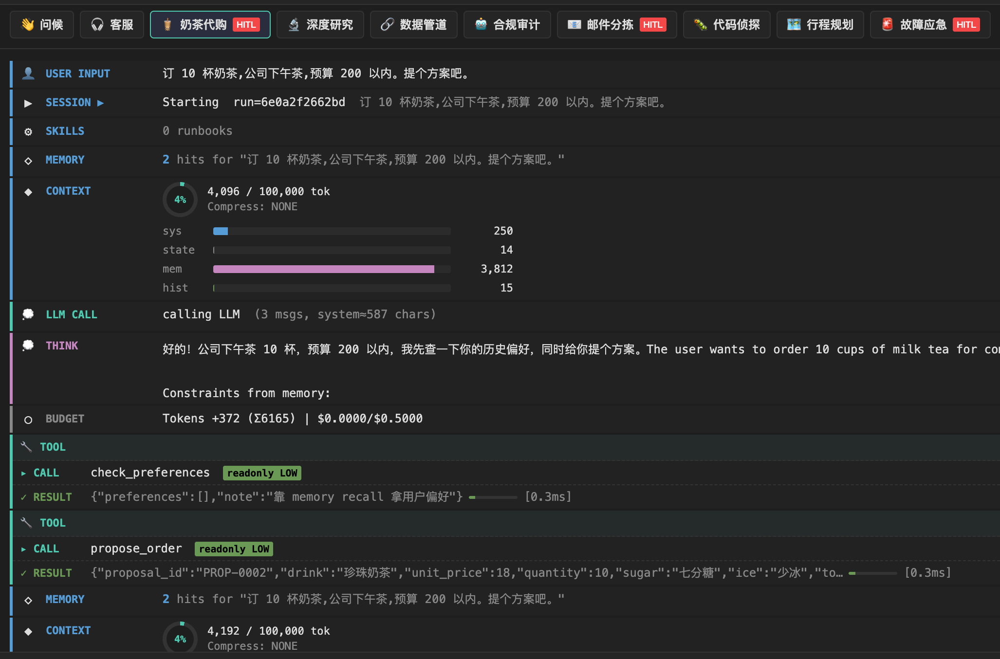
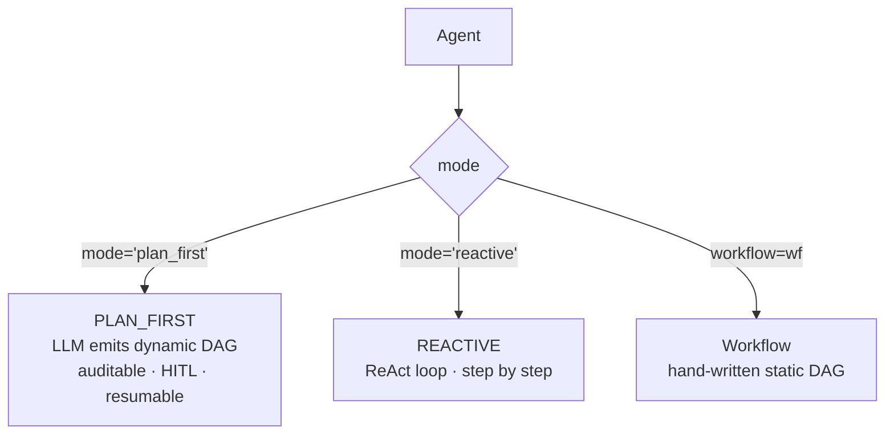
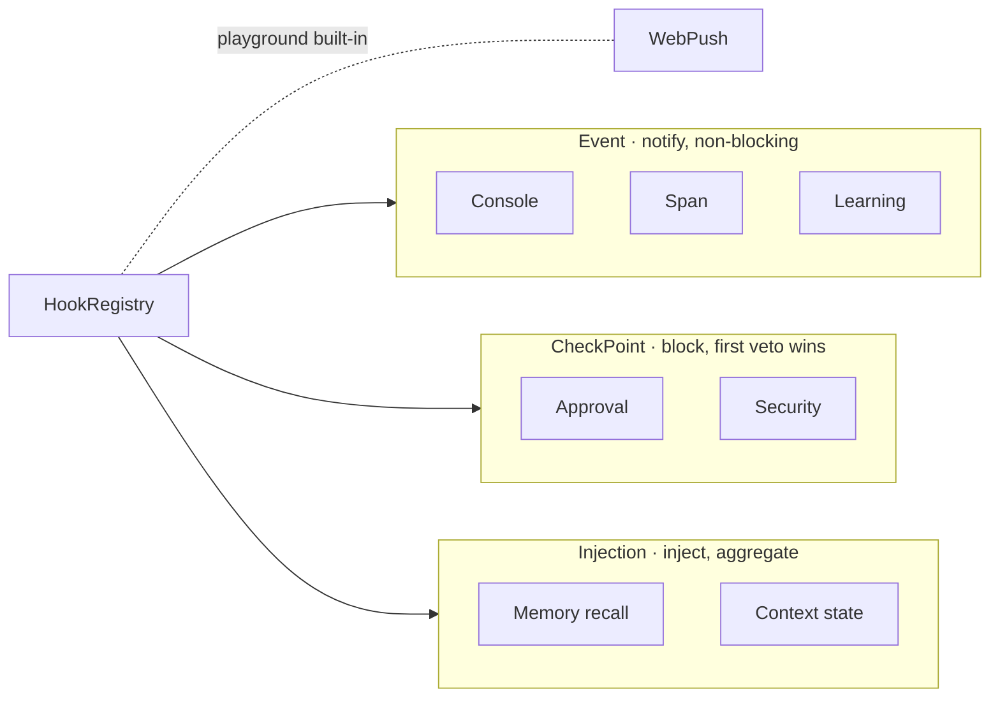
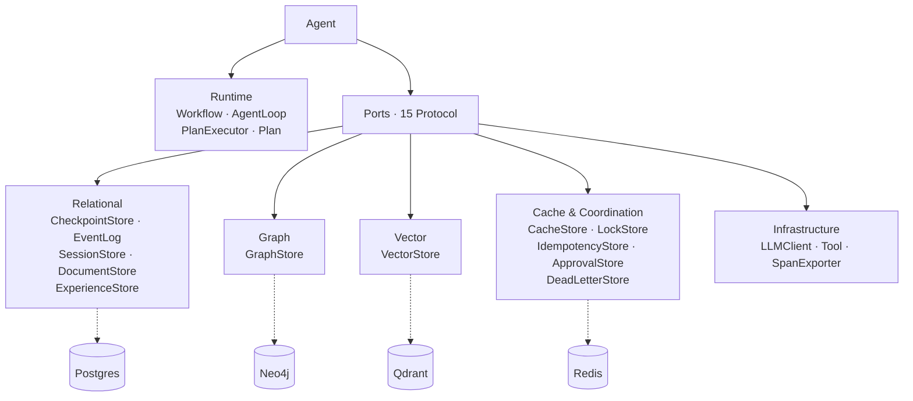

# prodagent

> A production-grade LLM agent framework. The model is probabilistic; production demands determinism — this framework makes the brakes, guardrails, and state machine first-class citizens.

[](https://pypi.org/project/prodagent/)
[](https://www.python.org/downloads/)
[](LICENSE)
[](https://github.com/limenagent/prodagent/releases)

**[中文文档](README.md)** · English

This is the open-source framework accompanying the GeekTime column [*Production-Grade Agent Pitfall Field Guide*](http://gk.link/a/12L6Q). The column walks through the Why behind each architectural decision; this repo lands the How in code.

## Why this framework

Getting an Agent to run, and keeping it alive in production, are two different things. Push it to production and the model hallucinates termination, crashes lose state, old and new memories clash, tools overstep, costs creep ... every project hits the same potholes. prodagent makes this layer a first-class framework citizen — not another LangChain, just the layer that makes an agent safe to run in production.



## Core Capabilities

### Production infrastructure

- **Four-axis hard budget** — turns / seconds / tokens / cost_usd as four independent axes; any axis tripping triggers a hard stop, with sub-agent spend rolling up to the parent in real time.
- **Crash recovery** — checkpoint + event log + optimistic versioning; a crashed process resumes from the breakpoint on restart, and IO failure doesn't block the business loop.
- **Pluggable backends** — file + memory by default (single-host, zero-dependency); swap to Postgres / Neo4j / Qdrant / Redis in production. Swapping is a config change, not a code change.
- **Retry** — fixed / exponential / jittered backoff, classified by error code to decide whether to retry or fall back.
- **Circuit breaking** — tool-level (CLOSED → OPEN → HALF_OPEN auto-recovery) + agent-level (agents that repeatedly overstep get suspended).
- **Security** — five-layer injection-defense pipeline + three-level taint tracking + write-time interception + tiered tool permissions + HITL approval gate.
- **Observability** — span tracing + OTLP export + trajectory drift detection.
- **Eval & testing** — golden eval suite + LLM Judge + CI regression.

<details>
<summary>📂 Source file index (click to expand)</summary>

| Capability | Core source files (`src/prodagent/`) |
|---|---|
| Four-axis hard budget | `core/budget.py`, `runtime/coordination/budget_ledger.py`, `runtime/coordination/accounting.py`, `resilience/cost/pricing.py` |
| Crash recovery | `ports/checkpoint.py`, `backends/file/checkpoint.py`, `backends/postgres/checkpoint.py`, `backends/postgres/_versioned.py`, `core/event_log.py`, `ports/event_log.py`, `runtime/plan/event_log.py`, `core/state/run.py` |
| Pluggable backends | `ports/` (15 Protocol ports), `backends/factory.py`, `backends/registry.py`, `backends/file/`, `backends/memory/`, `backends/postgres/`, `backends/neo4j/`, `backends/qdrant/`, `backends/redis/` |
| Retry | `resilience/reliability/retry.py`, `resilience/transport/http_retry.py`, `core/error_classifier.py`, `core/error_reason.py` |
| Circuit breaking | `tooling/reliability/circuit_breaker.py`, `guardrail/permission/circuit_breaker.py`, `guardrail/permission/scopes.py` |
| Security | `guardrail/injection/pipeline.py`, `guardrail/injection/trust_chain.py`, `guardrail/patterns.py`, `guardrail/permission/taint.py`, `guardrail/permission/scopes.py`, `guardrail/approval/gate.py`, `guardrail/approval/routing.py`, `guardrail/approval/formatter.py`, `hooks/bundles/security/` |
| Observability | `core/observability.py`, `resilience/observability/otel_exporter.py`, `resilience/observability/drift.py`, `resilience/observability/audit.py`, `resilience/observability/scrubber.py`, `ports/span.py`, `hooks/bundles/observability.py` |
| Eval & testing | `evaluation/evals/dataset.py`, `evaluation/evals/judge.py`, `evaluation/evals/runner.py`, `evaluation/testing/trace_assert.py`, `evaluation/testing/cassette.py` |

</details>

### Orchestration

- **Three execution modes** — `PLAN_FIRST` (LLM emits a dynamic PLAN DAG; auditable, HITL-reviewable, resumable from breakpoint) / `REACTIVE` (ReAct loop, step by step) / `Workflow` (hand-written static PLAN DAG).
- **Inter-agent collaboration** — five primitives, each with a different driving model: `agents=` push vertical delegation (parent spawns child, child returns result, parent continues); `peers=` push horizontal handoff (terminates the current run, a peer takes over); `Ensemble` shared floor, turn-taking; `Blackboard` shared board, field changes trigger experts, `buzz_in` locks first then computes; `WorkQueue` workers claim work themselves, lease-timeout requeue, retry-exhausted to dead-letter. All five share one `BudgetLedger`.
- **Context sandwich** — state / memory / skills / history / reminder assembled as a five-layer sandwich; each layer independently controllable and compressible.
- **Five-level compression** — NONE / TOOL_COMPRESS / HISTORY_SUMMARY / TOPIC_SUMMARY / EMERGENCY, auto-triggered by token occupancy ratio, with each level having a clear semantic loss boundary.
- **Tool system** — `@tool` decorator for declarative registration, tiered by side-effect level (LOW/MEDIUM/HIGH); native MCP protocol support for external tools.

<details>
<summary>📂 Source file index (click to expand)</summary>

| Capability | Core source files (`src/prodagent/`) |
|---|---|
| Three execution modes | `runtime/agent.py`, `runtime/plan/planner.py`, `runtime/plan/dag.py`, `runtime/plan/executor.py`, `runtime/plan/step_runner.py`, `runtime/plan/bootstrap.py`, `runtime/reactive.py`, `runtime/workflow.py`, `runtime/runner.py` |
| Inter-agent collaboration | `runtime/coordination/spawn.py`, `runtime/coordination/peer.py`, `runtime/coordination/ensemble.py`, `runtime/coordination/floor.py`, `runtime/coordination/floor_projection.py`, `runtime/coordination/blackboard.py`, `runtime/coordination/work_queue.py`, `runtime/coordination/budget_ledger.py`, `runtime/coordination/handoff.py`, `runtime/coordination/termination.py`, `runtime/coordination/run_loop.py`, `runtime/coordination/parent_runtime.py` |
| Context sandwich | `cognition/context/manager.py`, `cognition/context/budget.py`, `cognition/context/spill.py`, `cognition/context/tool_results.py` |
| Five-level compression | `cognition/context/compression/pipeline.py`, `cognition/context/compression/summarizer.py`, `cognition/context/compression/formatting.py` |
| Tool system | `tooling/decorator.py`, `tooling/base.py`, `tooling/registry.py`, `tooling/dispatcher.py`, `tooling/runner.py`, `tooling/search.py`, `tooling/skill_resolver.py`, `tooling/reliability/locks.py`, `mcp/bridge.py`, `mcp/client.py`, `mcp/registry.py`, `mcp/config.py`, `mcp/transports/` |

</details>

### Advanced capabilities

- **Four-channel long-term memory** — rule / entity / exact / semantic recall in parallel, with ACT-R activation decay.
- **Tri-protocol hook bus** — Event (notify) / CheckPoint (block) / Injection (inject) separated at the protocol layer.
- **Self-evolving loop** — successful runs distill into Skills, loaded on demand next time.

<details>
<summary>📂 Source file index (click to expand)</summary>

| Capability | Core source files (`src/prodagent/`) |
|---|---|
| Four-channel long-term memory | `cognition/memory/manager.py`, `cognition/memory/channels.py`, `cognition/memory/forgetting.py`, `cognition/memory/facts.py`, `cognition/memory/classification.py`, `cognition/memory/storage.py`, `cognition/memory/conflict.py`, `cognition/memory/embedder.py`, `cognition/memory/touch_worker.py`, `hooks/bundles/memory.py` |
| Tri-protocol hook bus | `hooks/registry.py`, `hooks/events.py`, `hooks/checkpoint.py`, `hooks/bundles/base.py`, `hooks/bundles/default_wiring.py`, `hooks/observers/console.py`, `hooks/observers/cache_monitor.py` |
| Self-evolving loop | `evaluation/learning/skill_synthesizer.py`, `evaluation/learning/experience.py`, `evaluation/learning/storage.py`, `evaluation/skills/registry.py`, `evaluation/reflection/constitutional.py`, `hooks/bundles/learning.py` |

</details>

## Quickstart

### 1. Install uv

uv manages Python and deps — no separate Python install needed.

| OS | Command |
|------|------|
| Mac / Linux | `curl -LsSf https://astral.sh/uv/install.sh \| sh` |
| Windows (PowerShell) | `powershell -c "irm https://astral.sh/uv/install.ps1 \| iex"` |

### 2. Start the playground

| OS | Command |
|------|------|
| Mac / Linux | `make playground` |
| Windows (or no `make`) | `uv sync && uv run prodagent --port 8766` |

Browser opens `http://127.0.0.1:8766` automatically.

### 3. Configure LLM

First run launches an interactive wizard with two choices:

- **FakeLLM** — offline, no key needed, try all 10 examples immediately
- **OpenAI-compatible endpoint** — provide `LLM_BASE_URL` / `LLM_API_KEY` / `LLM_MODEL`. Works with any vendor implementing the OpenAI Chat Completions protocol: DeepSeek, Qwen, Moonshot, Zhipu, Groq, Ollama, self-hosted gateways, etc.

Or skip the wizard and write `.env` in the repo root directly:

```
USE_FAKE_LLM=1
```

```
LLM_BASE_URL=https://open.bigmodel.cn/api/paas/v4
LLM_API_KEY=xxx
LLM_MODEL=glm-5.2
```

Production backends: `make playground-prod` (auto-starts Postgres / Neo4j / Qdrant / Redis).

### End-to-End Examples: 9 Scenarios, From Minimal Skeleton to Full-Stack Assembly

| # | Example | Scenario | Core Capabilities                                                                                                                             |
|---|---------|----------|-----------------------------------------------------------------------------------------------------------------------------------------------|
| 1 | [greeter](examples/greeter) | Minimal runnable agent | `@tool` + `Agent` + `mode="reactive"` trinity                                                                                                     |
| 2 | [trader](examples/trader) | Bubble-tea order negotiation | Conversational multi-turn negotiation (propose → counter → adjust → place order) + memory-driven replan + HIGH-side-effect HITL approval gate |
| 3 | [deep_research](examples/deep_research) | Multi-round exploratory research | REACTIVE exploration tree + five-level context compression + injection defense + memory dedup                                                 |
| 4 | [compliance_audit](examples/compliance_audit) | Financial compliance audit + dynamic Plan + human approval gate | `PLAN_FIRST` LLM-dynamic DAG + human approval gate (Approve/Reject) + auto-replan + idempotent write tool            |
| 5 | [code_detective](examples/code_detective) | Autonomous bug fixing | MCP stdio server bridging external tools + REACTIVE multi-round debugging                                                                     |
| 6 | [trip_planner](examples/trip_planner) | Trip planning | `Workflow` DAG + 3-peer parallel fan-out + `MemoryManager` preference injection                                                               |
| 7 | [aiops](examples/aiops) | Full-stack incident response | Multi-agent spawn + peer handoff + memory + learning + observability + approval                                                               |
| 8 | [dating_chat](examples/dating_chat) | Agent blind date | `Ensemble` dual-agent shared floor + real framework Agent vs simple agent — memory & context contrast                  |
| 9 | [quiz_arena](examples/quiz_arena) | Buzzer quiz contest | `WorkQueue` backstage question review (work stealing + lease timeout + dead-lettering) feeding a `Blackboard` live buzz-in round (`buzz_in` locks first then computes, asserted via real compute-call counts) |

### Installation

```bash
pip install prodagent
# Backend drivers for production, as needed:
pip install "prodagent[postgres,redis,neo4j,qdrant]"
```

### Use the SDK

```python
import asyncio

from prodagent import Agent, ExecutionMode, HardBudget, tool


@tool(name="search", readonly=True)
async def search(query: str) -> str:
    return f"results for: {query}"


agent = Agent(
    "demo",
    system_prompt="Find answers.",
    tools=[search],
    mode=ExecutionMode.REACTIVE,
    budget=HardBudget(max_turns=20, max_cost_usd=1.0, max_seconds=1800.0),
)


asyncio.run(agent.chat("What is the weather in Paris?"))
```

### Debug in PyCharm

1. Open this repo in PyCharm and pick the project `.venv` as the interpreter.
2. Run → Edit Configurations → add a **Python** configuration: Script path `src/prodagent/playground/server.py`, Working directory = repo root.
3. Environment variables, one of:
   - Offline, zero deps: `USE_FAKE_LLM=1`
   - Production backends: run `make services-up` first, then copy the `PRODAGENT_BACKEND=prod` / `DATABASE_URL` / `REDIS_URL` / `NEO4J_*` / `QDRANT_*` block from `make playground-prod`.
4. Click **Debug** — set breakpoints anywhere under `src/prodagent`; PyCharm's debugger attaches automatically (no manual debugpy needed).
5. Default port 8765: `http://127.0.0.1:8765`

## Architecture

Agent is the assembly entry point. Three architectural decisions: execution mode is switchable, cross-cutting capabilities mount as pluggable Bundles, and backends are Protocol ports — replaceable.

### Execution mode



### Hook tri-protocol bus

HookRegistry fans out by protocol. Three protocols have distinct semantics: Event is non-blocking notification, CheckPoint blocks until first veto, Injection aggregates injector results.



### Backend ports

15 Protocol ports, each independently replaceable. Default file + memory is single-host zero-dependency; production splits backends by data type — relational to Postgres, graph to Neo4j, vector to Qdrant, cache & coordination to Redis.



## License

AGPL v3 — see [LICENSE](LICENSE).
