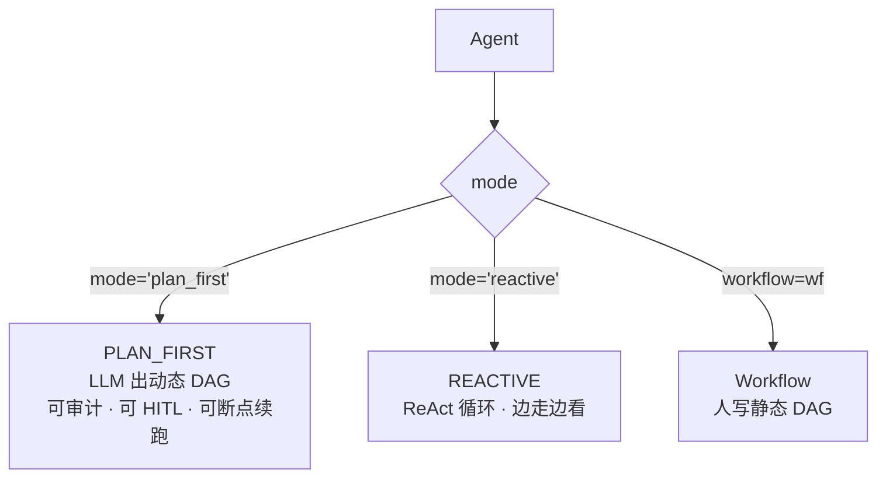
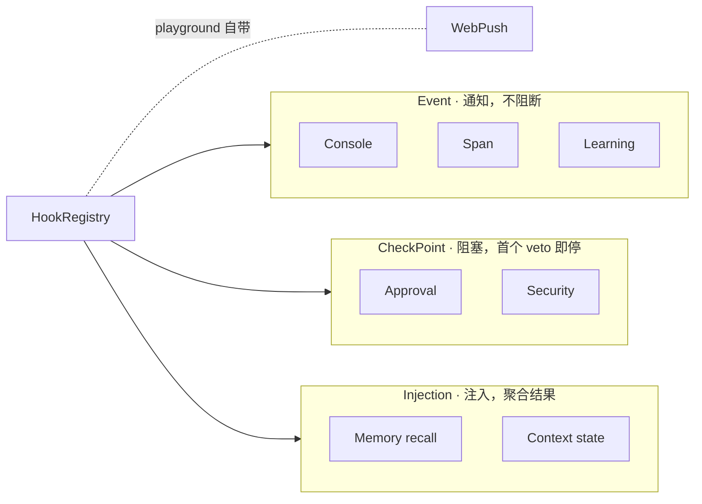
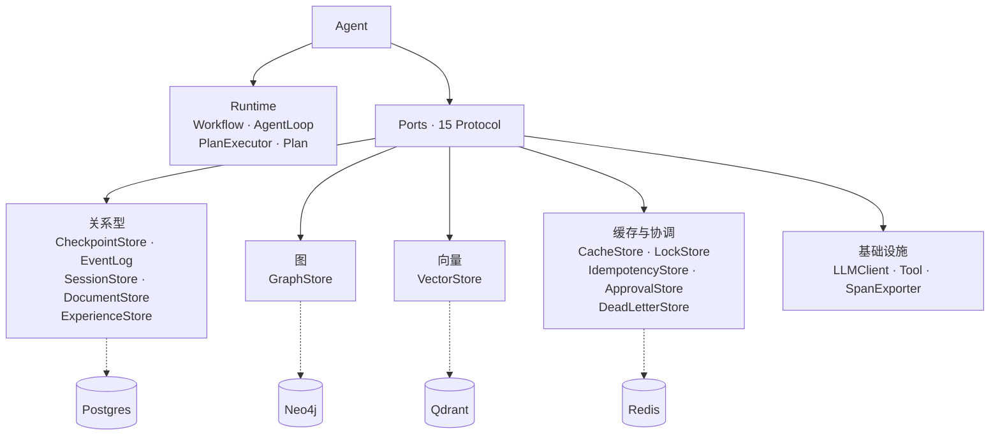

# prodagent

> 生产级 LLM agent 框架。大模型是概率的，生产要求确定性——这个框架把刹车、护栏、状态机做成一等公民。

[](https://pypi.org/project/prodagent/)
[](https://www.python.org/downloads/)
[](LICENSE)
[](https://github.com/limenagent/prodagent/releases)

**中文文档** · [English](README.en.md)

这是极客时间专栏[《生产级 Agent 排雷实战》](http://gk.link/a/12L6Q)的配套开源框架。专栏讲透每个架构决策的 Why，本仓库用代码落地具体的 How。

## 为什么做这个框架

让 Agent 跑起来，和让它在生产里活下去，是两件事。跑起来推到生产，模型会幻觉终止、崩了丢状态、新旧记忆打架、越权操作、成本飙升 ... 每个项目都踩同一批坑，prodagent 把这层做成框架一等公民，不是又一个 LangChain，只做"生产环境敢上线"的那一层。

下图是 Agent 的可视化事件流 —— 每个 Agent 生命周期事件（PLAN 的 DAG、STEP 状态、SUB-AGENT fan-out、TOOL CALL、BUDGET ...）都是一张可观测的卡片。


## 核心能力

### 生产基建

- **四维硬预算** —— turns / seconds / tokens / cost_usd 四个独立维度，任一触顶即硬停，子 Agent 花销实时汇总回父 Agent。

- **崩溃恢复** —— checkpoint + 事件日志 + 乐观版本控制，进程崩了重启从断点续跑。

- **可替换后端** —— 默认 file + memory 开箱即用，生产可换 Postgres / Neo4j / Qdrant / Redis。

- **重试** —— fixed / exponential / jittered 三种 backoff 策略，按错误码统一分类决定是否重试、是否降级。

- **熔断** —— 工具级（ CLOSED → OPEN → HALF_OPEN 自动探测恢复）+ Agent级（反复越权的 Agent 自动 suspend）。

- **安全** —— 五层注入防护管道 + 三级污点追踪 + 写时拦截 + 分层工具权限 + HITL 审批门禁。

- **可观测** —— Span 追踪 + OTLP 导出 + 轨迹漂移检测。

- **评估测试** —— 黄金评测集 + LLM Judge + CI 回归。

### 编排能力

- **三执行模式** —— `PLAN_FIRST`（LLM 动态出 PLAN DAG，可审计、可 HITL、可断点续跑）/ `REACTIVE`（ReAct 循环，边走边看）/ `Workflow`（人写静态 PLAN DAG）。

- **Agent 协作** —— `agents=` 垂直委派（父 spawn 子，子返回结果）；`peers=` 横向接力（终止当前 run，peer 接力继续）。

- **上下文三明治** —— state / memory / skills / history / reminder 五段式组装，每段独立可控、独立可压缩。

- **五级压缩** —— NONE / TOOL_COMPRESS / HISTORY_SUMMARY / TOPIC_SUMMARY / EMERGENCY，按 token 占用比例自动触发，每级有明确的语义损失边界。

- **工具系统** —— `@tool` 装饰器声明式注册，按副作用分层（LOW/MEDIUM/HIGH）；原生 MCP 协议接入外部工具。

### 进阶能力

- **四通道长期记忆** —— 规则 / 实体 / 精确 / 语义并行 recall + ACT-R 激活衰减。

- **三协议 Hook 总线** —— Event（通知）/ CheckPoint（阻塞）/ Injection（注入）协议层分离。

- **自我进化闭环** —— 成功的 run 蒸馏成 Skill，下次按需加载。

## 快速开始

一条命令起 playground——自动装 uv、首跑弹配置向导、开浏览器：

```bash
make playground
```

首次运行进入交互式向导，二选一：

- **FakeLLM** —— 离线，零 key，直接体验 10 个 example
- **OpenAI 兼容端点** —— 填 `LLM_BASE_URL` / `LLM_API_KEY` / `LLM_MODEL`。DeepSeek、Qwen、Moonshot、Zhipu 等任何 OpenAI Chat Completions 协议厂商均适用

不想跑向导，在仓库根目录写 `.env` 即可跳过：

```
USE_FAKE_LLM=1
# 或
LLM_BASE_URL=https://open.bigmodel.cn/api/paas/v4
LLM_API_KEY=xxx
LLM_MODEL=glm-5.2
``` 

> 没有 `make`（Windows 等）？先装 uv：`powershell -c "irm https://astral.sh/uv/install.ps1 | iex"`，再 `uv sync && uv run prodagent --port 8766`。

启动后浏览器自动打开 `http://127.0.0.1:8766`。切生产后端：`make playground-prod`（自动拉起 Postgres / Neo4j / Qdrant / Redis）。

### 端到端示例：8 个场景，从最小骨架到全栈组装

| # | Example | 场景 | 核心能力                                                                             |
|---|---------|------|----------------------------------------------------------------------------------|
| 1 | [greeter](examples/greeter) | 最小可跑 Agent | `@tool` + `Agent` + `mode="reactive"` 三件套                                            |
| 2 | [trader](examples/trader) | 奶茶代购下单协商 | 对话式多轮协商（提案→反驳→调整→下单）+ memory 驱动 replan + HIGH 副作用 HITL 审批                        |
| 3 | [deep_research](examples/deep_research) | 多轮探索式研究 | REACTIVE 探索树 + 五级 context 压缩 + 注入防御 + 记忆防重复                                      |
| 4 | [compliance_audit](examples/compliance_audit) | 金融合规审计 + 崩溃恢复 | `Workflow` 写死 DAG + `FileCheckpointStore` + event log 重放 + `fork_run` 分叉 + 幂等写工具 |
| 5 | [email_triage](examples/email_triage) | 邮件分拣 + 分级审批 | `Workflow` + `wf.llm_step`/`wf.tool_step` + 三级副作用 HITL 路由                        |
| 6 | [code_detective](examples/code_detective) | 自主修 bug | MCP stdio server 桥接外部工具 + REACTIVE 多轮调试                                          |
| 7 | [trip_planner](examples/trip_planner) | 旅行规划 | `Workflow` DAG + 3 peer 并行 fan-out + `MemoryManager` 偏好注入                        |
| 8 | [aiops](examples/aiops) | 故障应急全栈 | 多 Agent spawn + peer handoff + 记忆 + 学习 + 可观测 + 审批                                |

### 安装

```bash
pip install prodagent
# 生产后端驱动按需安装
pip install "prodagent[postgres,redis,neo4j,qdrant]"
```

### 调用框架 SDK

```python
import asyncio

from prodagent import Agent, ExecutionMode, HardBudget, tool


@tool(name="search", readonly=True)
async def search(query: str) -> str:
    return f"results for: {query}"


agent = Agent(
    "demo",
    system_prompt="Find answers.",
    tools=[search],
    mode=ExecutionMode.REACTIVE,
    budget=HardBudget(max_turns=20, max_cost_usd=1.0, max_seconds=1800.0),
)


asyncio.run(agent.chat("What is the weather in Paris?"))
```

### 在 PyCharm 中调试

1. 用 PyCharm 打开本仓库，解释器选项目的 `.venv`。
2. Run → Edit Configurations → 新建 **Python** 配置：Script path 选 `src/prodagent/playground/server.py`，Working directory 设为仓库根目录。
3. 环境变量二选一：
   - 离线零依赖：加 `USE_FAKE_LLM=1`
   - 生产后端：先 `make services-up` 拉起 Postgres/Redis/Neo4j/Qdrant，再加 `make playground-prod` 里的 `PRODAGENT_BACKEND=prod` 及 `DATABASE_URL` / `REDIS_URL` / `NEO4J_*` / `QDRANT_*`
4. 点 **Debug**，断点打在 `src/prodagent` 任意文件即可 —— PyCharm 调试器自动 attach，不需要手动接 debugpy。
5. 默认端口 8765，浏览器打开 `http://127.0.0.1:8765`。

## 架构

Agent 是装配入口。三类架构决策：执行模式可切换、横切能力以 Bundle 形式可插拔、后端是 Protocol 端口可替换。

### 执行模式



### Hook 三协议总线

HookRegistry 按协议层分流，三种协议语义不同：Event 纯通知不阻断，CheckPoint 阻塞决策首个 veto 即停，Injection 聚合注入器结果。



### 后端存储接口

15 个 Protocol 端口，每个独立可替换。默认 file + memory 单机零依赖，生产按数据类型分库：关系数据 Postgres、图 Neo4j、向量 Qdrant、缓存与协调 Redis。



## License

AGPL v3,详见 [LICENSE](LICENSE)。
