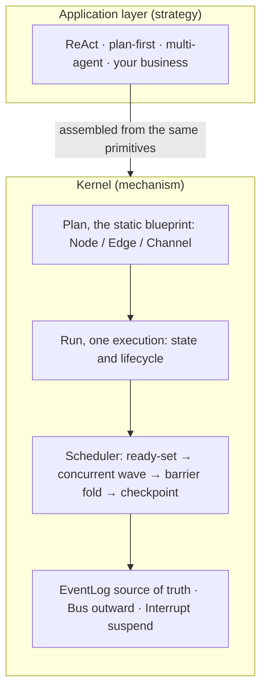

# prodagent: an agent-framework kernel in ~1800 lines

[](https://github.com/limenagent/prodagent/actions)
[](LICENSE)
[](https://www.python.org/)

English · [中文](README.zh-CN.md) · Docs: [English](docs/en/README.md) · [中文](docs/zh/README.md)

prodagent is a **teaching-grade agent kernel that keeps the essentials of a
production runtime**. With a small set of orthogonal abstractions it makes one
question concrete: what are the moving parts of an agent execution engine, and
why is each of them unavoidable? You can read the whole kernel in a weekend,
re-implement it yourself, and then see how ReAct, plan-then-execute, and
multi-agent collaboration are all *composed* from the same primitives on top.

If you have tried to read **LangGraph** or Google's **ADK** and bounced off the code
volume and layers of abstraction, start here. It explains the same kernel with
as little code as possible; going back to those frameworks afterward gets much
easier.

## Where to start — pick one of three paths

- **Five-minute taste**: run `make play`, pick a scenario on the left, and watch
  the event timeline, concurrent waves, and a human-approval pause that resumes
  from a checkpoint.
- **Really understand an agent framework**: follow the [reading order](#suggested-reading-order)
  with the [English docs](docs/en/README.md); you can finish the kernel in a weekend.
- **Just build something**: jump to [two levels of API](#two-levels-of-api-facade-or-raw-kernel)
  and adapt an example under `examples/`.

## Three layers

```
examples/                              ReAct, approval, compression, multi-agent, MCP
─────────────────────────────────────────────────────────────
src/runtime/ strategy / recipe layer   (wholly replaceable)
  react / plan_first / multiagent      how to orchestrate
  tools / mcp                          where tools come from
  context / memory / skills            cross-cutting strategies, injected
src/backends/                          storage: file-based resume from checkpoint
─────────────────────────────────────────────────────────────
src/kernel/                            Mechanism layer (zero third-party deps, knows no "pattern")
  Plan / Run / Scheduler 
  Node / Edge / Channel
  Outcome / Command / 
  Interrupt / Bus / EventLog

  ▲ model / tools / sub-agent / storage are all injected through ports; the kernel never imports them
```

**Mechanism inside, strategy outside.** There is no ReAct class and no
"execution-mode enum" in the kernel. ReAct, plan-then-execute, and multi-agent
are all assembled on top with the same primitives — a different orchestration
needs not a single line of kernel change.

## A map of the kernel



## The seven kernel parts, one file each

| Part | File | One-line job |
|---|---|---|
| Plan / Node / Edge / Channel | `kernel/graph.py` | the static blueprint and the pure "who is ready this wave" computation |
| Run | `kernel/run.py` | dynamic state of one execution, lifecycle state machine, snapshots |
| Channel / reducer | `kernel/channels.py` | how concurrent writes merge deterministically (append/last/add/merge) |
| Outcome / body | `kernel/body.py` | the single composable interface + four bodies: fn/tool/LLM/sub-plan |
| Command | `kernel/command.py` | Goto / Send change only "the next ready set"; Goto may carry a payload |
| EventLog / Store | `kernel/eventlog.py` | events are the source of truth, state is a folded projection |
| Bus | `kernel/bus.py` | observe `fire` / adjudicate `check` / collect `collect`, plus bounded-subscription backpressure |
| Scheduler | `kernel/scheduler.py` | the BSP wave loop that assembles every part into an engine |
| ports | `kernel/ports.py` | dependency-inversion ports for the LLM, tools, and sub-agent |

### Three principles that run through it

1. **State is a projection folded from an event stream.** Nodes never touch
   shared state directly; they return `state_delta`, and the engine folds it with
   reducers at the wave barrier, recording the "wave delta" in the event log.
   Replay rebuilds state — audit, time travel, and crash recovery become one thing.
2. **A wave is a consistency boundary.** Nodes in a wave run concurrently and
   never see each other's half-finished state; everything commits together when
   the wave ends, so the result is independent of scheduling order, and every
   barrier is naturally a checkpoint.
3. **Complex capabilities grow from recursive composition.** Multi-agent needs
   no new engine: *call* (delegation) is a node body that recursively runs a
   child Run and returns its result; *transfer* (handoff) is even cheaper — a
   `go` to another agent node in the same graph with no return edge, so control
   never comes back. Different convergence semantics, the same Goto.

## Two levels of API: facade, or raw kernel

**Most of the time the facade is enough** — `Agent` is an autonomous body that
thinks, calls tools, and delegates to teammates; `Workflow` is a readable flow
chart whose nodes can be functions or whole Agents:

```python
from src import Agent, Workflow, go

# 1) An autonomous agent: model + tools, then run
agent = Agent(name="researcher", model=llm, instruction="...", tools=[search])
result = await agent.run("look up X")  # result.output is the final answer

# 2) A supervisor: teammates are child Agents that are dispatched and return (call)
boss = Agent(name="boss", model=llm, teammates=[researcher, writer])

# 3) Deterministic orchestration / multi-agent handoff: Workflow
async def decide(root, ctx):
    return go("repair", root)  # hand to the repair agent: no return edge = transfer, no coming back

wf = Workflow()
wf.add("diagnose", diagnose_fn)             # a function node
wf.add("decide", decide)                    # a plain node that chooses where to go
wf.add("repair", repair_agent, terminal=True)  # a node can also be a whole Agent
wf.edge("diagnose", "decide")
wf.entry("diagnose")
result = await wf.run("incident")
```

Three memorable functions drive control inside a node: `go` (transition —
back-edges, loops, and handoffs; its value is the target's next input), `send`
(dynamic fan-out: `return [send("worker", x) for x in items]`, however many
branches are only known at runtime — the engine runs them concurrently in one
wave), and `wait_human` (pause for a person, then `wf.resume`). To see how the
facade is assembled from Plan/Node/Scheduler, return to the kernel and to
`graph_demo.py` and `react_demo.py`.

## Recipes and cross-cutting strategies (all replaceable)

| Capability | Location | Notes |
|---|---|---|
| Agent / Workflow facade | `runtime/agent.py`, `runtime/workflow.py` | ergonomic high-level API: autonomous agent, declarative graph, go/send/wait_human |
| ReAct | `runtime/react.py` | think⇄tools loop + final, advanced by Goto, unbounded tool rounds |
| Plan-then-execute | `runtime/plan_first.py` | the LLM plan is just a step list in state; `send` fans out, the join waits for predecessors |
| Multi-agent | `runtime/multiagent.py` | pipeline / supervisor (sub-agent as tool) / blackboard; transfer = same-graph `go` with no return |
| Tools | `runtime/tools.py` | functions as tools, inferred schema, read/write grading, approval gate, error-as-feedback |
| MCP | `runtime/mcp.py` | MCP tools are normalized to ordinary tools at the boundary |
| Context | `runtime/context.py` | five-level compression; the assembly strategy is replaceable |
| Long-term memory | `runtime/memory.py` | one unified record + orthogonal tags; retrieval is swappable (keyword in teaching, vectors in prod) |
| Skills | `runtime/skills.py` | tool + operating instructions packaged as expertise, loaded from a directory's SKILL.md |
| Step resilience | `kernel/graph.py`, `kernel/scheduler.py` | a Node carries timeout + RetryPolicy; timeout counts as one failure, exponential backoff |
| Streaming backpressure | `kernel/bus.py` | a node streams via `ctx.emit`; bounded subscription blocks (backpressure) or drops-and-counts |
| File persistence | `backends/file_store.py` | atomic checkpoint writes + JSONL events, cross-process resume |

## Run it

**No API key and no spend required**: every example uses `ScriptedLlm`, which
plays the model from a script — offline and deterministic, so you can run things
as often as you like.

```bash
# Run a single example from the repository root
PYTHONPATH=. python examples/graph_demo.py         # how waves advance (raw kernel)
PYTHONPATH=. python examples/react_demo.py         # hand-assemble ReAct (raw kernel)
PYTHONPATH=. python examples/01_greeter.py         # smallest agent: a one-tool ReAct
PYTHONPATH=. python examples/03_deep_research.py   # multi-round lookup + five-level compression
PYTHONPATH=. python examples/07_aiops.py           # diagnose via call + repair via transfer
PYTHONPATH=. python examples/09_persistence.py     # checkpoint to disk, resume in a fresh process
PYTHONPATH=. python examples/11_backpressure.py    # streaming events, bounded block/drop backpressure
```

The rest live under `examples/`; the numbering is the suggested order.

## Playground: one command, every example in the browser

```bash
make play                 # equivalent to: PYTHONPATH=. python3 -m src.playground
# open http://127.0.0.1:8000
```

Pick a scenario on the left (multi-agent draft-review-revise, parallel
delegation + handoff, cross-session memory recall). On the right you see:

- an **event timeline** of node start/complete, state deltas, and run completion
  (subscribed to the same Bus);
- a `wait_human` node **really suspends**; the UI shows Approve/Reject and the
  run resumes from its checkpoint;
- multi-agent parallelism, delegation (call), and handoff (transfer) are all
  visible on the timeline.

The playground uses only the standard library (`http.server` + a background
event loop) — no web framework.

### Use a real model (optional)

`runtime/openai_lite.py` talks to any OpenAI-compatible endpoint with the
standard library, no SDK. Set `OPENAI_API_KEY` (and optionally `OPENAI_BASE_URL`,
`OPENAI_MODEL`), swap the scripted model for it, and nothing else changes:

```python
from src.runtime.openai_lite import OpenAICompatibleLlm

agent = Agent(name="demo", model=OpenAICompatibleLlm(), tools=[...])
```

## Run the tests

```bash
pip install pytest pytest-asyncio
python -m pytest tests/ -q
```

## Suggested reading order

The kernel is one graph; read it along the flow of data so each step builds on
the last:

1. `kernel/types.py → command.py → channels.py`: value objects, the two control
   commands, state merge rules;
2. `kernel/graph.py`: the static blueprint and `ready()`, the pure function most
   worth close reading;
3. `kernel/run.py → body.py`: what one execution carries, the single composable
   interface;
4. `kernel/eventlog.py → bus.py → ports.py`: source of truth, outward seam,
   dependency inversion;
5. finally `kernel/scheduler.py`: the main loop is short enough to feel like review;
6. then `runtime/`: how the same primitives compose into ReAct and multi-agent;
7. cross-reference `examples/` and `tests/` (the tests are the best executable
   documentation), and you are ready to modify it yourself.

For the *why* behind each design and the alternatives that were rejected, read
the design notes under [docs/en](docs/en/README.md); 中文读者见 [docs/zh](docs/zh/README.md).

If this is useful, a **GitHub Star ⭐** helps other engineers who want to actually understand agent frameworks find it.