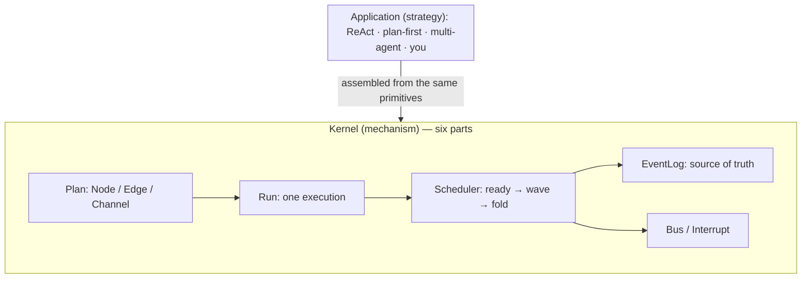

# prodagent: an agent-framework kernel in 1800 lines

[](https://github.com/limenagent/prodagent/actions)
[](LICENSE)
[](https://www.python.org/)
[]()
[]()

English · [中文](README.zh-CN.md) · Docs: [English](docs/en/README.md) · [中文](docs/zh/README.md)

prodagent is a **teaching-grade agent runtime kept deliberately small**: six
orthogonal parts, about 1800 net lines, **zero third-party runtime dependencies**,
and 83 tests that all run offline. Read it in a weekend and you will see how ReAct,
plan-then-execute, and multi-agent are all *composed* from the same primitives —
and going back to LangGraph or Google ADK gets much easier.

## Same skeleton, different clothes

Every mainstream framework makes the same small set of decisions, just in
different words. Know prodagent's six parts and you know where to look in any of them:

| Concern | prodagent (this repo) | The same idea where you already know it |
|---|---|---|
| a reusable blueprint of steps | `Plan` = Node / Edge / Channel | LangGraph `StateGraph`; ADK workflow / agent graph; CrewAI Process + Tasks |
| one execution and its state | `Run` + channels & reducers | LangGraph State + checkpointer; ADK Session |
| the engine that drives it | `Scheduler` recomputes a ready-set each wave (BSP) | LangGraph Pregel super-steps; ADK Runner; CrewAI's kickoff loop |
| runtime routing & fan-out | `Goto` / `Send` | LangGraph `Command(goto/send)`; ADK transfer; OpenAI handoffs |
| pause for a human | `Interrupt`, then resume | LangGraph `interrupt()` + `Command(resume)`; ADK human input |
| truth, replay, time travel | append-only `EventLog`; state is a fold | LangGraph checkpointer + time travel; ADK session replay |
| multi-agent | child Run (call) / no-return `Goto` (transfer) / blackboard | LangGraph subgraphs + `Send`; ADK sub-agents & transfer; CrewAI hierarchy |
| outward hooks | `Bus`: observe / adjudicate / subscribe | LangGraph callbacks & stream; ADK EventBus |

No magic, nothing hidden: 11 files you can read in a weekend.

## The shape



**Mechanism inside, strategy outside.** There is no ReAct class and no
"execution-mode enum" in the kernel — every pattern is assembled on top from the
same primitives, and a new orchestration needs no kernel change.

## Try it in 30 seconds — no API key, no spend

```bash
git clone https://github.com/limenagent/prodagent && cd prodagent

PYTHONPATH=. python examples/greeter.py       # smallest agent (a one-tool ReAct)
PYTHONPATH=. python examples/graph_demo.py    # watch the concurrent waves advance
make play                                      # browser: event timeline + human-approval pause
```

Every example is driven by a *scripted* model that plays back from a script —
fully offline and deterministic, run it as often as you like. Set `OPENAI_API_KEY`
to swap in any OpenAI-compatible model and nothing else changes. More scenarios
(plan-first, blackboard, checkpoint/resume, backpressure, memory) live under
`examples/`.

## The API in 15 lines

```python
from src import Agent, Workflow, go, send, wait_human

# an autonomous agent: model + tools
agent = Agent(name="researcher", model=llm, instruction="...", tools=[search])
await agent.run("look up X")

# a deterministic graph / handoff — a node is a function or a whole Agent
wf = Workflow()
wf.add("diagnose", diagnose_fn)
wf.add("repair", repair_agent, terminal=True)
wf.edge("diagnose", "repair")
wf.entry("diagnose")
await wf.run("incident")
```

Inside a node: `go(target, value)` routes — loops, back-edges, handoffs (no return
edge = transfer, control never comes back); `send(template, x)` fans out however
many copies the runtime decides, concurrently in one wave; `wait_human(...)`
suspends and later resumes from its checkpoint.

## Go deeper

- **New here? Start with [build a minimal kernel in 30 minutes](docs/en/build-a-minimal-kernel.md)** — 80 lines of stdlib, type it once and it clicks.
- [Architecture: derive the six parts from a six-line loop](docs/en/architecture.md)
- [Five key design trade-offs](docs/en/README.md) · [Framework comparison](docs/en/comparison.md) · [FAQ](docs/en/faq.md) · [Glossary](docs/en/glossary.md)
- File-by-file map and the suggested reading order are in the docs; run the tests with `python -m pytest tests/ -q`.

If this helps you actually understand agent frameworks instead of memorizing APIs,
a **GitHub Star ⭐** helps other engineers find it too.
