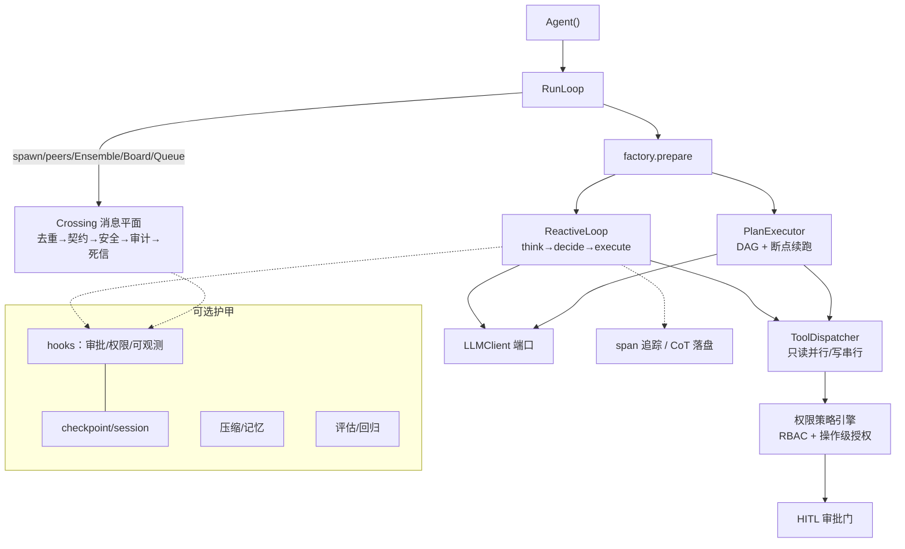

# prodagent

> 
> **25,000 行，13 个包**
> 一份你**真的能读完**的工业级 LLM Agent 实现。循环、预算、恢复、审批、权限、可观测、评估、多 Agent 协作——每个机制都小到一次读懂，完整到能上生产。

[](https://pypi.org/project/prodagent/)
[](https://github.com/limenagent/prodagent/actions/workflows/ci.yml)
[](https://www.python.org/downloads/)
[](LICENSE)

**中文文档** · [English](README.en.md) · 极客时间专栏[《生产级 Agent 排雷实战》](http://gk.link/a/12L6Q)配套框架

---

## 你会用 LangChain，但你能设计一个 Agent 平台吗

翻一翻 2026 年的 Agent 岗位，分层很清楚。

初级岗要求"熟练使用 LangChain/LangGraph，会写 prompt，做过 RAG"——三个月就能上手，所以供给最卷。高级岗和架构师岗的描述就完全不同了："从 0 到 1 构建生产级 Agent 系统"、"自研核心模块"、"多智能体架构设计"、"Agent Platform / AI Infra 建设"、"Trace/Log/Metrics 三位联动"、"三层多租户权限体系"。薪资翻两到三倍，能接住的人很少。

差距不在模型能力，不在 prompt 技巧，在**工程设计能力**——具体来说，你能不能回答这些问题：

**运行时稳定性：**

- Agent 跑了 20 轮，进程被 kill -9 了，怎么从断点续跑，不丢状态、不重复执行？
- 模型在两个工具之间反复横跳，token 一分钟烧一百块，怎么在 turns/seconds/tokens/cost 四个维度同时设硬上限？子 Agent 花的钱怎么实时汇总？
- 一个 HIGH 副作用工具要删数据，怎么挂起等人审批？审批拒绝后怎么增量重规划，而不是推倒重来？

**上下文与记忆：**

- 上下文跑到第 30 轮塞不下了，丢哪段？语义损失边界在哪？怎么保证"用户说过不要红色"这种关键约束不被压缩掉？
- 规则、实体、精确事实、语义相似这四类信息召回策略完全不同，怎么并行召回再做冲突裁决？

**多 Agent 协作：**

- 五个 Agent 并行干活，消息怎么去重、契约校验、审计、死信处理？怎么保证不丢、不重、不乱序？
- 委派、接力、投票、共享黑板、工作队列——五种协作拓扑分别适用于什么场景？

**企业级治理：**

- 十个团队共用一个平台，怎么做租户隔离？A 团队的 Agent 能不能看到 B 团队的数据？
- RBAC 只到角色级不够——同一个角色下的不同 Agent，可能需要操作级授权：A 只能查客户列表，B 才有权限发起审批流。策略引擎怎么设计？
- 每一次工具调用、数据访问、操作执行，日志怎么完整记录、不可篡改？出了问题怎么按 TraceID 回放整条链路？

**可观测与评估：**

- Agent 出了问题，怎么定位是模型不行、prompt 不行、还是工具返回错了？Trace/Log/Metrics 怎么打通？思维链怎么落盘？
- 改了一版 prompt，怎么知道变好还是变差了？离线回归怎么跑？线上 Trace 怎么自动打分？LLM-as-judge 怎么校准？

这批问题没有标准答案，但每个上生产的团队都会撞上。解法散落在论文、issue 讨论、阿里云 AgentLoop 和腾讯 ADP 的产品文档、几十万行工业源码里——你读不完，也没人给你串成一条线。

这个仓库就是那条线。上面每一个问题，源码里都有一个可以跑起来的对应实现。

---

## 为什么是这个仓库，而不是别的

市面上 Agent 框架不少，但大多走两个极端。

一类是**黑盒框架**——LangChain、AutoGen 之流，功能全但抽象层厚，你学会的是它的 API，不是它的设计。出了问题只能翻源码猜，改不动核心。权限、评估、可观测这些企业级特性，要么没有，要么绑死在它们的云上。

一类是**教学玩具**——几十行代码演示 ReAct 循环，看起来清晰，但没有预算、没有恢复、没有审批、没有多 Agent、没有权限、没有可观测，离生产差十万八千里。

prodagent 卡在中间。它是一个**可以 `pip install` 的生产级库**，同时**整个代码库只有 25,000 行，13 个包，按学习顺序排列**。你可以从头读到尾，每一个机制都能在脑子里建立完整的心智模型。

更重要的是，它的设计是**可拆解的**。预算、审批、崩溃恢复、上下文压缩、多 Agent 治理、权限策略、可观测追踪——每个都是独立模块，有清晰的 Protocol 边界。你的项目缺哪块，就搬哪块，不用引入整个框架。

---

## 学完你能得到什么

### 第一，一套完整的生产级 Agent 设计心智模型

不是零散的知识点，而是从一次 `chat()` 调用开始，经过循环、预算、工具调度、审批、权限校验、检查点、消息平面、上下文压缩、记忆召回、可观测追踪，到最终返回的**完整生命周期**。

文档第一部分用七站走完这条链路，每一站对应源码里的一个包。读完你能在白板上画出整个 Agent 的运行时架构，并且说清每一层为什么存在、去掉会怎样、替代方案是什么。

### 第二，每个机制都能现场调试

整个框架离线可跑。测试不连网，九个示例的每一轮模型行为都是可复现的脚本。

你可以在 `chat()` 的调用链打断点，看一次请求到底经过了多少层；改一个预算参数，看它在哪一轮、为什么停下来；把审批门拆掉，看没有保护的 Agent 会做出什么；把权限策略改成全放行，看越权操作会触发什么。

理解一个机制最深刻的方式是**调试它，不是背它的结论**。

### 第三，面试和工作中能接住高级岗的问题

下次面试被问到"你们的 Agent 怎么做崩溃恢复"、"多 Agent 之间的消息怎么保证不丢不重"、"上下文满了你们怎么处理"、"权限怎么做到操作级"、"怎么做离线回归评估"，你不用编。你见过完整的实现，知道 trade-off 在哪，能说出至少两种方案的优劣。

工作中更直接——你的项目需要审批门？搬 `hooks/approval/`。需要崩溃恢复？搬 `ports/checkpoint.py` + `backends/file/`。需要多 Agent 协作？搬 `coordination/`。需要可观测追踪？搬 `hooks/observability/`。不用从零造轮子。

[→ 开始：文档第一部分，七站读穿一次调用的生命周期](docs/tour/index.md)


---

## 快速开始

最小可跑，零文件零旁路：

```python
import asyncio

from prodagent import Agent, ExecutionMode, tool

@tool(name="search", readonly=True)
async def search(query: str) -> str:
    return f"results for: {query}"

agent = Agent("demo", system_prompt="Find answers.", tools=[search],
              mode=ExecutionMode.REACTIVE)

asyncio.run(agent.chat("巴黎今天天气如何？"))
```

一键上生产全套（落盘恢复、span 追踪、HIGH 工具审批门、LLM 缓存、上下文压缩）：

```python
from prodagent.core.config import production

agent = Agent("demo", ..., config=AgentConfig(name="demo", framework=production()))
```

可视化 playground，离线跑全部 9 个示例：

```bash
make playground    # 自动装 uv、首跑配置向导、开浏览器
```

安装与模型配置：

```bash
pip install prodagent
# 核心仅 4 个依赖：anyio/httpx/pydantic/typing-extensions，按需加装：
pip install "prodagent[openai,anthropic]"      # 模型 provider
pip install "prodagent[playground]"             # 可视化
pip install "prodagent[postgres,redis,neo4j]"   # 生产后端（默认 file+memory 零依赖）
```

模型配置三选一：

- `USE_FAKE_LLM=1` 完全离线
- `LLM_BASE_URL` / `LLM_API_KEY` / `LLM_MODEL` 指任意 OpenAI 兼容端点（DeepSeek/Qwen/Moonshot/Zhipu…）
- `ANTHROPIC_API_KEY`

**[→ 完整文档：学习路线 · 一次调用的生命周期 · 专题 · 示例](https://limenagent.github.io/prodagent/)**

---

## 核心能力

| 能力 | 解决什么问题 | 源码 |
| --- | --- | --- |
| **裸核默认** | `Agent()` 零文件零旁路起步；`production()` 一键全套护甲 | `core/config.py` |
| **四轴硬预算** | turns/seconds/tokens/cost 任一触顶即停；子 Agent 花销实时汇总到总账 | `core/budget.py`、`coordination/budget_ledger.py` |
| **崩溃恢复** | checkpoint + 乐观版本控制；kill -9 后从断点续跑，不重复执行已完成步骤 | `ports/checkpoint.py`、`backends/file/` |
| **HITL 审批** | HIGH 副作用工具挂起等人；拒绝触发增量重规划，不是推倒重来 | `hooks/approval/` |
| **权限策略引擎** | RBAC + 操作级授权；Agent 身份、工具权限、数据访问三层策略；越权拦截与审计 | `hooks/authorization/` |
| **三执行模式** | REACTIVE / PLAN_FIRST（动态 DAG）/ Workflow（静态 DAG），按任务复杂度选 | `runtime/`、`plan/` |
| **五协作原语** | agents= 委派、peers= 接力、Ensemble / Blackboard / WorkQueue，覆盖主流多 Agent 拓扑 | `coordination/` |
| **统一消息平面** | 一切跨 Agent 通信走同一管道：去重→契约校验→安全→审计→死信，不丢不重不乱序 | `coordination/messaging/` |
| **五级上下文压缩** | 按 token 占比分级牺牲，每级有明确语义损失边界，关键约束不被压缩掉 | `cognition/context/` |
| **四通道记忆** | 规则/实体/精确/语义并行召回 + 冲突裁决 + 遗忘曲线，不是只有向量检索 | `cognition/memory/` |
| **全链路可观测** | OpenTelemetry 兼容的 span 追踪；每轮推理、工具调用、消息穿越自动埋点；Trace/Log/Metrics 三位联动；CoT 思维链落盘 | `hooks/observability/` |
| **评估与回归** | 离线数据集评测 + 线上 Trace 自动打分；支持 LLM-as-judge、代码规则、人工标注；每次改动可跑回归对比 | `evaluation/` |
| **可替换后端** | 14 个 Protocol 端口；file+memory 默认零依赖，Postgres/Redis/Neo4j 按需替换 | `ports/`、`backends/factory.py` |
| **技能闭环** | 成功的 run 蒸馏成 runbook，下次同类任务按需加载，越用越稳 | `skills/` |
| **MCP 桥接** | 外部工具经 stdio/HTTP 接入，不用为每个工具写适配层 | `mcp/` |

---

## 架构



包目录即学习顺序：`core → ports → llm → tooling → runtime → plan → coordination → cognition → hooks → skills → evaluation → backends → mcp → playground`。

---

## 九个端到端示例

不是玩具示例，每个都对应一个真实的生产场景，教一个完整的机制组合：

| # | 示例 | 场景 | 教什么 |
| --- | --- | --- | --- |
| 1 | [greeter](examples/greeter) | 最小可跑 Agent | `@tool` + `Agent` + REACTIVE |
| 2 | [trader](examples/trader) | 奶茶代购协商 | 多轮谈判 + 记忆约束 + HIGH 审批 |
| 3 | [deep_research](examples/deep_research) | 探索式研究 | REACTIVE 树 + 五级压缩 + 预算硬上限 |
| 4 | [compliance_audit](examples/compliance_audit) | 金融合规审计 | 动态 DAG + 审批拒绝→增量重规划 + 权限策略 |
| 5 | [code_detective](examples/code_detective) | 自主修 bug | MCP 桥接 + 技能闭环 + 可观测追踪 |
| 6 | [trip_planner](examples/trip_planner) | 旅行规划 | Workflow DAG + 3 peer 并行 + 消息平面 |
| 7 | [aiops](examples/aiops) | 故障应急 | spawn + peer + 技能 + 审批 + 评估全栈 |
| 8 | [dating_chat](examples/dating_chat) | Agent 相亲 | Ensemble 共享会话 + 记忆 A/B 对比 |
| 9 | [quiz_arena](examples/quiz_arena) | 抢答竞赛 | WorkQueue（租约+死信）+ Blackboard + 多租户隔离 |

全部离线可跑（FakeLLM 脚本精确到每轮工具调用），与 1,182 个测试共用同一套机制。

---

## License

AGPL v3，详见 [LICENSE](LICENSE)。

---

**如果这个仓库帮你把 Agent 设计的某个环节想通了，点个 star，让更多卡在同一处的人看到。**