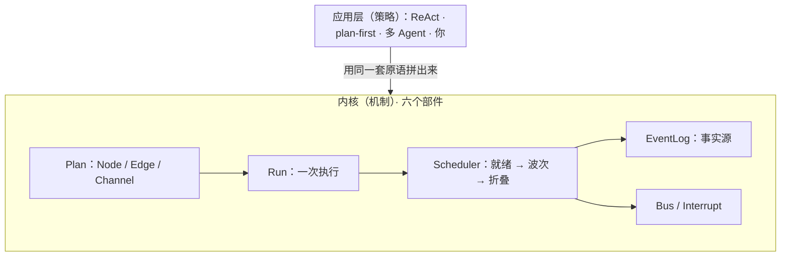

# prodagent：1800 行，讲透一个 Agent 框架内核

[](https://github.com/limenagent/prodagent/actions)
[](LICENSE)
[](https://www.python.org/)
[]()
[]()

**中文** · [English](README.md) · 配套文档：[中文](docs/zh/README.md) · [English](docs/en/README.md)

prodagent 是一个**刻意做小、但保留生产级要点的教学型 Agent 运行时**：六个原子正交部件、净代码
约 1800 行、运行时**零三方依赖**，83 个测试全部离线可跑。一个周末读完，你会看清 ReAct、先规划
后执行、多 Agent 协作其实都是用同一小把原语*拼*出来的——再回头看 LangGraph、Google ADK，会
轻松很多。它也是极客时间专栏[《生产级 Agent 排雷实战》](http://gk.link/a/12L6Q)的配套开源项目。

## 同一副骨架，只是换了身衣服

主流框架做到最后都是同一小把决策，只是起的名字不一样。认识了 prodagent 的六个部件，再看任何
一个框架，你都知道该往哪儿找：

| 要解决的事 | prodagent（本项目） | 你可能已经熟悉的同类做法 |
|---|---|---|
| 一张可复用的步骤蓝图 | `Plan` = Node / Edge / Channel | LangGraph 的 `StateGraph`；ADK 的 workflow / agent 图；CrewAI 的 Process + Task |
| 一次执行和它的状态 | `Run` + 通道与合并规则 | LangGraph 的 State + checkpointer；ADK 的 Session |
| 驱动执行的引擎 | `Scheduler` 每波重算一次“就绪集合”（BSP） | LangGraph 的 Pregel 超步；ADK 的 Runner；CrewAI 的 kickoff 循环 |
| 运行时跳转 / 散开 | `Goto` / `Send` | LangGraph 的 `Command(goto/send)`；ADK 的 transfer；OpenAI 的 handoff |
| 停下来等人 | `Interrupt`，之后 resume | LangGraph 的 `interrupt()` + `Command(resume)`；ADK 的人工输入 |
| 事实源 / 重放 / 时间旅行 | 只追加的 `EventLog`，状态是折叠出来的 | LangGraph 的 checkpointer + time travel；ADK 的会话重放 |
| 多 Agent | 子 Run（委派）/ 不回头的 `Goto`（交棒）/ 黑板 | LangGraph 子图 + `Send`；ADK 子 Agent 与 transfer；CrewAI 层级制 |
| 对外挂能力 | `Bus`：旁观 / 裁决 / 订阅 | LangGraph 的 callbacks 与 stream；ADK 的 EventBus |

没有魔法，也没有藏起来的东西：11 个文件，一个周末就能读完。

## 它长什么样



**机制在内，策略在外。** 内核里没有 ReAct 类、也没有“运行模式枚举”——所有模式都在上层用同一
套原语拼出来，换一种编排不需要改内核一行。

## 30 秒跑起来：不要 API Key、不花一分钱

```bash
git clone https://github.com/limenagent/prodagent && cd prodagent

PYTHONPATH=. python examples/greeter.py       # 最小 Agent：只有一个工具的 ReAct
PYTHONPATH=. python examples/graph_demo.py    # 看并发波次怎么一波波推进
make play                                      # 网页版：事件时间线 + 人工审批暂停
```

每个示例都用一个“按脚本扮演模型”的 `ScriptedLlm` 驱动，完全离线、结果确定，可以放心反复跑；
设好 `OPENAI_API_KEY` 就能换成任意 OpenAI 兼容的真实模型，其余代码一行不改。更多场景（先规划
后执行、黑板、断点续跑、背压、长期记忆）都在 `examples/` 目录。

## 15 行看懂 API

```python
from src import Agent, Workflow, go, send, wait_human

# 一个自主 Agent：模型 + 工具
agent = Agent(name="researcher", model=llm, instruction="...", tools=[search])
await agent.run("帮我查 X")

# 确定性流程图 / 交接：节点既能是函数，也能直接是一个 Agent
wf = Workflow()
wf.add_node("diagnose", diagnose_fn)
wf.add_node("repair", repair_agent, terminal=True)
wf.add_edge("diagnose", "repair")
wf.entry("diagnose")
await wf.run("故障")
```

节点里用三个函数控制走向：`go(目标, 值)` 负责转场——循环、回边、交接都靠它（不画回边就是
交棒 transfer，控制权一去不返）；`send(模板, 值)` 在运行时想分几份就分几份，同一波并发跑；
`wait_human(...)` 先挂起，之后从检查点原样继续。

## 再往深读

- **零基础建议先读这篇：[30 分钟手写一个最小内核](docs/zh/build-a-minimal-kernel.md)**——80 行标准库，亲手敲一遍就通了。
- [架构总览：从六行循环推导出六个部件](docs/zh/architecture.md)
- [五个最关键的设计取舍](docs/zh/README.md) · [框架对比](docs/zh/comparison.md) · [常见问题](docs/zh/faq.md) · [术语表](docs/zh/glossary.md)
- 逐文件读码地图和建议阅读顺序在配套文档里；跑测试用 `python -m pytest tests/ -q`。

如果它帮你真正看懂了 Agent 框架、而不是又背了一堆 API，欢迎点个 **GitHub Star ⭐**，让更多人
找到它。
