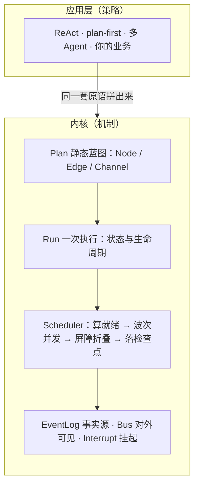

# prodagent：1800 行代码，讲透一个 Agent 框架内核

[](https://github.com/limenagent/prodagent/actions)
[](LICENSE)
[](https://www.python.org/)

**中文** · [English](README.md) · 配套文档：[中文](docs/zh/README.md) · [English](docs/en/README.md)


prodagent：一个**教学型、同时保留必要生产能力**的 Agent
框架。它用尽量少、尽量正交的抽象，把“一台 Agent 执行引擎由哪几块构成、为什么非它们不可”
讲清楚，让你能读完内核、照着自己手写一遍，再用上层配方拼出 ReAct、先规划后执行、多 Agent
协作。 它是极客时间专栏[《生产级 Agent 排雷实战》](http://gk.link/a/12L6Q)配套框架。

如果你正在学 LangGraph、Google ADK，却被它们的代码量和层层抽象劝退，可以先读这个项目。
它用最少的代码把同一套内核讲明白，等你看懂了再回去看它们，会轻松很多。

## 从哪开始：三条路，按需选一条

- **只想花 5 分钟看个酷的**：直接 `make play`，左侧选一个场景，右侧看事件时间线、并行
  波次，以及“停下来等人审批、再从断点继续”。
- **想真正读懂一个 Agent 框架**：跟着文末的[读码路线](#建议的阅读顺序)，配合
  [中文文档](docs/zh/README.md)，一个周末就能把内核从头读完。
- **想直接拿来用**：跳到[两种使用姿势](#两种使用姿势门面或直接用内核)，再对照 `examples/`
  里的例子改。

## 三层结构

```
examples/          业务示例：ReAct、审批、压缩、多 Agent、MCP
─────────────────────────────────────────────────────────────
src/runtime/       策略/配方层（可整层替换）
  react / plan_first / multiagent        怎么编排
  tools / mcp                            工具从哪来
  context / memory / skills              横切策略，注入即可
src/backends/      存储实现：文件级断点续跑
─────────────────────────────────────────────────────────────
src/kernel/        机制层（零三方依赖，不懂“模式”）
  Plan / Run / Scheduler / Node / Edge / Channel
  Outcome / Command / Interrupt / Bus / EventLog

  ▲ 模型 / 工具 / 子 Agent / 存储都从端口注入，kernel 不 import 它们
```

**机制在内，策略在外。** 内核里没有 ReAct、没有“运行模式枚举”；ReAct、先规划后执行、
多 Agent 全都是用同一套内核原语在上层拼出来的，换一种编排不需要改内核一行。

## 一张内核总图



> 读到这里如果觉得有用，欢迎去 [GitHub 点个 Star ⭐](https://github.com/limenagent/prodagent)，
> 你的支持会让更多想真正搞懂 Agent 框架的工程师看到它。

## 内核七部件，各自一个文件

| 部件 | 文件 | 一句话职责 |
|---|---|---|
| Plan / Node / Edge / Channel | `kernel/graph.py` | 静态蓝图，以及“这一波谁就绪”的纯计算 |
| Run | `kernel/run.py` | 一次运行的动态状态、生命周期状态机、快照 |
| Channel / reducer | `kernel/channels.py` | 并发写入如何确定地合并（append/last/add/merge） |
| Outcome / body | `kernel/body.py` | 唯一可组合接口 + 函数/工具/模型/子图四种 body |
| Command | `kernel/command.py` | Goto / Send：只改“下一波就绪集合”；Goto 可带 payload 作为转场输入 |
| EventLog / Store | `kernel/eventlog.py` | 事件是事实源，状态是折叠投影 |
| Bus | `kernel/bus.py` | 旁观 fire / 裁决 check / 收集 collect + 有界订阅背压 |
| Scheduler | `kernel/scheduler.py` | BSP 波次主循环，把所有部件装成一台机器 |
| ports | `kernel/ports.py` | LLM / 工具 / 子 Agent 的依赖倒置端口 |

### 三条贯穿原则

1. **状态是事件流折叠出的投影。** 节点不直接碰共享状态，只产出 `state_delta`；
   引擎在波次屏障处按 reducer 折叠，并把“波增量”写进事件日志。重放即重建，审计、
   时间旅行、崩溃恢复因此是同一件事。
2. **波次是一致性边界。** 同波节点并发、互不可见半成品，一波结束统一提交，结果与
   调度顺序无关；每个波次边界天然是一个检查点。
3. **复杂能力是原语递归组合长出来的。** 多 Agent 不是新引擎：call（委派）是某个
   节点的 body 递归又跑起一张子 Run、干完把结果交回；transfer（接力）更省——同一张
   图里 go 到对方的节点、不画回边，控制权就一去不返。汇合方式不同，用的都是同一条 Goto。

## 两种使用姿势：门面，或直接用内核

**大多数时候用门面就够了**——`Agent` 是会自己想、能调工具、能派活给同伴的自主体；
`Workflow` 是一张看得清的流程图，节点既能是函数也能直接是 Agent：

```python
from src import Agent, Workflow, go

# 1) 一个自主 Agent：模型 + 工具，run 一下
agent = Agent(name="researcher", model=llm, instruction="...", tools=[search])
result = await agent.run("帮我查 X")  # result.output 是最终答复

# 2) 主管派活：teammates 是“派出去、结果交回来”的子 Agent（call）
boss = Agent(name="boss", model=llm, teammates=[researcher, writer])

# 3) 确定性编排 / 多 Agent 接力：Workflow
async def decide(root, ctx):
    return go("repair", root)  # 转场到修复 Agent：无回边即交接（transfer）不回头

wf = Workflow()
wf.add("diagnose", diagnose_fn)       # 函数节点
wf.add("decide", decide)              # 决定转场去哪的普通节点
wf.add("repair", repair_agent, terminal=True)  # 节点也可以直接是一个 Agent
wf.edge("diagnose", "decide")
wf.entry("diagnose")
result = await wf.run("故障")
```

节点里的控制流用三个好记的函数：`go`（转场：回边、循环、交接都靠它，value 会作为
目标这一次的输入）、`send`（动态扇出：`return [send("worker", x) for x in items]`，
几份运行时才知道也没关系，引擎会放进同一波里并发跑）、`wait_human`（停下等人，
随后 `wf.resume`）。想看清门面底下怎么用 Plan/Node/Scheduler 拼出来，再回到内核与
`graph_demo.py`、`react_demo.py`。

## 上层配方与横切策略（都可替换）

| 能力 | 位置 | 说明 |
|---|---|---|
| Agent / Workflow 门面 | `runtime/agent.py`、`runtime/workflow.py` | 好用的高层 API：自主体、声明式图、go/send/wait_human |
| ReAct | `runtime/react.py` | think⇄tools 环 + final，环上前进由 Goto 驱动，可无限多轮工具 |
| 先规划后执行 | `runtime/plan_first.py` | LLM 计划只是 state 里的步骤清单，send 动态扇出、汇合点等齐前驱才汇总 |
| 多 Agent | `runtime/multiagent.py` | pipeline / supervisor（子 Agent 即工具）/ 黑板（专家并行写板、主持人 join=all 裁决、可多轮趋同）；transfer=同图 go 不回头 |
| 工具 | `runtime/tools.py` | 函数即工具、自动推断 schema、读写分级、审批门、失败即反馈 |
| MCP | `runtime/mcp.py` | MCP 工具在边界拉平成普通工具，内部只走一条管线 |
| 上下文 | `runtime/context.py` | 五级压缩：不动→机械缩工具结果→逐级摘要→紧急只留最近，装配策略可换 |
| 长期记忆 | `runtime/memory.py` | 一条统一记录 + 正交标签，检索策略可换（教学版关键词，生产换向量） |
| 技能 | `runtime/skills.py` | 工具 + 操作指引打包成专长，支持从目录的 SKILL.md 加载、按需选用 |
| 步骤弹性 | `kernel/graph.py`、`kernel/scheduler.py` | Node 挂 timeout + RetryPolicy，超时算一次失败、按指数退避重试 |
| 流式背压 | `kernel/bus.py` | 节点 `ctx.emit` 边算边吐，有界订阅 block 反压 / drop 丢帧记账 |
| 文件持久化 | `backends/file_store.py` | 原子写检查点 + JSONL 事件，跨进程断点续跑 |

## 先跑起来

本项目**不需要任何 API Key、不花一分钱**：所有示例都用 `ScriptedLlm` 按脚本扮演模型，
离线、确定性，可以放心反复跑。

```bash
# 跑单个示例（在仓库根目录执行）
PYTHONPATH=. python examples/graph_demo.py         # 波次怎么推进（纯内核）
PYTHONPATH=. python examples/react_demo.py         # 手工拼出 ReAct（纯内核）
PYTHONPATH=. python examples/greeter.py            # 最小 Agent：一个工具的 ReAct
PYTHONPATH=. python examples/deep_research.py      # 连查多轮 + 五级上下文压缩
PYTHONPATH=. python examples/after_sales.py        # 主管的"工具"是别的 Agent
PYTHONPATH=. python examples/aiops.py              # 诊断 call 要返回 + 修复 transfer 接力
PYTHONPATH=. python examples/orchestrator.py       # Send 运行时压出 N 份模板拷贝
PYTHONPATH=. python examples/blackboard.py         # 黑板多轮共识直到收敛
PYTHONPATH=. python examples/dating_chat.py        # 记忆+压缩 对照 手搓截断
PYTHONPATH=. python examples/persistence.py        # 检查点落盘，换新实例也能断点恢复
PYTHONPATH=. python examples/backpressure.py       # 流式吐事件，有界订阅 block/drop 背压
```

其余示例见 `examples/` 目录，`examples/README.md` 的表格即推荐阅读顺序。

## Playground：一个命令，在网页里跑全部业务场景

```bash
make play                 # 等价：PYTHONPATH=. python3 -m src.playground
# 打开 http://127.0.0.1:8000
```

左侧在多个场景里任选（含多 Agent 撰稿-审阅-修订、并行委派+接力、跨会话记忆召回），右侧能看到：

- 节点开始/完成、状态增量、运行完成等**事件流时间线**（订阅的是同一个 Bus）；
- 遇到 `wait_human` 的人工节点会**真正挂起**，页面弹出“批准/拒绝”，点完从断点继续；
- 多 Agent 的并行、委派（call）、接力（transfer）都能在时间线上看出来。

Playground 只用标准库（`http.server` + 后台事件循环），不引入任何 web 框架。

### 接真实模型（可选）

`runtime/openai_lite.py` 用标准库直连任意 OpenAI 兼容服务，不引 SDK。设好环境变量
`OPENAI_API_KEY`，可选 `OPENAI_BASE_URL`（自建网关/兼容服务）、`OPENAI_MODEL`，
把脚本模型换成它即可，其余代码一行不改：

```python
from src.runtime.openai_lite import OpenAICompatibleLlm

agent = Agent(name="demo", model=OpenAICompatibleLlm(), tools=[...])
```

## 跑测试

```bash
pip install pytest pytest-asyncio
python -m pytest tests/ -q
```

## 建议的阅读顺序

内核是一张图，建议顺着“数据怎么流动”读，每一步都建立在上一步之上，不会跳：

1. `kernel/types.py → command.py → channels.py`：值对象、两条控制命令、状态合并规则；
2. `kernel/graph.py`：静态蓝图与 `ready()`，全内核最值得细读的纯函数；
3. `kernel/run.py → body.py`：一次运行携带什么、唯一可组合接口长什么样；
4. `kernel/eventlog.py → bus.py → ports.py`：事实源、对外接缝、依赖倒置；
5. 最后读 `kernel/scheduler.py`：主循环短到几乎是“复习”；
6. 再看 `runtime/`：看同一套原语怎么拼出 ReAct 和多 Agent；
7. 对照 `examples/` 与 `tests/`（测试是最好的可执行文档），就能自己动手改了。

想边读边看“为什么这么设计、还能怎么选”，配合 [docs/zh](docs/zh/README.md) 的设计说明；
English readers start from [docs/en](docs/en/README.md).
