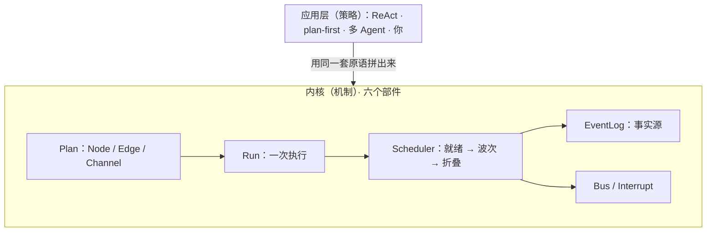

# prodagent：1800 行，讲透一个 Agent 框架内核

[](https://github.com/limenagent/prodagent/actions)
[](LICENSE)
[](https://www.python.org/)
[]()
[]()

**中文** · [English](README.md) · 配套文档：[中文](docs/zh/README.md) · [English](docs/en/README.md)

prodagent 是一个**刻意做小、但生产级要点一样不缺的教学型 Agent 运行时**：内核六个部件各管一件事、
净代码约 1800 行、运行时**零三方依赖**，测试全部离线可跑。一个周末读一遍，你会看清 ReAct、先规划
后执行、多 Agent 协作其实都是用同一套原语*拼*出来的——再回头看 LangGraph、Google ADK，会轻松
很多。它也是极客时间专栏[《生产级 Agent 框架设计与实现》](https://time.geekbang.org/column/intro/101189701)的配套开源项目。

## 同一副骨架，只是换了身衣服

主流框架做到最后，做的都是同一小撮决策，只是名字起得不一样。认识了 prodagent 的六个部件，再看
任何一个框架，你都知道该往哪儿找：

| 要解决的事 | prodagent（本项目） | 你可能已经熟悉的同类做法 |
|---|---|---|
| 一张可复用的步骤蓝图 | `Plan` = Node / Edge / Channel | LangGraph 的 `StateGraph`；ADK 的 workflow / agent 图；CrewAI 的 Process + Task |
| 一次执行和它的状态 | `Run` + 通道与合并规则 | LangGraph 的 State + checkpointer；ADK 的 Session |
| 驱动执行的引擎 | `Scheduler` 每波重算一次“就绪集合”（BSP） | LangGraph 的 Pregel 超步；ADK 的 Runner；CrewAI 的 kickoff 循环 |
| 运行时跳转与扇出 | `Goto` / `Send` | LangGraph 的 `Command(goto/send)`；ADK 的 transfer；OpenAI 的 handoff |
| 停下来等人 | `Interrupt`，之后 resume | LangGraph 的 `interrupt()` + `Command(resume)`；ADK 的人工输入 |
| 事实源 / 重放 / 时间旅行 | 只追加的 `EventLog`，状态是事件折叠出来的 | LangGraph 的 checkpointer + time travel；ADK 的会话重放 |
| 运行轨迹 / 产出文件 | `build_trace`；`BlobStore` + 指针事件 | OpenTelemetry spans；ADK 会话 artifacts |
| 多 Agent | 子 Run（委派）/ 不回头的 `Goto`（交接）/ 黑板 | LangGraph 子图 + `Send`；ADK 子 Agent 与 transfer；CrewAI 层级制 |
| 从外面看得见、拦得住 | `Bus`：旁观 / 裁决 / 订阅 | LangGraph 的 callbacks 与 stream；ADK 的 EventBus |

没有魔法，也没有藏起来的东西：内核 14 个文件，一个周末就能读完。

## 它长什么样


```mermaid
flowchart TB
  subgraph APP["应用层（策略）：ReAct · plan-first · 多 Agent · 你"]
  end
  subgraph K["内核（机制）· 六个部件"]
    P["Plan：Node / Edge / Channel"] --> R["Run：一次执行"] --> S["Scheduler：就绪 → 波次 → 折叠"]
    S --> L["EventLog：事实源"]
    S --> BI["Bus / Interrupt"]
  end
  APP -->|用同一套原语拼出来| K
```

**机制在内，策略在外。** 内核里没有 ReAct 类，也没有“运行模式”开关——所有模式都在上层用同一套
原语拼出来；换一种编排，内核一行都不用动。

## 30 秒跑起来：不要 API Key、不花一分钱

```bash
git clone https://github.com/limenagent/prodagent && cd prodagent
pip install -e .

prodagent run            # 离线跑通完整流程，中途在终端答一句人工审批
prodagent run --trace    # 同一次运行，渲染成父子 Run 的因果树
make play                # 网页版：轨迹 / 事件 / 状态 / 文件 / 图
```

每个示例背后都是一个“照剧本演戏”的 `ScriptedLlm`：完全离线、结果确定，想跑多少遍都行，一分钱
不花。哪天想接真模型，设一个 `OPENAI_API_KEY` 就能换成任意 OpenAI 兼容接口，其余代码一行不改。
更多场景（先规划后执行、黑板、断点续跑、背压、长期记忆）都在 `examples/` 目录。

## 15 行看懂 API

```python
from src import Agent, Workflow, go, send, wait_human

# 一个自主 Agent：模型 + 工具
agent = Agent(name="researcher", model=llm, instruction="...", tools=[search])
await agent.run("帮我查 X")

# 确定性流程图 / 交接：节点既能是函数，也能直接是一个 Agent
wf = Workflow()
wf.add_node("diagnose", diagnose_fn)
wf.add_node("repair", repair_agent, terminal=True)
wf.add_edge("diagnose", "repair")
wf.entry("diagnose")
await wf.run("故障")
```

节点就是一个 `async def fn(input, ctx)`：直接 `return`，就是把结果交给下游。要改道就 `go(目标, 值)`——
循环、回边、交接都靠它（不画回边就是交接 transfer，控制权一去不返）；要扇出就
`return [send("模板", x) for x in items]`——分几份运行时才知道，同一波并发跑；要停下等人就
`wait_human("问题")`——问题和之后的回答都是日志里的事实，恢复时从事实原样继续。

## 再往深读

- **零基础建议先读这篇：[30 分钟手写一个最小内核](docs/zh/build-a-minimal-kernel.md)**——80 行标准库，亲手敲一遍就通了。
- [架构总览：从六行循环推导出六个部件](docs/zh/architecture.md)
- [五个最关键的设计取舍](docs/zh/README.md) · [框架对比](docs/zh/comparison.md) · [常见问题](docs/zh/faq.md) · [术语表](docs/zh/glossary.md)
- 内核模块的阅读顺序写在 `src/__init__.py` 的文件头注释里（types → channels → graph → … → scheduler）；跑测试用 `python -m pytest tests/ -q`。

如果它帮你真正看懂了 Agent 框架、而不是又背了一堆 API，欢迎点个 **GitHub Star ⭐**，让更多人
找到它。
