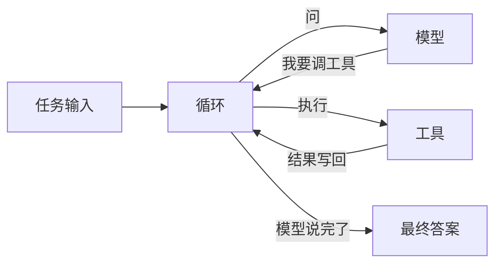
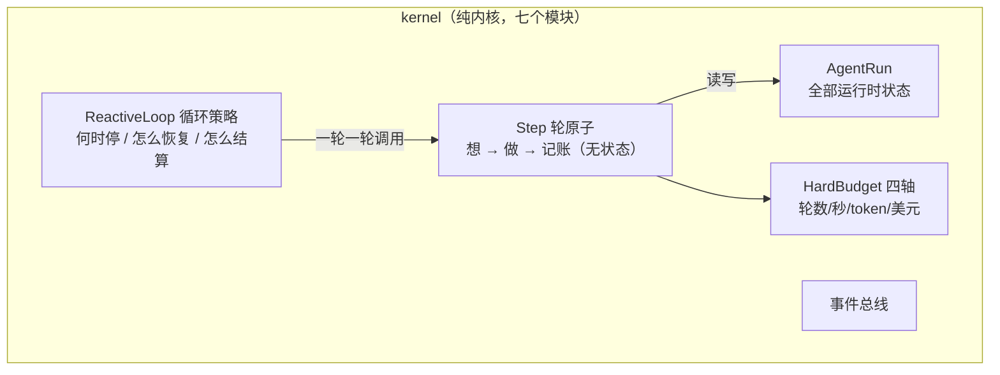
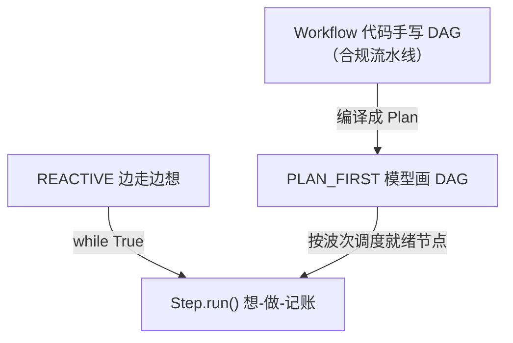
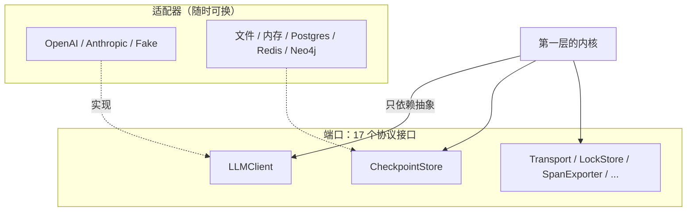
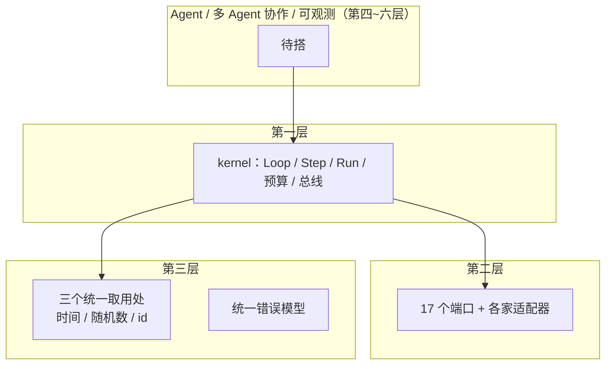
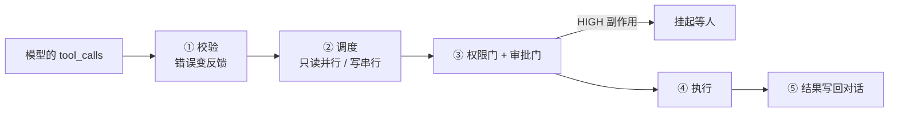
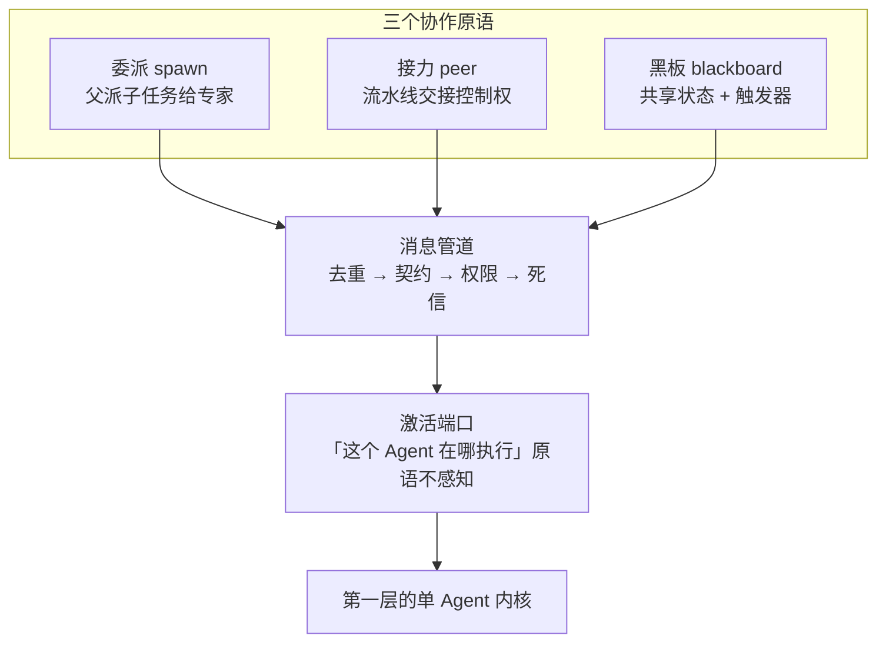
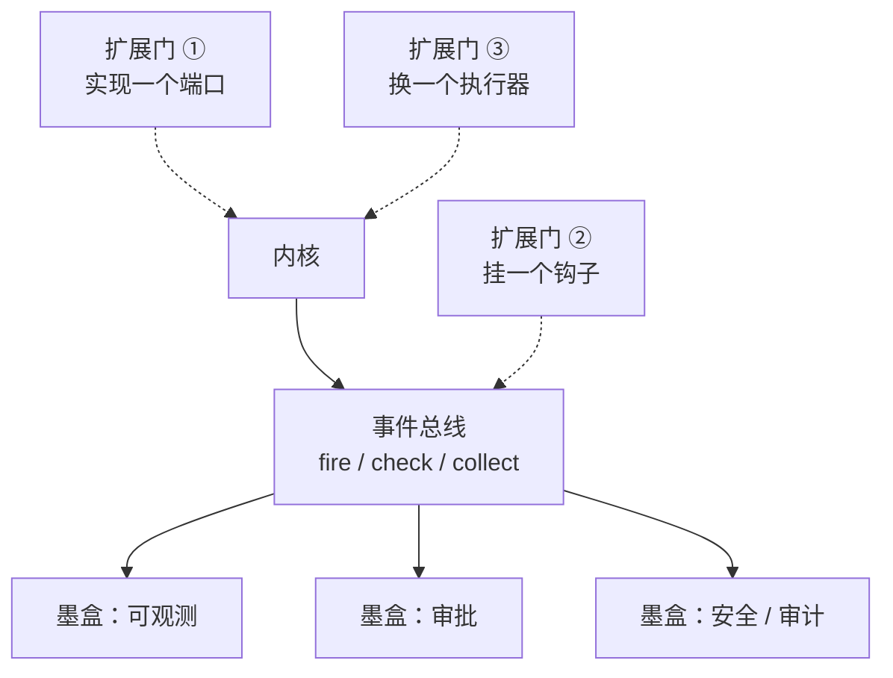
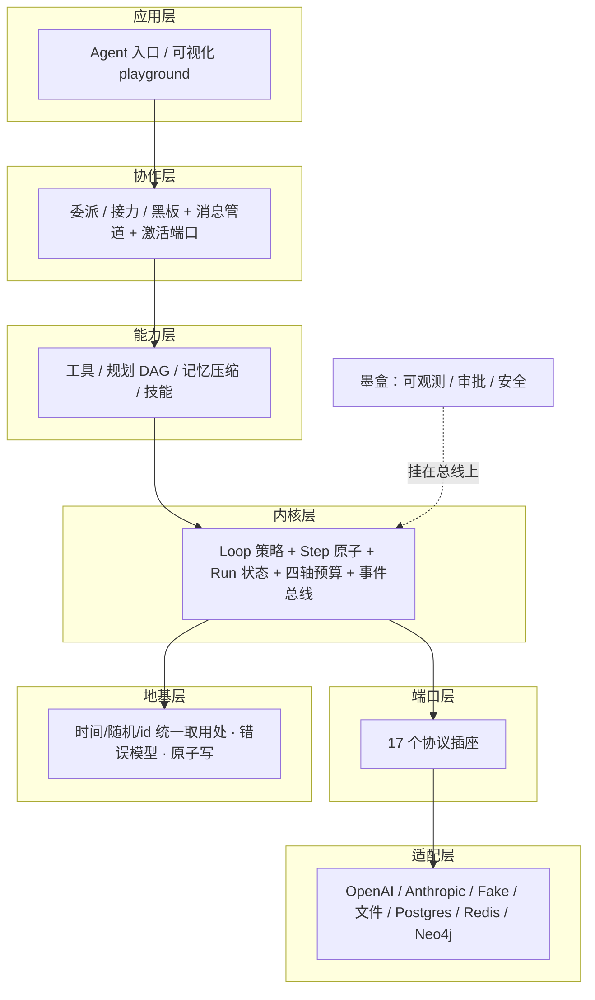

# 所有 Agent 框架的内核，都是同一个 while 循环

> 从第一性原理推一遍工业级 Agent 框架的骨架：七层抽象，每层一个裁决、一张图、一次业界对照。标本是开源框架 prodagent——3 万行、1300+ 离线测试、核心只有 4 个依赖，配了一本十二章的免费书。

先做一个思想实验。

你是一个 Agent 开发者，今天决定不看文档，直接去读 LangGraph 的源码。你大概会在几十万行代码里迷路——入口都找不到。换一条路，你自己写一个 50 行的 demo：一个 while 循环，调模型、执行工具、把结果塞回对话。这个你完全读得懂，但它没有预算、没有恢复、没有审批，什么都没有。

这两个体验之间的鸿沟，就是"会用框架"和"会设计框架"的距离。市面上的文章几乎全站在鸿沟的此岸教你怎么调 API，或者站在彼岸给你看一座已建成的桥。很少有人把造桥的过程拆开：**第一个决策是什么，为什么这样裁，不这样会死在哪一步，一流框架又是怎么裁的。**

这篇文章就做这件事。从一个五行循环出发，一层一层搭出能上生产的骨架。解剖标本是开源框架 [prodagent](https://github.com/limenagent/prodagent)：三万行代码、十四个包、一千三百多个离线测试、核心依赖只有四个（anyio / httpx / pydantic / typing-extensions），仓库里配了一本十二章的开源书（`docs/book/`）。文中每张架构图都随讲述逐层长大——最后一节你会看到全景。

## 第零层：第一性原理——Agent 到底是什么

剥掉所有装饰，每个 Agent 框架的内核都是这五行：

```python
while True:
    response = await llm.complete(messages)
    if response.stop_reason == StopReason.END_TURN:
        return response.content
    for call in response.tool_calls:
        messages.append({"role": "tool", "content": execute(call)})
```

想一步（问模型）、做一步（执行工具）、把结果接回对话、再想。OpenAI 的 Runner、LangGraph 的执行器、Claude Agent SDK 的 loop，拆开看都是这五行。**模型是大脑，负责决策；框架是身体，负责执行**——模型自己执行不了任何东西，它只会输出文字说"我想调 search 工具"。画成图就这么大：



既然内核相同，架构师的差距体现在哪？

体现在这五行循环转起来之后发生的事。生产环境会接连不断地提要求：模型在同一个错误上打转怎么办（每一轮都是真金白银）？进程崩了怎么从断点继续（发过的邮件不能重发一遍）？删数据这种不可逆动作怎么先过人？多个 Agent 协作时消息怎么不丢不重不乱序？出了事故怎么原样重演一遍？

多数人的第一反应是找一份"生产级特性清单"：加重试、加缓存、加监控、加分布式。**这是错的次序。**零碎的特性解决不了系统性的问题，堆到最后你得到一个什么都有一点、什么都不彻底的怪物。正确的次序是：每接到一个生产要求，先问它逼迫你回答哪个**底层问题**——回答对了，后面的特性都是水到渠成的填充；回答错了，后面所有特性都在给错误的地基打补丁。

这些问题一共七个，也是本文的路线图：

1. 循环怎么拆、状态放在哪？（内核层——先看心脏）
2. 内核怎么接触外部世界而不被污染？（端口层）
3. 怎么让同样的输入得到同样的运行？（最底层）
4. 模型犯错怎么接住？（工具层）
5. 多个 Agent 怎么协作？（协作层）
6. 横切能力从哪进入内核？（扩展层）
7. 怎么保证约束永远成立？（最后一层）

## 第一层：kernel——先看心脏

三万行的框架，心脏只有七个模块：循环、步骤、状态、预算、总线、死循环检测、类型。这个心脏的纯度不是靠自觉维持的——有一整层测试看守它（kernel 的依赖闭包里不得出现任何能力包，这条作为定理跑在 CI 里，第七层细说）。先把心脏拆开看：



七个模块里藏着三个关键决策。

**决策一：Agent 无状态，状态全部属于 Run。**Agent 是一个无状态的配置对象——名字、系统提示、工具集，一份静态的任职说明书；对话进行到哪、花了多少钱、执行到第几步，这些随时间变化的数据全部属于 Run（一次任务的完整生命周期）。为什么这是第一个决策？因为**并发和恢复都从这一个分离里长出来**：同一个 Agent 可以同时接多个任务，因为任务状态不挂在 Agent 身上；一个任务崩溃后能被完整存盘恢复，因为状态有唯一的家。反过来，状态散落在 Agent 属性里的框架，这两个词根本无从谈起。很多框架把"支持并发"当特性宣传——并发不是做出来的，是状态归属对了之后自然存在的。

**决策二：把循环拆成两个类——这是多种执行模式共用同一内核的全部秘密。**`Step` 是一轮的完整原子：想（组装上下文、调模型、记账），然后只有当模型要工具时才做（执行工具批次），预算在批次前后各查一次；无状态，所有模式共用。`ReactiveLoop` 是循环策略：什么时候停、怎么恢复、异常怎么结算。拆完之后，"三种组织任务的方式跑在同一个内核上"从口号变成三行代码：



边走边想的 REACTIVE、先规划后执行的 PLAN_FIRST、手写确定性流程的 Workflow，全部落在同一个"想-做-记账"原子上——模式之间的全部差别，浓缩为**什么时候调用原子**。原子只写一次、只测一次；PLAN_FIRST 的 DAG 调度、断点续跑、重规划，都只是调用时机的变化。为什么不这么拆会死？因为不拆的框架只有两条路：为每种模式复制一份循环（每个 bug 修三遍），或者写一个巨型循环函数用 if 区分模式（每加一个特性要在三个分支里各加一段）。你的 50 行 demo 之所以什么都加不上去，就是因为它是一个不可分解的整块。**架构师的工作就是找到公约数，把它钉成一个类。**

顺带一提预算为什么住在这里：四轴上限——轮数、秒数、token、美元——任何一个触顶即停。为什么四个轴而不是业界常见的 `max_iterations` 一个数？因为轮数量度不了成本：同样十轮，账单可以差三个数量级；而一个合理需要三十轮的任务会被一刀切误伤。四个轴各堵一种失控形态。

**决策三：状态收进类型，让非法状态不可表示。**一次运行的一生是四个状态：RUNNING、COMPLETED、FAILED、SUSPENDED（挂起等外部——等人审批是最典型的场景）。用枚举封闭集合只是第一步，真正的决策在转移上：**状态转移只有一个入口。**裸赋值（`run.state = "COMPLETED"`）的问题在于状态从不孤立出现，它总携带配对物——转到 COMPLETED 必须同时有最终输出，转到 FAILED 必须有分类过的崩溃现场。允许裸赋值，四条配对关系就要在每个赋值点上靠人脑记住，漏写一行，落盘的就是一个"不知道为什么失败"的 FAILED。prodagent 把转移收进四个方法，配对逻辑写一次，全框架只能走这几扇门。

同一个思想的另一次现身是 StepStatus 的第六个值：规划执行到一半要改计划，那些还没开始的步骤被新版本顶替——它们既没运行也没失败。标成 FAILED，恢复逻辑会误以为它们出过错而去重试；标成 COMPLETED，会误以为副作用已发生。于是单独立一个 OBSOLETE。**当一种真实处境无法用现有词汇准确表达时，正确的做法不是凑合用近义词，而是为它造一个诚实的名字。**

**业界对照。**同一颗心脏，各家装法不同。LangGraph 把控制流本身做成一等公民——你先定义图和状态机，框架负责执行，强在编排显式、可可视化，代价是每个应用都要先建图，单聊场景也得背着图的抽象。OpenAI Agents SDK 反其道行之，Runner 内置一个循环，简单直接，但想换循环的组织方式（比如先规划后执行）就得自己在外面拼。Claude Agent SDK 在同一个 loop 上加 subagent 做并行上下文隔离。prodagent 走第三条路：**循环策略可换、轮原子不可换**——换模式不换心脏。

心脏看完了。但它要在一个真实世界里连续跳很多年，面对两个威胁：外面的世界会变（模型厂商、存储介质），自己的内部会漂（时间、随机数、id，每次都不一样）。接下来两层分别回答这两个威胁——它们不是新话题，是"这颗心脏怎么保持又小又纯"的两个答案。

## 第二层：端口——内核不认识任何厂商

心脏要跳，就要调模型、要把状态存盘。最直接的写法是在循环代码里 import 某家 SDK。这样当天就能跑通，但三个麻烦会陆续找上门，一个比一个深。

第一，换模型等于改内核。今天用 OpenAI，明天换 Anthropic 或本地部署，你就得打开最核心的循环代码动刀——心脏成了换零件的必经之路。第二，测试必须连真实 API。真模型贵、慢、有随机性，你连"断言结果正确"都做不到。第三，各家格式打架。每家的返回结构、工具调用格式、缓存字段都不同，翻译代码散布在循环的各个角落，接第三家时你已经在对一张几十项的表。

于是第二个决策：**内核和外部世界之间，立一堵墙。**墙这边是核心代码，只认接口约定（端口）；墙那边是适配器，每一家厂商、每一种介质各写一个。这就是教科书里的六边形架构（端口与适配器）。心脏的图长出边界：



方向是全部精髓：**依赖箭头从内核指向接口，永远不指向具体厂商。**这个方向安排有个正式名字叫依赖倒置——让细节去依赖抽象，而不是让使用者去依赖细节。它一次兑现三件事：换模型不动内核；测内核不用真模型；没装任何厂商 SDK 的机器照样 `import prodagent`。

但教科书没告诉你的是三个工程细节，它们才是关键：

**第一，端口用 Protocol 而不是抽象基类。**Python 的 `typing.Protocol` 是结构化类型：任何类只要长着约定要求的方法，就自动满足协议——不需要继承，不需要 import 框架的任何东西。差别看似微妙，后果很实在：如果用抽象基类，测试用的假模型就必须继承你的基类，测试代码从此被缝死在框架里；用 Protocol，测试世界和框架世界零耦合，第三方写的类不改一行就能插进来。

**第二，端口要小到只有一个方法。**prodagent 的 `LLMClient` 端口全部内容就是一个 `complete()`。这不是偷懒：端口的大小直接决定实现的成本。一个方法的约定，任何人一百来行就能实现一个新适配器；二十个方法的约定，没有人愿意实现第二次。**接口越小，替换越容易。**

**第三，这份清单要用数字钉死。**`ports/` 目录下 17 个可替换插座（模型、工具、检查点、会话、消息传输、锁、审批、追踪导出、共享账本……），换来核心只有 4 个依赖，连带整个测试体系离线可跑。

**业界对照。**这层谁都在做，但深浅有别。OpenAI Agents SDK 把 model 做成可注入的接口，方向相同；Claude 生态把"外部工具怎么接"上升成了 MCP 标准，让工具这个端口行业共建——把端口思想做到了协议层，很漂亮。2026 年 8 月 DeepSeek 开源的 Harness（DSH）走得更远，"一切皆插件"，连循环本身都可替换。LangChain 系选了另一条路：广收集成、生态铺量，代价是依赖树和抽象层的厚度。prodagent 的立场是微内核：**变化全部关进端口，核心薄到能从头读完。**没有唯一正确答案，但你必须知道自己选了哪条、付了什么。

## 第三层：最底层——管住"每次都不一样"的东西

外部的变化被墙挡住了，还有第二个威胁在内部。检验一个框架的工程质量，只需问一句话：**同样的输入，能不能得到两次一模一样的运行？**

测试需要这个能力——断言才有意义；排查事故也需要——复现才有意义。但一个随手写就的框架，答案是做不到。因为代码里到处埋着"每次都不一样"的东西：事件要盖时间戳，每次读 `time.time()` 都是新值；重试要加随机抖动（避免所有重试同时砸向刚喘过气的下游），`random` 每次给新数；每条记录要发 id，`uuid` 每次发新号。这些调用散落在几百个文件里，看起来人畜无害，实则判了死刑：你的框架永远无法被完整地测试，也永远无法被完整地重演。

解法不神秘：给这三样各设一个统一的取用处——时间、随机数、id 生成，各定义一个小接口，默认实现直接转调标准库（行为与裸调用一模一样），并立一条 lint 规则：框架代码禁止直接调 `time.time()`、`uuid.uuid4()`，一律走取用处。prodagent 里这个模块不到两百行，放在全仓库最底层的 `base/` 包。到此为止的四层拼成一张剖面图：



为什么要放在最底层、而且必须从第一天做起？因为这件事的补课成本随代码量增长。第一天做，是几行包装；写完两万行再做，要把全库翻一遍，而且永远不确定翻干净了没有。**这类"越晚做越贵、晚了做不彻底"的决定，就是架构师要先于一切识别出来的东西。**同住在 base 里的还有统一错误模型——描述"失败"需要受控词表（鉴权失败、限流、超时……决定哪些错值得重试）、异常类树、第三方异常翻译器，三样本质是同一个概念的三个面，放一个文件，新增一种失败模式只改一处。

**业界对照。**这层是各家真正的分水岭。Langfuse 这类观测平台能把生产 trace 一键变成测试数据集，但它重跑时调用的是此刻的真实模型——复现的是当时的输入，不是当时的执行；原因之一就是它站在你的进程之外，管不到你代码里的时钟和 id。DeepSeek Harness 的核心理念"运行时语义与回放等价"，靠的正是把这类不确定性统一管起来——而且这条纪律只能在框架代码里立，别人替你立不了。**确定性不是特性，是地基；而地基没法后补。**

## 第四层：Tool——"做"这一半的防御工事

三层骨架搭好，Agent 和 Tool 反而是最薄的部分。Agent 是配置对象加一个 `chat()` 入口，由 runtime 包的组装根把零件拼成整机——组装根是全仓库唯一允许点名具体零件的地方，想知道默认配置开了什么，读一个文件就够。

Tool 这层真正的决策只有一句：**调用工具的是会犯错的模型，不是严谨的程序员。**模型会幻觉出不存在的工具名、传错参数名、把数字写成字符串。工具系统的反应不是抛异常打断循环，而是把错误变成模型读得懂的反馈——"工具 xxx 不存在，可用工具有这些"——模型下一轮读到反馈，通常自己就改对了。工具这一侧的管线：



工具的静态档案里藏着一个教科书级的拆分：**"是否只读"和"副作用等级"是两个独立字段，而不是一个枚举的四档。**因为它们是两个正交的维度——只读与否决定能不能并行（只读操作互不干扰可以并发，写操作必须保序串行），副作用等级决定要不要人审批。一个低危的缓存写入是"串行但免审"，一个高危的银行转账是"串行且要审"，压成一个枚举就表达不出这种组合。**当一个字段装不下所有组合时，正确的动作是拆成两个字段。**

**业界对照。**"错误回喂模型"如今已是各家共识——Claude 的 tool use、OpenAI 的 tool loop 都这么做，不用争。差别在管线的完整度：审批挂起（HIGH 副作用先过人）在 OpenAI Agents SDK 里是 Runner 的 human approval 暂停，在 prodagent 里则是调度管线上的一扇门，且和"恢复后执行的就是当初展示给用户的那次调用、一个字节不差"绑定成完整语义。**管线里每一道闸都不是特性，是"谁在什么顺序上把关"的结构决策。**

## 第五层：多 Agent 协作——先问该不该拆

单个 Agent 讲完，该拆多 Agent 了。这层的第一个决策朴素得扫兴：**能不拆就不拆。**多 Agent 更贵、更慢、更难调试，还多一种单 Agent 没有的病：互相甩锅的死循环。Anthropic 在多智能体协调指南里说得很透——让协调的复杂度超过任务本身的复杂度，是事倍功半的经典配方。真要拆（需要不同专长、需要并行、需要制衡、天然流水线，四选一），prodagent 给的原语只有三个：



委派（父 Agent 派子任务，专家干完交报告）、接力（流水线，控制权像接力棒传递）、黑板（版本化共享状态加触发器，谁的数据到了谁被激活）。三个够吗？把 Anthropic 归纳的协作模式摆上来对：编排器-子智能体是委派；生成器-验证器是委派（父端验证）；智能体团队（持久工人从队列认领工作）是黑板——触发器盯着"待办"键；共享状态是黑板的事件触发形态；点对点定向传递是接力。**三个原语覆盖全部业界模式，没有一个模式需要"再发明一种原语"才能表达。**注意这三个不是拍脑袋选的：框架早期有五个原语，后来发现队列是黑板的一种触发器、合议是黑板围绕一个话题轮流发言的特化，砍掉的是重复，留下的是正交。**原语要少到能全部装进脑子，又足够组合出已知的一切。**

但这层最深的决策不在原语，在图最下面那行：**所有"让一个 Agent 干活"的动作，在代码里是同一个调用——一次激活。**激活的入参只带可序列化的字段；这个 Agent 在本进程执行还是在另一台机器上，由端口实现决定，协作原语完全不感知。协作的语义（谁跟谁、什么顺序、共享什么）和执行的物理（哪里跑、怎么通信）被彻底分开——想从单机搬上集群，换一个端口实现，三个原语一行不改。

**业界对照。**这层最热闹，也最能看出各家立场。CrewAI 把协作模式做成框架 API：crew、task、process（sequential / hierarchical），上手极快，但你学的是它的 DSL，模式是它替你选好的。AutoGen 走对话路线，agent 们聊天协作，通用性强，后来微软把它和 Semantic Kernel 合并成了统一的 Agent Framework，可见"协作抽象怎么定"连大厂也在迭代。OpenAI Agents SDK 把 handoff 做成四原语之一，交接是原语级的。Claude 的 subagent 是编排器-子智能体的产品化形态。prodagent 的不同在于方向反转：**模式不是 API，是三个正交原语的组合**——你要 sequential 就用接力串起来，要 hierarchical 就用委派加父端验证，要团队就配黑板触发器。组合式贵在原语层稳定：业界每出一种新模式（而且它们确实一直在出），你组合现有的原语去表达，框架本身一行不用改。

## 第六层：Hook 与三扇门——横切能力怎么进入内核

还剩最后一类东西没安放：可观测、审批、安全、审计。它们的共同点是**横切**——不属于任何一个模块，要纵向穿过整个系统。这层有两个决策。

第一个：**横切能力挂在总线上，不串成中间件链。**kernel 的事件总线有三个协议，语义刻意不同：fire（观察——并发扇出，观察者挂了不影响主流程）、check（拦截——阻塞裁决，任何一个说"不"就短路，检查器自己出错默认按拦截处理，安全检查宁可错杀）、collect（收集——要等答案、按序汇总）。审批门、权限门挂在 check 通道的九个拦截点上，追踪挂在 fire 通道上。为什么不用更常见的中间件链？因为链式结构里每环都要显式调用下一环，漏调一环整条链断掉；总线是星形注册，各观察者独立挂上互不相识，谁掉了都不影响别人。

第二个：**横切能力封装成自装配墨盒（HookBundle）。**可观测需要在七八个事件点挂钩子，如果一个一个注册，组装根就必须了解每个能力的内部细节。墨盒模式下每个能力对外只暴露一个 `attach()`，插上自己完成所有连接。于是一套配置档位就是一张墨盒清单：裸核清单是空的；`production()` 一行换上全套护甲——落盘恢复、追踪、高风险工具审批、LLM 缓存、上下文压缩。**裸核和生产是同一套内核的两种配置，不是两套代码。**架构图长出最后一圈：



到此，整个框架的扩展方式可以数清楚了，一共三扇门：**实现一个端口**（新的模型适配器或存储后端）、**在总线上挂一个钩子**、**换一个执行器**。价值不在列了什么，而在划了边界——**不存在第四扇需要逆向源码才能发现的暗门。**想知道这个框架能怎么扩展，读一张清单就够了。

**业界对照。**Claude Agent SDK 的 hooks 和 OpenAI Agents SDK 的 guardrails 是同一类思想的单品形态：hooks 在循环的特定节点触发你的函数，guardrails 并行做输入输出校验——都好用，但每家各自定义了一组点。prodagent 把这件事做成了三层结构：**总线提供语义（三种协议，各自容错），拦截点提供位置（九个），墨盒提供封装（能力自装配）**——于是"加一个新的横切能力"从改框架代码，降级为写一个新墨盒。

## 第七层：贯穿一切的手艺——把约束变成结构，再用机器锁死

七层搭完，退后一步看全景：



你会发现十二个模块（预算、恢复、审批、规划、协作、观测、回放……）表面各不相同，底下是同一门手艺的变奏：**把"必须永远成立的约束"从口头约定变成代码结构，再用测试把它锁死。**

- 架构方向是测试：哪个包不许 import 哪个包、依赖闭包的纯度、全库 import 图无环、import 重量不膨胀——四个层级跑在 CI 里，分层不靠自觉，靠机器执法；
- 状态转移收进单入口方法，配对物从注释升格为结构；
- 账目恒等式（任意操作序列下"实花 + 预占 == 总支出"）是定律，用随机生成的上万种操作序列锤打，等式必须恒成立；
- 序列化往返律、事件日志折叠律，同样进 CI 永不跳过。

这门手艺的极致是一条等式，值得单独拿出来压轴。生产 Agent 出事后最大的痛是复现不了：temperature 调零也没用（服务商机房里的浮点归约顺序你管不着），翻观测数据也没用（记录是过去的描述，不是可以重新执行的程序）。LangGraph 把宝押在检查点上——每步存完整状态快照，时间旅行支持从任意检查点续跑（replay）和分叉（fork），能力很强，但检查点之后的节点会**真实重新执行**，模型完全可能给出不同答案：过去确定，未来不确定。Langfuse 把生产 trace 一键变测试数据集，重跑用的却是此刻的真实模型：复现的是当时的输入，不是当时的执行。DSH 的"运行时语义与回放等价"离得最近，粒度也最细（连流式输出的每个分块都进日志，换来调试的完整、付出带子随协议漂移的代价）。

prodagent 的答案是录一盘卡带：一次运行只录"边界问答对"——模型每次被问到什么、答了什么，工具每次收到什么参数、返回了什么（状态不录，状态是问答的确定性推论，可以重算）。然后立一条定律：

```
strict(replay(cassette(run))) ≡ run
```

把一次运行的卡带喂给回放器重演，逐事件比对（排除时间戳这类天然会变的字段），两者必须等价。这条定律进了持续集成，任何改动都要在它面前证明自己没有破坏"历史可重演"。它一旦成立，凌晨三点的事故就能零成本、毫秒级地在测试环境等价复现，复现完的卡带脱敏后固化成永久的回归测试——**可观测、审计、评估、测试，是同一份录像带的四种读法。**（进度交代：确定性端口、事件日志、检查点恢复已在仓库里；卡带与回放引擎按里程碑推进，等价律最近才在 CI 里变绿——仓库不吹没兑现的东西。）

回放本身不是重点。重点是你会认出它：假模型的手写剧本（第三层的统一取用处）、确定性闸口、边界只录一次（第二层的端口思维）、幂等键（第五层的消息管道）——**这台时光机没有发明任何新零件，它只是把前面每一层的决策接到了一起。**这就是好架构的检验标准：旗舰能力是地基的自然延伸，而不是一块独立的补丁。

## 最后：你该带走什么

七层、七个决策，串起来复述一遍：

| 层 | 决策 | 一句话 WHY | 业界近邻 |
|---|---|---|---|
| 内核 | Agent 无状态；Loop/Step 分离 | 并发与恢复、多模式共用一个原子 | LangGraph / Claude SDK |
| 端口 | 会变的东西藏到接口后面 | 换模型不动内核，测内核不用真模型 | OpenAI SDK / MCP / DSH |
| 地基 | 统一"每次都不一样"的东西 | 确定性是测试和回放的前提，且无法后补 | DSH |
| 工具 | 错误是反馈；正交维度拆字段 | 模型会犯错是常态，反馈让它修正 | 各家共识，差在管线完整度 |
| 协作 | 三原语 + 激活端口 | 语义与执行位置分离；模式靠组合不靠 API | Anthropic 指南 / CrewAI / AutoGen |
| 横切 | 总线 + 墨盒 + 三扇门 | 扩展点即边界，没有暗门 | Claude hooks / OpenAI guardrails |
| 执法 | 约束变结构，结构上机器 | 口头约定会被遗忘，定律不会 | DSH / LangGraph 定律化程度不一 |

注意这张表里没有一个"生产级特性"。没有重试策略，没有缓存，没有监控面板——不是它们不重要，而是**它们全是填充物**：骨架立对了，填充是体力活；骨架立错了，填充是给错误地基打补丁，而且永远打不完。面试官问"预算怎么设计"，背特性清单的人从重试次数讲到熔断阈值，从白板推下来的人从四轴讲到账本恒等式——差距就在有没有这七层。

如果你想把手放在这套骨架上验证一遍：仓库在 [github.com/limenagent/prodagent](https://github.com/limenagent/prodagent)，`git clone` 下来 `uv sync` 一条命令起环境，`uv run pytest tests/ -q` 一千三百多个测试离线跑完，全程不需要一个 API key。每一层决策的完整论证、每个"为什么不选另一种方案"的取舍表、从 Python 类型注解讲起的十二章详解，都在仓库的 `docs/book/` 里——一本为"从会用到会设计"写的书，免费，无广告。

如果这篇文章只让你记住一句话，记住这句：**设计能力不是记住特性清单，是能在白板上把骨架从零推一遍——而推的第一笔，永远是问"什么会变"。**

---

**Sources:**
- [OpenAI Agents SDK – Official Docs](https://openai.github.io/openai-agents-python/)
- [Agents SDK Guide – OpenAI API Docs](https://developers.openai.com/api/docs/guides/agents)
- [Use Time-Travel – LangChain Docs](https://docs.langchain.com/oss/python/langgraph/use-time-travel)
- [Persistence – LangChain Docs](https://docs.langchain.com/oss/python/langgraph/persistence)
- [Subagents in the SDK – Claude Code Docs](https://code.claude.com/docs/en/agent-sdk/subagents)
- [CrewAI Docs – Processes](https://docs.crewai.com/v1.15.17/en/concepts/processes)
- [CrewAI Docs – Crews](https://docs.crewai.com/v1.15.17/en/concepts/crews)
- [microsoft/autogen – GitHub](https://github.com/microsoft/autogen)
- [Microsoft Agent Framework Overview](https://learn.microsoft.com/en-us/agent-framework/overview/)
