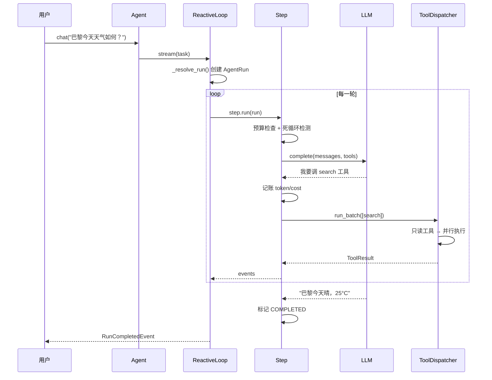

# 序章 · 从 Python 基础，到独立设计一个工业级 Agent 框架
> 阅读时间约 18 分钟。这一章不写代码细节，只做三件事：说清这本书要把你带到哪里、为什么用"读一个完整框架"的方式带你去，以及怎么把标本先跑起来。

---

## 这本书的目标

这本书带你走一条路：从只会 Python 基础，走到能独立设计并实现一个工业级 Agent 框架。这个水平，在行业里对应高级 Agent 开发工程师、Agent 架构师——不是会用某个框架写应用，而是框架本身由你来设计。

先把"工业级"三个字说具体，因为它最容易被含糊带过。你写过的 Python 程序，大概率都跑在自己的电脑上：跑错了改改再跑，崩了重启一遍就行。这样的环境叫开发环境。而**生产环境**指的是程序真正对外提供服务的环境：真实用户在用它，真实数据在被处理，出了问题有真实的代价。在本书里，"工业级"指的就是能在这个环境里长期稳定运转的水平。

调通一次模型调用、写一个会调工具的 `while` 循环，一周就能学会，但那离工业级还很远。两者差在哪儿？用五个真实问题一问就现形，这五个问题也是全书五个部分的主角：

- **预算**：模型在同一个错误上反复打转，怎么让它在第四轮就停下来，而不是第四百轮把钱烧光？
- **恢复**：进程崩溃、机器重启，怎么从断点继续，而不是从头再来、把发过的邮件再发一遍？
- **审批**：发邮件、删数据这类**做了就撤不回**的动作，怎么先经过人确认再执行？
- **消息平面**：多个 Agent 协作时，消息怎么保证不丢、不重、不乱序？
- **回放**：出了事故，怎么在测试环境把当时的每一步**原样重演**一遍来定位根因？

右边加粗的五个词，就是这五个问题的名字。你现在可能一个都答不上来——完全正常，本书的十二个章节就是把这五个问题一个一个讲透。读完你会发现，它们看似分散，底层却是同一门手艺：**把"必须永远成立的约束"从口头约定变成代码结构，再用测试把它锁死。**这句话现在读起来有些抽象，等你走完全书再回头看，它会变得非常具体。

## 为什么学设计，必须读一个完整实现

市面上的 Agent 学习材料分两类，恰好各缺一半。

一类是黑盒框架的官方文档。功能很全，跟着教程确实能把应用搭起来，但它的抽象层很厚：你学会的是它的 API——在哪个位置传什么参数——而学不到它内部为什么这么取舍。为什么预算设四个轴而不是一个？为什么恢复要用事件日志而不是直接存档？文档不回答这些问题，因为对使用者来说不需要回答，但对设计者来说，这些问题就是全部。

另一类是教学玩具：几十行写一个循环，每一行都看得懂，很清晰。但它没有预算、没有恢复、没有审批——恰好把"工业级"和"玩具"区分开的那部分全部省略了。看懂它，你学到的是一个孤立的概念，离能设计生产系统还差很远。

| | 黑盒框架文档 | 教学玩具 | 这本书要给你的 |
|---|---|---|---|
| 功能完整度 | 高 | 低 | 高 |
| 可读性 | 抽象层厚 | 清晰但单薄 | 逐行可读 |
| 生产机制 | 常绑定自家云服务 | 无 | 内建、可拆解 |
| 你最终学到的是 | 它的 API | 一个孤立概念 | 可迁移的设计方法 |

概念课能告诉你"事件溯源是什么"，一句话就讲完了。但设计能力要求你回答更细一层的问题：事件的 id 具体在哪一行生成、序号由谁来分配、时间戳从哪里取、为什么这样定、换一种做法要付什么代价。这些问题，没有任何抽象概念能替你回答——答案只存在于一个真实的、完整的实现里。

所以这本书的做法是：拿一个真实的工业级框架当**解剖标本**，一层一层拆开给你看。每讲完一个机制，检验标准都不是"你记住了名词"，而是——换你来设计，你知道从哪里下手。

## 解剖标本

本书的解剖对象是 prodagent，一个开源的 Python Agent 框架。先看一组数字建立量级感：

| 指标 | 值 | 说明 |
|------|-----|------|
| 代码行数 | 约 3 万 | 小到可以从头读到尾 |
| 包数量 | 14 | 按学习顺序排列，每包一个职责 |
| 离线测试 | 1,300+ | 零 API key、零网络、零偶发失败 |
| 核心依赖 | 4 | anyio / httpx / pydantic / typing-extensions |
| 协议端口 | 17（ports 目录共 20 个 Protocol） | 后端可换：file/memory/postgres/redis/neo4j |
| 执行模式 | 2 种 + 1 个构建器 | REACTIVE / PLAN_FIRST 两种模式；Workflow 是手写计划的构建器，不是第三种模式 |
| 协作原语 | 5 | 委派 / 接力 / 合议 / 黑板 / 队列 |
| 总线协议 | 3 | fire（观察）/ check（拦截）/ collect（收集） |
| 预算轴 | 4 | turns / seconds / tokens / cost |
| 压缩级 | 5 | 不压缩 → 工具压缩 → 历史摘要 → 主题摘要 → 紧急 |
| 记忆通道 | 4 | 规则 / 实体 / 精确 / 语义 |
| Python 版本 | 3.11+（CI 覆盖 3.11 / 3.12 / 3.13） | 持续集成矩阵全覆盖 |

这张表里的一半名词——端口、总线、协作原语——你现在一个都不认识，完全正常，也完全不用记。每一行都会在对应的章节里讲透，这里只需要带走一个量级印象：**它小到读得完，又全到值得读**。3 万行是什么概念？一个商用框架动辄几十万行，读到入口就迷路了；3 万行是一个勤奋读者用几周时间能真正从头走到尾的规模。

选它做教材只有一个理由：它同时满足"能上生产"和"能读完"。生产机制一样不缺，但每个核心机制只有几百行，整体还按学习顺序组织。请注意，你不需要成为 prodagent 的用户——它是标本，不是目的地。读完这本书，你带走的是可迁移的设计能力，不是某个框架的使用技能。

---

## 学习路线

全书 12 章，按"先吃透单个 Agent，再扩展到多个 Agent"组织：

| 部分 | 章 | 内容 |
|---|---|---|
| 全景 | 第 1 章 | 从 10 行 demo 一步步推演出架构地图；类型注解从零讲起 |
| 单个 Agent | 第 2–9 章 | 模型层 → 循环内核 → 预算 → 工具系统 → 记忆/压缩/技能 → 事件日志与恢复 → 规划 DAG → 审批 |
| 多 Agent | 第 10 章 | 协作：消息平面、幂等、全序 |
| 观测与回放 | 第 11–12 章 | 可观测；可回放、可回滚的运行时 |

有一件事需要特别说明，它决定了这本书的讲法。Python 进阶、计算机基础、设计模式这三类知识，本书**不设独立的章节**。哪个模块用到了哪块知识，就在那一章的"插曲"小节里把它讲透，学完立刻回到源码里用。为什么这么安排？因为知识需要动机才留得住。孤立地学 Protocol、学事件循环，看完就忘；带着"这段代码凭什么能跑、为什么非这样不可"的问题去学，一次成型。所以第 2 章讲到模型适配器时才教 Protocol，第 7 章讲到检查点时才教乐观并发——每个知识点都是在你马上要用到它的那一刻登场的。

## 学完你能做什么

四个可以自我检验的目标。

第一，独立设计一个 Agent 框架的各大机制——预算、恢复、审批、工具调度、多 Agent 协作、可观测，每个设计决策的约束、代价和替代方案，你都能讲清楚。"讲清楚"的标准是白板级别：不给资料，你能从一张空白的架构图开始，推演出每个模块并说明理由。

第二，读懂任何 Agent 框架的源码。读完这本书再去看 LangGraph、Temporal 这类系统，你能很快判断它做了什么、没做什么、为什么这么选——因为你已经亲手拆过一个完整的。

第三，在技术评审和面试里，把 Agent 架构讲成一等公民。不是背名词——名词谁都会背——是当场推演设计：面试官问"预算怎么设计"，你从四个轴讲到熔断，从单 Agent 讲到多 Agent 共享账本。

第四，每个机制你都亲手改过。全书的动手环节带你改代码、看测试变红再变绿。设计能力从动手里长出来，不从单纯的阅读里。

## 前置要求

你只需要会 Python 的变量、函数、类，会用命令行装包、跑命令。不需要任何 AI 背景，用到的概念都会在你需要的那一刻教。如果"类型注解"这个词让你发怵，完全没关系——第 1 章会从零讲起，它是读源码的第一道门槛，跨过去之后一马平川。

---

## 先把标本跑起来

解剖课先见活的。下面这 10 行是一个完整、可跑的 Agent：

```python
import asyncio
from prodagent import Agent, AgentConfig, ExecutionMode, tool

@tool(name="search", readonly=True)
async def search(query: str) -> str:
    """搜索网络信息。"""
    return f"results for: {query}"

agent = Agent(
    "demo",
    system_prompt="你是一个 helpful assistant，使用工具回答问题。",
    tools=[search],
    mode=ExecutionMode.REACTIVE,
    config=AgentConfig(name="demo"),
)

asyncio.run(agent.chat("巴黎今天天气如何？"))
```

逐段看它在做什么。第一行 `import asyncio` 引入 Python 标准库里的异步运行支持（异步到底是什么、为什么 Agent 离不开它，第 2 章有整整一节从零讲；现在只要知道 `asyncio.run(...)` 负责启动一个异步任务并等它跑完）。第二行从框架顶层拿来四个名字：`Agent` 是主角，`AgentConfig` 是它的配置，`ExecutionMode` 是执行模式的枚举（"边走边想"还是"先规划后执行"，第 1 章展开），`tool` 是一个装饰器——`@` 开头的这种语法叫装饰器，作用是在不改函数代码的前提下给它附加能力，这里是把一个普通的 `search` 函数"登记"成 Agent 可用的工具，第 5 章讲它的原理。

接着定义了那个工具函数：接收一个查询词，返回一段结果文本。注意它头上的三引号文档字符串——模型就是靠读这段文字来理解"这个工具是干什么、什么时候该用它"的，所以它写给模型看，不写给程序员看。

然后构造 Agent：第一个参数是名字；`system_prompt` 是岗位说明书，告诉模型它是谁、该怎么做事；`tools=[search]` 把工具挂上；`mode=ExecutionMode.REACTIVE` 选择"边走边想"的循环模式；最后一行把"demo"这个名字的配置交给它。全部就绪，`asyncio.run(agent.chat(...))` 启动对话——这一行背后发生的事，比这 10 行代码本身多得多。

它默认使用框架内置的"假模型" FakeLLM，零 API key、零网络、零配置——这一点极其重要，意味着你在飞机上、在任何没配密钥的机器上都能把整本书的代码跑起来。全书所有示例和测试都遵守这条纪律：不联网也能完整工作。

安装分两种情况。**只想快速体验**，一行装包即可（核心只有 4 个依赖）：

```bash
pip install prodagent
```

**要跟着这本书读源码、做动手练习**，把仓库克隆下来，用 uv 装开发环境。uv 是一个很快的 Python 包管理器，没有的话先装上：

```bash
pip install uv                          # 没有 uv 才需要这行
git clone https://github.com/limenagent/prodagent
cd prodagent && uv sync --extra dev     # 装好依赖与开发工具
```

这 10 行背后是一条完整的调用链，先混个脸熟：



这张时序图现在一个字都看不懂也没关系——第 1 章会把一次同样的调用放慢到一帧一帧回放，图中每个方框在第 1 章的架构地图里都有名字。这里只有一个细节值得现在就注意：这已经是最简单的调用路径，但预算检查、死循环检测、工具调度管线一个不少，而且**默认开启**。生产机制"默认就有"而不是"需要你手动配置才有"，这是工业级的第一条判据，第 1 章会展开讲它到底意味着什么。

### 接真实模型与生产配置

想接真实模型，只需换一个 `LLMClient` 实现：OpenAI 兼容端点、Anthropic 原生都行，也可以只设环境变量（如 `ANTHROPIC_API_KEY`），框架会自动识别。上生产则用 `AgentConfig(framework=production())`，一行开启全套护甲——落盘恢复、追踪、高风险工具审批、LLM 缓存、上下文压缩、事件日志。

请记住这个感觉：裸核和生产是**同一套内核的两种配置**，不是两套代码。差别只在一张配置清单上，这个结构性的结论第 1 章就会讲清楚。这些细节后续章节都会展开，现在一个都不用记。

---

## 怎么读这本书

每章遵守同一个节奏：先从一个真实问题或一段真实代码切入，把概念耐心讲透，回到源码验证，最后留一个动手练习。三个约定贯穿全书。

第一个约定：**开着仓库读书**。每个概念都标注真实文件路径（如 `src/prodagent/base/event_log.py`），引文偶尔略去类型注解以便阅读，会注明。左边书、右边编辑器，看到锚点就跳过去看上下文，这是读代码书最有效的姿势。

第二个约定：**测试是练习册**。框架一千三百多个测试全部离线可跑，`uv run pytest tests/ -q` 一条命令全量。动手环节会让你改代码、看测试变红、再改回绿——亲手制造一次错误、再修好它，是理解一个机制最短的路径。

第三个约定：**附录随时查**。[跨章知识点速查](appendix.md)按图索骥——忘了 Protocol、忘了乐观并发，查到就回那一章复习；附录里还有十条设计原则、关键取舍速查、术语表、示例地图和 API 速查，一份附录就是一本工具书。

---

## 下一章

第 1 章回答两个问题：一个工业级 Agent 到底由哪些模块组成、每个模块为什么非存在不可；以及读源码的第一道门槛——类型注解——从零讲起。

→ [第 1 章 · 全景：从 10 行 demo 到一个工业级框架](ch01.md)
