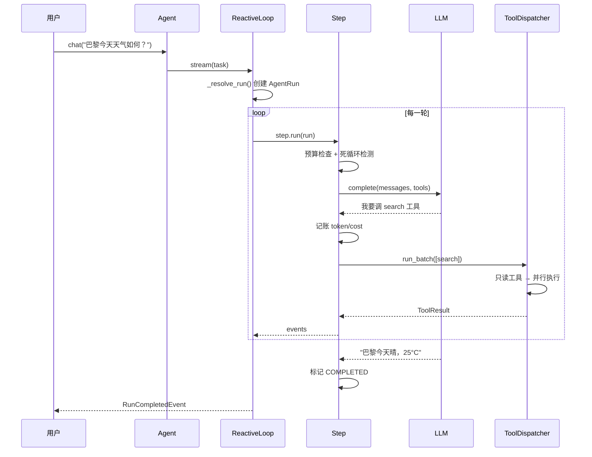

# 序章 · 从 Python 基础，到独立设计一个工业级 Agent 框架

> 阅读时间约 10 分钟。

---

## 这本书的目标

这本书带你走一条路：从只会 Python 基础，走到能独立设计并实现一个工业级 Agent 框架。这个水平，在行业里对应高级 Agent 开发工程师、Agent 架构师。

先把"工业级"三个字说具体，因为它最容易被含糊使用。调通一次模型调用、写一个会调工具的循环，一周就能学会，但那不是工业级。工业级框架要回答的是另一组问题：模型在同一个错误上打转，怎么在第四轮就停下来，而不是第四百轮？进程崩溃重启，怎么从断点继续，而不是从头再来？发邮件、删数据这类不可逆的动作，怎么先经过人确认再执行？多个 Agent 协作，消息怎么保证不丢、不重、不乱序？出了事故，怎么精确复现当时的每一步？预算、恢复、审批、消息平面、回放——这五个词分别对应这五个问题。会调 API 和会设计这些机制之间，隔着这本书的全部内容。

## 为什么学设计，必须读一个完整实现

市面上的 Agent 学习材料分两类，恰好各缺一半。一类是黑盒框架的文档：功能很全，但抽象层厚，你学会的是它的 API，学不到它内部的取舍过程。另一类是教学玩具：几十行实现一个循环，清晰，但没有预算、没有恢复、没有审批，离生产很远。

| | 黑盒框架文档 | 教学玩具 | 你需要的 |
|---|---|---|---|
| 功能完整度 | 高 | 低 | 高 |
| 可读性 | 抽象层厚 | 清晰但单薄 | 逐行可读 |
| 生产机制 | 绑定自家云服务 | 无 | 内建、可拆解 |
| 你学到的是 | 它的 API | 一个概念 | 设计方法 |

概念课能告诉你"事件溯源是什么"。设计能力要求你回答另一层次的问题：事件的 id 在哪一行生成、序号由谁分配、时间戳从哪里来、为什么这样定、换一种做法的代价是什么。这些问题，只有真实的完整实现能回答。所以这本书的做法是：拿一个真实的工业级框架做解剖标本，逐层拆开来看。每讲完一个机制，检验标准不是"你记住了"，而是换你来设计，你知道从哪里下手。

## 解剖标本

本书的解剖对象是 prodagent，一个开源的 Python Agent 框架。先用一组数字建立量级感。读完这本书再回头看这张表，每一行你都会知道它对应哪一章：

| 指标 | 值 | 说明 |
|------|-----|------|
| 代码行数 | 约 2.9 万 | 小到可以从头读到尾 |
| 包数量 | 14 | 按学习顺序排列，每包一个职责 |
| 离线测试 | 1,300+ | 零 API key、零网络、零 flaky |
| 核心依赖 | 4 | anyio / httpx / pydantic / typing-extensions |
| 协议端口 | 17（共 20 Protocol） | 后端可换：file/memory/postgres/redis/neo4j |
| 执行模式 | 3 | REACTIVE / PLAN_FIRST / Workflow |
| 协作原语 | 5 | 委派 / 接力 / 合议 / 黑板 / 队列 |
| 总线协议 | 3 | fire（观察）/ check（拦截）/ collect（收集） |
| 预算轴 | 4 | turns / seconds / tokens / cost |
| 压缩级 | 5 | 不压缩 → 工具压缩 → 历史摘要 → 主题摘要 → 紧急 |
| 记忆通道 | 4 | 规则 / 实体 / 精确 / 语义 |
| Python 版本 | 3.11 – 3.14 | CI 矩阵全覆盖 |

选它做教材只有一个理由：它同时满足"能上生产"和"能读完"——生产机制齐全，但每个核心机制只有几百行，整体按学习顺序组织。你不需要成为 prodagent 的用户，它是标本，不是目的地；读完这本书，你带走的是设计能力，不是某个框架的使用技能。

---

## 学习路线

全书 12 章，按"先单个 Agent、再多 Agent"组织：

| 部分 | 章 | 内容 |
|---|---|---|
| 全景 | 第 1 章 | 从 10 行 demo 推演架构地图；类型注解从零讲起 |
| 单个 Agent | 第 2–9 章 | 模型层 → 循环内核 → 预算 → 工具系统 → 记忆/压缩/技能 → 事件日志与恢复 → 规划 DAG → 审批 |
| 多 Agent | 第 10 章 | 协作：消息平面、幂等、全序 |
| 观测与回放 | 第 11–12 章 | 可观测；可回放、可回滚的运行时 |

有一件事需要特别说明：Python 进阶、计算机基础、设计模式这三类知识，本书不设独立的章节。哪个模块用到了哪块知识，就在那一章的"插曲"小节里把它讲透，学完立刻回到源码里用。这样安排是因为知识需要动机才能留住——孤立地学 Protocol、学事件循环，学完就忘；带着"这段代码为什么能跑"的问题去学，一次成型。

## 学完你能做什么

四个可以检验的目标。第一，独立设计一个 Agent 框架的各大机制——预算、恢复、审批、工具调度、多 Agent 协作、可观测，每个设计决策的约束、代价和替代方案，你都能讲清楚。第二，读懂任何 Agent 框架的源码；读完这本书再看 LangGraph、Temporal 这类系统，你能很快判断它做了什么、没做什么、为什么。第三，在技术评审和面试里，把 Agent 架构讲成一等公民——不是背名词，是推演设计。第四，每个机制都亲手改过：全书的动手环节带你改代码、看测试变红再变绿，设计能力从动手里长出来，不从阅读里。

## 前置要求

会 Python 的变量、函数、类，会用命令行装包、跑命令。不需要任何 AI 背景，用到的概念都会在需要的章节教。如果你对"类型注解"这个词感到陌生，正好——第 1 章会从零讲起，它是读源码的第一道门槛。

---

## 先把标本跑起来

解剖课先见活的。这 10 行代码是一个完整可跑的 Agent：

```python
import asyncio
from prodagent import Agent, AgentConfig, ExecutionMode, tool

@tool(name="search", readonly=True)
async def search(query: str) -> str:
    """搜索网络信息。"""
    return f"results for: {query}"

agent = Agent(
    "demo",
    system_prompt="你是一个 helpful assistant，使用工具回答问题。",
    tools=[search],
    mode=ExecutionMode.REACTIVE,
    config=AgentConfig(name="demo"),
)

asyncio.run(agent.chat("巴黎今天天气如何？"))
```

默认使用框架内置的假模型 FakeLLM，零 API key、零网络、零配置。安装只需两步：

```bash
pip install prodagent          # 核心仅 4 个依赖
# 从源码读这本书：
git clone https://github.com/limenagent/prodagent
cd prodagent && uv sync --extra dev
```

这 10 行背后是一条完整的调用链：



注意一个细节：这是最简单的调用路径，但预算检查、死循环检测、工具调度管线一个不少，而且默认开启。生产机制"默认有"而不是"可以配"，这是工业级的第一条判据，第 1 章会展开讲它的含义。

### 接真实模型与生产配置

接真实模型只需换一个 `LLMClient` 实现：OpenAI 兼容端点、Anthropic 原生都行，也可以只设环境变量。上生产用 `AgentConfig(framework=production())`，一行开启全套护甲——落盘恢复、追踪、高风险工具审批、LLM 缓存、上下文压缩、事件日志。裸核和生产是同一套内核的两种配置，不是两套代码。这些细节都会在后续章节展开，现在不必记。

---

## 怎么读这本书

每章遵守同一个节奏：先从一个真实问题或一段真实代码切入，把概念讲透，回到源码，最后动手。三个约定贯穿全书。

第一个约定：开着仓库读书。每个概念都标注真实文件路径（如 `src/prodagent/base/event_log.py`），引文偶尔略去类型注解以便阅读，会注明。左边书、右边编辑器，看到锚点就跳过去看上下文，这是读代码书最有效的姿势。

第二个约定：测试是练习册。框架一千三百多个测试全部离线可跑，`uv run pytest tests/ -q` 一条命令全量。动手环节会让你改代码、看测试变红、再改回绿——改坏了什么、为什么坏，这是设计反馈的最短路径。

第三个约定：附录随时查。[跨章知识点速查](appendix.md)按图索骥——忘了 Protocol、忘了乐观并发，查到就回那一章复习；附录里还有十条设计原则、关键取舍速查、术语表、示例地图和 API 速查，一份附录就是一本工具书。

---

## 下一章

第 1 章回答两个问题：一个工业级 Agent 到底由哪些模块组成，每个模块为什么存在；以及读源码的第一道门槛——类型注解——从零讲起。

→ [第 1 章 · 全景：从 10 行 demo 到一个工业级框架](ch01.md)
