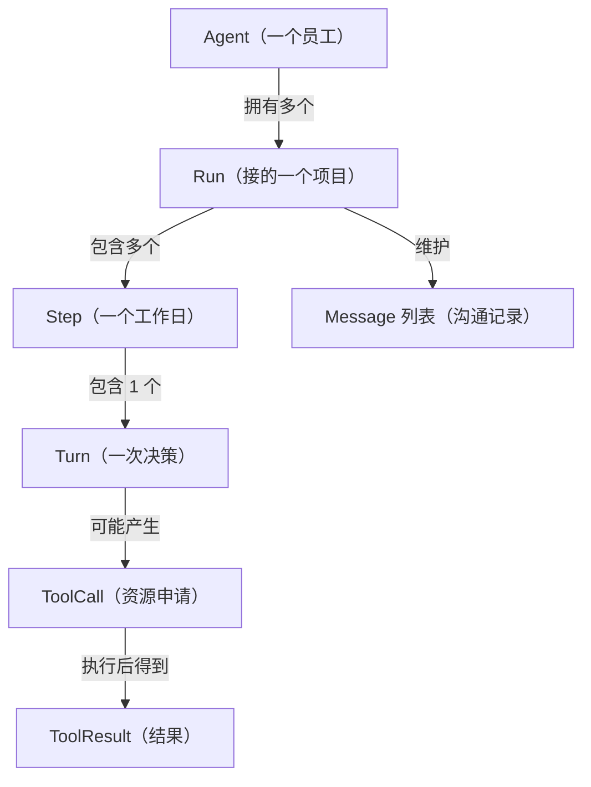
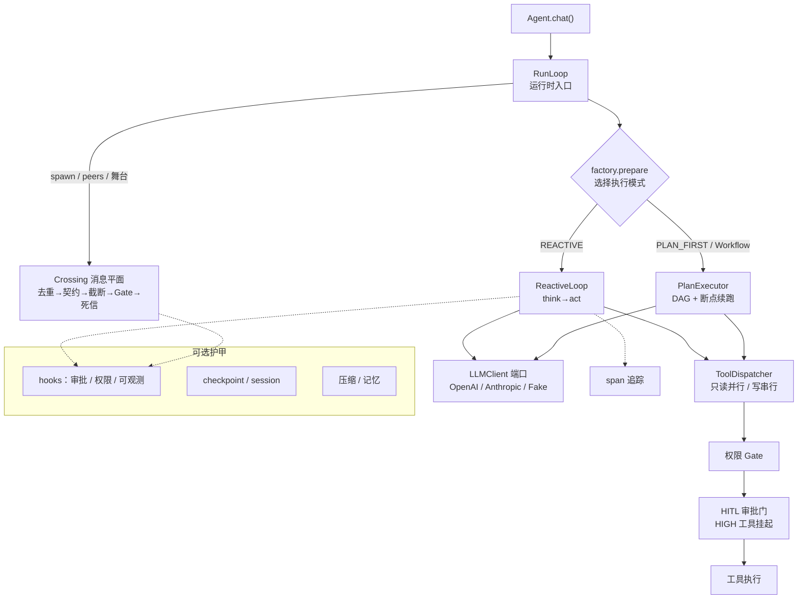

# 第 1 章 · 全景：从 10 行 demo 到一个工业级框架

> 阅读时间约 45 分钟。本章回答两个问题：一个工业级 Agent 由哪些模块组成，每个模块为什么存在。最后从零讲类型注解——读懂后面所有源码的第一道门槛。

---

## 1.1 每提一个生产要求，长出一个模块

序章那个 10 行的 demo，拆开只有三个部件：模型是大脑，工具是手，还有一个看不见的循环是心跳——想一步、做一步、看结果、再想。教学玩具到此为止，工业级框架从第 4 个部件开始。

### 推演之前，先对齐七个词

大脑、手、心跳这三个部件，各自都有正式名字，后面每一章都要用它们说话。Agent 领域最容易混淆的就是这些"看起来差不多"的概念，一张包含关系图就能说清：



Agent 是一个有身份、有系统提示、有工具集的实体；Run 是一次任务执行的完整生命周期；Step 是一轮"想加做"；Turn 是模型的一次输出；再加上 Message、ToolCall、ToolResult 三个自明角色。Run 之上还有一个 Session：跨多次 Run 的持久对话上下文，同一个会话里的多次调用共享历史——Run 是"今天这个任务"，Session 是"跟这个用户的整段关系"。有一条裁决现在就要立住：**Agent 是无状态的配置对象，状态全部属于 Run**。同一个 Agent 可以同时跑多个 Run（并发），一个 Run 崩了不影响 Agent 本身——正是这个分离让并发和恢复成为可能。你会在第 3 章看到 Run 怎么被序列化、在第 7 章看到它怎么被存盘恢复。

词汇对齐了，回到推演。这个框架的发展逻辑只有一条规则：每提一个生产要求，就长出一个模块。下面把这条推演完整走一遍。这不是历史考据，而是帮你建立一张"问题到模块"的对照表——走完你会发现，它就是全书的目录。

### 要求一：不能无限烧钱

模型没有"够了"的概念。你问它一个问题，它调用工具、查看结果、再调用工具，这个节奏本身没有终点；如果工具一直报错而模型一直换着参数重试，循环可以转上几百轮，每一轮都是一次计费的模型调用。所以必须给一次运行设上限：最多几轮、最多几秒、最多多少 token、最多多少钱，四个上限任何一个触顶就强制停止。这就是预算模块，框架里最简单也最重要的安全网。

### 要求二：进程崩了，要从断点继续

生产环境里，进程被杀死是常态而不是意外：部署要重启，内存不足会被系统杀掉，宿主机本身也可能重启。如果没有应对机制，重启后 Agent 从头开始，而它之前调用过的工具，副作用已经发生了——发过的邮件会再发一遍，写过的数据会再写一遍。应对它需要两个模块配合：事件日志把"发生过什么"一条条记下来，只追加、不修改；检查点恢复定期保存进度快照，重启后从最近的快照继续。这套技术来自数据库领域，第 7 章专门讲。

### 要求三：不可逆动作，先过人

模型再强也有出错率。对查询类工具，错了重来就是，代价很小；对发邮件、删数据、下订单这类动作，错了无法撤销。所以要有审批模块：给工具标注风险等级，高风险的动作执行前挂起，等人确认后才继续。它和预算的分工要说清：预算防的是"失控"，审批防的是"正确地做错事"，两种危险需要两种闸门。

### 要求四：复杂任务要先规划

"调研两个竞品，对比后写份报告"——这类任务有明确的步骤结构。让模型边走边想，它容易漏步骤、容易顺序乱。所以要有规划模块：先让模型产出一张步骤依赖图（第 8 章讲 DAG），按依赖执行，能并行的并行；执行中发现计划不对，还可以重规划。

### 要求五：对话会越来越长

每一轮的工具结果都留在对话历史里，聊到几十轮，历史文本的长度会超过模型能处理的窗口。所以要有压缩模块：超过阈值时按规则压缩历史，保留关键信息、牺牲细节。什么能压、什么绝不能压，是需要认真设计的问题，第 6 章讲。

### 要求六：要记住教训

同一个任务失败过三次，第四次不该从零开始，经验和教训应该沉淀下来。这催生两个模块：记忆模块负责存取事实和经验、按需召回；技能模块负责把成功运行的做法蒸馏成可复用的操作手册。它们合起来是第 6 章的主角。

### 要求七：一个 Agent 干不完

调研、写作、审核是三种不同的工作，一个提示词塞不下三种专长。所以要多 Agent 协作：多个各有专长的 Agent 通过消息传递协作——委派、接力、投票、共享黑板。这是第 10 章的内容，也是"先单个 Agent、再多 Agent"这条学习线的下半场。

### 要求八：出了事要能查

上面所有模块都在运行，出了问题你怎么知道哪一环错了？靠翻日志效率很低。所以要有可观测模块：结构化的追踪数据——每轮做了什么、花了多少、工具返回了什么——可以对接标准的观测工具。第 11 章。

### 要求九：出了事要能复现

日志只能告诉你"发生了什么"。排查复杂问题需要的是"原样重演一遍"：同样的输入、同样的中间状态，一步步重放。这是九个要求里最难的一个：可回放运行时，第 12 章专门讲。前面各章攒下的纪律（时间从哪来、随机数从哪来、id 从哪来）都会在那一章兑现。

### 九个模块，一张地图

九个生产要求，长出九个模块，加上最初的三件（大脑、手、心跳），就是全书要解剖的完整框架。每章一个模块，书就是你刚走过的这条推演的展开。

---

## 1.2 架构地图：14 个包怎么摆

框架源码在 `src/prodagent/` 目录下，分成 14 个包。包（package）就是一组相关的模块文件，放在同一个目录里。先看地图混个脸熟，后面每章解剖一块：

```
src/prodagent/
├── base/          ← 最底层公共件：配置、异常、类型、事件模型
├── ports/         ← 17 个可替换"插座"（第 2 章主角）
├── llm/           ← 模型层：各家模型的适配器 + 假模型 + 定价 + 缓存
├── kernel/        ← 心跳：循环、步骤、预算、事件总线、运行状态
├── tooling/       ← 手：工具装饰器、调度、可靠性（熔断）
├── runtime/       ← 装配：把上面的零件组装成一个可用的 Agent
├── plan/          ← 规划：动态 DAG、执行器、手写工作流
├── cognition/     ← 记忆与压缩
├── skills/        ← 技能：经验蒸馏成手册
├── coordination/  ← 多 Agent：委派/接力/投票/黑板/队列
├── hooks/         ← 横切能力：审批、安全、可观测、审计
├── backends/      ← 端口的实现：文件/内存/Postgres/Redis
├── mcp/           ← 接入外部工具的标准协议
└── playground/    ← 可视化界面（独立叶子，谁也不依赖它）
```

### 分层：依赖只朝一个方向

这个目录不是平铺的，有严格的层次。规则一句话：上层可以使用下层，下层不知道上层存在。

```
        runtime/（装配，最上层）
              │ 组装
    ┌─────────┼──────────┐
  llm/     tooling/    plan/ ……（功能模块）
    └─────────┼──────────┘
              │ 使用
        ports/（插座：换后端不换内核）
              │ 依赖
        base/（最底层：谁都可以用，自己谁也不依赖）
```

为什么要在乎依赖的方向？假设没有这条规则，任何文件都能 import 任何文件，那么改动任何一处代码，波及面都无法预测，你只能靠完整跑一遍测试来确认没弄坏什么。有了单向依赖，局面就清楚了：改 `base/` 要小心，因为所有上层都在用它；改 `kernel/` 不用担心影响 `base/`，因为 kernel 用 base、base 根本不知道 kernel 存在。"改一处、崩一片"的风险被结构本身挡住了一大半。

这条规则特别的地方在于，它不是靠自觉维持的。仓库里有一条测试专门看守它，而且看守的不止这一条。完整的红线清单有四条：kernel 不依赖任何能力包（它不知道模型是哪家、存储是什么）；ports 是唯一的接缝（换后端等于换实现类，不碰业务代码）；协作层不 import 运行时（执行走端口，将来搬上分布式不改协作代码）；playground 是叶子（任何模块不得依赖界面）。每一条都有对应的测试在持续集成里执法。

红线第四条提到的 `playground/`（可视化界面）要多说两句。它站在依赖树的最顶端，可以依赖任何包、任何包不许依赖它，这条边界写在构建配置的契约里强制执行。它自身还有两个决定：HTTP 层无状态，运行状态的真相永远在存储里，进程重启后网页还能接着看同一个 run——这是"状态外置到端口"原则的自我兑现；多 Agent 的各种玩法用"适配器归一化事件 + 一个统一驱动器"消灭特判——和舞台驱动器、后端一致性考卷是反复出现的同一个母题。

执法本身分层级，框架管它叫"架构即定理"：

| 测试 | 断言什么 | 层级 |
|------|---------|------|
| `test_layering_contract` | 两两禁令：哪个包不得 import 哪个包 | 规则 |
| `test_kernel_purity` | kernel 的 import 闭包不含能力包 | 闭包 |
| `test_import_weight` | `import prodagent` 的重量不随时间膨胀 | 度量 |
| `test_no_import_cycles` | 全库 import 图拓扑排序无环 | 定理 |

最后一级有个讲究。两两禁令有盲区：每条边都合法，拼起来却可能成环——而环意味着不存在自底向上的阅读顺序，也不存在能单独加载的模块。禁令约束的是局部，定理保证的是全局。这个"约束逐级收紧到数学事实"的思路，和第 7 章你要见到的数据不变式（往返律、账目恒等式）是同一门手艺：**凡是能交给机器判定的约束，就不留给人的自觉。**

### 组装：三个插座，一清单墨盒

地图上还有一个包没讲——`runtime/`，装配的地方。零件再多，总得有一处把它们拼成整机，这一处叫组装根（compose），全仓库唯一允许"点名"各零件的地方。它宣告了扩展能力的全部三种方式：实现一个端口（模型适配器、存储后端）、在总线上挂一个钩子（观察、审批、注入）、换一个执行器（PLAN_FIRST 就是第二种循环策略）。清单的价值不在列了什么，而在划了边界——**不存在第四扇需要逆向源码才能发现的暗门**。

横切能力还有一层打包设计。像"可观测"这样的能力要在好几个事件点上挂钩子，如果一个一个注册，组装根就得了解每个能力的内部细节。框架的解法是 HookBundle：每个能力封装成一个"自装配墨盒"，你只要在组装时调它的 `attach()`，它自己把整套钩子接上。于是一套 profile 就是一张墨盒清单——裸核清单是空的，`production()` 的清单里有 span 导出、审批门、缓存监控各一枚。加一个新能力等于写一个新墨盒加一行清单，组装根永远不动。两个细节：控制台打印默认关闭（库不经过同意不刷别人的屏）；审批墨盒挂载前先查用户有没有自己传过审批钩子，传过就不重复挂——默认值要给显式选择让路。

### 底座的手艺：最底层解决最脏的活

`base/` 包是全仓库最底的一层，谁都可以用它、它谁也不依赖。这里的代码都不起眼，但合起来是同一种审美：把重复的、机械的、容易踩坑的事，在最底层、离接缝最近的地方一次性解决。看两件代表作。

第一件是懒加载。框架顶层要导出几十个符号，但全部加载会让 `import prodagent` 变慢——而跑测试、写脚本的人每天都在付这笔税。`base/lazy.py` 的解法只有十几行：顶层只登记一张"谁住在哪"的符号表，真正访问某个符号时才去加载它住的模块，加载过就缓存：

```python
# prodagent/__init__.py —— 只登记"谁住在哪"，并不真正 import
_SYMBOL_SOURCES = {
    "Agent": "prodagent.runtime.agent",
    "HardBudget": "prodagent.kernel.budget",
    # ...
}
__getattr__, __dir__ = lazy_package(_SYMBOL_SOURCES)
```

像图书馆的闭架取书：目录一直摊在你面前，书要等你点名才去库房取，取过一次就放在手边。它让"对外只暴露一个整洁入口"和"内部按需加载、核心极轻"这两件本来矛盾的事同时成立——而"轻"由 `test_import_weight` 上秤看守，前面那张定理表里你已经见过它。

第二件是错误模型。描述"失败"需要三样东西：一套受控词表（鉴权失败、限流、超时……，决定要不要重试）、一棵异常类树（`raise` 时抛的）、一个分类器（把第三方异常映射回词表）。很多项目把它们拆在三个文件里，新增一种失败模式要改三处。框架的判断是它们本质是同一个概念，全部放进 `base/errors.py` 一个文件——新增失败模式只改这一处。你在第 5 章会完整读到它，包括里面那条"默认可重试、不可重试要举证"的成熟取舍。

base 层还有一串同款手艺，散在后面各章等你：字段驱动的序列化编解码器（第 7 章）、原子写与路径防火墙（第 7 章）、稳定指纹序列化（第 3 章）、中文 n-gram 切词（第 6 章）、带抖动的退避（第 5 章）、时间的唯一出口（第 7 章）。读到时留意它们的共同点：**都有明确的默认方向，都设在离数据入口最近的接缝处。**

---

## 1.3 一次调用怎么走：两种执行模式

序章的时序图展示了最简单的执行方式，框架实际支持两种模式，对应两类任务。

REACTIVE（边走边想）：每一轮，模型看着当前局面决定下一步调用什么工具。适合探索性任务——路径事先不知道，走一步看一步。PLAN_FIRST（先规划后执行）：先让模型产出完整的步骤依赖图，人可以审一眼计划，然后按图执行，执行中可重规划。适合结构清晰的任务。

默认是 REACTIVE，不为简单任务付规划的代价。两种模式共用同一套大脑、手、预算和恢复机制，差别只在"心跳"的组织方式。这个共用是怎么做到的，是第 3 章的悬念之一。

把一次 `chat()` 调用在整张架构里的路径画出来，是本章最后一张地图——后面每一章，都是这张图某一块的放大：



实线是主调用链，虚线是横切能力——它们挂在总线上，循环感知不到它们的存在。

---

## 1.4 插曲：类型注解，从零讲起

从这一节起会出现大量真实源码。读它们的第一道门槛不是 Agent 知识，而是 Python 的类型注解（type hints）。这一节从零讲起——已经会的读者可以快进，但建议扫一遍小标题，后面章节会按这里建立的词汇来引用。

### 1.4.1 变量上的注解：一张标签

```python
x: int = 5
name: str = "prodagent"
```

`x: int` 读作"x 是一个整数"。冒号后面的部分就是类型注解。这里有一个必须先讲清楚的关键事实：注解只是标签，不是笼子。写完 `x: int = 5` 之后你往 x 里塞一个字符串，Python 照样运行，不会报任何错：

```python
x: int = 5
x = "hello"        # 运行完全正常，没人拦你
```

那要它何用？用处有三处。给人读：读代码的人一眼知道这个变量装什么。给工具读：编辑器据此做代码补全和提示，这是日常收益最大的一项。给检查器读：mypy，下面会讲。

### 1.4.2 函数签名：一份契约

注解真正的主战场是函数。完整签名长这样：

```python
def repeat(text: str, times: int = 2) -> str:
    return text * times
```

从左到右读：`text: str` 表示参数 text 应该是字符串；`times: int = 2` 表示参数 times 是整数，不传就默认 2；箭头后面的 `str` 是返回值类型，这个函数返回字符串。一个函数的签名就是它的契约：进什么、出什么。读工业代码的顺序永远是先读签名再读实现——签名告诉你它承诺做什么，实现告诉你它怎么兑现。

注解不是笼子这件事，在函数上有一个可以亲手验证的例子：

```python
def repeat(text: str, times: int = 2) -> str:
    return text * times

result = repeat(3, 2)      # 注解说 text 是字符串，我偏传整数 3
print(result)              # 6 —— 程序照常运行，返回了一个整数
```

`3 * 2` 在 Python 里是合法的整数乘法，所以没有任何报错，但契约已经违反了：说好返回字符串，返回了整数。这类错误在动态语言里最阴险——不崩溃，只是悄悄地错。谁来抓它？往下看。

### 1.4.3 容器的注解

列表、字典这类容器，注解要说明"里面装的是什么"：

```python
names: list[str] = []                      # 字符串列表
scores: dict[str, int] = {}                # 键是字符串、值是整数的字典
steps: list[dict[str, Any]] = []           # 字典的列表，字典的值类型不限
```

方括号读作"里面装……"。最后的 `Any` 表示任何类型都行，等于在这一层放弃检查，通常出现在内容自由的地方，比如事件的负载数据。

### 1.4.4 可选：可能是 X，也可能是 None

框架源码里最常见的形状之一：

```python
async def stream(self, task: str, *, run_id: str | None = None):
    ...
```

`str | None` 读作"字符串或者 None"，竖线的意思是"或"。这个参数可以传一个字符串，也可以不传（默认 None，表示让框架自己生成）。"可选"出现在返回值上时语义要换个方向理解：`-> str | None` 意味着可能没有结果，调用方必须考虑 None 的情况。读签名时看到 `| None`，脑子里要响起"这里有一个分支要处理"。

顺带解决一个你会反复遇到的疑惑：仓库每个文件开头都有 `from __future__ import annotations`。它的作用是让 `str | None` 这类较新的写法在较旧的 Python 版本上也不出错。现阶段知道"这行是通行证"就够了。

### 1.4.5 mypy：把标签变成安检门

Python 运行时不检查注解，这一点你已经亲手验证过了。但有一个独立工具会检查，叫 mypy。它不运行你的代码，只读你的代码，把类型对不上的地方全部列出来。刚才那个 `repeat(3, 2)`，mypy 会报：

```
error: Argument 1 to "repeat" has incompatible type "int"; expected "str"  [arg-type]
```

这个仓库开着 mypy 的最严档（strict），并且接进了持续集成：类型对不上的代码合不进来。这给你读源码带来一个很大的便利——写在那里的类型是真实生效的合同，不是装饰。你不需要读进函数体，就能确定参数和返回值的类型，阅读成本大幅降低。

### 1.4.6 小结

为什么工业代码全是注解？四个理由前面都出现了：编辑器补全、让"悄悄错"变成"提前报"、签名即契约、重构有安全网。代价只是写的时候多敲几个字符，工业场景里这笔账怎么算都划算。动手环节里有一道练习，让你亲眼对比"运行时不报、mypy 报"。

---

## 1.5 读码方法论：三件工具

全书都靠这三件事读代码，先立好。

第一件，测试是答案册。框架带一千三百多个测试，全部离线、秒级可跑。任何一个机制，找到它的测试文件读一遍，预期行为就清楚了——测试是可执行的规格书。跑法是 `uv run pytest tests/某目录/某文件 -v`。更好的玩法是改坏它：改一处源码，跑测试看哪个变红，红的那组测试就是这段代码的"客户"。本章动手环节你会做一次。

第二件，用文本搜索找接缝。想知道一个概念在代码里的全部落点，直接搜索：

```bash
grep -rn "class.*Protocol" src/prodagent/ports/
```

搜出来的每一行就是一个端口定义。读大代码库的诀窍不是从第一行顺读到最后一行，而是带着问题搜着读。

第三件，读注释里的"为什么"。好代码的注释不解释代码做什么——那是代码自己能说清的——而解释为什么这么做。这个仓库的注释几乎每条都在讲为什么，读书过程中遇到时停下来读两遍，那是设计者的原始思路，比任何转述都准确。

---

## 动手环节

练习 1：亲眼见一次"注解不是笼子"。建一个文件 `bad.py`：

```python
def repeat(text: str, times: int = 2) -> str:
    return text * times

result = repeat(3, 2)
print(result)
```

先运行 `python bad.py`，正常打印 6。再运行 `uv run mypy bad.py`，报出类型错误。两个结果放在一起看，就是 1.4 节的全部内容。

练习 2：跑通你的第一次"改坏"。打开 `src/prodagent/base/time.py`，把 `now_utc` 函数体里的 `now_wall()` 改成一个常量比如 `0.0`，然后运行 `uv run pytest tests/base -q`，看哪些测试变红——这告诉你谁在依赖时间。改回去，确认全绿。你刚完成了一次"谁依赖这段代码"的侦察。

---

## 自测三题

第一题：九个生产要求各对应哪个模块？任意说出两组，并各用一句话解释没有它会怎样。第二题：`repeat(3, 2)` 在运行时报错吗？谁会报错，在什么阶段报？第三题："依赖只朝一个方向"这条规则，靠什么机制保证不退化？

第三题的答案——一个扫描 import 方向的测试——现在就记住它：用测试锁住架构规则，这个手法后面每章都会出现。

---

## 下一章

地图有了，从下一章开始逐模块解剖。第一个是模型层，Agent 的大脑。它要回答的问题你在序章已经见过：框架内核怎么做到"不关心你是 OpenAI、Anthropic 还是假模型"？为了读懂答案，第 2 章的插曲会讲两件事：Python 的鸭子类型与 Protocol（"长得像就算数"的类型），以及异步编程的第一课——那是全书技术密度最高的插曲，讲得慢一些。

→ [第 2 章 · 模型层：Agent 的大脑](ch02.md)
