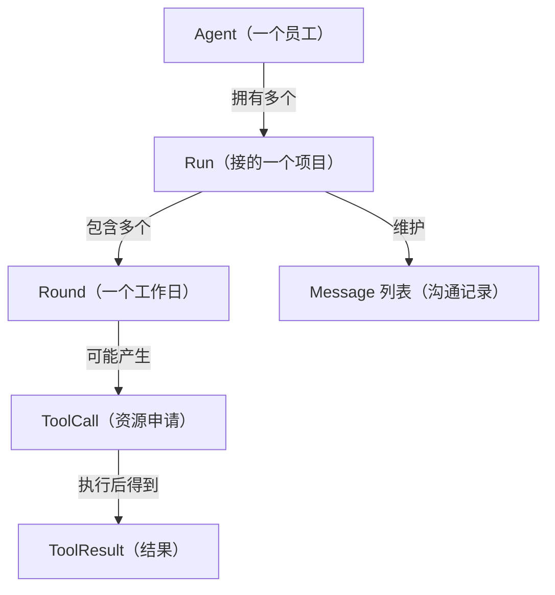
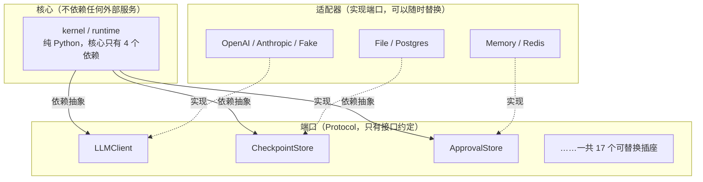
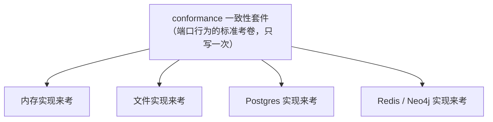
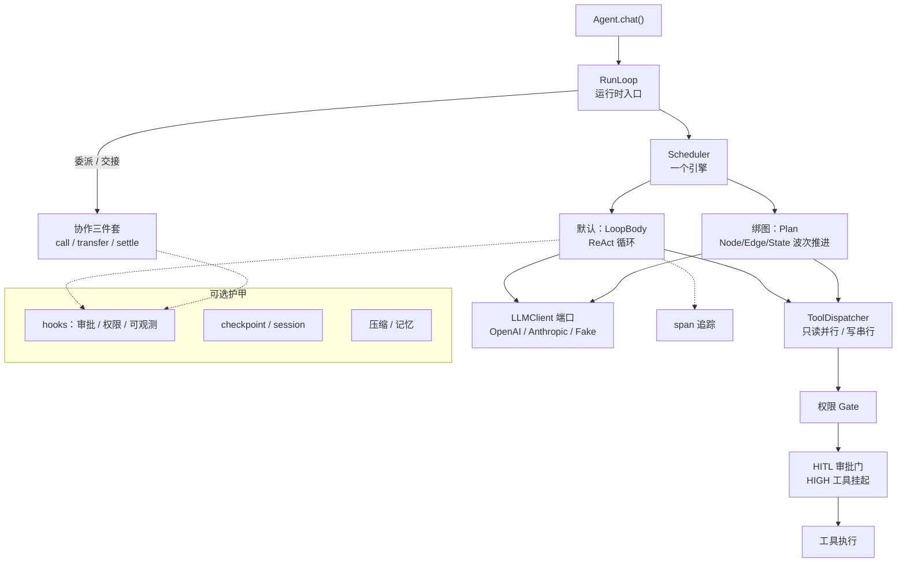

# 第 1 章 · 全景：从 10 行 demo 到一个工业级框架

> 阅读时间约 95 分钟。本章先给你一张完整的地图：一个工业级 Agent 由哪些模块组成、每个模块为什么非存在不可、这些模块靠什么"插座"拼在一起。最后从零讲类型注解——读懂后面所有源码的第一道门槛。
>
> 本章主线一句话：**工业级不是功能多，而是每多一个真实的生产要求，就长出一个职责明确的模块，并且把"会变的东西"统统藏到接口后面。**
>
> 零基础提示：这一章出现的图比序章多，遇到 `graph TD`、`stateDiagram` 这类图我会先教你怎么看；遇到没见过的英文词，旁边都有白话解释，不用停下来查。

---

## 开场：这一章要带你到哪里

序章的最后，你把那段 10 行的 demo 跑起来了。它调用了一次 `search` 工具，回答了一个天气问题，整个过程不到一秒。看起来平淡无奇——但这一章要告诉你的是：这次"平淡"的运行里，藏着工业级框架要处理的全部问题的种子。

本章回答三个问题。第一个，从那段 demo 到一个能上生产环境的框架，中间要补哪些模块？我们不讲历史考据，而是做一次推演：生产环境每提出一个真实要求，就逼出一个模块，走完这条推演你就拿到了全书的目录。第二个，这些模块在代码里是怎么摆放的？谁依赖谁、怎么拼装、换零件为什么不用动核心？这是 1.2 和 1.3 的内容，也是理解这个框架"为什么这么好换、这么好测"的总钥匙。第三个，读这份源码需要的 Python 功底——主要是类型注解——在 1.5 从零补齐。

先约定一个词，后面反复用。**生产环境**（production）指的是程序真正对外提供服务的环境：真实用户在用它，真实数据在被处理，出了问题有人打电话进来。它和你自己电脑上"跑一下看看"的开发环境是两回事。生产环境有很多你控制不了的事——部署新版本要重启程序、机器可能断电、用户会输入你没想到的东西。这本书所说的"工业级"，指的就是能在这种环境里长期稳定运转的水平。

---

## 1.1 每提一个生产要求，长出一个模块

### 1.1.1 先把 demo 放慢，一帧一帧看

要理解工业级框架为什么长成那样，得先把那段 10 行的 demo 看明白——不是扫一眼"哦它调了个工具"，而是放慢到一帧一帧，看清每一步是谁在做什么。后面所有的模块，都是从这次运行里长出来的。

回放开始。你调用了 `agent.chat("巴黎今天天气如何？")`，接下来框架内部依次发生了这些事：

1. **创建一次运行。** 框架为这次任务建立起全部簿记：任务的输入、对话记录（此刻只有你的问题一行）、预算账户（还剩多少轮、多少钱可花）。
2. **第一轮，请求模型。** 框架把两样东西发给模型（大脑）：对话记录，外加一份工具清单——"你有一个叫 `search` 的工具可用，它接收一个叫 `query` 的字符串参数"。
3. **模型决定调工具。** 模型看完局面，不直接回答，而是返回一段结构化的指令，意思是："请帮我调用 `search`，参数 `query='巴黎 今天 天气'`。"注意，**模型只是"说"了要调工具，它自己没有能力执行任何东西**——它是运行在别处的一个文字接龙程序，全部本事就是产出文字。
4. **框架执行工具。** 真正去调用那个 Python 函数的是框架里的代码。函数返回一个字符串结果。
5. **结果放回对话。** 框架把工具结果作为新的一行追加进对话记录，然后**再次请求模型**，把更新后的对话发过去。
6. **模型给出答案。** 这一次模型看到了工具结果，组织出自然语言回答："巴黎今天晴，25°C"，并且不再要求调用任何工具。
7. **循环结束。** 框架发现模型不再要工具，判断这次运行可以收尾了，把答案还给你。

这七步里有两条认知，值得你停下来多读一遍。

第一条：**模型是大脑，框架是身体。** 模型负责决策（"下一步调什么工具"），但执行决策的是框架：执行工具的是它、维护对话记录的是它、决定何时收尾的也是它。把模型想成一个只会写医嘱、不能碰病人的医生，真正抓药、打针、量体温的是框架这一整套护士团队。

第二条：**第 2 步到第 6 步构成一个循环。** 模型看局面、做决策，框架执行、把结果递回去，模型再看新局面、做下一个决策……这个"想一步、做一步、看结果、再想"的循环，就是 Agent 和普通程序的本质区别，也是整个框架的心跳。普通的程序步骤是写死的，而 Agent 每一步做什么，是模型在运行时临时决定的。

demo 的全部就到这里。一个能转的循环（心跳）、一个会决策的大脑、一只工具的手——教学框架通常到此为止。工业级框架从这个循环的"下一站"开始：这个循环转起来之后，真实世界会接连不断地给它出难题。

### 1.1.2 给看到的东西起名字：七个词

在推演之前，得先给刚才回放里出现的东西起正式的名字。Agent 领域的文献和框架各有各的叫法，非常容易混淆，本书统一用 prodagent 的词汇。一张包含关系图先建立整体感：



先花半分钟学会看这种图，后面会反复出现。它叫**流程图**，`graph TD` 的意思是"从上到下（Top-Down）排列"；每个方框是一个概念，箭头表示两者的关系，箭头上的字说明是什么关系。比如第一行读作"一个 Agent 拥有多个 Run"。对照下面的类比，这张包含关系就很好懂了。

用公司里的一个员工来类比，逐个词过一遍。

**Agent 是一个员工。** 它有名字（身份）、有岗位说明（系统提示，告诉它"你是谁、该怎么做事"）、有一套趁手的工具（技能）。这里有一条裁决现在就要立住，后面全靠它：**Agent 是无状态的配置对象，状态全部属于 Run**。"状态"指的是随时间变化的数据——对话进行到哪了、已经花了多少钱、工具执行到第几个；"无状态"是说 Agent 对象本身不保存任何这类数据，它只是一份静态的任职说明书。为什么要这样分？因为同一个员工可以同时接多个项目（并发），一个项目搞砸了不影响员工本身（隔离）——正是这个分离让并发和恢复成为可能。你会在第 3 章看到运行状态怎么被完整地序列化，在第 7 章看到它怎么被存盘、崩溃后又怎么被恢复。

**Run 是员工接下的一个项目**，一次任务从开始到结束的完整生命周期。它是所有运行时状态的容器：对话记录挂在它名下，预算按它结算，恢复也以它为单位。

**Round 是项目里的一个工作日**，一轮完整的"想加做"：先请求一次模型（想），然后执行模型要的工具（做）。模型这一轮要么发出一项工具调用指令，要么给出最终回答。第 3 章的死循环检测，盯的就是连续几个 Round 是不是在原地打转。

**ToolCall 与 ToolResult 是申请单和回执。** 模型"说"要调工具，那次请求叫 ToolCall；框架执行完拿到的东西叫 ToolResult。两者都会作为新的行追加进对话记录，让模型下一轮看得见。

**Message 是对话记录里的一行。** 你的提问、模型的回答、工具的申请、工具的回执，每一条都是一个 Message。这个对话记录就是模型的全部视野——它没有别的记忆，每轮看到的就是这份记录。

最后补一个图上没有的词：**Session（会话）**。Run 之上还有一层跨多次 Run 的持久上下文：同一个用户今天问一次、明天问一次，两次是不同的 Run，但应该共享同一段对话历史。Run 是"今天这个项目"，Session 是"跟这位客户的整段关系"。

为什么要把粒度切得这么细？不是为了学术上的整齐，而是因为**不同机制需要不同的记账单位**：预算按 Run 封顶，恢复按 Run 重建，工具执行以 Round 为一轮，死循环检测比对相邻的 Round。边界划在哪里，不是审美问题，是每个机制的自然单位。

### 1.1.3 生产环境会提九个要求

词汇齐了，开始推演。这条推演只有一条规则：**生产环境每提出一个真实要求，框架就长出一个模块来应对**。走完你会发现，它就是全书的目录。

#### 要求一：不能无限烧钱

模型没有"够了"的概念——这是使用它之后很快会学到的第一课。你问它一个问题，它调用工具、查看结果、再调用工具，这个节奏本身没有任何天然的终点。一种常见的坏情况是：某个工具一直报错，而模型锲而不舍地换着参数重试，循环可以转上几百轮。问题在于，**每一轮循环都是一次向模型厂商付费的调用**。

这里第一次出现 token 这个词，必须先讲清楚，它是整个领域计价和计量的基本单位。模型不按"字数"或"次数"处理文本，而是把文本切成一个个小块来处理，这些小块叫 token。粗略的换算是：英文一个单词大约一个 token，中文一个汉字一到两个 token。你发给模型的对话、它生成的回答，都按 token 数计费。所以"循环转上几百轮"不是抽象的危险，而是账单上几百次、每次几千 token 的真实开销。

应对手段是给一次运行设上限，而且一设就是四个：最多几轮（turns）、最多几秒（seconds）、最多多少 token、最多多少钱（cost），任何一个触顶——"触顶"就是碰到了事先画好的那条红线、达到了上限——就强制停止。为什么四个轴都要？因为它们各堵一条路：轮数封住"便宜但无限转"的循环，时间封住"单次调用慢得像挂死"的循环，token 和钱封住"每轮都巨贵"的循环。这就是预算模块，框架里最简单也最重要的安全网，第 4 章专门讲。

#### 要求二：进程崩了，要从断点继续

先解释"进程"。你运行的每一个 Python 程序，在操作系统眼里都是一个进程（process）：一块被独立分配了内存、独立管理的运行实例。关键在于，进程不是永恒的。部署新版本，要杀掉旧进程再启动新的；机器内存吃紧，操作系统会直接杀掉占用最多的进程；宿主机本身也可能断电重启。在自己的电脑上写脚本时进程死掉最多重跑一遍，但在生产环境里，**进程的死是常态，不是意外**。

再解释一个更关键的词：副作用（side effect）。程序调用工具，有两种性质截然不同的结果。一种是只读的：查天气、搜网页，查完之后世界没有任何改变，重查一遍没有任何代价。另一种会改变外部世界：发一封邮件、往数据库写一条记录、下一张订单。后者的效果一旦发生就收不回去——程序重来一遍，已经发出的邮件不会"撤回"，只会再发一封。这种"发生了就收不回的外部改变"就是副作用。

现在把两个词合起来看进程重启的后果：如果没有应对机制，进程重启后，Agent 只能从头开始执行任务。而它重启前调用过的工具，副作用已经发生了——发过的邮件会再发一遍，写过的数据会再写一遍。这不仅是浪费，更可能是一场事故。

应对它需要两个模块配合。第一个叫事件日志（event log）：把"发生过什么"一条一条记下来，只允许追加、不允许修改——像银行的流水账，而不是可以涂改的草稿纸。第二个叫检查点（checkpoint）：定期给运行拍"快照"（snapshot，意思是某一时刻完整状态的存档），进程重启后从最近的快照继续，而不是从零开始。这套手法不是 Agent 领域的发明，而是从数据库领域继承来的成熟技术——数据库里有个对应的经典机制叫 WAL（预写日志），第 7 章会专门讲，现在你只要记住"先把发生的事记成流水，再靠流水恢复状态"这个直觉。第 7 章还会讲它怎么落地、怎么扛住并发冲突。

#### 要求三：不可逆动作，先过人

模型再强也有出错率，这是概率上抹不掉的。对只读工具，错了重来就是，代价很小；但对发邮件、删数据、下订单这类有副作用的动作，错了无法撤销。所以要有审批模块：给每个工具标注风险等级，高风险的动作在执行前先挂起，等真人确认后才继续。业界给这个思路起了个名字叫 HITL（Human-In-The-Loop，人机回环）——把人的确认插进自动流程的中间环节，而不是等流程跑完了再让人来验收结果。

它和预算的分工要说清楚，因为两者容易被认为是同一种东西：预算防的是"失控"，即循环停不下来、钱烧个没完；审批防的是"正确地做错事"，即每一步都执行得毫无故障，但方向本身就是错的。两种危险需要两种闸门，第 9 章讲审批的完整设计。

#### 要求四：复杂任务要先规划

"调研两个竞品，对比优劣势，写一份报告"——这类任务有明确的步骤结构。如果让模型边走边想（就是 1.1.1 那个循环），它容易漏步骤、容易把顺序做乱，因为每一步它只看得到当前局面。所以要有规划模块：先让模型产出一张步骤依赖图，再按图执行。

这张图在计算机科学里有个正式名字：有向无环图（Directed Acyclic Graph，DAG）。别被名字吓到，拆开看很简单。"图"就是由节点（一个个步骤）和连线（步骤间的关系）组成的结构；"有向"指步骤之间有先后方向——"写报告"依赖"做对比"，"做对比"依赖两份"调研"，方向不能反；"无环"指依赖关系不能绕成一圈——如果 A 等 B、B 等 C、C 又等 A，那谁也动不了，这种互相卡死的局面叫死锁。按这张图执行还有个附赠的好处：图中互不依赖的步骤（两份调研）可以并行跑。执行中发现计划本身不对，还可以重规划。第 8 章讲它。

#### 要求五：对话会越来越长

还记得 1.1.1 的第 5 步吗？每一轮的工具结果都会作为新的一行追加进对话记录，下一轮全部发给模型。这意味着对话记录只增不减，聊到几十轮，它的长度会超过模型能处理的窗口。模型的这个硬上限叫上下文窗口（context window），以 token 计量——超出窗口的文本，模型要么报错拒绝，要么被截断丢失。

所以要有压缩模块：当对话超过某个阈值（阈值就是事先设好的临界值、门槛，到了就触发动作）时，按规则压缩历史，保留关键信息、牺牲细节。听起来简单，实际上"什么能压、什么绝不能压"是个需要认真设计的问题——比如把一条还没被模型读到的重要工具结果压没了，任务就悄悄做错了。第 6 章讲这套五级压缩。

#### 要求六：要记住教训

同一个任务失败过三次，第四次不该从零开始——前三次的教训应该被沉淀下来。这催生两个模块。记忆模块负责存取事实和经验，需要时召回：像员工自己的工作笔记本，"这位客户的报表格式要 CSV"。技能模块负责把某次成功运行的完整做法蒸馏成可复用的操作手册——"蒸馏"是这个领域的行话，指从一次具体的成功经历里提取出抽象的、可照着做的步骤，就像把老师傅的一次现场操作提炼成一份标准作业流程。两者合起来是第 6 章的主角。

#### 要求七：一个 Agent 干不完

调研、写作、审核是三种不同的工作，一份提示词塞不下三种专长——正如没有一个岗位说明书能同时写好研究员、撰稿人和审稿人。所以要多 Agent 协作：多个各有专长的 Agent 通过消息传递一起干活，协作的方式有委派（把子任务交出去）、接力（干完自己的交给下一个）、投票（意见不合时表决）、共享黑板（各自往一块板上写，谁需要谁读）……这些词现在不用记，第 10 章逐个讲清楚。这里只需要接受一个事实：一旦 Agent 多于一个，"消息不丢、不重、不乱序"就从不存在的问题变成必须解决的问题。

#### 要求八：出了事要能查

上面八个模块都在运行，某个任务失败了，你怎么知道是哪一环出了错？靠在代码里到处插 `print` 是效率很低的做法：print 出来的东西信息量随意、格式随意，量一大就淹没在噪声里，而且没法用程序去统计和查询。所以要有可观测模块，产出结构化的追踪数据——"结构化"的意思是，每条记录都是有固定字段的数据（时间、事件类型、这一轮花了多少 token、工具返回了什么），程序可以直接查询、统计、画图，而不是一坨只有人眼能读的文本。这些数据可以对接业界标准的观测工具，第 11 章讲。

#### 要求九：出了事要能复现

这是九个要求里最难的一个。日志只能告诉你"发生了什么"，排查复杂问题往往需要的是"原样重演一遍"：同样的输入、同样的中间状态，一步步重放，看错误在哪一步显形。难点在于程序里到处是不确定的东西——每次读到的时间不同、随机数不同、网络延迟不同——直接重跑一遍，跑到出错的地方早就不是原来的轨迹了。要让重放成立，得从写第一行代码起就管住这些不确定性的来源：时间从哪来、随机数从哪来、id 从哪来，全部收口到统一的地方。前面各章会一点一点攒这个纪律，到第 12 章"运行时"集中兑现。

### 1.1.4 九个要求、九个模块，一张对照表

九个生产要求，长出九个模块，加上最初的三件（大脑、循环、工具），就是这个框架的全部。把对照表放在这里，读完任何一章都可以回来对一眼位置：

| 生产要求 | 逼出的模块 | 所在章 |
|---|---|---|
| ——（会决策） | 模型层（大脑） | 第 2 章 |
| ——（能行动） | 工具系统（手） | 第 5 章 |
| ——（会循环） | 循环内核（心跳） | 第 3 章 |
| 不能无限烧钱 | 预算 | 第 4 章 |
| 进程崩了要续跑 | 事件日志 + 检查点恢复 | 第 7 章 |
| 不可逆动作先过人 | 审批（HITL） | 第 9 章 |
| 复杂任务先规划 | 规划（DAG） | 第 8 章 |
| 对话越来越长 | 压缩 | 第 6 章 |
| 要记住教训 | 记忆 + 技能 | 第 6 章 |
| 一个 Agent 干不完 | 多 Agent 协作 | 第 10 章 |
| 出了事要能查 | 可观测 | 第 11 章 |
| 出了事要能复现 | 运行时 | 第 12 章 |

每章解剖一块，书就是你刚走过的这条推演的展开。

---

## 1.2 架构地图：14 个包怎么摆

### 1.2.1 先补三个词：模块、包、import

在讲代码怎么组织之前，先把三个 Python 工程词补齐，它们是这一节的地基。

**模块（module）就是一个 `.py` 文件。** 你写过的 Python 程序大概都是单个文件；程序变大，就拆成多个文件，每个文件是一个模块。**包（package）就是一个装着一批相关模块的目录**——技术上，只要目录里有一个 `__init__.py` 文件，Python 就把它当作包。

**import 是"把别的模块的代码拿过来用"。** 在 `a.py` 里写 `import b`（或 `from b import something`），Python 会做三件事：找到 `b.py`，把它从头到尾执行一遍（执行过程中定义了它里面的函数和类），然后把这些名字交给 `a.py` 使用。"A import 了 B"，我们就说 **A 依赖（depend on）B**——A 的正常运转离不开 B，B 出问题或改动，A 就可能被波及。"依赖"这个词是本节的主角，依赖的方向（谁依赖谁）决定了一个代码库是井然有序还是一团乱麻。

框架的源码在 `src/prodagent/` 目录下，分成 14 个包。先看地图混个脸熟，后面每章解剖一块：

```
src/prodagent/
├── base/          ← 最底层公共件：配置、异常、类型、事件模型
├── ports/         ← 可替换"插座"（1.3 节专门讲）
├── llm/           ← 模型层：各家模型的适配器 + 假模型 + 定价 + 缓存
├── kernel/        ← 内核七部件：Plan(Node/Edge/State 通道)/Run/Scheduler/Interrupt/Bus/Event Log
├── tooling/       ← 手：工具装饰器、调度、可靠性（熔断）
├── runtime/       ← 装配：把内核组装成 Agent + 协作三件套 + 循环配方
├── cognition/     ← 记忆与压缩
├── skills/        ← 技能：经验蒸馏成手册
├── hooks/         ← 横切能力：审批、安全、可观测、审计
├── backends/      ← 插座的实现：文件/内存/Postgres/Redis
├── mcp/           ← 接入外部工具的标准协议
└── playground/    ← 可视化界面（独立叶子，谁也不依赖它）
```

这种用线条画出目录层级的写法叫"目录树"，竖线和拐角表示"谁在谁里面"，照着它在编辑器里一层层点开即可。

### 1.2.2 分层：依赖只朝一个方向

这 14 个包不是平铺的一堆，而是有严格的层次。规则一句话：**上层可以使用下层，下层不知道上层存在。**

为什么要立这条规矩？先看没有它会怎样。假设任何文件都可以 import 任何文件，那么改动任何一处代码，波及面都不可预测——你可能只是动了 `base` 里的一个小函数，结果 `playground` 的某个页面崩了，因为隔着三层某个文件恰好间接用到了它。你没有任何办法从结构上排除这种事，只能每次改完把全部测试跑一遍来确认没弄坏什么。代码库越大，这种"改一处、崩一片"的恐惧越重，最后没人敢动任何代码。

再看一个具体的反例来建立直觉：假如 `kernel`（心跳，最核心的循环）直接 import 了 `openai` 这个第三方库会怎样？首先，所有装了 prodagent 的人都被迫装上 openai，哪怕他们用的是 Anthropic 的模型；其次，测试内核逻辑必须联网、必须有 API key——内核的单元测试从此不再"单元"；最后，哪天要支持新厂商，就得动最核心的循环代码，心脏做大手术。

有了单向依赖，局面就清楚了：

```
        runtime/（装配，最上层）
              │ 组装
    ┌─────────┼──────────┐
  llm/     tooling/    plan/ ……（功能模块）
    └─────────┼──────────┘
              │ 使用
        ports/（插座：换后端不换内核）
              │ 依赖
        base/（最底层：谁都可以用，自己谁也不依赖）
```

改 `base/` 要格外小心，因为所有上层都在用它；改 `kernel/` 则完全不用担心影响 `base/`——kernel 用 base，base 根本不知道 kernel 存在。想知道某个改动可能波及谁，只要顺着依赖方向往下看，范围永远有限。"改一处、崩一片"的风险被结构本身挡住了一大半。

### 1.2.3 规则靠测试执法：四条红线与一张定理表

上节的分层规则有个特别之处：它不是靠开发者自觉维持的，而是有测试在看守。这里先补一点背景，让"用测试看守架构"这句话变得具体。

一个测试就是一个普通的 Python 函数，名字以 `test_` 开头，函数体里用 `assert` 语句声明"某个事实必须成立"——assert 后面的条件如果为假，这个测试就失败，行话叫"变红"，通过则叫"变绿"。仓库还配置了持续集成（Continuous Integration，CI）：每次提交代码，机器自动把全部测试跑一遍，有红的就拒绝合入。所以写在测试里的规则，不是 wiki 上靠自觉遵守的君子协定，而是每次提交都被机器重新审判的法律。

这个仓库看守的架构规则有四条红线。每一条现在都能用白话讲清楚它在防什么：

1. **kernel 不依赖任何能力包**。"能力包"指 llm、tooling、plan 这些干具体活的包。kernel 是心脏，心脏不应该知道你用的是哪家模型、什么存储——它只跟"插座"（下一节的 ports）打交道。心脏保持通用，换任何器官都不用动心脏。
2. **ports 是唯一的接缝。** 换一个后端（比如把文件存储换成 Postgres）等于换一个插座上的实现类，不需要碰任何业务代码。接缝只有一条，才知道去哪里换。
3. **协作层不 import 运行时。** 多 Agent 的协作代码只通过端口派活，不直接依赖本进程的运行时。这是给未来留的路：将来把执行搬到别的机器上（分布式），协作代码一行不用改。
4. **playground 是叶子。** 可视化界面站在依赖树的最顶端，它可以依赖任何包、任何包都不许依赖它。反过来会发生什么？界面改个样式，内核跟着改——那不叫界面，叫寄生。

执法本身分四个层级，框架管这套做法叫"架构即定理"：

| 测试 | 断言什么 | 层级 |
|------|---------|------|
| `test_layering_contract` | 两两禁令：哪个包不得 import 哪个包 | 规则 |
| `test_kernel_purity` | kernel 的 import 闭包不含能力包 | 闭包 |
| `test_no_import_cycles` | 全库 import 图拓扑排序无环 | 定理 |
| `test_import_weight` | `import prodagent` 的重量不随时间膨胀 | 度量 |

这四行里藏着两个需要解释的词。**闭包**（这里的用法）：kernel 直接 import 的文件，还会 import 别的文件，层层传递拉出来的全部间接依赖，合起来叫 kernel 的 import 闭包。"kernel 不 import llm"容易检查，但 kernel import 了某个中间模块、中间模块又 import 了 llm，这种绕路的违规只有查闭包才能抓到。**拓扑排序**：把所有包按"谁依赖谁"排成一个从最底层到最顶层的先后顺序的算法；排得出来说明依赖图无环，排不出来说明图里有环。

最后一级为什么叫"定理"而不是"规则"？因为两两禁令有盲区。设想三条禁令各自成立：A 不许 import B，B 不许 import C，C 不许 import A——每一条单独看都合法，但三条拼起来，A、B、C 谁也不能先加载。这就是 import 环：`a.py` 第一行 import `b`，`b.py` 第一行 import `a`，Python 加载 a 时要先加载 b，加载 b 时又回头要 a，谁也无法完成。有环的代码库不存在"从最底层往上"的阅读顺序，也没有任何一个模块能被单独加载。所以禁令约束的是局部（每条边），定理保证的是全局（整张图无环）——把约束逐级收紧到数学事实，机器判定的东西就再没有争论空间。这个思路第 7 章还会以数据不变式的面目出现（往返律、账目恒等式），是同一门手艺：**凡是能交给机器判定的约束，就不留给人的自觉。**

红线第四条提到的 `playground/` 还要多说两句，因为它的两个设计决定在后面各章会反复遇到同款。第一，它站在依赖树的最顶端这件事，不是口头约定，而是写进构建配置的契约里强制执行的。第二，它的 HTTP 层是无状态的：网页展示的运行状态，真相永远在存储里，界面每次都从存储读——这样进程重启后网页还能接着看同一个 run。这是"状态外置到端口"原则（第 7 章展开）在自己身上的兑现。多 Agent 的各种玩法，在界面层用"适配器归一化事件 + 一个统一驱动器"来呈现，而不是每种玩法写一套特判——这个母题你在 1.3 的一致性考卷里还会见到第二次。

### 1.2.4 组装：一个组装根，一清单墨盒

地图上还有一个包没讲——`runtime/`，装配的地方。零件再多，总得有一处把它们拼成整机，这一处叫**组装根**（compose），全仓库唯一允许"点名"各零件的地方。"点名"的意思是：代码里写死"用文件后端""挂审批墨盒"这类具体选择，只允许出现在这一个文件里。

为什么要有这么一个唯一的地方？想想两种散装方案的下场。方案一，让用户自己拼：用户得先懂每个零件的内部构造才能正确组装，门槛高到没人愿意用。方案二，零件各自为政：每个零件自己去拉拢别的零件，依赖关系四处蔓延，想回答"这个框架默认开了哪些东西"没有一个地方可查，加一个能力要改五个文件。组装根把所有具体选择收拢到一处：想知道默认配置，读这一个文件；想改默认配置，改这一个文件。

组装根同时宣告了扩展这个框架的全部三种方式：**实现一个端口**（写一个新的模型适配器或存储后端）、**在总线上挂一个钩子**、**换一个执行器**。后两个词需要先释一下。**钩子**（hook）是机制在关键节点预留的挂载点——机制运行到那里时，会调用挂上去的函数。像装修时预埋的插座底盒：将来要接灯还是接电器，插上就行，不用砸墙。**总线**（bus）是内核里一条公共的事件通道，各模块把自己关心的事件挂上去听，第 3 章细讲；这里只需要知道钩子是挂在总线上的。三扇门列在一起，价值不在列了什么，而在划了边界——**不存在第四扇需要逆向源码才能发现的暗门**。想知道这个框架能怎么扩展，读一张清单就够了。

横切能力还有一层打包设计，这里释完最后一个词就能讲明白。**横切**（cross-cutting）指的是这样一类能力：它不专属于某个模块，而是要穿过系统的很多地方——像大楼的消防系统，不属于某一层楼，而是纵向穿过每一层。可观测、审批、审计都是横切能力：它们需要在好几个事件点上挂钩子。如果一个一个地注册这些钩子，组装根就必须了解每个能力的内部细节（你在哪些点挂钩、各挂什么），能力的封装被击穿了，组装根也越来越臃肿。

框架的解法叫 HookBundle：每个横切能力封装成一个**自装配墨盒**。墨盒的比喻来自打印机：用户不需要知道墨盒内部有几路墨水、怎么封口，只要把墨盒插进卡槽，它自己完成所有连接。每个能力对外只暴露一个 `attach()`——组装时调用它，它自己把整套钩子接上。于是一套配置档位（profile）就是一张墨盒清单：裸核的清单是空的；`production()` 的清单里有 span 导出、审批门、缓存监控各一枚。想加一个新能力？写一个新墨盒、清单加一行，组装根永远不动。

这张清单里有两个不起眼但很见功力的细节。第一个，控制台打印默认关闭——库不经过用户同意不往人家的终端刷输出。这不是小题大做：一个库如果默认打日志，会污染用户程序自己的输出，在 Python 社区这是公认的失礼行为。第二个，审批墨盒挂载前会先查用户有没有自己传过审批钩子，传过就不重复挂——**默认值要给显式选择让路**：用户亲手做的配置永远优先于框架的默认。

### 1.2.5 底层的手艺：最底层解决最脏的活

`base/` 包是全仓库最底的一层，谁都可以用它、它谁也不依赖。这里的代码单看都不起眼，但合起来是同一种审美：把重复的、机械的、容易踩坑的事，在最底层、离接缝最近的地方一次性解决。看两件代表作。

**第一件：懒加载。** 先看问题。框架的顶层包要导出几十个符号——"导出"的意思是，用户写 `from prodagent import Agent` 能拿到 `Agent`。最朴素的做法是在 `__init__.py` 里把所有模块都 import 一遍，把所有符号准备齐全。但 import 是有代价的：前面讲过，它要找到文件、把文件从头到尾执行一遍。几十个模块的代价叠加起来，`import prodagent` 这一行本身就要明显地慢上一截——而跑测试、写脚本的每个人每天都在 import 这个库，这笔税天天在收。

`base/lazy.py` 的解法只有十几行：顶层只登记一张"谁住在哪"的符号表，并不真正 import；等某个符号第一次被访问，才去加载它住的模块；加载过就缓存，下次直接命中：

```python
# prodagent/__init__.py —— 只登记"谁住在哪"，并不真正 import
_SYMBOL_SOURCES = {
    "Agent": "prodagent.runtime.agent",
    "HardBudget": "prodagent.kernel.budget",
    # ...
}
__getattr__, __dir__ = lazy_package(_SYMBOL_SOURCES)
```

这段代码能工作，靠的是 Python 3.7 起提供的一个特性：允许在包的 `__init__.py` 里定义一个 `__getattr__` 函数——当有人访问这个包上一个"当前还不存在"的名字时，Python 会来调用它，把要找的名字传进来，由你负责返回真正的值。于是访问 `prodagent.Agent` 时，`__getattr__` 查表得知它住在 `prodagent.runtime.agent`，现场加载那个模块、取出 `Agent`，然后写回包的全局变量表——之后再访问就直接命中，`__getattr__` 根本不会被调用。

它像图书馆的闭架取书：目录永远摊开在你面前（符号表一直在），但书并不摆在架子上，你点名哪本，管理员才去库房取那一本，取过一次就放在你手边。它让"对外只暴露一个整洁入口"和"内部按需加载、核心极轻"这两件本来矛盾的事同时成立——而"轻"不是口头宣称的，`test_import_weight` 给 `import prodagent` 的重量上了秤，那张定理表里你已经见过它。

**第二件：错误模型。** 描述"失败"这件事，仔细拆开看需要三样东西。

第一样，一套**受控词表**：失败原因的封闭清单——鉴权失败、限流、超时、配额超限……它存在的意义是决定后续动作：限流和超时值得等一等再重试，参数错误重试一万次结果也一样。"受控"的意思是只能从清单里选，不许私自造新词，这样全系统对"失败"的说法才是统一的、可推理的。

第二样，一棵**异常类树**。Python 里报告错误的正规手段是 raise 一个异常对象（如 `raise BudgetExceeded(...)`）——也就是"抛出"一个装着错误信息的对象，让上层来处理；上层用 try/except 捕获，也就是"接住"它。把这些异常类组织成一棵继承树（"继承"就是子类自动拥有父类的一切），调用方就能按粗细不同的粒度捕获——只抓某一种具体错误，或一口气抓某一类。

第三样，一个**分类器**。现实里的第三方库各抛各的异常：HTTP 库抛它的超时异常，模型 SDK 抛它的限流异常。分类器负责把这些外来的异常翻译回上面那份词表，让内核永远面对统一的失败词汇。

很多项目把这三样拆在三个文件里，新增一种失败模式要改三处。这里的判断是：它们本质上是同一个概念（"失败"）的三个面，全部放进 `base/errors.py` 一个文件，新增失败模式只改这一处。第 5 章会完整读它，包括那条"默认可重试、不可重试要举证"的成熟取舍——意思是：新增一种错误时，你若想说"这种错不要重试"，必须给出理由；不给理由就默认允许重试。方向为什么定成这样？因为漏掉一个本该重试的错，代价只是多失败一次；而错把不可重试的当成可重试，可能在重试中把副作用放大好几倍。

base 层还有一串同款手艺，散在后面各章等你：字段驱动的序列化编解码器（第 7 章）、原子写与路径防火墙（第 7 章）、稳定指纹序列化（第 3 章）、中文 n-gram 切词（第 6 章）、带抖动的退避（第 5 章）、时间的唯一出口（第 7 章）。读到时留意它们的共同点：**都有明确的默认方向，都设在离数据入口最近的接缝处。**

---

## 1.3 插座全景：会变的东西，都藏到接口后面

1.2 反复出现一个词——"端口"。这一节把它一次讲透，因为它是理解整个框架"为什么这么好换、这么好测"的总钥匙。第 2 章解剖模型层时只会聚焦 `LLMClient` 这一个插座，全景放在这里，你先有森林，再去看树。

### 1.3.1 从墙插座讲起：接口、端口与适配器

你家的墙插座只规定一件事：插孔的形状和电压标准。它不关心插在上面的是台灯、充电器还是吸尘器——只要电器的插头长得符合标准，就能取电。电器坏了换一台，墙里的线路不用动；电厂换了，你的电器也不用动。这个标准两头都不认识对方，两头却都能各自更换。

软件里的**接口**（interface）就是这面墙插座：一份只描述"能做什么、做成什么样"的约定清单——列出有哪些方法、每个方法接收什么参数、返回什么结果——但一个字都不写"具体怎么做"。就像插孔标准只规定形状和电压，不关心墙后面电线接到哪家电厂。在"端口与适配器"这套架构词汇里，**端口**（port）就是核心代码定义的那面墙插座，**适配器**（adapter）就是插上来的电器，是接口的一份具体实现。

框架核心只认端口，不认任何一个具体厂商。于是：

- 想把 OpenAI 换成 Anthropic？换一个适配器，核心循环一行不动；
- 想把文件存储换成 Postgres？换一个适配器，业务逻辑一行不动；
- 想在测试里把真模型换成按剧本演戏的假模型？还是换一个适配器。

这套架构有个正式名字——**六边形架构**，也叫"端口与适配器"。三层关系一张图：



这张图里 `subgraph` 是"虚线框起来的一个分区"，实线箭头表示"依赖"，虚线箭头表示"去实现"。箭头的方向是全部精髓：**依赖永远从核心指向抽象（端口），绝不指向具体实现**。核心代码里出现的只有 `LLMClient` 这个名字，它既不 import openai 也不 import anthropic；反倒是各家适配器去 import 端口、实现端口。初看这很反直觉——"功能明明是适配器提供的，凭什么提供者不被依赖，被依赖的反而是那张清单？"这个方向安排有个专门的名字，叫**依赖倒置**（dependency inversion）：让细节去依赖抽象，而不是让使用者去依赖细节。它换来的好处前面已经各出现过一次，现在合在一起看：换厂商不动核心；测试不需要网络（插一个假适配器即可）；没装任何厂商 SDK 的机器照样能 `import prodagent`——装了才加载，没装也能跑。

至于 Protocol——Python 里书写"只约定形状"这类清单的标准语法工具——怎么写、怎么用，是第 2 章的第一堂补课，这里先建立直觉就够了。

### 1.3.2 十七个插座，分成五组

`ports/` 目录里一共定义了 20 个 Protocol（协议类）。其中 **17 个是"可替换插座"**——插座的另一头可以换不同介质或不同厂商；另外 3 个是内核内部的结构约定（`ActivationPolicy` 决定多 Agent 下一个该谁发言、`Executor` 是内部执行器、`SpendView` 是账本的只读视图），它们不是用来"换后端"的，所以不计入插座数。你自己去 `ports/` 目录数会数到 20，记住这个差别就不会困惑。

17 个可替换插座按职责分五组。先混个脸熟，每一个都会在对应章节被逐个精读：

| 组 | 插座 | 解决什么 |
|---|---|---|
| 模型与执行 | `LLMClient`、`Tool`、`RunnerPort` | 换模型、换工具来源、换"在哪执行 Agent" |
| 持久化与记忆 | `CheckpointStore`、`SessionStore`、`DocumentStore`、`GraphStore`、`ExperienceStore` | 断点、会话、知识库、图、经验，各存各的 |
| 并发与协作 | `LockStore` | 分布式锁 |
| 可观测与治理 | `SpanExporter`、`EventLog`、`ApprovalStore`、`CacheStore` | 追踪导出、审计流水、审批单、LLM 缓存 |
| 预算 | `BudgetLedgerPort` | 多 Agent 共享的账本 |

这个数字本身就是一份设计宣言：**会变的东西全部隔离在插座后面，核心才可能只有 4 个依赖**——不引入任何一家模型厂商的 SDK，不引入任何一个数据库驱动，装了才加载，没装也能跑。

还有一类对象也住在 ports 目录，但目的不是"换后端"，而是**跨进程传递**，值得单独讲清楚，因为它揭示了 ports 的真正判据。场景是这样的：将来多 Agent 部署到多台机器，主进程要"派活"给远端机器上的 Agent，派活的信必须在网络上传输。可是 Agent 的配置里握着 LLM 客户端、钩子、存储这些"活对象"——活对象指的是内存里握着连接、回调、状态的对象。对它们做序列化（把内存对象变成可以存盘或传输的文本）是无能为力的：你能把一条 TCP 连接"变成文字"发到另一台机器吗？不能，连接的另一端不在那台机器上。所以配置留在进程内，`Agent.spec()` 从配置里投影出一份纯数据的"规格"——名字、提示、模式、预算、工具的 schema——发到远端，远端照规格重建一个等价的 Agent。判断"一个东西该不该放进 ports"的标准由此清晰：不是看"用户会不会换它"，而是看**上层是不是只应该依赖它的抽象**。

### 1.3.3 插座的另一头：五族后端，两个档位

17 个插座的具体实现叫"后端"，内置五族，按存储介质离 CPU 从近到远排列：

| 后端族 | 介质 | 特点 | 典型用途 |
|---|---|---|---|
| 内存 | 进程内存 | 零依赖、最快，进程退出即消失 | 测试、默认兜底 |
| 文件 | 本地磁盘 | 原子写，单机够用 | 个人开发、小规模生产 |
| Postgres | 关系数据库 | 多进程共享、事务强一致 | 生产级持久状态 |
| Redis | 内存数据库 | 高频、短数据、带过期 | 缓存、锁 |
| Neo4j | 图数据库 | 擅长关系遍历 | 复杂图查询、记忆图谱 |

注意这不是"一个数据库包打天下"，而是让每种介质干它最擅长的事：缓存这种高频短命的数据天然适合 Redis；需要事务保证的关系状态适合 Postgres；"从 A 认识 B、B 认识 C"这类关系遍历是图数据库的本行；什么都没装时，内存兜底，功能一个不少。这和假模型兜底、记忆用哈希伪向量兜底是同一门产品哲学：**默认零依赖可跑，生产按需升级，升级只换实现、不动业务。**

后端的选择集中在一张配置表里，字段按数据用途分组，每组只允许填它那组支持的值。这个"只允许"不是靠文档提醒，而是靠类型系统直接约束：字段类型写成 `Literal["file", "postgres"]`——Literal（字面量）类型的含义是"只能从括号里列出的这几个原样字符串中选一个"，填了别的值，类型检查器当场报错。比如要耐久的持久化状态（检查点、事件日志、会话、文档、span）可选 file 或 postgres；丢了能重建的瞬时状态（缓存、锁、审批）可选 memory 或 redis；图存储可选 file 或 neo4j。

这些选择不必一个个手填，框架预置了两个档位。**裸核是默认档位**——`FrameworkConfig` 的 `profile` 字段默认就是 `"bare"`：不落盘、不挂审批、不开缓存和压缩，适合测试和一次性任务。**生产档位则是一行函数**：`AgentConfig(framework=production())`，把 checkpoint 落盘、事件日志、span 导出、高风险工具审批门、LLM 缓存、上下文压缩一次全开。

| 能力 | 裸核（默认） | production() |
|------|--------|-------------|
| checkpoint / 事件日志 | 不开启 | file |
| 审批门 | 不挂载 | 挂载 |
| LLM 缓存 / 压缩 | 不开启 | 开启（含溢出） |
| span 导出 | 不开启 | file |

请记住这个感觉：裸核和生产是**同一套内核的两种配置**，不是两套代码。序章你已经用过它，这里你终于知道那句话在结构上意味着什么——两张档位表的差别，只是组装根里那张墨盒清单的内容不同。

### 1.3.4 同一套考卷，谁都得考满分

看到这里你心里大概会冒出一个尖锐的问题：端口承诺"换后端不换行为"，可凭什么相信？把文件存储换成 Postgres 之后，我凭什么相信两者的行为完全一样？口头承诺不算数，框架用一套可执行的测试来回答。

先讲清楚这套测试是什么。`tests/backends/conformance/` 为每个端口定义一份**一致性测试套件**（conformance，一致性），也就是一份标准考卷：一组测试函数，逐条规定"一个合格的 CheckpointStore 必须满足哪些行为"。举一道具体考题：同一个 run 连续保存两次检查点，第二次的版本号必须比第一次大——因为每次保存都代表更新的状态，版本号就是状态的代数。考卷里全是这样的行为条款：fork 出来的运行必须互相隔离、并发冲突必须抛出 `VersionConflict`……然后每个后端族只写一个薄薄的"考生入口"，把自己的实现送进**同一套考题**。测试界把这叫参数化：考题写一遍，换着考生考。



对照一下通常的做法，才知道这张考卷值钱在哪。人们测后端，习惯给每个后端各写各的测试，结果是用例参差不齐：文件后端测了二十种情况，Redis 后端只测了十二种，某个后端悄悄少实现了一种边界情况也没有人发现——因为每个人的考卷不一样，分数没有可比性。"同一套考卷"把端口契约变成了可执行的东西：将来你想加一个 SQLite 后端，只要把实现填进同一套 conformance，跑过就证明它和既有后端行为一致。抽象不再是文档里的一句话，而是一套能自动判分的测试——这正是端口架构能长期演进而不腐化的底气，也是 1.2 节"架构即定理"在后端维度的又一次现身。

至于"同一件读-改-写的事，在文件、Postgres、Redis 上分别怎么防并发冲突"——这是恢复机制的核心技术，需要先懂乐观锁（一种"先放心改、提交时再检查有没有和别人撞车"的并发防冲突手法）和事件日志，留到第 7 章一起讲，那里有完整的对照。

---

## 1.4 一次调用怎么走：一个引擎，形状由组合决定

地图有了，再看一次真实调用在这张地图里怎么流动。**没有"执行模式"**——内核只有一个引擎（Scheduler），跑的是什么形状，由组合决定，不是开关。

默认是一个 ReAct 循环：Agent 本体是一个单节点（`LoopBody`），think-act 一轮轮转，直到模型说做完。绑了 workflow（或手写 `@workflow` 编译成 Plan 图），就跑一张图：Scheduler 沿边算就绪、波次推进，每个节点是一个 body（函数 / LLM / 工具 / 子图）。同一套预算、恢复、审批、可观测，形状不同而已。

把一次 `chat()` 调用在整张架构里的路径画出来，是本章最后一张地图。后面每一章，都是这张图某一块的放大：



带你把这张图走一遍。请求从 `Agent.chat()` 进来，先到 RunLoop 这个运行时入口，然后进入 Scheduler 这一个引擎：默认单节点（LoopBody，ReAct 循环），绑了图就按 Plan 的波次推进。两条路都会用到模型插座 `LLMClient`（右上）和工具调度器 `ToolDispatcher`（右下）：调度器先过权限 Gate，再过 HITL 审批门——高风险工具在这里被挂起等人确认（1.1.3 的要求三），然后才真正执行；图中还能看到"只读并行 / 写串行"的标注，为什么敢把只读工具并行跑，第 5 章讲。左边那条支线是第 10 章的协作三件套。虚线框住的"可选护甲"是挂靠在总线上的横切能力——注意它们和主链路之间全是虚线：循环感知不到它们的存在，这正是钩子设计的用意。

实线是主调用链，虚线是横切能力。这张图上每一个框，都会在后面某一章被放大成主角。

## 1.5 补课：类型注解，从零讲起

从这一节起会出现大量真实源码。读它们的第一道门槛不是 Agent 知识，而是 Python 的类型注解（type hints）——这个仓库的每一行源码都带着它。这一节从零讲起：已经会的读者可以快进，但建议扫一遍小标题，后面章节会按这里建立的词汇来引用。

### 1.5.1 变量上的注解：一张标签

```python
x: int = 5
name: str = "prodagent"
```

`x: int` 读作"x 是一个整数"。冒号后面的部分就是类型注解。这里有一个必须先讲清楚的关键事实：**注解只是标签，不是笼子**。写完 `x: int = 5` 之后你往 x 里塞一个字符串，Python 照样运行，不会报任何错：

```python
x: int = 5
x = "hello"        # 运行完全正常，没人拦你
```

那要它何用？用处有三处。给人读：读代码的人一眼知道这个变量装什么。给工具读：编辑器据此做代码补全和提示，这是日常收益最大的一项。给检查器读：mypy，下面会讲。

### 1.5.2 函数签名：一份契约

注解真正的主战场是函数。完整签名长这样：

```python
def repeat(text: str, times: int = 2) -> str:
    return text * times
```

从左到右读：`text: str` 表示参数 text 应该是字符串；`times: int = 2` 表示参数 times 是整数，不传就默认 2；箭头后面的 `str` 是返回值类型，这个函数返回字符串。一个函数的签名就是它的契约：进什么、出什么。读工业代码的顺序永远是先读签名再读实现——签名告诉你它承诺做什么，实现告诉你它怎么兑现。

注解不是笼子这件事，在函数上有一个可以亲手验证的例子：

```python
def repeat(text: str, times: int = 2) -> str:
    return text * times
result = repeat(3, 2)      # 注解说 text 是字符串，我偏传整数 3
print(result)              # 6 —— 程序照常运行，返回了一个整数
```

`3 * 2` 在 Python 里是合法的整数乘法，所以没有任何报错，但契约已经违反了：说好返回字符串，返回了整数。这类错误在动态语言里最阴险——不崩溃，只是悄悄地错。谁来抓它？往下看。

### 1.5.3 容器的注解

列表、字典这类容器，注解要说明"里面装的是什么"：

```python
names: list[str] = []                      # 字符串列表
scores: dict[str, int] = {}                # 键是字符串、值是整数的字典
steps: list[dict[str, Any]] = []           # 字典的列表，字典的值类型不限
```

方括号读作"里面装……"。最后的 `Any` 表示任何类型都行，等于在这一层放弃检查，通常出现在内容自由的地方，比如事件的负载数据。

### 1.5.4 可选：可能是 X，也可能是 None

框架源码里最常见的形状之一：

```python
async def stream(self, task: str, *, run_id: str | None = None):
    ...
```

`str | None` 读作"字符串或者 None"，竖线的意思是"或"。这个参数可以传一个字符串，也可以不传（默认 None，表示让框架自己生成）。参数列表里那个孤零零的 `*` 是一条分界线：它后面的参数调用时必须写名字（如 `run_id=xxx`），不能按位置硬塞，参数一多，写上名字才看得懂每一项是什么。"可选"出现在返回值上时语义要换个方向理解：`-> str | None` 意味着可能没有结果，调用方必须考虑 None 的情况。读签名时看到 `| None`，脑子里要响起"这里有一个分支要处理"。

顺带解决两个你会反复遇到的小疑惑。第一个：仓库每个文件开头都有 `from __future__ import annotations`，它的作用是让 `str | None` 这类较新的写法在较旧的 Python 版本上也不出错，现阶段知道"这行是通行证"就够了。第二个：你在别的资料里会见到 `Optional[str]`，它和 `str | None` 是同一个意思的两种写法，新代码倾向于后者，读旧代码时认得前者即可。

### 1.5.5 mypy：把标签变成安检门

Python 运行时不检查注解，这一点你已经亲手验证过了。但有一个独立工具会检查，叫 mypy。它不运行你的代码，只读你的代码，把类型对不上的地方全部列出来。刚才那个 `repeat(3, 2)`，mypy 会报：

```
error: Argument 1 to "repeat" has incompatible type "int"; expected "str"  [arg-type]
```

这个仓库开着 mypy 的最严档（strict——所有能开的检查全开，注解缺失也算错），并且接进了持续集成：类型对不上的代码合不进来。这给你读源码带来一个很大的便利——写在那里的类型是真实生效的合同，不是装饰。你不需要读进函数体，就能确定参数和返回值的类型，阅读成本大幅降低。

### 1.5.6 小结

为什么工业代码全是注解？四个理由前面都出现了：编辑器补全、让"悄悄错"变成"提前报"、签名即契约、重构有安全网。代价只是写的时候多敲几个字符，工业场景里这笔账怎么算都划算。动手环节里有一道练习，让你亲眼对比"运行时不报、mypy 报"。

---

## 1.6 读码方法论：三件工具

全书都靠这三件事读代码，先立好。

**第一件，测试是答案册**。框架带一千三百多个测试，全部离线、秒级可跑。任何一个机制，找到它的测试文件读一遍，预期行为就清楚了——测试是可执行的规格书。举个例子：想知道"预算触顶之后，这次运行最终停在什么状态"，不用读实现猜答案，打开预算的测试文件，断言里写得明明白白。跑法是 `uv run pytest tests/某目录/某文件 -v`。更好的玩法是改坏它：改一处源码，跑测试看哪个变红——红的那组测试就是这段代码的"客户"，它们回答了"谁在依赖这段代码、依赖它的什么"。本章动手环节你会做一次。

**第二件，用文本搜索找接缝**。想知道一个概念在代码里的全部落点，直接搜索：

```bash
grep -rn "class.*Protocol" src/prodagent/ports/
```

两个常用标志：`-r` 表示递归地搜整个目录（否则只搜单个文件），`-n` 表示显示行号。搜出来的每一行就是一个端口定义。读大代码库的诀窍不是从第一行顺读到最后一行，而是带着问题搜着读。

**第三件，读注释里的"为什么"**。好代码的注释不解释代码做什么——那是代码自己能说清的——而解释为什么这么做。这个仓库的注释几乎每条都在讲为什么，读书过程中遇到时停下来读两遍，那是设计者的原始思路，比任何转述都准确。

### 代码定位

| 内容 | 源码位置 |
|------|---------|
| 四条架构法律的测试 | `tests/base/test_layering_contract.py` `test_kernel_purity.py` `test_no_import_cycles.py` `test_import_weight.py` |
| 组装根与墨盒清单 | `runtime/compose.py` |
| 懒加载模式 | `base/lazy.py` |
| 错误模型（三面一体） | `base/errors.py` |
| 确定性端口 | `base/determinism.py` |
| 17 个插座的定义 | `ports/`（按 1.3 的五组表对号入座） |
| 五族后端与一致性考卷 | `backends/`、`tests/backends/conformance/` |

---

## 动手环节

练习 1：亲眼见一次"注解不是笼子"。建一个文件 `bad.py`：

```python
def repeat(text: str, times: int = 2) -> str:
    return text * times
result = repeat(3, 2)
print(result)
```

先运行 `python bad.py`，正常打印 6。再运行 `uv run mypy bad.py`，报出类型错误。两个结果放在一起看，就是 1.5 节的全部内容。

练习 2：跑通你的第一次"改坏"。打开 `src/prodagent/base/time.py`，把 `now_utc` 函数体里的 `now_wall()` 改成一个常量比如 `0.0`，然后运行 `uv run pytest tests/base -q`，看哪些测试变红——这告诉你谁在依赖时间。改回去，确认全绿。你刚完成了一次"谁依赖这段代码"的侦察。

练习 3：把 17 个插座数出来。运行 `grep -rn "class .*(Protocol" src/prodagent/ports/ | wc -l`，你会得到 20。回到 1.3 节，把 `ActivationPolicy`、`Executor`、`SpendView` 这三个内部协议找出来，剩下的正好 17 个——你亲手验证了"20 个 Protocol、17 个可替换插座"这句话。

---

## 下一章

地图有了，从下一章开始逐模块解剖。第一个是模型层，Agent 的大脑。它要回答的问题你在序章已经见过：框架内核怎么做到"不关心你是 OpenAI、Anthropic 还是假模型"？插座全景你已经在 1.3 看过，第 2 章只聚焦 `LLMClient` 这一条缝，并为读懂它补三块 Python 知识：鸭子类型与 Protocol、异步编程第一课、dataclass——那是全书技术密度最高的一堂补课，我们会讲得慢一些。

→ [第 2 章 · 模型层：Agent 的大脑](ch02.md)
