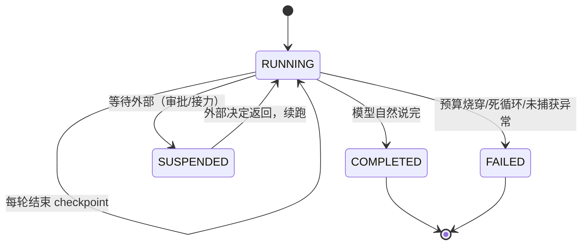
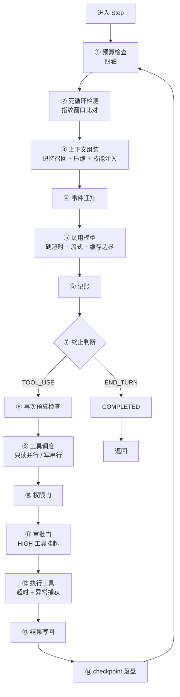
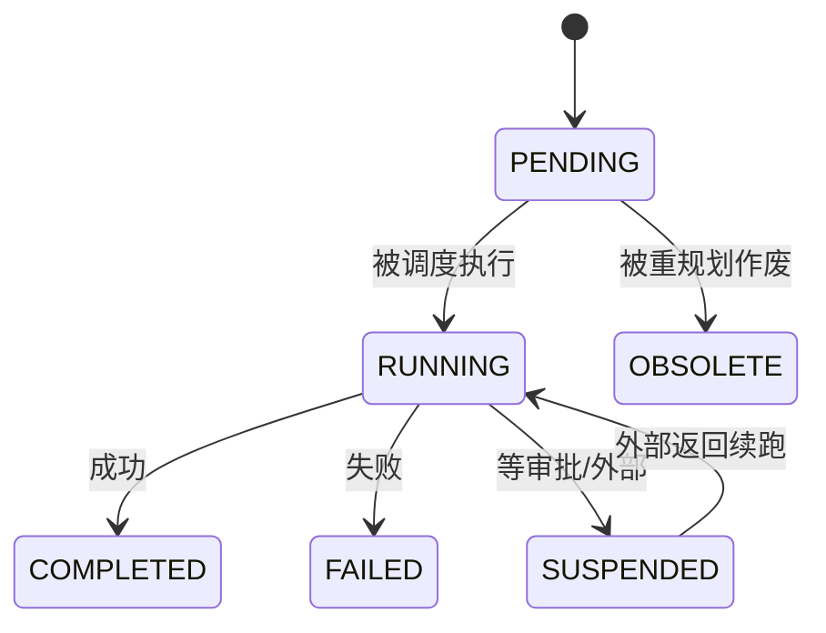

# 第 3 章 · 循环内核：Agent 的心跳
> 阅读时间约 50 分钟。本章讲循环内核，中间穿插三块基础：生成器与事件流、状态机、两种时钟。
>
> 本章主线一句话：**所有 Agent 框架的内核都是同一个五行循环，工业级与玩具的差距，全在给这个循环的每个关节加上的护甲——而护甲的第一原则，是把状态和状态的变化关进类型与单咽喉里。**

本章前置是第 2 章的两个插曲——async/await 和端口——以及第 1 章的类型注解。另外你在第 2 章见过 `stop_reason` 和 `tool_calls` 这两个字段，本章它们会从"模型的输出"变成"循环的输入"，结合起来看才完整。

---

## 3.1 从裸循环开始：五行代码，和它漏掉的一切

所有 Agent 框架的本质都是同一个循环。剥掉一切装饰，核心就五行的样子（示意代码）：

```python
while True:
    response = await llm.complete(messages)
    if response.stop_reason == StopReason.END_TURN:
        return response.content
    for tool_call in response.tool_calls:
        result = execute(tool_call)
        messages.append({"role": "tool", "content": result})
```

想一步（调用模型）、做一步（执行它要的工具）、把结果接回对话，循环往复，直到模型说"说完了"。这个骨架你在第 2 章末尾已经能完全读懂了。问题是，它离能上生产差多远？把这个问题拆开，是五个具体的漏洞。

第一，它唯一的停止条件是模型自己说停。模型在同一个错误上打转、反复用相同参数调用同一个工具时，这个循环会忠实地陪它转到天荒地老，每一轮都在烧钱。第二，没有任何预算：轮数、时间、token、花费，都没有上限。第三，进程一崩，一切归零——messages 只在内存里，重启后这个 run 的历史荡然无存。第四，执行过程是黑箱：外部看不到它现在调了什么工具、返回了什么，出问题只能干瞪眼。第五，出错的处理只有一条路：异常直接炸出去，没有分类、没有善后。

本章就把这五个漏洞逐个堵上。你会看到最终成品比这五行长很多，但骨架没变——**工业化的本质不是替换骨架，是在骨架的每个关节上加护甲。**

---

## 3.2 插曲：生成器与事件流

堵第四个漏洞（黑箱）之前，需要先学一个 Python 机制：生成器。因为循环把过程暴露给外部的方式，靠的就是它。

### 从一个问题开始：怎么"边生产边消费"

假设你要表示"一次运行中陆续发生的所有事件"。最直觉的做法是收集一个列表，最后整体返回。但有两个真实需求否决了它。一是调用方想实时看到进展：前端要展示"正在调用 search 工具……"，而不是干等四十秒后一次性收到全部事件；二是调用方想能中途退出：超时了、用户取消了，消费者半路走人，生产者不该还傻傻把剩余事件算完。这两条都指向同一个要求：事件应该一个一个流出，而不是攒成一坨交付。

Python 提供这个能力的机制叫**生成器**（generator）。

### 生成器：会暂停的函数

函数体里只要出现一个 `yield` 关键字，这个函数就成了生成器函数。它的调用方式和普通函数一样，但行为完全不同：调用它不执行任何代码，而是返回一个生成器对象；每次向这个对象要下一个值，函数体才从上一次停下的位置继续执行，直到遇见下一个 `yield`，交出一个值，再次暂停。看例子：

```python
def count_up(n: int):
    i = 0
    while i < n:
        yield i
        i += 1

g = count_up(3)      # 没有执行任何代码，拿到生成器对象
print(next(g))       # 0 —— 执行到 yield，交出 0，暂停
print(next(g))       # 1 —— 从暂停处继续
for x in count_up(3):
    print(x)         # 0 1 2 —— for 会自动反复"要下一个"
```

`next()` 是"给我下一个值"的指令。`for` 循环本质上就是在反复调用 `next()`，直到生成器耗尽。生产者交一个、消费者收一个，这就是"流"。它天然满足前面两条要求：事件一产生就能被拿到（实时），消费者不再要了，生产者就永远停在那里（可中断）。

### 异步生成器

框架的事件多数产生自异步操作（一次模型调用可能等几秒），所以需要异步版：函数用 `async def` 定义、内部用 `yield` 交值，消费者用 `async for` 接收。这样的函数叫**异步生成器**。机制与同步版一一对应，只是"要下一个值"的动作前面要加 `await`，允许等待期间让出执行权。

### 回到循环：stream() 的形状

现在可以读懂循环内核的主入口了（`src/prodagent/kernel/loop.py`，有删节）：

```python
async def stream(
    self,
    task: str,
    *,
    run_id: str | None = None,
    parent_run_id: str | None = None,
) -> AsyncGenerator[AgentEvent, None]:
    """Drive the loop to a terminal state and always emit exactly one
    terminal event."""
    run = await self._resolve_run(task, run_id=run_id, parent_run_id=parent_run_id)
    ...
    try:
        async for event in self._loop_events(run):
            yield event
    except BudgetExceeded as exc:
        yield await self._settle_terminated(run, exc)
    ...
```

读法：`stream()` 是一个异步生成器，消费它的人用 `async for` 逐个接收 `AgentEvent`。返回类型注解 `AsyncGenerator[AgentEvent, None]` 现在也能读懂了——"产出 AgentEvent 的异步生成器"（第二个 None 是一个进阶参数位，本书用不到，忽略）。

注意 docstring 里那句承诺，它是这个接口最重要的合同：**无论循环怎么结束——正常完成、预算烧穿、死循环被杀、意外异常——都必发出且只发出一个终止事件。** 为什么这条如此要紧？因为流式消费最怕的就是"流着流着没了"：消费者挂在 `async for` 上等下一个事件，永远等不到，也永远不知道该不该继续等。有了"恰好一个终止事件"的承诺，消费者的写法就简单而可靠：循环收事件，收到终止事件就收工。第 2 章的 `collect_final_run` 你已经见过这种消费端的样子：只关心三种终止事件，其余放过；万一流结束了还没见到终止，宁可合成一个失败结果，也不假装成功。

---

## 3.3 插曲：状态机——一次运行的生命周期

循环要把一次运行（run）的生命周期管理起来：它现在跑到哪了、因为什么停的、还能不能继续。这需要一个状态模型，而状态模型最重要的决定是：哪些状态存在，以及谁有权改变它。

### 四个状态，一张图

框架用四个状态覆盖一次运行的一生（`RunState`）：



RUNNING 是进行中；COMPLETED 和 FAILED 是两种终态，好理解；SUSPENDED 要多说一句，它是"暂停等待外部世界"——最典型的场景是第 9 章的审批：高风险工具要等人确认，确认可能十分钟后才来，进程不该干等，于是运行挂起、状态落盘、进程该干嘛干嘛，等决定来了再恢复续跑。

用枚举把状态集合封闭起来（第 2 章讲过的手法），先保证了"状态只可能是这四个之一"。但光封闭集合还不够，第二个问题是转移。

### 转移只有一个入口

最容易的写法是把 `run.state` 字段直接暴露出来，谁想改谁赋值。框架拒绝这么做，原因是：状态从来不孤立出现，它总是携带着**配对物**。转到 COMPLETED，必须同时有 `final_output`（模型说了什么）；转到 FAILED，必须同时有 `last_error`（因为什么失败），而且异常要经过分类落进崩溃现场；转到 SUSPENDED，必须记下在等什么；恢复回 RUNNING，必须清掉上一次的崩溃现场，不能带着旧错误重新跑。只要允许裸赋值，这四条配对关系就得在每一个赋值点上被人脑记住，漏写一行，落盘的就是一个"不知道为什么失败"的 FAILED——而且从外部很难察觉这种沉默的残缺。

所以框架把这些转移收进了 `AgentRun` 的四个方法（`src/prodagent/kernel/state.py`，源码里这段的注释标题就叫 "Terminal transitions — the single throat"，终态转移的单咽喉）：

```python
run.complete(response.content)    # → COMPLETED，输出为空时自动回填
run.fail(exc)                     # → FAILED，异常自动分类
run.suspend("等待审批")            # → SUSPENDED
run.revive()                      # → RUNNING，清除崩溃现场
```

配对逻辑在方法内部写一次，全框架所有需要改状态的地方都只能走这四个入口。"某个约束必须处处成立"这类知识，写在约定里会被遗忘，收进结构里就永远成立。这个思路有个流传很广的说法叫**"让非法状态不可表示"**——与其在每个写点检查正确，不如让正确的写法只有一种。你在后面章节会看到它反复出现：工具调度的单咽喉、事件的唯一序列化出口，都是同一个思想。

---

## 3.4 Step：一轮的原子

状态是骨架，干活的是每一轮。框架把"一轮"封装成一个类，叫 `Step`（`src/prodagent/kernel/step.py`）。先看它一轮要过的全部关卡——这不是示意图，每一步都对应真实代码路径：



本章讲其中带编号的①②⑤⑥⑦⑭，权限与审批两道门是第 5、9 章的主角，上下文组装是第 6 章的主角。它的 `run()` 方法是一轮的完整原子，docstring 写得非常清楚：先想（组装上下文、调用模型、记账），只有当模型要求工具时才做（执行工具批次），且预算在批次前后各查一次——因为模型调用本身可能就把上限烧穿了。真码：

```python
async def run(self, run, *, system, tools) -> AsyncIterator[AgentEvent]:
    """One turn of the atom: think (assemble → call → account), then —
    only if the model asked for tools — act, with budget checked on both
    sides of the batch (the model call itself may have burned the cap)."""
    response, token_events = await self._think(run, system=system, tools=tools)
    for evt in token_events:
        yield evt
    if self._end_turn(run, response):
        return
    self._check_budget(run)
    async for event in self._runner.run_batch(run, response.tool_calls):
        yield event
    self._check_budget(run)
```

一轮从 `_think` 开始：组装发给模型的上下文（记忆召回、压缩、技能注入都在这一步，第 6 章讲），调用模型，记账。然后看模型的 `stop_reason`：说完了就结束本轮（`_end_turn`），要工具就先查一次预算，执行工具批次，再查一次预算。注意这个方法本身也是异步生成器——一轮内部发生的事（模型想说的每个字、每个工具的结果）同样是流出去的事件。

### 每个工作单元也有自己的一生：StepStatus 六态

刚才 3.3 讲的是**整个运行**的状态（RunState，四态）。现在补上**单个工作单元（一步）**的状态，它叫 `StepStatus`，定义在 `src/prodagent/kernel/types.py`，一共六个值。这是全书唯一一次正式讲它，第 8 章规划器里每个图节点的 `status` 字段用的就是它：



逐个说：`PENDING` 是"排上了队、还没开始"；`RUNNING` 是正在执行；`COMPLETED` 成功完成；`FAILED` 执行失败；`SUSPENDED` 和运行级一样，是挂起等外部。

最需要停下来讲的是最后一个 `OBSOLETE`（作废），它和 `FAILED` 的区别非常微妙、也非常关键。第 8 章讲重规划时你会看到：计划执行到一半发现要改，有些**还没开始的步骤**会被新版本顶替掉——这些步骤既没有运行、更没有失败，只是"不再需要了"。如果把它们标成 FAILED，恢复逻辑就会误以为它们出过差错而尝试重试，可它们根本什么都没做；标成 COMPLETED 又会误以为它们的副作用已经发生。于是单独立一个 OBSOLETE：它表达"没我的事了"，既不重试也不当作完成。源码注释原话是："OBSOLETE is distinct from FAILED: replanning can invalidate a pending step through no fault of its own — it neither ran nor failed."（作废不同于失败：重规划可能让一个待执行步骤无过错地失效——它既没运行也没失败。）

这又是一次"让非法状态不可表示"：**当"没运行、没失败、只是被取消"这件事无法用现有状态准确表达时，正确的做法不是凑合用一个近似状态，而是为它单独立一个状态**，让每一种真实处境都有唯一、诚实的名字。

### 一个省钱的排序：注入块为什么放在历史后面

组装这一步里藏着一个不起眼但省钱的决定：注入块（记忆、技能、状态提醒）排在对话历史**之后**，而不是之前。两个理由。一是缓存前缀稳定——注入块每轮都在变（召回不同、状态在走），历史前缀则基本不动；把会变的块放在前面，等于每轮都把提示缓存打碎重来，放在后面，缓存边界之前的字节逐轮稳定，缓存命中率才起得来。二是指令就近——"必须遵守"的约束放在离回答最近的位置，模型对尾部指令的遵守度更高。一个排序决定，同时买到成本和质量。

### 模型调用的硬超时

`_think` 里调用模型的片段，把这一段读完整（`src/prodagent/kernel/step.py`，有删节）：

```python
# The time budget is a hard deadline on the call, not an afterthought.
llm_timeout = max(0.1, self._budget.max_seconds - run.elapsed_seconds())
coro = self._llm.complete(messages, system=system, tools=tools or None,
                          config=llm_config, on_chunk=_on_chunk)
try:
    response = await asyncio.wait_for(coro, timeout=llm_timeout)
except TimeoutError as exc:
    raise BudgetExceeded(
        f"LLM call timed out after {llm_timeout:.1f}s.",
        axis="seconds", value=run.elapsed_seconds(),
        limit=self._budget.max_seconds,
    ) from exc
```

这里有个容易忽略但很重要的区别：时间预算的实现方式。容易想到的做法是"调用完回来，看看有没有超时"——那是事后检查，一个卡死九十秒的调用已经白白等了九十秒。这里的做法是把剩余时间直接作为这次调用的超时上限交给 `asyncio.wait_for`，到点掐断。注释原文说得干脆：时间预算是调用上的硬截止，不是事后的想法。

### 记账：缓存命中不重复计费，但轮次要照计

调用回来要记账，这段藏着一个漂亮的细节（同文件）：

```python
async def _account(self, run: AgentRun, response: LLMResponse) -> None:
    run.metrics.turn_count += 1
    # A cached response is a replay — its tokens were already accounted on
    # first execution — but the turn still counts: the turns axis must see
    # a run that spins on cache hits, not one that looks free.
    if not getattr(response, "from_cache", False):
        run.add_tokens(response, cost_usd=...)
```

如果这次响应来自缓存（第 2 章提过 LLM 有提示缓存），token 就不再记了——同样的 token 第一次执行时已经记过账，再记就是重复计费。但轮数照样加一。为什么区别对待？读注释：一个全靠缓存命中的 run，token 轴上看起来"免费"，但它每轮仍然在消耗真实的轮次、仍然可能在原地打转——turns 轴必须看得见这种空转，否则一个死循环恰好都命中缓存时，预算就失明了。一个 if 里的取舍，背后是"每个预算轴各自度量什么"的清醒。

### 死循环检测：指纹窗口

裸循环的第一个漏洞（模型打转转到底）在 Step 的入口处被拦。原理不复杂：给每一轮的工具调用算一个指纹——就是一段简短的标识，内容相同的调用指纹相同——保留最近若干轮的指纹做比对，连续多轮指纹一模一样，判定为死循环，抛 `InfiniteLoopDetected` 停机。这比单纯限最大轮数聪明：上限 20 轮的 run 可能第 5 轮就进了死循环，指纹检测第 7 轮就能叫停，省下白烧的十几轮。

有两个实现细节要说。第一，指纹不是对参数字典直接哈希——字典的键顺序不保证固定，"语义相同、键顺序不同"的两次调用会得到不同指纹，检测就漏了。框架先走一遍稳定序列化（把对象归一化成确定形态）再算指纹，保证语义相同则指纹相同。第二，算指纹时刻意剔除 `limit` 这类分页参数：同一个查询只变翻页大小，恰恰是死循环的典型形态，判断"是否原地打转"要看意图而不是页码。把领域判断编进指纹，而不是无脑哈希全部字段，这是工具的元数据设计（第 5 章）第一次露脸。

---

## 3.5 插曲：两种时钟

`_call_llm` 里有一行 `run.elapsed_seconds()`——这个 run 已经跑了多久。你可能觉得"现在时间减开始时间"没什么可讲的，但"现在时间"在计算机里其实有两个不同的来源，用错了会出真 bug。

第一个来源叫**挂钟时间**（wall clock），就是 `time.time()` 返回的那个：自 1970 年起的秒数，你手表上的时间。它的问题是会跳：系统会定期跟时间服务器对表（用的协议叫 NTP），对表时钟可能往回拨——这一秒是 10:00:00，下一秒可能变回 09:59:58。用它算"过了多久"，钟一回拨，elapsed 可能变成负数。

第二个来源叫**单调钟**（monotonic clock），`time.monotonic()`：从一个任意起点开始一直往前走的秒数，系统保证它绝不回退，但它和现实时间对不上号，只用来量时长。

所以量时长永远该用单调钟。但框架里恰好有一个用不得它的场景——从检查点恢复的 run。单调钟的读数是进程局部的：上一个进程里量到的 500 秒，在新进程里没有任何意义。看框架怎么处理（`src/prodagent/kernel/state.py`）：

```python
def elapsed_seconds(self) -> float:
    """Two clocks, one rule: monotonic while the process lives (NTP
    can't bend it), wall-clock after a checkpoint restore (monotonic is
    process-relative) — so a resumed run's seconds axis still binds."""
    if self.monotonic_start is not None:
        return now_monotonic() - self.monotonic_start
    return now_wall() - self.start_time
```

注释把规则说全了：进程活着时用单调钟（NTP 播不弯它），检查点恢复后用挂钟对开始时间。后一种选择还藏着一层含义：用挂钟意味着停机时间也算进运行时长——恢复后的 run，秒预算仍然作数，而且把崩溃躺平的时间一并计入。要不要"赦免"停机时间是一个可以争论的产品决定，框架选择了不赦免，deadline 就是 deadline。

你可能还注意到代码里写的是 `now_monotonic()` 和 `now_wall()`，不是直接调 `time.monotonic()` 和 `time.time()`。这是第 1 章提过一句、第 12 章要完整揭晓的伏笔：时间的来源被收进了一个可替换的小闸口（`base/determinism.py`）。今天它的行为和直接调用标准库一模一样，但第 12 章讲回放时，你会看到把整个时钟"冻结在录像带上"是怎么实现的——那套机制的地基，就是这两行看似多余的包装。

---

## 3.6 拆成两个类：循环策略与轮原子

最后看一个结构决定，它回收本章开头埋的悬念：REACTIVE 和 PLAN_FIRST 两种模式怎么共用同一套内核？

答案是把"循环"拆成两个职责。`ReactiveLoop` 负责**循环策略**：什么时候停、怎么恢复、异常怎么结算、终止事件怎么发。`Step` 负责**一轮的原子执行**：想、做、记账。两者一小一大：

| | ReactiveLoop | Step |
|---|---|---|
| 职责 | 循环策略（何时停/怎么恢复/怎么结算） | 一轮的原子（想→做→记账） |
| 状态 | 管理 run 的生命周期 | 无状态 |
| 可替换 | 换执行模式时替换 | 所有模式共用 |

PLAN_FIRST 模式的循环策略完全不同——要管理步骤依赖、并行执行、断点续跑（第 8 章细讲）——但它的每一步，仍然是同一个"想→做→记账"的原子。把 Step 抽出来，两种模式共享同一段被充分测试过的代码；换模式只换策略层。你在第 1 章看到的"共用同一套大脑、手、预算和恢复"，落到代码里就是这个拆分。

这个拆分还有一层更深的含义：**Step 是可恢复的最小单位**。很多框架把多轮循环写成一个巨大的函数，中间状态散落在局部变量里——进程一死，什么都留不下，根本无从恢复。框架把每一步的状态全部收敛到 `AgentRun` 对象上（第 7 章你会看到它整体序列化落盘），Step 才成为"恢复时可以精确对齐"的刻度：死在 Step 中间，恢复逻辑知道该从哪条边续跑。能恢复的前提不是"写了恢复代码"，是"状态有家可归"。

还有一个细节留给第 7 章：`stream()` 的 `finally` 块里，每一轮结束都会保存检查点，无论成功、失败还是挂起。崩溃恢复的全部魔法从这行开始，到时候展开。

### 代码定位

| 内容 | 源码位置 |
|------|---------|
| ReactiveLoop（循环策略） | `kernel/loop.py` |
| Step（轮原子） | `kernel/step.py` |
| AgentRun、RunState 与终态单咽喉 | `kernel/state.py` |
| StepStatus 六态 | `kernel/types.py` |
| HardBudget / BudgetLedger | `kernel/budget.py` |
| 三协议总线 | `kernel/bus.py` |
| 死循环检测 | `kernel/progress.py` |

---

## 动手环节

练习 1：亲手写一个流。新建文件 `my_stream.py`，先写同步版生成器并用 for 消费，再照着改成异步版：

```python
import asyncio

async def events(n: int):
    for i in range(n):
        yield f"event-{i}"

async def main() -> None:
    async for evt in events(3):
        print(evt)

asyncio.run(main())    # 依次打印 event-0/1/2
```

然后打开 `src/prodagent/kernel/loop.py`，找到 `stream()`，对照着看：它的形状和你刚写的是同一个形状，只是产出的事件更丰富。

练习 2：找到死循环检测的测试。运行 `grep -rln "InfiniteLoopDetected" tests/`，看看哪些测试文件在验证它，挑一个跑 `uv run pytest 那个文件 -v`。读一遍测试内容，注意它怎么用假模型（第 2 章的 `script()`）构造出一个"会打转的模型"——这正是测试作为答案册的意思：它教你怎么无成本地制造一场事故。

练习 3：把 StepStatus 六态读进代码。打开 `src/prodagent/kernel/types.py` 找到 `StepStatus`，逐个值读一遍它上面的注释，重点读 OBSOLETE 那段。然后 `grep -rn "StepStatus.OBSOLETE" src/prodagent/`，看它在第 8 章的规划器里到底在哪里被赋值——先留个印象，第 8 章正式讲。

---

## 下一章

心跳转起来了，但每一轮开头那个 `_check_budget` 我们只当它存在，还没打开看过：四个上限怎么定、怎么查、子 Agent 的花销怎么汇总到父 run、为什么缓存读不占 token 额度。下一章讲预算，框架的烧钱闸门，也是五个漏洞里"无限烧钱"那一洞的完整答案。

→ [第 4 章 · 预算：烧钱的闸门](ch04.md)
