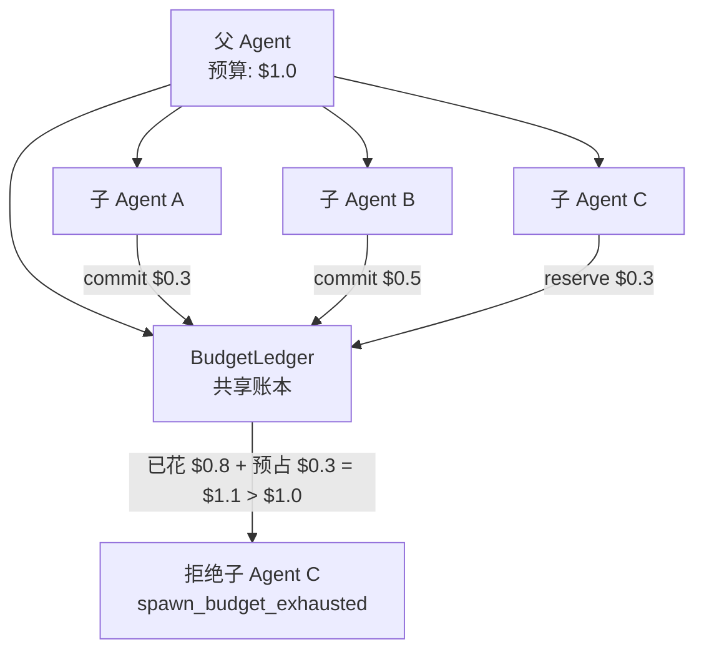

# 第 4 章 · 预算：烧钱的闸门

> 阅读时间约 70 分钟。本章讲四轴预算和共享账本，中间穿插一块并发基础：竞态条件。
>
> 本章主线一句话：**Agent 的失控有四种不同形态，所以要四个互相兜底的上限；而多 Agent 共享预算时，"先检查再花钱"是靠不住的，必须先把额度预占住——这就是账本的全部由来。**

本章前置是第 3 章的 Turn 原子——预算检查在 Turn 里出现过两次，当时只当它存在；还有 `elapsed_seconds()` 的双时钟，本章的秒轴直接依赖它。第 2 章的 token 计量四件套（普通输入、输出、缓存读、缓存写）也在这里正式派上用场。

---

## 4.1 问题：为什么一个上限不够

大多数框架给 Agent 的保护是一个 `max_iterations=10`：最多循环十次。听起来有保护，细想是不够的。

问题在于"十次"这个单位度量不了成本。十次调用可能只花一美分——每次都是短问题短回答；也可能花五十美元——每轮都拖着十万 token 的长上下文。轮数相同的两次运行，账单可以差三个数量级（数量级是按十倍来算的量级，差三个数量级就是大约一千倍）。反过来，一个有价值的任务可能合理地需要三十次调用，却被一刀切的十次拦腰砍断：保护变成了误伤。

而且失控的形态不止一种。第一种是**轮数失控**：模型在同一个地方打转，转个不停，每一轮都在产生真实的花费。第二种是**token 成本失控**：对话历史越滚越长，每一轮都把全部历史重发一遍，单轮成本逐轮上涨，哪怕只跑十轮，总花费也可能惊人。第三种是**时间失控**：模型接口偶尔会卡住不返回，没有时间上限的运行会无限期挂在那里，占着资源不干活。这三种失控各需要各的度量——轮数、token、时间——再加上最直接的一层：真实美元成本。于是有了四个必须同时成立的上限，任何一个触顶，运行就该停下来。这就是四轴预算的来历，也是第 3 章裸循环第一个漏洞的完整答案。

---

## 4.2 四个上限，一个检查顺序

预算本身是一个小小的数据类（`src/prodagent/kernel/budget.py`），dataclass 的写法第 2 章已经讲过：

```python
@dataclass
class HardBudget:
    """Conservative defaults: unattended runs fail fast rather than burning quota."""
    max_turns: int = 20
    max_seconds: float = 120.0
    max_tokens: int = 100_000
    max_cost_usd: float = 1.0
```

四个字段就是四个上限：最多二十轮、最多一百二十秒、最多十万 token、最多一美元。注意 docstring 那句话，它解释了为什么默认值偏紧：**无人值守的任务应该快速失败，而不是慢慢烧配额**。这里的思想值得展开：默认宽松的框架，等于把"记得设预算"变成用户的义务，忘了的人用真金白银付学费；默认保守的框架，把失败提前到最便宜的时刻——第一次试跑就在两分钟内被拦下，而不是烧完十美元才停。用户需要更大额度时显式配置，一次性的麻烦换来默认的安全。这一行注释背后的取舍，以后你设计任何默认值时都会反复用到。

检查四个轴的逻辑是一个纯函数，四条 if，按固定顺序返回第一个触顶的轴（同文件）：

```python
def evaluate_axes(*, turns, elapsed, tokens, cost_usd,
                  max_turns, max_seconds, max_tokens, max_cost_usd):
    """First axis at/over its ceiling, in turns → seconds → tokens → cost
    precedence — or ``None`` if all four are under cap."""
    if turns >= max_turns:
        return "turns", turns, max_turns
    if elapsed >= max_seconds:
        return "seconds", elapsed, max_seconds
    if tokens >= max_tokens:
        return "tokens", tokens, max_tokens
    if cost_usd >= max_cost_usd:
        return "cost_usd", cost_usd, max_cost_usd
    return None
```

顺序本身是个小决定：多个轴同时超限时，先报轮数、再报时间、再报 token、最后报钱。为什么这个顺序？轮数超限意味着行为层面的失控（打转），时间超限意味着环境层面的卡死，token 和钱是资源层面的耗尽——**先报最能指导排查的那个**：看到 turns 超限你去找死循环，看到 seconds 超限你去找卡死的调用，看到钱超限你去查上下文是不是失控膨胀，报错本身就是排查方向。这个函数的存在方式同样有讲究：单 Agent 的检查（`check_budget`）和多 Agent 的账本（马上讲）都要做同一个判断，判断逻辑只写这一份，两边共用。政策只有一份实现，就不会有两边说法不一致的那天。

`check_budget` 在调用它之前，还要做一次 token 口径的修正，这段藏着本章最好的注释：

```python
total_tokens = run.input_tokens + run.output_tokens + extra_tokens
# Cache reads bill at a fraction (10% Anthropic / 50% OpenAI); charging
# them at full price would make caching *accelerate* exhaustion — the
# one behaviour that must never follow from saving money.
billable_tokens = total_tokens - run.cache_read_tokens
```

预算的 token 轴用的不是总 token，而是**计费 token**：总 token 减去缓存读。原因在第 2 章埋过：缓存读只按一折到五折计费，几乎不花钱。如果把它全额计入预算，就会出现一种荒诞的行为——你开了提示缓存来省钱，结果预算反而更快耗尽。注释的最后半句可以直接抄走：**省钱的行为绝不能导致加速耗尽**，这是唯一不可接受的后果。设计预算时先写下"什么行为绝不能被惩罚"，再倒推口径，是一个可复用的方法。

第 3 章还留了一个问题：为什么预算在 Turn 里查两次（开头一次、工具执行后一次）。现在可以答了。开头的检查问的是"上一轮结束后，这一轮还该不该开始"；工具执行后的检查问的是"这一轮的模型调用刚烧掉一大笔 token，现在还撑得住吗"。只查开头的话，一次十万 token 的模型调用可以在预算已穿的情况下继续执行完工具批次——检查点必须覆盖每个"可能大量消耗"的动作之后。

---

## 4.3 补课：竞态条件——查过，不代表还能用

单 Agent 的预算到此讲完了。但第 1 章的要求七说过，多个 Agent 会并发工作，而并发给预算带来了一个新问题。这个问题要用一整节讲清楚，因为它是所有共享状态在并发下的通病，后面的锁、消息去重、事件序号，本质上都在和它打交道。

设想总预算一美元，三个子 Agent 并发启动，每个预计花四十美分。每个 Agent 启动前都检查一次"还剩多少"：第一个查，剩一美元，通过；第二个查，剩一美元（第一个还没花），通过；第三个查，还是一美元，通过。三个都开始干活，各花四十美分，最后总花费一点二美元——超了，而且是在每个人"都检查过"的情况下超的。

问题出在"检查"和"使用"之间有时间差。检查的瞬间结论是真的，但等真正花钱时，别人可能已经把钱花掉了。这类"多个执行流因时间差而破坏共享约束"的问题叫**竞态条件**（race condition），是并发编程第一大坑。单线程顺序代码里不存在这个问题，因为检查和花钱之间不会插进别人的动作；一旦多个执行流并行推进，任何"先查后用"的写法都给了别人插进来的机会。

对付竞态条件，最基础的工具是**锁**（lock）：一种"同一时刻只允许一个执行流持有"的门票——拿到锁的干活，没拿到的排队等，锁一释放队伍里的下一个进场。把"检查加记账"包在锁里，就能保证没有人在你检查和记账的中间插队。框架的账本确实有锁（代码里是 `asyncio.Lock`，异步版的锁，获取时要 `await`），但只靠锁不够——锁解决"同时改"的问题，解决不了"提前占位"的问题。三个子 Agent 就算排队检查，只要都是"查完就走、花完再报"，总花费照样可以在汇报到达之前越过上限：检查的时刻大家都还没花钱，一个个查全通过，然后各自慢慢花，超支在汇报回来的路上就已经发生了。

真正需要的是**预占**：开始工作之前，先把预计花费从共享额度里占住，让后来者看得见"这笔钱已经有主了"。这招你在生活里见过——酒店订房扣的是预授权，信用卡担保的是押金，都是"先占住、结账时多退少补"。把它做成机制，就是下面这个账本。

---

## 4.4 BudgetLedger：预扣、实报、冲销

账本叫 `BudgetLedger`，多 Agent 场景下所有成员共用一个。整体结构一张图，读法和前面的流程图一样：父 Agent 持有总预算，三个子 Agent 都向同一个共享账本报账；箭头上的 `commit` 是"实报已花"、`reserve` 是"预占额度"，最后账本一算总账越线，就把第三个请求挡在门外：



图里是其中一种数字组合：A 和 B 已经实报了各自的花费，C 想预占三毛时，账本把"已花加预占"加总一算，一点一美元越线，C 在门口被拒，错误码 `spawn_budget_exhausted`。下面用另一组数字把规则完整走一遍，规则本身与图中相同。

先看它的数据结构（`src/prodagent/kernel/budget.py`，有删节）：

```python
@dataclass
class BudgetLedger:
    max: HardBudget
    _committed: _Spend = field(default_factory=_Spend)
    """Permanent — only moved by commit()'s actual deltas. Never decreases."""
    _reserved: _Spend = field(default_factory=_Spend)
    """Transient — moved by reserve()/release(), reconciled away by commit()."""
    _reserved_by: dict[str, _Spend] = field(default_factory=dict)
    """Per-member reservation buckets — sum never exceeds ``_reserved``."""
    _lock: asyncio.Lock = field(default_factory=asyncio.Lock)
```

两个核心计数器分工明确：`_committed` 是已经实际花掉的，只增不减；`_reserved` 是预占的，等真实花费报上来时被"冲销"——预占的三毛钱换成实报的两毛五，总数从"预占三毛"变成"实花两毛五"，这个词来自会计，指一笔账用另一笔相抵。第三个字段 `_reserved_by` 按成员记预占明细，作用体现在退还时：一个成员只能退还自己名下的预占，不能替别人释放额度——否则一个出了 bug 的成员就能把整个团队的额度悄悄放掉。最后一个字段是锁，保护上面三者的修改互斥（还记得 4.3 吗，锁解决"同时改"，预占解决"提前占"，两者缺一不可）。

对外的操作是三个，合起来是一套**三阶段记账**。`reserve` 是预占，开始工作前调用，把预计的量占住；`commit` 是实报，工作完成后用真实花费替换预占；`release` 是退还，预占了但没实际花（比如任务被重新安排）时归还。走一遍完整的数字例子：

三个子 Agent 并发，总预算一美元。A 开始前 reserve 三十美分，账本显示预占三毛；B 开始前 reserve 三十美分，预占六毛；A 完成，实际花了二十五美分，commit 实报两毛五——A 的预占被冲销，账本变成实花两毛五加预占三毛；这时 C 想启动，预计六十美分，reserve 时账本检查：实花两毛五加预占三毛加新预占六毛等于一点一五美元，超过一美元上限，C 被拒绝。回头看 4.3 节的竞态场景：没有预占时三个全都通过，有了预占，第三个在门口就被拦下。检查用的是"实花加预占"的合计，后来的成员看得见前面的人占住的额度，时间差被抹掉了。

### 两个反直觉的裁决

这套账本里有两个决定，第一眼看着奇怪，要停下来想清楚。

第一个：**失败的尝试也实报，不退还**。一个子 Agent 中途崩溃了，它预占的额度怎么处理？直觉说崩了就没花钱，该还。框架的选择是不还——至少轮数轴上照记。理由是一个不断崩溃的成员：如果每次崩溃都把轮数退回去，这个成员在账本上就永远"隐形"，预算盯着一群看起来健康的成员，实际上有个位置在反复消耗真实的调度资源。记账的原则和第 7 章你要见到的事件日志同源：宁可多记一笔可以事后核销的，不可漏记一笔真实发生的。

第二个：**所有花钱的地方共用同一个"结算信封"**。spawn（派生，指父 Agent 启动一个子 Agent 分头干活，第 10 章的主角）出的子 Agent、集体决策的成员、接力链的每一跳，都要走"预占、干活、实报"这套纪律。框架没有让每个调用点自己写一遍，而是封装成一个函数，全部委托它。原因写得很直白：政策一旦有多处实现，就必然漂移——今天两处一致，三个月后一处修了边界条件、另一处没跟上，差异不报错，只表现为某一类成员悄悄多花或少花。你在第 3 章见过的"终态单咽喉"，这里是它在记账上的翻版。

最后一件事：任意操作序列下，"实花加预占等于总支出"这条等式，是作为**定律**被机器检验的——`tests/runtime/test_laws_budget_ledger.py` 用 hypothesis 这个 Python 测试库随机生成成千上万种操作序列砸向账本，等式必须恒成立。普通测试是你手写几个固定例子去验证，而 hypothesis 会自动造出大量你想不到的刁钻输入来"找茬"；账目的可靠性因此不是靠抽查几个例子，而是靠在海量随机操作下证明等式不被打破。这个手法（定律测试）第 7 章正式讲。

---

## 4.5 预算烧穿时发生什么

四轴任何一个触顶，`BudgetExceeded` 异常被抛出，第 3 章 `stream()` 的 except 分支接住它，进入结算：run 的状态走单咽喉转成 FAILED，异常经过分类落进崩溃现场，追踪 span（span 指一次操作从开始到结束的完整追踪记录，第 11 章的主角）记下错误，checkpoint 保存最终状态供事后分析。错误信息里带着具体数字：哪个轴、当前值多少、上限多少。比如轮数轴的报错是 "Turn limit reached: 20/20"。

同样重要的是**不发生什么**：不会静默截断——把超限情况下产出的半成品假装成正常结果交出去，是安全网最恶劣的失效方式；不会丢失已完成的工作——checkpoint 里都在，第 7 章你会看到怎么从那里恢复；不会影响同进程里其他并发的 Agent——各自的 run 各自结算，一个烧穿不连坐。一个安全网的品位，很大程度上看它断开时留下的现场有多干净。

### 代码定位

| 内容 | 源码位置 |
|------|---------|
| HardBudget / 四轴评估 | `kernel/budget.py` |
| check_budget（单 Agent 检查） | `kernel/budget.py` |
| BudgetLedger（共享账本） | `kernel/budget.py` |
| 账本定律测试（hypothesis） | `tests/runtime/test_laws_budget_ledger.py` |
| 预算异常 | `base/errors.py` |
| 定价表与成本计算 | `llm/pricing.py` / `ports/llm.py` |

---

## 动手环节

练习 1：亲手让预算烧穿。回到第 2 章的 `my_first_script.py`，那个剧本有两轮（先要工具、再给答案）。现在找到 Agent 的预算参数把 `max_turns` 设成 1——如果你不确定参数怎么传，用第 1 章的方法：`grep -rn "HardBudget" src/prodagent/runtime/` 看装配代码怎么接预算，照着来。跑起来，观察报错信息里轴名、数值、上限三样东西是否齐全，以及最终输出是失败了而不是假答案。

练习 2：读账本的定律测试。打开 `tests/runtime/test_laws_budget_ledger.py`，跑 `uv run pytest tests/runtime/test_laws_budget_ledger.py -v`。读它的思路：随机操作序列怎么生成、等式怎么断言。这是你第一次见到"定律测试"的实体，第 7 章它会升级成主角。

---

## 下一章

预算管住了"跑多久、花多少"，但循环里真正的执行者是工具——模型的每个 `tool_calls` 都要变成真实的函数调用，而工具的世界比模型危险得多：参数可以是任意的，名字可以是编造的，副作用可以不可逆。下一章讲工具系统，框架里防御工事最密集的地方，补课讲两块：装饰器（从零讲起），和异常分类（重试的策略从哪里来）。

→ [第 5 章 · 工具系统：Agent 的手](ch05.md)
