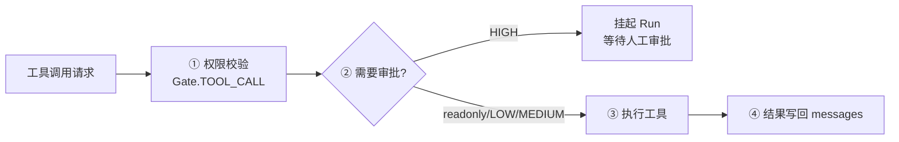
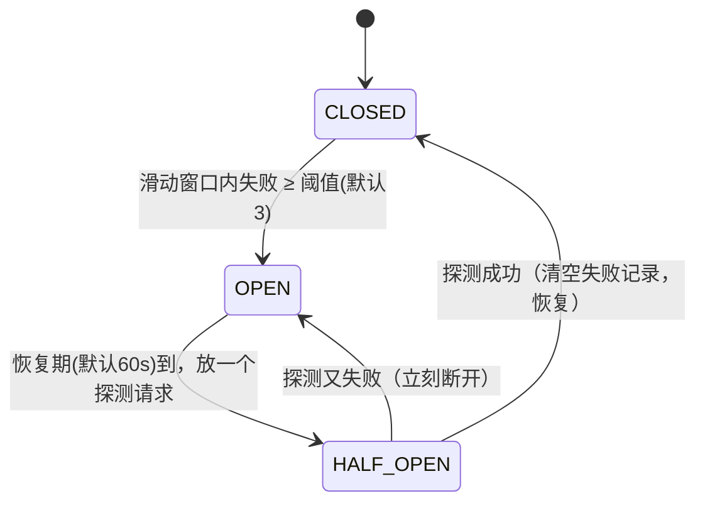
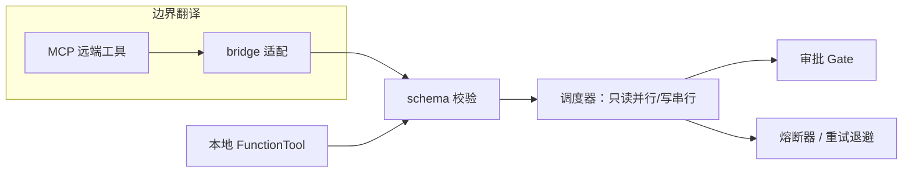

# 第 5 章 · 工具系统：Agent 的手

> 阅读时间约 50 分钟。本章讲工具系统的防御工事，中间穿插两块基础：装饰器（从零讲起）和信号量。

本章前置包括第 2 章的 dataclass 与 async（`gather` 的用法）、第 3 章的 Step 原子（工具批次在其中的位置），以及第 1 章的类型注解——你会看到注解在本章又立了一次大功。

---

## 5.1 问题：模型不是程序员

循环内核拿到模型的 `tool_calls` 后，要把"我想调用 search，参数是这些"变成真实的函数调用。这件事听起来只是查表加调用，实际上危险得多，因为调用方是模型，而模型不是程序员。

模型会犯程序员不会犯的错。它会调用一个根本不存在的工具——术语叫工具幻觉，模型把工具列表"记岔了"，凭空编出一个名字。它会传错参数名，把 `query` 写成 `q`；会传错类型，把数字写成字符串。它还会在一轮里同时调用两个有先后依赖的写操作，或者不打招呼就执行一个危险动作。这五类错误不是假设，是任何把 Agent 放出去跑的人很快都会遇到的日常。

工具系统的职责，就是防御这五类错误，同时不给正常的调用添负担。本章按一道道工事讲下来：定义工具时声明它的危险性，调用前校验参数和名字，调度时分读和写两条路，执行时套超时和熔断。你会看到框架里最密集的防御设计，也会看到一个贯穿始终的原则：模型犯错是常态，系统的反应是给反馈让它修正，而不是打断整个循环。

---

## 5.2 插曲：装饰器，从零讲起

定义工具的写法你已经见过很多次了：

```python
@tool(name="search", readonly=True)
async def search(query: str) -> str:
    """搜索网络信息。"""
```

函数头上那个 `@tool(...)` 叫装饰器。本章后面全是它，所以先把它从零讲清楚——装饰器是 Python 里被神秘感包裹但其实很直白的东西。

先看一个不涉及任何框架的例子。假设你想知道一个函数每次跑多久，又不想在函数体里塞计时代码，可以写一个"包装器"：

```python
import time

def timed(fn):
    def wrapper(*args, **kwargs):
        start = time.time()
        result = fn(*args, **kwargs)
        print(f"{fn.__name__} 耗时 {time.time() - start:.3f}s")
        return result
    return wrapper

def work(n):
    return sum(range(n))

work = timed(work)     # 手动包装：work 现在指向包装后的函数
work(10_000)
```

关键在最后两步：`timed` 接收一个函数，返回一个新函数（wrapper，先计时再调用原函数）；把 `work` 重新绑定到包装后的版本。从此调用 `work` 走的都是包装版，原函数一点没改。Python 为这个"传入函数、返回函数"的模式提供了专门的语法糖——把 `work = timed(work)` 写成：

```python
@timed
def work(n):
    return sum(range(n))
```

两行完全等价，`@` 只是让包装动作发生在定义处、可一眼看见。这就是装饰器的全部机制：一个接收函数并返回新函数的函数，`@` 是调用它的语法。

带参数的装饰器只多一层：`@tool(name="search")` 里 `tool(name="search")` 先被求值，它返回的才是真正用来装饰函数的东西。所以你会在框架源码里看到 `tool` 的定义是两层函数：外层接收 `name`、`readonly` 这些选项，内层 `_make` 接收被装饰的函数、完成真正的加工（`src/prodagent/tooling/decorator.py`，有删节）：

```python
def tool(_fn=None, *, name=None, description=None, readonly=False, meta=None):
    """Wrap a function as a ``FunctionTool`` — bare or with options. This is
    the authoring surface; everything mechanical (schema inference, adapter
    caching, incompatibility checks) happens here once, not in the loop."""

    def _make(fn):
        tool_name = name or (meta.name if meta else fn.__name__)
        doc = description or (inspect.getdoc(fn) or "")
        ...
        schema = _infer_schema(fn, tool_name, doc)
        return FunctionTool(name=tool_name, fn=fn, meta=base_meta, schema=schema)

    if _fn is not None:
        return _make(_fn)
    return _make
```

读一遍这段：装饰器把普通函数加工成 `FunctionTool`——名字取自参数或函数名，描述取自参数或函数的 docstring，然后推断出这个工具的参数模式（schema）。docstring 那句"这是编写面，一切机械的事情在这里做一次，而不是在循环里做"，点出了装饰器的工程价值：**机械劳动在定义时一次做完，运行时零重复**。这也是为什么裸写 `@tool`（不带括号）也可以——你看最后一行，直接传函数时立即加工，否则返回 `_make` 等函数到达。

还有一处防御：装饰器会检查选项之间的矛盾，比如 `readonly=True` 和高副作用等级不能同时成立——只读工具不可能有高危副作用，两个声明打架说明写的人理解有误，最好的处理是当场报错而不是运行时猜。装饰期报错的成本是几毫秒，运行期误解的成本可能是真金白银。

---

## 5.3 ToolMeta：把危险性写成数据

每个工具随身携带一份静态档案，就是第 2 章见过的 `ToolMeta`。现在可以完整读懂它的字段了：

```python
@dataclass
class ToolMeta:
    name: str
    is_readonly: bool = False
    side_effect_level: SideEffectLevel = SideEffectLevel.LOW
    enforced_idempotent: bool = False
    timeout_seconds: float = 10.0
    domain: str = "general"
    max_result_chars: float = 100_000
```

其中 `side_effect_level` 是副作用三级：LOW（低，如写缓存）、MEDIUM（中，如普通外部接口调用）、HIGH（高，如发邮件、下单、删数据）。HIGH 级别的工具执行前会挂起等人审批，这是第 9 章的主角。

这里有个设计问题要停下来想：为什么"只读"是一个独立的布尔字段（`is_readonly`），而不是副作用等级的第四个值？因为它们其实是两个正交的维度。只读与否决定**能不能并行**——只读操作互不干扰可以同时跑，写操作必须排队；副作用等级决定**要不要人审批**——这是危险性问题。一个缓存写入是低危险的写（串行、免审），一个高危的银行转账也是写（串行、要审），但"只读搜索"和"低危写入"在并行性上不同、在审批上相同。把两个维度压成一个枚举，就表达不出"并行且免审"和"串行但免审"的区别。当你在设计里发现一个字段装不下所有的组合时，正确的动作往往是拆成两个字段。

`enforced_idempotent` 先混个脸脸熟：为真时，框架会在调用前自动往参数里注入一个幂等键（`idempotency_key`）。它的用途与崩溃后的重放有关——重放可能把同一次调用发两遍，键让工具端能识别"这笔我处理过了"从而去重。完整的故事第 7 章讲恢复时展开。

---

## 5.4 参数校验与工具幻觉：错误是反馈，不是异常

调用到达的第一道工事是参数校验。`@tool` 在定义时已经从函数签名生成了每个参数的校验器（用 pydantic 这个"用类型注解做运行时校验"的库），调用时逐参数检查。这里有三个决定，每一个都体现"给模型反馈而不是打断它"的原则。

第一个决定：校验器在定义时构建并缓存，运行时直接用。机械劳动做一次，和装饰器的哲学一脉相承。

第二个决定：类型对不上时**不抛异常**。记一条 warning，把原始值原样传给工具函数——工具自己可能处理得了（很多函数能接受 `int("5")` 这种宽容转换），处理不了的话错误会在下一层变成结构化反馈。宁可多给一次机会，不轻易判定死刑。

第三个决定针对参数名错误和工具幻觉，返回的是同一种东西：一个携带错误信息和修正提示的结构化结果。模型调了不存在的工具，它收到的是"工具 xxx 不存在，可用工具有这些"的文本；传了不认识的参数，收到的是"参数不匹配，合法参数是这些"。模型在下一轮读到这些反馈，通常自己就改对了。对比另一种常见做法——抛异常打断整个循环——你就明白差别：异常处理的是"程序员的错误"，程序员看见堆栈会去改代码；而模型的错误要在对话里修，它需要的是一段它能读懂的、带着正确答案提示的反馈。**错误的最佳处理者，是拿着上下文的那一方。**

顺着这个思路把工具的结局看全。每次工具执行回来，结果带一个 `outcome` 字段，六个值，覆盖所有可能——不是只有成功失败两种：

| 结局 | 含义 | 循环的反应 |
|---|---|---|
| `OK` | 成功 | 结果写回历史，继续下一轮 |
| `RETRY` | 可重试的错误 | 错误作为反馈给模型，让它自行调整 |
| `ABORT` | 不可重试的错误 | 运行失败 |
| `BLOCKED` | 被权限或策略拦截 | 拦截原因给模型（10.6 的 Gate） |
| `SUSPENDED` | 审批挂起 | 运行暂停等人（第 9 章） |
| `HANDOFF` | 接力交接 | 当前运行完成，交给下一个 Agent（第 10 章） |

后面三章的主角（审批、接力）在这张表里已经有了座位——枚举把"工具执行完之后世界可能处于的六种状态"一次列全，循环对每种都有明确反应，没有一种结局需要临场发挥。

---

## 5.5 调度：读并行，写串行

校验通过后进入调度。调度的完整关卡序列先看一眼全貌，再拆开读：



第 3 章说过批次里的调用被分成两堆，现在看真实代码（`src/prodagent/tooling/dispatcher.py`，有删节）：

```python
# Reads commute, writes don't: readonly calls may race under a
# concurrency cap, while side-effecting calls run one at a time so
# their observable order matches the order the model asked for.
```

注释第一句的 "commute" 是个数学词：可交换。三次搜索先做谁后做谁，结果不受影响——读操作可交换，所以能并行。写操作不可交换：先扣款再发货和先发货再扣款是两回事，所以必须按模型给出的顺序一个一个来。这个"读可换、写不可换"的判断，是并发调度的全部依据。

```python
if readonly_calls:
    semaphore = asyncio.Semaphore(readonly_concurrency)

    async def _dispatch_with_cap(call):
        async with semaphore:
            return await self.dispatch(call, run_id=run.run_id)

    raw = await asyncio.gather(
        *[_dispatch_with_cap(c) for _, c in readonly_calls],
        return_exceptions=True,
    )
```

只读的一堆用第 2 章学的 `gather` 并发执行，但外面包了一样新东西：`Semaphore`，信号量。把它想成停车场入口的"剩余车位"计数器——最多放八辆车进去，第九辆在门口等，有车出来才放行。为什么需要它？如果模型一轮喊出一百个搜索，无上限地同时发出，可能瞬间打爆下游的搜索接口，或者触发对方的限流。信号量一行代码给并发度装了天花板。写操作那一堆则严格地一个接一个（循环里逐个 `await`），保证可观测的执行顺序与模型请求的顺序一致。

---

## 5.6 可靠性：默认不重试，和熔断器

工事的两块压舱石，一块关于重试，一块关于故障隔离。

先说一个反直觉的默认值：框架的执行器**默认不重试**失败的工具调用。工具超时了？返回一个结构化的超时错误，附上"建议换参数或退避"的提示，交给模型。这和多数框架"失败自动重试三次"的习惯相反，理由要细说。框架层的自动重试是盲目的——它用同样的参数再砸一次刚失败的依赖，如果失败原因是参数错误，重试只是把同一个错误再触发几遍。而模型看到结构化错误和提示后，能做出有认知的决策：换参数、换工具、或者放弃这条路。**重试的正确归属是有上下文的决策者，不是无脑的执行层。**当然可以配置 `RetryPolicy` 打开框架层自动重试（指数退避加抖动），但那是你知情的选择，不是默认。

那"哪些错误值得重试"由谁判断？异常分层在这里接上。描述"失败"，框架需要三样东西：一套受控词表（鉴权失败、限流、超时、参数错误……，这是决策依据）、一棵异常类树（`raise` 时真正抛出的东西）、一个把第三方异常映射回词表的分类器。三样本质是同一个概念的三个面，所以住在同一个文件里——新增一种失败模式只改一处。词表上立着一条成熟的默认方向：**明确列出不可重试的名单，不在名单上的推定为瞬时故障**——因为对一个永久性错误重试，只会白烧预算、推迟用户看到失败；举证责任落在"标记为永久"的一边，系统默认宽容而清醒。

真要自动重试时，退避策略也不是固定间隔或朴素指数，而是带完整抖动的指数退避：等待时间在区间内随机取。为什么非要随机？设想十个子 Agent 同时撞上上游限流，如果大家都"等一秒再试"，一秒后它们会齐刷刷地再次同时打过去，把本来就喘不过气的上游再打一次——这叫惊群效应。一个随机抖动把重试时刻自然打散，上游才有喘息空间。一行 `random.uniform`，解的是分布式系统的经典故障模式。

第二块是熔断器（circuit breaker），名字和家里的空气开关同源：线路短路就先断开，别让故障扩散。一个已经挂掉的工具如果还被反复调用，每次都要白白走完"发请求、等超时、收报错"的全程，烧掉的是真实的轮次和预算。熔断器为每个工具维护一个小状态机，三个状态：



CLOSED 是正常放行，同时每次失败的时间戳被记进一个队列；队列里最近五分钟内的失败达到三次，状态翻到 OPEN——此后对这个工具的调用立刻返回一个可重试的错误，根本不去碰下游。过了恢复期（默认六十秒），进入 HALF_OPEN，放一个探测请求去试水：成功就恢复 CLOSED，失败就立刻回到 OPEN。

有两个细节要停下来想。为什么用滑动窗口而不是累计失败总数？如果只数总数，一个工具半年前失败过两次、今天又失败一次，也该熔断吗？窗口只保留最近的失败记录，衡量的是"最近是不是一直在失败"，不是"历史上有没有失败过"。为什么半开时只放一个探测？恢复期一到就把积压的请求全放出去，而下游其实还没好，等于给它致命一击；只放一个，用最小代价判断"恢复了没有"。这两个决定都不是什么高深算法，但对"隔离故障"这个目标的忠诚度很高。

---

## 5.7 多来源合并与工具分层

最后两块小而精的设计，解决"工具从哪来"和"工具太多怎么办"。

工具其实有五个来源：你内联传的、全局注册表里的、MCP 远端的、溢出回读的、多 Agent 场景注入的。来源多了会撞名——你定义了一个 `search`，MCP 服务器也提供一个 `search`，用谁的？框架的规则简单到一眼能记住：按固定顺序合并，同名时先在列表里的赢。顺序本身有讲究：你亲手传的内联工具最先入列，天然胜出，远端工具不能悄悄顶替它。**优先级不靠隐式覆盖，靠显式的合并顺序**——读代码的人不需要记忆任何特殊情况，顺着顺序就能推出结果。

工具太多则是另一个问题：工具的定义本身就是发给模型的提示词的一部分，五百个工具的 schema 还没对话就先烧掉一大截预算，模型的选择准确率还会下降。框架的解法是分三层：核心工具永远可见；领域工具按角色挂载；冷备工具平时完全不可见，只在任务的词法检索命中时浮出。每个工具永远可调用，但只有少数可见。检索器刻意不用向量嵌入那类技术，因为工具选择发生在每轮的上下文组装路径上，必须离线、确定性、亚毫秒——一个对工具名做分词加加权打分的词法检索器，对要贡献的那两三个槽位已经够准，不够准的部分交给模型在对话里自己弥补。在热路径上，够快且确定的粗糙，好过又慢又飘的精确。

---

## 5.8 外部工具：MCP 与防腐层

工具的最后一块拼图是"别人写好的工具"。MCP（Model Context Protocol）是一个让模型调用外部进程或远程服务所提供工具的标准协议，生态里有大量现成的 MCP 服务器。幼稚的实现会在调度循环里到处写"如果是 MCP 工具走网络、否则走本地"，核心很快被外部世界的细节污染。框架的做法是在边界上做一次彻底的翻译，整条链路四层：


第一层 config 读入服务器声明（用哪种传输、启动命令或地址）。这里有个贴心的细节：配置里的 `${VAR}` 会用环境变量展开，**没设置的变量保持原样而不是报错**——于是 API key 这类秘密不必写死在配置文件里，文件可以安全提交进仓库，秘密留在环境中。第二层 transport 把"怎么连"抽象成一个端口，内置两种形态：拉起子进程（往它的标准输入写一行 JSON、从标准输出读一行）或连远程 HTTP 服务。它们说的方言叫 JSON-RPC——一种极简的远程调用格式：请求就是一个写着"方法名、参数、请求编号"的 JSON，服务端回一个带相同编号的 JSON；编号的作用是对号入座，多个请求并发出去、回来的顺序可能乱，靠编号才知道哪个响应对哪个请求。第三层 client 在通道之上说 MCP 的方言：先握手对协议版本，再列出远端工具（名字、描述、参数模式、风险注解），调用时编码成 JSON-RPC 发出去。

第四层 bridge 是整个设计的精华，软件架构里称之为**防腐层**（Anti-Corruption Layer）。它比第 2 章的适配器更进一步：不只翻译接口形状，还翻译风险语义、错误语义、命名，确保外部的混乱不渗进内部。翻译做了四件事。名字上，远端工具获得 `mcp__服务器名__工具名` 的限定名，既避免不同服务器同名打架，又让来源可追溯（审批日志里一眼看出这是远端工具）。风险上，MCP 协议自带的风险注解（是否只读、是否破坏性）被翻译成本地的副作用等级；服务器没给注解就退化为按名字匹配，再不行用保守默认值。并发上，每个远端工具自带一个独立的并发上限，防止模型把某一个远端服务压垮。错误上，远端的黑盒错误码被映射进框架的错误词表——"方法不存在"这类永久错误标红不重试，网络超时归为可重试；没有这层映射，重试和熔断跨过边界就失灵了。

翻译完成后，远端工具带着和本地工具一模一样的档案进入系统，于是和本地的 `FunctionTool` **共用同一条流水线**：



这就是"一等公民"的真正含义——不是给外部工具开一条特殊通道，而是让它们通过翻译后享受与本地工具完全相同的治理能力。好的边界设计，最终会让边界"消失"。管理多个连接的注册器还有一条健壮性取向可以记下：连接所有服务器是并发的，但失败被逐个隔离——某个服务器连不上，只在失败清单里记一笔，其余服务器的工具照常接入。外部依赖不可靠，框架不能因为一个可选的远端挂了就整体启动失败。

### 代码定位

| 内容 | 源码位置 |
|------|---------|
| @tool 装饰器 / FunctionTool | `tooling/decorator.py` / `tooling/base.py` |
| ToolDispatcher（调度管线） | `tooling/dispatcher.py` |
| 多来源合并（同名先到先得） | `tooling/merge.py` |
| 分层与检索 | `tooling/registry.py` / `tooling/search.py` |
| 重试与熔断 | `tooling/reliability/` |
| MCP 配置/传输/客户端 | `mcp/config.py` / `mcp/transports/` / `mcp/client.py` |
| MCP 防腐层与连接管理 | `mcp/bridge.py` / `mcp/registry.py` |

---

## 动手环节

练习 1：亲手导演一场工具幻觉。给第 2 章的剧本改两行，让第一轮的模型去调用一个不存在的工具：

```python
config=AgentConfig(name="demo", llm=script(
    {"tool": "hologram_tool", "params": {"q": "巴黎天气"}},   # 不存在的工具
    {"content": "抱歉，刚才的工具不存在，我改用已有知识回答：巴黎今天晴。"},
))
```

跑起来，然后想办法看到第一轮返回给模型的工具结果（提示：开调试日志，或者看 playground）。你应该能观察到 5.4 节说的结构化反馈：报错文本里带着可用工具列表。

练习 2：定义一个带完整档案的工具。给 `send_email` 写上 `meta=ToolMeta(name="send_email", side_effect_level=SideEffectLevel.HIGH, enforced_idempotent=True)`，再故意把 `readonly=True` 和 HIGH 同时写上，看装饰器当场报什么错。报错读完，把冲突解掉。

---

## 自测三题

第一题：`is_readonly` 布尔和 `side_effect_level` 三级为什么是两个独立字段，不合成一个四级枚举？各自决定什么？

第二题：工具执行器默认不重试，这个"反直觉的默认"背后的论证是什么？什么情况下你会主动打开自动重试？

第三题：熔断器的半开状态为什么只放一个探测请求，恢复期一到就全放行不行？

---

## 下一章

手能干活了，但一个只会干活的 Agent 是金鱼：上下文一长就忘，教训再多也不长记性。下一章讲认知三件套——压缩怎么在窗口见底前抢救上下文、记忆怎么按需召回、技能怎么把成功经验蒸馏成手册。插曲讲一块几乎没人系统教过、但每天都影响你钱包的基础：token 到底是什么。

→ [第 6 章 · 记忆、压缩与技能](ch06.md)
