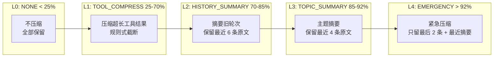
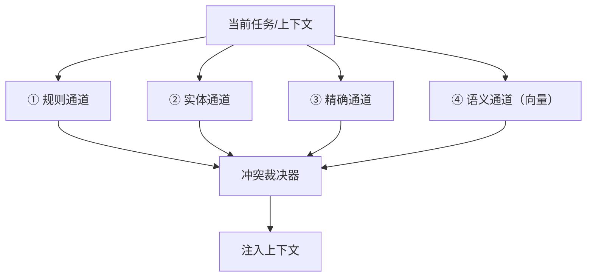

# 第 6 章 · 记忆、压缩与技能
> 阅读时间约 65 分钟。本章讲认知三件套，开头先补一块每天都影响你钱包的基础：token 到底是什么。
>
> 本章主线一句话：**上下文窗口又贵又小，还会随轮次超线性烧钱——压缩负责让"这一次"不爆窗口，记忆负责让"下一次"不失忆，技能负责把成功固化成方法论；而三者都只改"模型看到的视图"，绝不动原始事实。**

本章前置是第 3 章的 Step 原子——三件套全部挂在每轮开始前的上下文组装那一步上；第 5 章结尾提到的 spill（超长工具结果溢出）也在这里完整展开。

---

## 6.1 插曲：token 是什么，成本为什么越跑越贵

全书到处在说 token，现在是把它讲清楚的时候了。

模型不直接读文字。文本在进入模型之前，会先被一个叫**分词器**（tokenizer）的组件切成一小段一小段的 token：常见词是一个 token，生僻词可能拆成两三个，中文的一个汉字通常是一到两个 token。一段文本换算成 token 数量，就像一段布料换算成厘米数——它是模型世界里的基本长度单位。你为模型付出的钱，按 token 计价；第 4 章预算的 token 轴，管的就是这个数量。

模型还有一个硬性限制叫**上下文窗口**：它一次能处理的 token 总量有上限，比如十万。对话历史、系统提示、工具定义，全部加起来不能超过这个数——超过不是"多收钱"，是根本塞不进去。

有了这两个概念，长任务的成本问题就浮现了。Agent 的每一轮，都要把**到目前为止的全部历史**发给模型——第一轮发一千 token，第二轮发两千，第十轮发一万。轮数线性增长，历史线性变长，但总成本是把每轮的发送量**加起来**，涨得比线性更快——这种"比线性还快"的增长叫超线性。拿数字算一遍最直观：假设每轮净增一千 token，跑二十轮，各轮发送量是一千、两千、三千……两万，加起来是二百一十万 token——相当于第一轮的两百一十倍。更糟的是再往后，窗口本身会见底，任务直接被掐死。

认知三件套就是对着这两个问题去的：压缩对付"历史越滚越长"，让长任务不爆窗口、少花钱；记忆对付"跨任务失忆"，让上一个 run 学到的东西在下一个 run 里还在；技能对付"重复踩坑"，把成功经验固化成方法论。一样一样看。

---

## 6.2 压缩：五级牺牲阶梯

压缩的朴素做法是"到阈值了一刀切"——把旧历史砍掉一半。框架拒绝一刀切，理由是不同的信息该有不同的牺牲方式：工具结果丢了细节多半无碍，但用户最后那句"不对，改成上海"丢了就是事故。它的方案是按上下文的占用量分五级，从最温和的开始逐级加码：



| 级别 | 占用量 | 牺牲什么 | 保留什么 |
|---|---|---|---|
| L0 不压缩 | < 25% | 无 | 全部 |
| L1 压工具结果 | ≥ 25% | 超长工具结果的细节 | 关键字段（规则式截断，不调模型） |
| L2 历史摘要 | ≥ 70% | 较早轮次的完整对话 | 最近 6 条原文 + 旧消息的模型摘要 |
| L3 主题摘要 | ≥ 85% | 更多旧轮次 | 最近 4 条原文 + 更凝练的主题摘要 |
| L4 紧急 | > 92% | 几乎一切 | 最后 2 条原文 + 已有的最近摘要 |

阶梯的顺序本身就是设计。第一刀砍向工具结果，因为它们通常最长（一次搜索、一份文件动辄几千 token），而模型往往只需要其中的关键信息——这一级是纯规则式的字符串处理，零成本零延迟。压缩要到第二级才请模型帮忙（把旧对话摘要成一段连贯文字），因为摘要本身也是一次模型调用，有真金白银的成本。越往后的级别保留的原文越少、摘要越凝练，L4 是保命模式：上下文用到九成二以上，只留最后两条消息和一份摘要，任务能继续就算赢。

### 进阶：阈值不是拍的——压缩触发点的经济学

这些阈值看着像经验数字，背后其实有一笔可以算的账，而且结构出人意料地经典。问题：上下文多长时触发压缩，每轮平均成本最低？

一个压缩周期里的成本分三段。压缩调用本身是一笔固定开销（全价读入当前上下文、生成摘要），周期越长（轮次 N 越大），这笔开销摊得越薄。压缩后的第一轮，新摘要还没建立缓存，全价。从第二轮起，前缀（系统提示加摘要加已有历史）开始命中缓存折扣价，但前缀随轮次增长，命中的基数越滚越大——这是随 N 线性累积的长尾。"固定开销摊薄"和"长尾累积"两项一升一降，平衡点就是最优解。这个结构和库存学里的经典**经济订货批量公式**（EOQ，Economic Order Quantity——库存管理百年老定理：一次订多少货使总成本最低）完全同构——"同构"指数学结构相同：压缩就是"补货"，**周期太短**则订货成本（压缩开销）摊不薄、吃不消，**周期太长**则库存积压（前缀累积）吃不消——两股力方向相反，夹出的那个点就是最优。

对平均成本求导取零点（微积分里找极值的标准做法；下面的公式看不懂推导过程完全不影响使用它的结论——你只需要记住"两股反向的力夹出最优点"这个结构），得到最优间隔 $N^* = \sqrt{2B/rd}$，换算成触发长度：

$$L^* = S + A + \sqrt{\frac{2d}{r} \cdot \big[\, rS + A(2+q-r) + M \,\big]}$$

其中 $S$ 是系统提示长度、$A$ 是摘要长度、$d$ 是每轮净增量、$M$ 是压缩指令模板长度、$r$ 是缓存命中折扣率、$q$ 是输出输入价格比。公式不用背，它说的就是：根号里那一串，是固定开销和缓存长尾之间的拉锯。代入各厂商 2026 年 8 月的官方定价（典型业务参数 $S$=10k、$A$=2k、$d$=5k、$M$=500）：

| 模型 | 缓存折扣率 $r$ | 最优触发长度 | 约多少轮 | 占 1M 窗口 |
|---|:---:|:---:|:---:|:---:|
| DeepSeek V4 Flash | 0.03 | ~72k | ~12 | 7.2% |
| Claude Sonnet 5 / Gemini 3 / Kimi K3 | 0.10 | ~51k | ~8 | 5.1% |
| GPT-4.1 / GLM / Qwen | 0.19~0.25 | ~36–37k | ~5 | 3.7% |
| GPT-4o | 0.50 | ~30k | ~4 | 3.0% |

四个观察值得记。第一，**缓存折扣越狠的模型，越该晚压缩**——DeepSeek 命中价只有原价百分之三，长前缀养着反而便宜；GPT-4o 命中价打五折，前缀养不划算，三十 k 就该压。第二，所有厂商的最优触发点都远小于百万窗口，最高才用到百分之七——**"等窗口快满再压"是最贵的策略**，比最优值高三四倍。第三，$r$ 是最敏感的参数，从零点零三到零点五，触发点差二点四倍，所以不要用一个阈值打天下，要按模型定价调参。第四，短对话不必压：任务五轮内结束的话，压缩的固定开销根本摊不薄，不压缩反而最划算。

> 这张表和上面公式的完整推导（每一步怎么求导、各参数怎么标定）在源码仓库的 `docs/topics/compress_threshold.md`，是一份独立的技术笔记，感兴趣可以对照着算一遍自己业务的最优触发点。

最后一条诚实的边界：以上是纯金钱最优，压缩是有损的（九万压到一万二丢八成七信息）——任务依赖早期历史的场景（代码、金融、多步推理），把关键信息放外部记忆按需召回，比在上下文里硬压更可靠。

### 三件比阶梯本身更重要的事

**第一，压缩只改变模型看到的视图，不修改原始历史。**`run.messages` 里存的永远是完整对话，checkpoint 落盘的也是完整版，压缩发生在"组装发给模型的上下文"这一步，是个无副作用的只读操作。这样设计换来三个自由度：恢复后可以用不同策略重新压缩；事后分析能看到完整过程；压缩本身永远不会弄丢证据。"模型看到的"和"真实发生的"是两个东西，这个分离你在第 12 章回放里会再次遇到，到那时它是主角。

**第二，系统提示永远不被压缩。**上下文窗口被切成有预算配比的几层：系统提示占百分之八、状态信息占百分之十五、记忆与技能注入占百分之三十五、对话历史占剩下的四成二——压缩只作用于历史层。"你是谁、必须遵守什么"这类指令，天塌下来也不能丢。

**第三，超长内容有专门的出口，叫 spill（溢出）。**有些工具结果即使在最宽松的级别也放不下——读一个大文件回来五万 token。溢出机制把完整内容存到外部，消息里只留一小段预览加一个编号。

spill 里有个见功力的细节：占位符不是干巴巴的一句"内容已省略"，而是一张取件指引——保留前两千字预览，并明确告诉模型"需要细节就调用 read_tool_result 工具去检索全文，不要只信预览"。信息没有丢失，只是换了个地方放；模型的"视力"受限，但"伸手去拿"的能力完整保留。

而取件的路径是一道安全边界：回读被严格限制在溢出目录之内，拒绝符号链接（一种内容是"指向另一个路径"的特殊文件，可能指到目录外面）、拒绝用 `../`（"上一级目录"，连着写就能一步步走出溢出目录）逃逸——模型可以决定读哪个溢出文件，但不能借这条通道摸到系统别处的文件。和第 5 章工具名合并的显式规则一样，这是"在接缝处设防"的又一例。

实现层还有两个小而硬的细节。溢出目录第一次真正用到才创建，创建用了双重检查锁定（锁外先看一眼、进锁再查一次，并发下也只建一个目录）；写文件用排他模式——同名文件已存在就跳过，让"同一个结果被重复溢出"天然幂等，不会覆盖已有内容。

---

## 6.3 记忆：四条通道，各记各的

很多框架的"记忆"就是一个向量数据库——一种专门存向量、按"方向相近"快速检索的数据库。做法是把历史对话全部向量化，用时检索最相似的几条。框架认为这远远不够，因为不同类型的记忆，性质完全不同。

看四句话。"用户说预算不能超过二十元"——这是规则，二十就是二十，不能靠"相似度"匹配成三十。"用户叫张三，在上海工作"——这是实体，有明确的结构（谁、什么属性、什么关系）。"上次这个任务用 X 方法成功了"——这是精确经验，差一个字的任务都可能是另一个任务。"类似的问题通常要先查文档"——这才是模糊的语义关联，适合相似度检索。前三种用向量检索都会出问题：规则被"差不多匹配"是灾难，实体的结构被压扁成向量就丢了，精确经验被语义近邻污染会误导模型。

所以记忆是四条通道并行，整体结构一张图：



规则通道做条件匹配（当前任务满足触发条件，规则自动生效）；实体通道按任务提到的实体拉取属性和关联；精确通道按任务特征做精确匹配；语义通道做传统的向量检索。四路结果汇总后经过一道冲突裁决，裁决按**通道优先级**：规则最高（用户明确说的硬约束，不可违反），实体次之（关于当前用户的确切事实），精确再次（同类任务的经验），语义垫底（模糊的关联知识）。规则说"预算不超过二十"、语义召回"类似任务通常花五十"打架时，规则赢。冲突会被记进日志，可观测系统可以事后分析"为什么这次召回了矛盾的信息"。裁决的败者不被告别——打上"被取代"的标记留在原地，审计时能追问"这条记忆为什么不再生效"，误判时回滚只是改一个标记。**删除毁掉历史，淘汰保留历史。**

### 语义通道的默认实现：不调任何模型的向量

语义通道还有个反常规的默认实现，细看它。把文本变成向量，通常做法是调一个 embedding 服务——embedding（嵌入）指用模型把一段文本映射成一个向量，语义相近的文本向量也相近；这是一次网络调用，要花钱、有延迟、有随机性。框架的默认实现用经典的哈希技巧，在本地把词哈希到固定维度上：

```python
def embed(self, text):
    vec = [0.0] * 256                    # 固定 256 维
    for token in tokenize_cjk(text):     # 复用底座的中英文分词
        idx = blake2b(token) % 256       # 每个词哈希到某一维
        vec[idx] += 1.0                  # 该维 +1（词袋）
    return l2_normalize(vec)             # 之后用余弦相似度比较
```

逐行读：建一个 256 维的全零向量；把文本切词，每个词用 blake2b（一种哈希算法，和第 3 章算指纹用的是同类工具）算出一个数，对 256 取余得到它"住"的那一维，给那一维加一。这其实是**词袋**表示法——只记"哪些词出现过、出现几次"，不管先后顺序，所以叫"袋"。两篇文本用到的词越接近，落到相同维度的次数就越多，方向就越接近。这里补一个小知识点：把一段文本看成高维空间里的一个箭头，两个箭头方向越一致就越相似，**余弦相似度**算的就是这个夹角——因为比的是方向不是长度，长文本短文本才能公平比，所以要先把长度归一到一（l2_normalize 干的就是这个）。

这套近似当然不如真模型准，但换来三个性质：离线（零依赖零费用）、确定性（同一段文本永远同一个向量——确定性在框架里是被反复守护的属性）、亚毫秒。更关键的是它只是个默认值：构造器允许注入任意真实的 embedding 客户端，四个通道一行不用改——"默认够用、升级换实现"的端口思维又一次。切词环节还有个针对中文的务实取巧：中文没有空格词边界，正经分词器是个不小的依赖，底座对连续中文片段取二到三字的 n-gram（相邻字组合）换召回率，精度交给后面的向量端去补——不背一个分词器，在合适的层解决合适的问题。

### 遗忘：一条记忆可以靠持续有用赎回自己的寿命

记忆不能无限增长——旧经验会过时，噪声会稀释召回精度，存储也要成本。每个通道有自己的遗忘策略：规则不自动遗忘（用户显式删除才移除）；实体长期保留、可更新属性；精确经验按时间衰减；语义记忆带标准的过期清理。

衰减的具体公式来自认知科学的经典激活模型：一条记忆的激活度等于指数衰减（它多老了）、频率加成（它被证明有用过多少次）、近期加成（七天之内被碰过没有）三项之和。三因子各有分工，合起来得到一个反直觉的性质：**一条记忆可以靠持续有用赎回自己的寿命**——衰减在走，但每次召回都在往回加，这正是人类记忆的行为，公式只是把它写了下来。两类记忆被刻意排除在这套算术之外：硬约束和实体事实恒为满激活——该记住的东西，不允许被时间稀释。

"每次召回都在往回加"引出一个工程问题：记账的写盘不能挡住检索的路。实现是召回时只把记忆编号丢进一个内存队列就立刻返回，一个后台任务串行地取编号、落盘——读操作保持纯读，副作用异步落地。否则召回越有用、记忆库越热，检索反而越慢，好的行为会惩罚自己。把"重要但不紧急、失败可容忍"的副作用挪到后台，是让关键路径又快又稳的通用手法（这个后台队列的模式你还会在别处见到）。

最后把压缩和记忆的关系摆正，它们常被混为一谈：压缩管当前 run 的历史长度，每轮动态计算、即时生效、不持久化；记忆管跨 run 的经验，持久存储、召回时注入。一个保证这次不爆，一个保证下次不忘。两者还有一层配合：任务结束后重要信息从 run 里提取写入记忆；此后压缩可以更激进地对待"已存入记忆的内容"——记忆里有备份，历史里丢了也找得回来。

---

## 6.4 技能：把成功蒸馏成方法论

记忆存的是"事实和规则"，技能存的是"怎么做某类任务"。一个成功跑完的复杂任务，过程里可能有多次试错、几个关键决策；如果这些只留在日志里，下次遇到类似任务，模型从零推理，很可能再踩一遍同样的坑。技能系统做的就是把这个过程蒸馏成可复用的操作手册（runbook）。

闭环有四步：蒸馏、存储、召回、应用。成功的 run 被分析——每轮做了什么、用了什么工具、结果如何——关键决策点被提取出来，总结成结构化的手册：适用场景、按序步骤、工具用法、注意事项。新任务开始时按描述召回相关的手册，注入系统提示，指导执行；执行再次成功，蒸馏升级，失败则记账——连续失败若干次的技能自动标记"不可靠"，不再召回。技能不是写死的手册，是有生命周期的：用得好的权重越来越高，用得不好的自动退役。

召回本身也有讲究：不只看相似度，还要看历史成功率——一个"看起来相关但从来没成功过"的技能不会被召回。而注入环节藏着一个很容易写错、也很省钱的设计：**渐进式披露**。技能文档往往很长，全塞进系统提示，光说明书就先烧掉几千 token。框架分两步走：系统提示里每个技能只占一行（名字加一句话简介），相当于一张目录；模型判断某个技能用得上时，才调用内置工具 `get_skill` 把完整手册拉进上下文。这笔账算得很直白——**为你真正用到的深度付费，而不是为你可能用到的深度付费**。和压缩、记忆懒召回是同一种成本意识：上下文窗口是最稀缺的资源，"也许有用"的内容不提前占座。

### 怎么不学会错误的东西

防"经验污染"有三道闸，一道比一道细。

第一道，蒸馏门槛，而且是**不对称的**：从零新建一个技能，一次成功就够——先让经验沉淀下来，门槛太高就什么都学不到；但要**改写一个已经存在的技能**，门槛更高，需要同类任务重复成功若干次。为什么不对称？新建只影响"多了一条参考"，修订改的是未来每次执行都要注入的既有方法论——一次走运的成功，不配推翻被反复验证过的流程。

第二道，修订的语法只有一条铁律：**新证据与已有步骤矛盾时，不是新覆盖旧，而是把两者都保留为条件分支**——"当观察到 X，执行旧做法；当观察到 Y（新证据中出现的形态），执行新做法"。为什么这么苛刻？因为技能文件的每一行都会注入未来的每一次执行，静默覆盖意味着新证据对了一次，就永久注销了旧证据曾经对的整个场景——那不是学习，是失忆。分流让两种经验并存，由现场观察决定走哪边；矛盾本身也被记录成结构化条目（旧建议、新证据、分辨条件），可审计可复盘。

第三道，技能库的更新遵守"历史不可变"。新版手册覆盖旧版时，旧文件先归档进带版本号的历史目录，版本号单调递增，回滚只是把归档翻回来。你在记忆通道见过同样的选择：被打败的信息标记取代而不是删除。加上落盘前技能名要过文件名白名单校验（名字里藏路径逃逸也逃不出技能目录），这个模块对"写磁盘"这件事的敬畏，一脉相承。

---

## 6.5 三件套在一次组装里的合奏

最后把三件套放回第 3 章的 Step 里，看它们在同一时刻怎么配合。每轮开始前，上下文组装依次发生：记忆四通道按当前任务召回，结果注入记忆层；已加载技能的手册注入技能层；然后对历史层计算占用，决定要不要压缩、压到哪级；超长的工具结果早在上一轮就被 spill 出去了。模型最终看到的，是"完整系统提示 + 召回的记忆 + 技能手册 + 可能被压缩的历史"这个精心组装的视图——而 `run.messages` 里，完整的对话原封不动。

### 代码定位

| 内容 | 源码位置 |
|------|---------|
| 五级压缩管道 | `cognition/context/compression/pipeline.py` |
| 工具结果压缩（规则式）/ LLM 摘要器 | `cognition/context/compression/formatting.py` / `summarizer.py` |
| 窗口分层预算 | `cognition/context/budget.py` |
| 上下文组装 | `cognition/context/manager.py` |
| Spill 溢出与回读工具 | `cognition/context/spill.py` / `tooling/builtin/read_tool_result.py` |
| 四通道记忆 / 冲突裁决 | `cognition/memory/channels.py` / `conflict.py` |
| 哈希伪向量 / 遗忘曲线 | `cognition/memory/embedder.py` / `forgetting.py` |
| 后台强化工人（不阻塞召回） | `cognition/memory/touch_worker.py` |
| 技能蒸馏与召回 | `skills/skill_synthesizer.py` / `tooling/skill_resolver.py` |
| 技能库（历史归档/白名单） | `skills/registry.py` |
| 压缩阈值的完整数学推导 | 仓库 `docs/topics/compress_threshold.md` |

---

## 动手环节

练习 1：亲眼看看 token。把第 2 章的 `my_first_script.py` 最后一行改成：

```python
run = asyncio.run(agent.chat("巴黎今天天气如何？"))
print(run.metrics)
```

跑一遍，看 metrics 里轮数和 token 的记账。然后往剧本里多加几轮（比如再来一组工具调用和回答），对比 input_tokens 的增长——你会发现每轮的历史都在被重新计费，6.1 节的超线性就发生在你眼前。

练习 2：读压缩的测试。运行 `ls tests/cognition` 找到压缩相关的测试文件，跑通后挑一个读：看它怎么构造超长历史、断言压缩后保留了什么。特别留意"原始 messages 未被修改"这类断言——6.2 节最重要的那条性质，测试是怎么守住它的。

---

## 下一章

聪明的事讲完了。但一个只会变聪明的系统离工业级还差最硬的一块：进程被杀死之后怎么办。下一章讲事件日志与崩溃恢复——框架的档案库和复活术，也是全书计算机基础密度最高的一章，插曲排队的有四块：JSON 序列化、追加写日志、乐观并发，和第 3 章欠下的 contextvars。

→ [第 7 章 · 事件日志与崩溃恢复](ch07.md)
