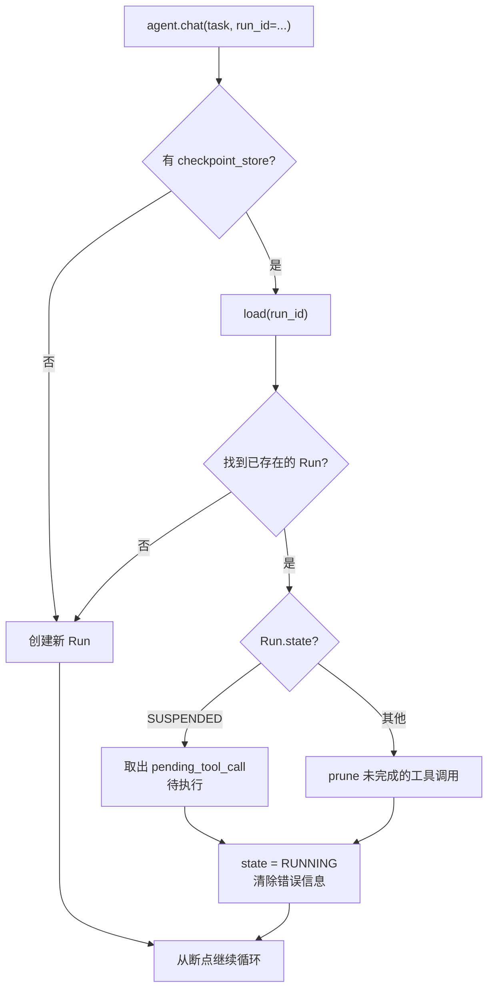
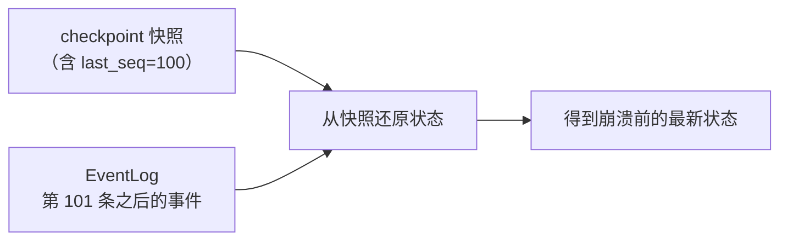

# 第 7 章 · 事件日志与崩溃恢复
> 阅读时间约 85 分钟。本章讲框架的档案库与复活术，穿插四块基础：JSON 序列化、原子写、乐观并发、contextvars。
>
> 本章主线一句话：**进程会死是常态，所以"状态、半截副作用、没回音的请求"三样都要有人接住——检查点存状态、幂等键认重复、事件日志留全史；而"快照打底 + 尾部重放"让恢复既快又不丢历史。**

本章前置：第 3 章的终态单咽喉和 `stream()` 里那个 `finally`（当时说"恢复的全部魔法从这行开始"），第 5 章预告过的幂等键，第 6 章"模型看到的视图"与"真实历史"的分离。本章是全书计算机基础最密集的一章，慢一点。

---

## 7.1 问题：进程会死，状态不能跟着死

第 1 章的要求二说，进程被杀死是生产环境的常态。现在把"被杀"的瞬间放大看，一个正在运行的 Agent 身上有三样东西处于危险中。

第一样是**状态本身**：对话历史、轮数、token 记账、当前状态——它们都在内存里，进程一死就蒸发。内存这种东西，本质是进程向操作系统租的：进程一终止，租约结束，里面的一切即刻清零。

第二样更麻烦：**正在执行的工具**。进程死在工具执行的半路上，副作用有没有发生是未知的——邮件可能发了也可能没发，没有任何人知道。这不是"重试一次"能解决的：发了再试就是两封，没发就正好，可你不知道是哪种。

第三样是**对话的完整性**：模型刚输出"我要调用某工具"，进程死了，工具结果永远不会到来，历史里留下一条没有回音的呼喊。

恢复系统要同时接住这三样。对应的三个机制分别是：检查点（把状态定期存到磁盘）、幂等键（让工具端能识别重复执行）、消息修剪（把半截的呼喊从历史里剪掉）。本章按这个顺序讲，最后讲事件日志——它和检查点是一对搭档，也是第 12 章回放的地基。

---

## 7.2 插曲：序列化——对象怎么变成能存盘的文本

状态要存盘，第一个技术问题是：内存里的对象怎么变成磁盘上的字节？

Python 对象活在内存里，有地址、有引用关系，这些概念磁盘不认识——磁盘只能存一串字节。要把对象存下来再读回来，需要一种中间格式：把对象转成一段纯文本（或纯字节），这段文本能完整描述对象里有什么；读回来时再从文本重建对象。这个转换叫**序列化**（serialization，转成文本）和**反序列化**（deserialization，从文本重建）。最常用的文本格式是 JSON——就是那种 `{"name": "demo", "turns": 3}` 的键值对写法，你已经见过很多次。

标准库的 `json` 模块提供两个函数：`dumps` 把字典转成 JSON 文本（dump to string），`loads` 把文本转回字典（load from string）。但 `AgentRun` 是个 dataclass，不是字典，怎么办？第 2 章埋过伏笔：dataclass 能自动生成样板方法，框架给 `AgentRun` 补了一对 `to_dict()` 和 `from_dict()`——前者把对象转成"只含字典、列表、字符串、数字"这种 JSON 认识的朴素结构，后者反向重建。往返一次，对象应该分毫不差。

这里有个所有持久化系统都要面对的问题：**格式会演化**。今天的 `AgentRun` 有二十个字段，下个月加了第二十一个——旧的存档读回来怎么办？框架的答案是在序列化文本里带一个 `schema_version`（格式版本号），格式变更就递增它；读取时发现是旧版本，就地迁移成新格式再重建对象。配套的原则写得很清楚：**加载得不对还可以救，拒绝加载就没得救**——所以旧版本永远尽力读取，读到比自己新的版本也只是警告，不拒载。数据比代码活得久（存档可能躺三年，代码已经发了一百版），读取端永远要比写入端宽容。

这套 `to_dict`/`from_dict` 要几十个类各写一对，是典型的重复劳动。`base/codec.py` 把它一次性收口：遍历 dataclass 的字段，按类型注解决定怎么转换——枚举取值、嵌套的递归、列表逐个处理。这里有一条要划重点的边界：**通用编解码器只接管"机械镜像"，"策展投影"坚持手写**。普通对象的字段和落盘内容一一对应，交给通用 `dump/load`；而 `AgentRun` 落盘时只存可持久化的子集、事件线格式要靠类型字段区分——这些投影的形状带着设计立场，保留手写。不追求"全部自动化"的整齐，而在"重复劳动"和"需要表达意图"之间划清边界，这是很成熟的工程判断。

还有一个字段值得专门认识：`cursors`，游标。它记录"恢复到哪了"——比如事件日志读到第几条。第 3 章说过 REACTIVE 和 PLAN_FIRST 各自往这个字典里放自己的一格，互不打扰；将来新增执行模式，也是加一个键，而不是给 `AgentRun` 加字段。

---

## 7.3 插曲：原子写——怎么保证文件不会写一半

序列化解决了"变成文本"，下一个问题是"怎么写到磁盘"。这里藏着一个比想象中深的问题。

直觉的写法是打开文件直接写。但如果写到一半进程死了——磁盘上留下半个文件：旧内容已经被覆盖，新内容又不完整。下次恢复读到这个文件，解析直接失败，等于崩溃把"恢复的机会"也一起带走了。安全网自己先破了个洞，这是恢复系统绝对不能接受的。

解法来自操作系统给的一个承诺。POSIX 系统（Linux、macOS 这类遵循同一套操作系统接口标准的系统）保证 `rename`（改名）这个操作是**原子的**：一个文件要么叫旧名字，要么叫新名字，不存在"叫了一半"。于是标准套路是三步：先把完整内容写到一个临时文件；确认写完——这里要"冲刷"（flush，术语 fsync）：操作系统平时把写入先攒在内存缓冲里、攒够再真正落盘，冲刷就是强迫它现在就写到物理磁盘上（连文件的父目录也要冲，否则极端情况下连"改名"这个动作本身都可能没落到磁盘）；最后把临时文件改名成正式名字。任何时刻被杀：改名之前，正式文件还是完好的旧版；改名之后，正式文件是完整的新版。不存在中间态。这个套路叫 **write-temp-then-rename**，框架的文件后端就是这么写的：

```python
async def save(self, run, expected_version=None):
    path = self.base_dir / f"{run.run_id}.json"
    # 原子写入：先写临时文件，再 rename
    tmp = path.with_suffix(".tmp")
    tmp.write_text(json.dumps(...))
    tmp.rename(path)  # POSIX rename 是原子的
```

（示意，`src/prodagent/backends/file/checkpoint.py`。）两行核心，换来"任何时刻被杀，磁盘上永远是完整状态"这条性质。你在技能库（第 6 章的历史归档）和溢出存储里见过同一套敬畏，它是所有"往磁盘写东西"的代码都该有的底色。

围绕"写文件"还有三个更细的坑，底座各有一个明确的立场。

其一，**耐久性分级**。checkpoint 这种丢了要命的数据，写完还要强制落盘（冲刷数据文件、再冲刷父目录）；缓存这种丢了无所谓、重算即可的数据，就不付这个磁盘代价。不为不重要的数据花重要数据的钱。

其二，**路径防火墙**。run 号这类标识最终会拼进文件路径，混进 `../` 就可能写到预期目录之外——底座在数据进入的接缝处用白名单拦截，非法字符直接拒绝。安全校验离入口越近越好，不要指望下游每个人都记得检查。

其三最隐蔽：**JSONL 按行读取只认 `\n`，绝不用 Python 的 `splitlines()`**。这个坑值得放慢讲。JSONL（JSON Lines）指一行一条 JSON 的日志文件格式，写入时每条 JSON 后面跟一个换行符 `\n`。问题出在 Unicode：JSON 允许字符串里出现两个特殊字符 `U+2028` 和 `U+2029`（Unicode 标准定义的"行分隔符"和"段落分隔符"），而 Python 的 `splitlines()` 自作主张地把它们也当成换行——于是一条合法的事件被静默切成两半，两半都不是合法 JSON、都解析失败，等于凭空丢了一条历史，而且不报任何错。这个坑在仓库里真实炸过一次，后来立成契约：写的一方只按 `\n` 换行，读的一方只按 `\n` 切，双方对"什么是行"的理解必须严格一致。读写双方对同一件事的理解契约，正是生产级和玩具的分水岭。

---

## 7.4 检查点：每轮落盘，和乐观并发

有了序列化和原子写，检查点的策略就一句话：**每一轮结束都保存，无论结果如何**。第 3 章的 `stream()` 里那个 `finally` 块，现在可以完整读懂它的分量：

```python
finally:
    # ← 关键：无论成功、失败、异常，都保存 checkpoint
    if self._checkpoint_store is not None:
        await save_and_fire_checkpoint(self._checkpoint_store, run, self._hooks)
```

`finally` 是 Python 的语法承诺：无论代码块正常结束、抛异常、还是被打断，`finally` 里的语句都执行。放在这里意味着：崩溃前的最后一个完整轮次，一定已经落盘。恢复时丢的最多是"正在进行的那个半轮"——而半轮的问题，马上有专门的机制处理。

### 插曲：乐观并发——平时不锁，提交时对版本

保存时还有一个并发问题要处理。假如同一个 run 被两个执行者同时写检查点（比如运维误操作起了两个实例），后写的会覆盖先写的，状态可能交错出没人认识的样子。传统解法是加分布式锁（跨进程的互斥锁），但分布式锁难实现、易死锁。框架用的是**乐观并发控制**：保存时带上"我读到的版本号"（`expected_version`），存储端先核对当前版本号是否一致——一致才写入并递增版本，不一致抛 `VersionConflict`，让调用方知道有人抢先写了。

这个名字里的"乐观"是什么意思？它乐观地假设冲突很少发生，所以平时不加任何锁、不付任何代价，只在提交的瞬间检查一次；真冲突了，报错重来。对比"悲观"方案（先锁住再操作，防患于未然但处处付锁的成本）：Agent 的场景里，一个 run 通常只有一个执行者，冲突概率极低——低冲突场景用乐观方案，是省钱又省心的标准选择。记成一条：**锁的成本付在每次操作上，乐观检查的成本只付在冲突时；按冲突率选方案。**

`VersionConflict` 还有一个更微妙的用途，第 12 章会回来：它是"单写者"纪律的执法者——事件日志的追加也走同一个模式，保证一条流上只有一个权威在盖章。

### 同一件事，三种介质，三种并发控制

第 1 章 1.3 节说过后端有五族。现在你已经懂乐观并发了，可以回答后端适配里技术含量最高的问题：同一件事——"读出当前值、修改、写回"——在不同介质上要防的并发问题并不相同，框架给了各得其所的三种解法。这也是"换后端行为完全一致"背后最硬的功夫。

**文件后端用操作系统的文件锁。**多个进程同时写同一个文件会互相覆盖，`backends/file/_locking.py` 用 `fcntl.flock`（POSIX 提供的文件锁接口）给一次"读-改-写"全程上排他锁——锁由操作系统在进程间生效，进程崩溃时系统也会自动释放，不会留下永远解不开的死锁。这里有一个诚实的降级：`fcntl` 是 POSIX 专属，Windows 没有；代码在导入失败时把锁降级为空操作，同时用注释把契约讲清楚——Windows 上的文件后端只保证单进程使用。**不假装支持做不到的事，把边界写在明处，比留一个"看似跨平台、实则偶发丢数据"的实现负责得多。**

**Postgres 用双保险：事务级咨询锁 + 乐观版本号。**咨询锁（`pg_advisory_xact_lock`，Postgres 提供的一种应用层锁：不锁数据行，锁一个你们约定的编号）让同一对象的写者排队，且绑定在事务上、提交时自动释放，进程崩了也不留死锁。为什么光有乐观版本号还不够？模块注释点破了要害：两个写者并发**插入**时，可能都读到"当前不存在（版本 0）"，版本检查拦不住这种冲突，必须靠锁先把写者串行化。**锁管排队，版本管发现冲突，缺一不可。**

**Redis 既不用锁也不用版本，用约定加过期。**所有键统一加 `prodagent:{namespace}:` 前缀，不同租户、不同环境的键互不撞车；缓存、死信这类本就该过期的数据再配上 TTL（Time To Live，存活时间——到点由 Redis 自动删除），到期自动清理。用"命名空间 + 过期策略"代替重型锁，契合 Redis 单线程、擅长高频短数据的特性。

你看，三种介质没有套用同一个模板，而是各自用了自己最擅长的原语，最后却对外呈现同一个端口契约——这正是端口与适配器架构"内部因地制宜、外部整齐划一"的样子。而"换了介质行为真的一致吗"这件事，第 1 章讲过，是由 `tests/backends/conformance/` 那同一套考卷判分的。

### 快照里到底存什么

顺带一个关于快照内容的裁决。哪些字段进快照，判据不是"能不能序列化"，而是**谁拥有这个事实**：`checkpoint_version` 不在持久化子集里——它是存储信封的回声，保存之后由存储端回填，让 run 自己持久化它只会存下一个注定过期的值；`checkpoint_failed` 也不在——保存失败是进程局部的诊断，由事件做持久记录，恢复后的新进程从干净的标志位重新观察。原则一句话：能从别处重建的事实不做冗余存储，属于进程生命周期的记忆不冒充为数据。快照里每多一个字段，就多一份"两个来源不一致时信谁"的未来债务。

端口自身的定义也有功力。`CheckpointStore` 把能力分成两级：基础级必须实现（保存、加载、列出运行号），扩展级可以不实现（从历史版本分叉、列出版本历史——没有版本历史的介质可以明确抛"未实现"）。不是所有介质都存得起版本历史，强行要求会让简单后端无法入场；分成两级，文件后端快速上线、Postgres 提供完整能力，端口对两者都诚实。还有个细节：`load` 找不到时返回 `None` 而不是抛异常——"不存在"在这个语境里是正常情况而不是错误，用 `if run is not None` 处理比捕获异常清晰得多。

---

## 7.5 恢复：三种起死回生

重启后，`chat()` 带着原来的 `run_id` 再进来，`_resolve_run` 先查检查点库：有存档就加载，没有就新建。加载到存档后按状态分三条路走：



**第一条路，存档状态是 SUSPENDED**——它不是崩溃，是在等人审批。恢复逻辑取出存档里那个 `pending_tool_call`（当时挂起的工具调用），**直接执行它，不重新问模型**。为什么必须这样？三个理由层层递进：重新问一次模型，答案可能不一样（模型输出有随机性）——但用户审批的是"那一个具体的调用"，换一个就成了偷梁换柱；重新问一次要花真实的 token 和时间；而且挂起可能过了很久，模型重新看一遍上下文未必还原出当时的决策。所以正确的语义是：**审批通过的，就是当初展示给用户的那个调用，一个字节都不能差**。

**第二条路处理半截呼喊。**进程死在"模型输出了工具请求、工具结果还没回来"的中间，历史最后一条 assistant 消息引用着一个永远不存在的工具结果。直接拿这个历史去调模型 API 会被拒绝——第 2 章讲过消息配对：协议要求每个工具请求必须有配对的结果。恢复逻辑把这条悬空的消息从历史里剪掉（prune，修剪），让模型在干净的局面下重新决策。剪掉它不丢信息：模型会看到之前所有的工具结果，只是重新决定下一步。

**第三条路是普通的运行中崩溃**：状态回到 RUNNING，清掉崩溃现场（上次尝试的错误信息不带到新尝试里——第 3 章单咽喉的 `revive()` 干的就是这个），从断点继续。

恢复的设计不止覆盖单个 run。PLAN_FIRST 模式多一张 DAG 要恢复：已完成的步骤不重执行，崩溃时正在跑的步骤回到待执行（产出状态未知，不知道就是没做完），按依赖继续。第 10 章的三种舞台（发言记录、板面、队列）走的是同一套事件溯源契约：每次状态变更追加一条事件，重跑同一个 run 号时先查日志——有事件就重建（带着原来的轮次号和版本号），没有就全新开始。有一条共通的克制：**活对象不进日志**——舞台的成员、工具这些"活着的东西"恢复后由调用方重新挂上，日志只存事实数据。和恢复后重装工具是一个道理：能重建的不持久化，持久化的必须是事实。

---

## 7.6 幂等：副作用不能靠祈祷

还剩 7.1 的第二样危险：死在工具执行的半路上。看一条最坏的时间线。模型请求发邮件；工具开始执行；进程在这一瞬被杀——邮件可能已经发出，也可能没有，没人知道；恢复后剪掉了那条请求，模型重新决策，很可能再次请求发邮件；邮件发了两次。

检查点管不了这件事——它管状态，不管副作用。这里的正确武器是**幂等键**，第 5 章 `ToolMeta` 里那个 `enforced_idempotent` 的完整含义现在可以讲清楚了。框架在调用工具前，基于 run 号、轮次、工具名和参数算出一个稳定的键，注入到工具参数里。注意"稳定"两个字：崩溃重放导致的第二次调用，算出的键和第一次**相同**——工具端（或它写的数据库）看到这个键已经处理过，就拒绝重复执行。

"幂等"这个词补一句定义：同一个操作执行一次和执行多次，效果相同，就叫幂等（idempotent）。查询天然幂等（重复读一次无害），发邮件不是。责任划分在这个设计里很清醒：框架的职责是铸造崩溃稳定的键、提供清晰的恢复语义；**去重的实现是工具作者的责任**。框架不假设所有工具都是幂等的，它只保证"重复发生时，你一定认得出来"。把"你的工具该怎么去重"留给最了解副作用的人，和第 5 章"错误的最佳处理者是有上下文的一方"是同一个思路。

---

## 7.7 事件日志：另一条腿

到这里，恢复似乎已经完整了。那事件日志是干什么的？为什么框架要有两条持久化的腿？

区别在用途。检查点存的是"某一刻的完整状态快照"，为恢复服务——快，但只有最新一份（或少数几份版本）。事件日志存的是"发生过的每一件事"，一条一条追加，只增不改：计划创建了、步骤三完成了、运行挂起了……它为审计和重放服务——慢一点，但完整。第 6 章说"模型看到的视图"和"真实历史"要分离，事件日志就是那个永远说真话的历史。

事件通过 `Event.make` 创建，整个模块在 `src/prodagent/base/event_log.py`，先看追加这一步：

```python
async def append_expected(event_log: EventLog, event: Event, *, tail_seq: int) -> int:
    """Optimistic append: attach ``event`` after ``tail_seq``, return the seq
    the store assigned."""
    return await event_log.append(event, expected_seq=tail_seq)
```

追加走的是和检查点同款的乐观并发：带上"我认为的尾部序号"，存储端核对不一致就冲突。这保证了**一条流上只有一个写者在连续盖章**——序号由存储分配、连续递增，两个人同时追加必然有一个被 `VersionConflict` 拦下。为什么序号这么重要？因为日志的全部价值建立在"顺序可信"上：审计要按真实顺序看历史，重放要按因果顺序重演。`Event.make` 里 `seq` 初始只是占位符的谜底在此——事件自己不数数，权威的存储数。

两条腿怎么配合？先补一个概念。**事件溯源**（Event Sourcing）是一种与"只存当前结果"相对的存储哲学：把导致结果的每一次变化按顺序记成事件，当前状态等于从空状态开始把每个事件依次折叠进去的结果。银行流水是最好的类比——余额是结果，流水才是事实，任何时候都能靠流水把余额重新算出来。负责折叠的函数叫 **reducer**，它是纯函数：吃进当前状态和一个事件，吐出新状态，同样的事件序列必然得到同样的结果——这就是第 4 章 `evaluate_axes` 那类纯函数的又一个用场，也极其好测。

只靠事件重放有代价：跑到几千个事件后，每次恢复都要从头折叠一遍，越来越慢。只靠快照也有代价：两次快照之间的变化会丢。框架的折中是把两者的长处拼起来——检查点里存一份快照**和它对应的事件序号**，恢复时快照打底，只重放序号之后的那一小段尾部：



```python
async def hybrid_restore(run_id, event_log, checkpoint_store, reducer, ...):
    """Checkpoint-as-base + exact tail replay, or full replay if no usable base."""
    run = await checkpoint_store.load(run_id)
    base = extract_base(run) if run is not None else None
    if base is not None:
        # Fast path: snapshot as the base, replay only the tail after it.
        state, checkpoint_version, last_seq = base
        post = await event_log.get_after(run_id, since_seq=last_seq)
        for event in post:
            reducer(state, event)  # fold the few events the snapshot missed
        return state, checkpoint_version, ...
```

（同文件，有删节。）这和数据库里的"预写日志加检查点"（WAL，Write-Ahead Log：数据库先记日志再改数据的经典技术）、消息系统里的"日志压缩"（定期把同一键的旧记录清掉、只留最新，控制日志长度）是同一门经典智慧：**用定期快照截断重放长度，用事件流保证不丢增量**。文件注释里还有一句兜底哲学：没有可用快照时（比如第一次恢复），从空状态全量重放——慢，但永远正确。

最后一样武器把本章和前面几章缝在一起：**定律测试**。恢复系统的正确性依赖一批"必须永远成立"的性质——序列化的往返律（`from_dict(to_dict(run))` 等于原对象）、第 4 章账目的恒等式、日志序号的后缀律、折叠可分解律。框架把这些性质写成测试，其中一些用随机生成的操作序列反复锤打，恒等式必须恒成立。约定可能被遗忘，文档可能过时，但每笔提交都要跑的机器检验不会。**把不变量写成定律，是这个框架最独特的手艺**，你已经在预算、架构方向上见过它两次，第 12 章它会成为绝对主角。

---

## 7.8 插曲：contextvars，完整版

还欠第 3 章一笔账。两钟插曲的结尾你看到，代码里取时间写的是 `now_wall()` 而不是 `time.time()`，当时说那是"时间来源的闸口"，完整机制留给本章。现在事件日志已经在手，这个设计的目的可以说透了。

先补机制。问题设定：框架希望"时间从哪来、随机数从哪来、id 从哪来"可以在运行中被整体替换——比如第 12 章的回放需要把时钟冻结在录像带上、让 id 重放旧值。最朴素的实现是一个全局变量（`CURRENT_CLOCK = ...`），但全局变量在并发世界里是公害：一个任务换掉了时钟，同进程所有任务都遭殃。`contextvars` 模块解决这个问题：每个异步任务随身携带一份独立的上下文（一组带名字的变量），任务读写的都是自己那份，互不干扰。机制上，`asyncio` 每创建一个任务都会复制当前上下文，所以"任务 A 冻结时间、任务 B 正常生活"自动成立。

框架的实现在 `src/prodagent/base/determinism.py`，核心不到两百行：三个协议（时间、随机数、id），三个默认实现（直接委托标准库，行为与今天完全一致），三个 `ContextVar` 存"当前装的是哪个实现"，以及一个 `override()` 上下文管理器负责"换芯-恢复"——上下文管理器就是 `with` 语句背后的小协议：进入代码块时做准备工作、退出时（哪怕中途抛异常）做收尾，`@contextmanager` 装饰器让你用一个带 `yield` 的函数写出来：

```python
_time: ContextVar[TimePort] = ContextVar("prodagent_determinism_time", default=SystemTime())

def now_wall() -> float:
    """Epoch seconds from the installed time port."""
    return _time.get().wall()

@contextmanager
def override(*, time_port=None, random_port=None, id_port=None):
    """Install substitute ports for the duration of the block."""
    time_token = _time.set(time_port) if time_port is not None else None
    ...
    try:
        yield
    finally:
        if time_token is not None:
            _time.reset(time_token)
```

平时 `now_wall()` 读到的是默认的真时钟，`Event.make` 的行为和你直接写 `time.time()` 一模一样。需要回放时，包一层 `override(time_port=RecordedClock(...))`，块内所有时间读数变成录像带上的值，出块自动恢复——`_time.set()` 返回的 token 是恢复原状的凭据，`finally` 里的 `_time.reset(token)` 凭它把世界放回去；哪怕回放中途崩了，冻结的时钟也不会漏到外面的世界。

为什么这章讲它？因为它是事件日志的孪生兄弟。日志负责记录"发生过什么"，确定性端口负责保证"重演时，时间和身份还能跟当时一样"。没有后者，重放一个 run 会得到全新的事件 id、全新的时间戳——日志就对不上了。两条线索在第 12 章合龙成完整的回放系统，全书在那里收束。

顺带一提，这个模块落地的同时，框架立了一条 lint 法律——lint 指不运行代码、静态扫描源码找问题的检查工具，这里的法律是一条自定义规则：域内代码禁止直接调用 `time.time`、`uuid.uuid4` 这些原始来源，一律走端口——第 1 章动手环节你亲手触发过它的近亲。法律的含义现在完整了：**不是禁止用时钟，是禁止绕过闸口用时钟。**

---

### 代码定位

| 内容 | 源码位置 |
|------|---------|
| AgentRun 与序列化 | `kernel/state.py` |
| CheckpointStore 端口（两级能力） | `ports/persistence.py` |
| 文件后端（原子写/文件锁） | `backends/file/checkpoint.py`、`backends/file/_locking.py` |
| PG 咨询锁+版本 / Redis 命名空间 | `backends/postgres/_versioned.py`、`backends/redis/keys.py` |
| 恢复逻辑 / 挂起恢复 | `kernel/loop.py` |
| 事件与混合恢复 | `base/event_log.py` |
| 确定性端口 | `base/determinism.py` |
| 版本冲突 / 幂等键 | `base/errors.py` / `ports/messaging.py` |
| 后端一致性考卷 | `tests/backends/conformance/` |

---

## 动手环节

练习 1：找到那两行原子写。打开 `src/prodagent/backends/file/checkpoint.py`，找到写临时文件和改名的两行。然后打开 `src/prodagent/skills/registry.py`，找找技能库写盘是不是同一套套路。数一数框架里还有几处 write-temp-then-rename——这个数本身就是"底座能力渗透程度"的一个指标。

练习 2：看乐观并发被谁守护。运行 `grep -rln "VersionConflict" tests/`，找到冲突测试跑一遍。读它的构造：怎么制造"两个写者撞车"的场景、断言什么。然后想一想：如果没有这个异常，撞车时会发生什么、多久会被发现。

练习 3：对照三种介质。读 `backends/file/_locking.py`、`backends/postgres/_versioned.py`、`backends/redis/keys.py` 三个文件的开头注释，用你自己的话各说一句：它靠什么保证"读-改-写"不被并发破坏？然后去 `tests/backends/conformance/` 看同一套考题长什么样。

---

## 下一章

恢复系统接住了崩溃，但还有一类"失败"不是崩溃：任务本身走错了路。计划步骤三失败了，整个任务重跑吗？审批被拒了，从头再来吗？下一章讲规划与 DAG——先想后做的执行模式，它的版本化重规划、断点续跑，以及"被替换的步骤为什么标记废弃而不是删除"。

→ [第 8 章 · 规划与 DAG](ch08.md)
