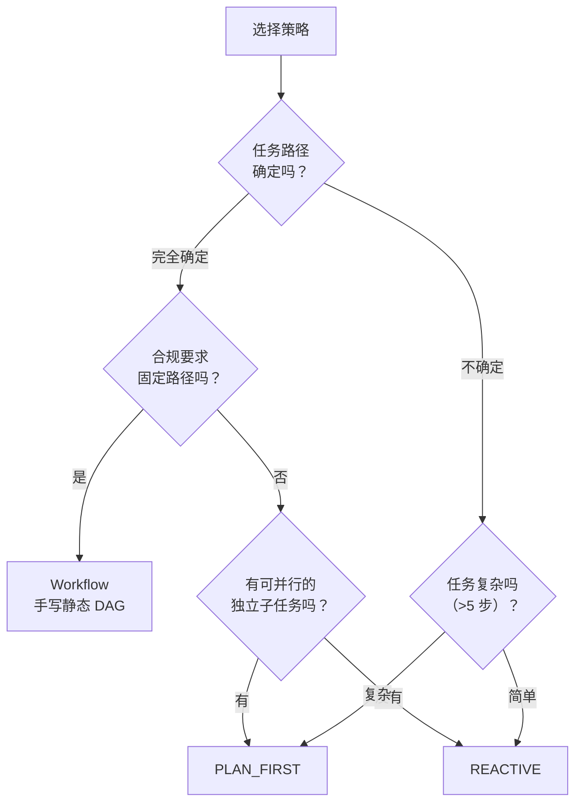
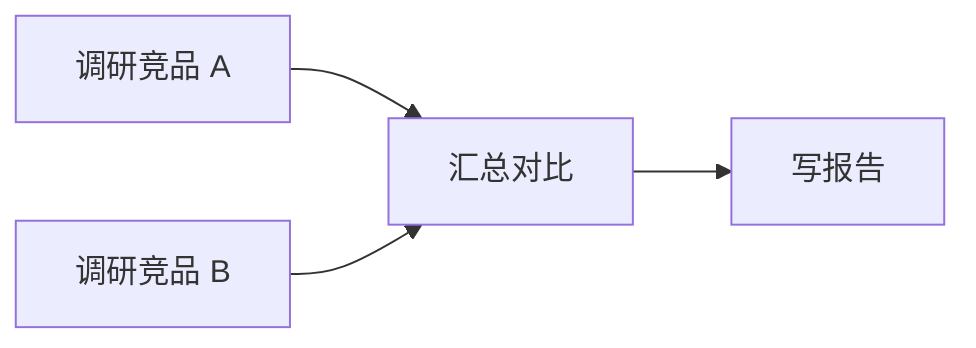

# 第 8 章 · 规划与 DAG

> 阅读时间约 65 分钟。本章讲"先规划后执行"这种模式，开头先补一块图论基础：有向无环图与拓扑序。
>
> 本章主线一句话：**当任务需要并行、可审计、按步恢复时，就不能再走一步看一步，而要先产出一张步骤依赖图再按图施工；而图会改，改图的铁律是"版本化重写、绝不就地涂改、已完成的步骤绝不重跑"。**

本章前置：第 3 章的两种执行模式和"共用内核"的悬念、第 7 章的恢复语义（本章的断点续跑是它的 DAG 版）、第 3 章正式讲过的 `NodeStatus` 六态。

---

## 8.1 问题：一种循环走天下吗

REACTIVE 边走边想，很好用，但有三个它天然做不好的场景。

一是**并行**。任务有五个互不相依的子任务，REACTIVE 只能一轮一轮串着来——它的并行单位是"一轮之内的只读工具"（第 5 章），不是"任务之间的步骤"。好比五个信封要送五个地址，它坚持一封送完回来再取下一封。二是**审计**。合规场景要求按固定步骤执行、留痕可查，每轮都重新决策的循环可能跳步、可能乱序——审计员要问"第三步做了吗"，循环模式连"第三步"这个概念都给不出。三是**恢复粒度**。第 7 章的恢复以"轮"为单位，而一个多步任务跑到第八步崩溃，理想的恢复是"前七步不用重做"——循环模式没有"步"的概念，谈不上按步恢复。

这三个场景的共同解法是：先规划，后执行。框架给三个选择。REACTIVE 不规划，模型每轮现场决策，适合探索式任务。PLAN_FIRST 让模型先产出一张步骤依赖图，按图执行、可增量重规划，适合复杂多步任务。Workflow 用代码手写这张图，模型只在指定步骤被调用，适合确定性流程——合规流水线要的就是"每一步都写在纸上"。再次强调：**Workflow 不是第三种执行模式，它是一个计划构建器**，产出的计划交给 PLAN_FIRST 的执行器去跑。

三者的差别可以用一个类比一次记牢：REACTIVE 是开车去陌生地方，走一步看一步导航；PLAN_FIRST 是装修前先出施工图，按图施工、图中途可改；Workflow 是工厂流水线，每一步固定。选择可以走一棵决策树。这张图里的菱形都是"一个问题"，箭头上写着答案，顺着问题一路答下去，最后落到某个叶子框就是推荐的策略：



读法：先问"任务路径确定吗"。完全确定且合规要求固定路径，用 Workflow 手写；确定但不要求固定、且有可并行的独立子任务，用 PLAN_FIRST 让模型画图；路径不确定的，看复杂度——超过五步的复杂任务值得先规划，简单任务直接 REACTIVE，不为小事付规划的成本。

---

## 8.2 补课：有向无环图与拓扑序

规划的核心数据结构是 DAG，这三个字母值得从零讲一遍。

**图**（graph）是计算机科学里最常用的结构之一：一些节点（node），一些边（edge）连接它们。边有方向的图叫有向图。顺着方向走，从任何节点出发都转不回自己的，叫无环（acyclic）——合起来就是 Directed Acyclic Graph，**有向无环图（DAG）**。

DAG 天然适合表达"依赖"。每个节点是一步工作，一条从 A 指向 B 的边说"B 要等 A 完成"。查资料 A、读文档 B、汇总对比 C、写报告 D，这四步的依赖图画出来是这样（横图，箭头方向就是"先做谁、后做谁"）：



"写报告"要等"汇总"完成，"汇总"要等两个调研都完成——一张再自然不过的图。两个调研互不相依，所以它们可以同时开工：并行不是靠运气，是图结构里明摆着的。

无环这个约束为什么性命攸关？假设图里有环：A 等 B，B 等 C，C 又等 A。谁来先开工？谁也不能——每个都在等别人，任务是死锁的（一组互相等待、永远无法推进的执行流）。所以"无环"不是优化项，是"这张图能不能被执行"的先决条件。把一批依赖翻译成执行顺序，叫**拓扑排序**（拓扑序）：找一种节点的排列，使每条边的起点都排在终点前面——顺着这个序执行，任何依赖都不会被违反。拓扑序往往不唯一（两个互不相依的步骤谁先都行，也可以并行），这正是 DAG 的并行空间所在。

框架在两处用到这些概念：模型输出计划后先校验无环，有环就报错让模型重新规划（第 5 章的老朋友——错误是反馈）；执行时反复计算"当前哪些节点可以跑了"（依赖全部完成、自己还没开始的那批），按波次推进——一波齐发、等这一波落定、再计算下一波，像潮水一样。

---

## 8.3 Plan：一张活的图

规划产物是 `Plan` 类，节点是 `Node`（`src/prodagent/kernel/graph.py`）：

```python
@dataclass
class Node:
    node_id: str
    action: str = ""
    params: dict[str, Any] = field(default_factory=dict)
    depends_on: list[str] = field(default_factory=list)
    status: NodeStatus = NodeStatus.PENDING
    output_ref: Any = None
    ...
    version_created: int = 1
    replaces_node_id: str | None = None
    """Replan lineage: the step this one replaced. Completed steps may carry
    side effects (a sent email, a written row) — replans must reroute around
    them, never re-execute them."""
```

字段分三组。身份组：`node_id`、`action`（做什么）、`params`、`depends_on`（等谁）。进度组：`status`，用的正是第 3 章正式讲过的 `NodeStatus` 六态（PENDING/RUNNING/COMPLETED/FAILED/SUSPENDED/OBSOLETE），这里你会亲眼看到 OBSOLETE 被赋值；`output_ref`（产出引用，这一步干完后结果放哪）、`attempts`（尝试次数）。血统组：`version_created` 记录它是第几版计划的产物，`replaces_node_id` 记录它顶替了谁——血统（lineage，源码注释里的用词）指"新步骤从哪个旧步骤顶替而来"的谱系，这两个字段是 8.4 的主角。先注意那条注释：已完成的步骤可能带着副作用（发过的邮件、写过的数据行），重规划必须绕开它们，绝不重新执行。

`Plan` 类内部除了正向的步骤表，还维护一个**反向索引**（倒排表）：正向记录是"每个步骤依赖谁"，反向索引反过来记"每个步骤被谁依赖"。这个倒排让"这步完成之后谁变 ready 了"变成一次查表，而不是每次全图重扫——就像书的目录（按章找页）和书后的索引（按关键词找页）互为正反，各查各的。执行器每轮问的问题就是它：

```python
def get_parallel_ready(self) -> list[Node]:
    """PENDING nodes whose dependencies are all COMPLETED — the wave the
    executor fans out concurrently. ... *this* is the DAG's parallelism unit."""
    return [s for s in self._steps.values()
            if s.status is NodeStatus.PENDING and self._deps_done(s)]
```

返回"当前这一波"：还没开始、且依赖全部完成的节点。执行器把这一波并发派出去（复用第 5 章的工具调度），完成后计算下一波。这就是 8.1 里"步骤级并行"的落地——并行单位从"一轮内的只读工具"升级成了"互不相依的任务步骤"。

---

## 8.4 版本化重规划：被替换的步骤为什么不删除

执行不会总按计划走。步骤失败、审批被拒，计划要改。最简单的改法是把旧图撕了让模型重新画一张，但这个直觉是错的，错在两处。

第一处：**新图不知道旧图做过什么**。重画的计划可能重新包含"发邮件"这个步骤，而它在旧图里已经执行完——邮件再发一遍。第 7 章幂等键能挡一部分，但正确的做法是从源头不让已完成的工作被重新安排。第二处：**重画丢掉了历史**。事后审计问"当时的计划长什么样、第几步改的"，一张被覆盖的图答不上来。

框架的方案是**按版本重写，不就地涂改**。每次重规划，计划的版本号加一；被替换的旧步骤不删除，状态标为 `OBSOLETE`（还记得第 3 章那条注释吗——OBSOLETE 不同于 FAILED，它既没跑过也没失败，只是被新版本顶替了）；顶替它的新步骤携带 `replaces_node_id`，记着自己的血统。看 `merge` 的骨架（同文件，有删节）：

```python
def merge(self, new_steps: list[Node]) -> None:
    # Replans rewrite by version, not in place: replaced steps turn
    # OBSOLETE and successors carry lineage (replaces_node_id), so the
    # event log replays every revision — nothing is silently mutated.
    self.version += 1
    for ns in new_steps:
        if ns.replaces_node_id:
            old = self._steps.get(ns.replaces_node_id)
            if old:
                old.status = NodeStatus.OBSOLETE  # replaced, not deleted
```

好处是双份的。对执行：增量重规划只调整受影响的后续步骤，已完成的照旧，副作用不被触碰。对历史：每一版计划都在事件日志里（第 7 章的日志只增不改），审计可以重放出计划的每一次修订——第 1 章说事件日志"永远说真话"，这里就是真话的一部分：计划怎么变的，和发生过什么一样，是历史。这和第 6 章记忆里"被取代的信息标记而不是删除"是同一种对历史的敬畏。

恢复规则也是这套思维的延伸。`Plan.from_state` 从存档重建图时有一条硬规则：崩溃时正处于 RUNNING 的步骤，恢复后回到 PENDING 重做——因为它死在半路，产出状态未知，不知道就是没做完；而 COMPLETED 的步骤永不重执行——它们的副作用已经发生。第 7 章"恢复以轮为单位"，这里细化到"以步为单位"，且每一步的取舍都有明确理由。

---

## 8.5 Workflow：手写确定性 DAG

模型规划再好，也带着不确定性——同样的问题两次规划可能出两张图。当流程必须百分之百确定（合规、审计、固定流水线），规划这一步就该从模型手里拿走。Workflow 就是干这个的计划构建器：

```python
from prodagent.plan import Workflow
wf = Workflow()
@wf.step
async def fetch_data() -> str:
    """获取数据"""
    return "raw data"
@wf.step(depends_on=["fetch_data"])
async def analyze(fetch_data: str) -> str:
    """分析——参数名与依赖名匹配时，前置步骤的产出自动绑定为实参"""
    return f"analyzed: {fetch_data}"
wf.llm_step(
    name="summarize",
    prompt="总结分析结果：{{analyze.output}}",
    depends_on=["analyze"],
    is_terminal=True,
)
```

三种积木：`step` 注册普通函数步骤；`llm_step` 注册一个调用模型的步骤（模型只在这些指定环节出场）；`tool_step` 注册调用既有工具的步骤。最后 `compile()` 把整张图编译成标准的 `Plan`，交给 PLAN_FIRST 的执行器跑——手写的图和模型画的图走同一条执行管线，又是"共用内核"。

这段代码里藏着两个巧思。第一个在 `analyze` 的签名上：它的参数名恰好是它依赖的步骤名 `fetch_data`，框架据此把前置步骤的产出自动绑定为这个实参——名字即接线，少写一层显式的参数传递。第二个在 `llm_step` 的 prompt 里：`{{analyze.output}}` 是模板占位符，运行时会被替换成 analyze 步骤的实际产出——写提示词时就声明了"我要用上一步的结果"。巧思归巧思，确定性才是 Workflow 存在的理由——同一份 Workflow 代码，永远编译出同一张图。

---

## 8.6 开场与收场：执行器的纯粹

还剩一个结构决定收尾本章。PLAN_FIRST 运行时，真正的执行器只干一件事：按图跑步骤。跑之前的准备和跑完后的收尾被刻意拆到另外两个地方。

开场（bootstrap，引导：程序正式干活前的准备阶段）解决"初始的运行和计划从哪来"：这次是全新规划还是从检查点恢复的断点续跑，调用方不必关心，开场内部判断——你在第 7 章见过的恢复三分支，入口就收敛在这里。计划生成之后还要过一道审批门：计划本身也可以要求人批准（"这份施工图可以动工吗"），和第 9 章的工具审批同一个机制，只是拦的对象换成了计划。把"能不能开始"收敛在开场而不是散在执行循环里，因为这本就是开场该回答的问题。

收场（finalize）则是一组纯函数：把终态翻译成对外的流事件（完成、失败、挂起），并从终止步骤的输出回填最终答案。不做 IO、不产生副作用，给定输入输出唯一，可以脱离整个框架单独测。你会发现这和 reducer、和第 3 章的纯内核是同一条审美的延续：**把有副作用的部分缩到最小，把可推理、可测试的纯逻辑留下来。**

最后把两种模式的共享内核写成三行，本章收束：

```
REACTIVE:   while True: Turn.run()
PLAN_FIRST: for node in ready_nodes: Turn.run()   （按 DAG 调度）
Workflow:   编译为 Plan 后，同 PLAN_FIRST
```

"想-做-记账"的原子只写一次、测一次，模式之间的全部差别浓缩为"什么时候调用它"。

### 代码定位

| 内容 | 源码位置 |
|------|---------|
| Plan / Node（版本化 DAG） | `kernel/graph.py` |
| PlanBootstrap（规划与恢复） | `kernel/bootstrap.py` |
| 步骤执行器 | `kernel/node_runner.py` |
| 计划事件日志 | `kernel/event_log.py` |
| Workflow 构建器 | `plan/workflow.py` |

---

## 动手环节

练习 1：搭一条三步流水线。照 8.5 的样子写一个 fetch→analyze→summarize 的 Workflow（用 FakeLLM，`llm_step` 的产出就是剧本上的回答），跑通后打印最终输出。然后给 `analyze` 加一个不存在的依赖 `depends_on=["nope"]`，看校验怎么报错。

练习 2：亲手造一个环。写两个互相依赖的步骤（a 依赖 b，b 依赖 a），观察框架在什么时刻、用什么方式拒绝这张图。对照 8.2 节："有环的图不可执行"这个判断，是在计划入场时被拦下的。

练习 3：看 OBSOLETE 怎么落地。`grep -rn "NodeStatus.OBSOLETE" src/prodagent/plan/`，对照 8.4 的 `merge` 骨架走读一遍：旧步骤在哪一行被标记、新步骤的血统字段在哪一行写入。第 3 章只讲了六态的含义，这里是它真正被赋值的地方。

---

## 下一章

计划可以让任务走得有条理，但条理管不住"这一步本身就不该执行"的情况：删库、转账、发对外邮件，这类不可逆动作需要人来把关。下一章讲审批——挂起、等人、恢复的完整语义，以及"拒绝之后怎么办"这个比"批准"难得多的问题。

→ [第 9 章 · 审批：不可逆动作的门](ch09.md)
