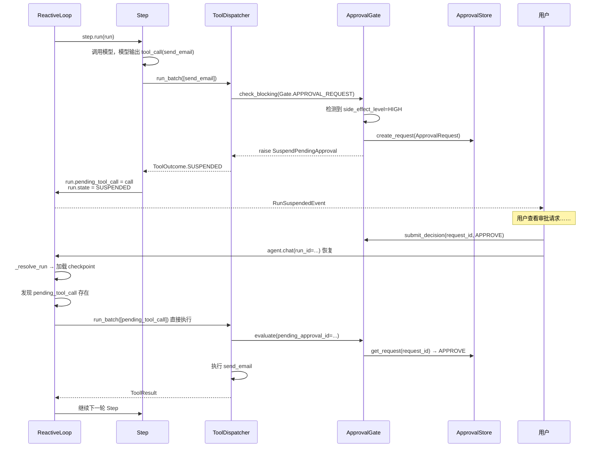

# 第 9 章 · 审批：不可逆动作的门
> 阅读时间约 50 分钟。本章讲人机协作的完整闭环：挂起、等待、决定、恢复。
>
> 本章主线一句话：**自主和安全的平衡点，是把门开在"不可逆程度"上——只读放行、高危挂起；而真正难设计的不是"批准"，是"拒绝之后怎么办"，答案是把拒绝变成给模型的反馈，而不是给运行判死刑。**

本章前置：第 5 章的副作用分级（HIGH 级工具挂起等审的那句话）、第 7 章的 SUSPENDED 恢复（"直接执行不重问模型"的三条理由先记着，本章从审批的视角把它讲完整）、第 8 章的增量重规划（拒绝后的处理和它是同一个理念）。

---

## 9.1 问题：自主与安全之间的门往哪开

Agent 的价值在自主，麻烦也在自主。如果它可以不经确认执行任何操作，迟早会出事：发错邮件、删错数据、下错单。但如果每个操作都要人点头，Agent 就退化成需要全程照看的宏录制（宏录制：把人的鼠标键盘操作录下来回放的工具——它能替你重复动作，但不能替你做任何决定），自主性归零。

两全的办法是把门开在正确的地方：不是按"操作是不是工具"来拦（那就全拦了），而是按**不可逆程度**来拦。第 5 章的副作用分级在这里兑现——只读和低危操作直接放行，HIGH 级别的动作（发邮件、下单、删数据）执行前挂起，等人确认。门的数量很少，但每一扇都开在悬崖边上。这个安排的隐含账本也值得看一眼：拦得少，人就不会被审批疲劳磨成"见单就点同意"的橡皮图章——每一张审批单都稀罕，人才会认真看。

这一章要讲清楚的是门之后的世界：挂起到底意味着什么、等待是怎么实现的（提示：不是进程傻等）、批准之后发生什么、拒绝之后发生什么。拒绝比批准难设计得多，先说结论：框架的选择是把拒绝当成给模型的反馈，而不是给运行的死刑。

---

## 9.2 挂起：一次合法的暂停

模型这一轮请求调用 `send_email`——一个 HIGH 级工具。从这一刻到恢复续跑，完整时序如下：



逐段读。**上半场是挂起。**调度管线在执行前遇到审批门，门检查副作用等级，确认需要审批，于是创建一张审批单（记下工具名、参数、一段人类可读的上下文摘要）持久化到审批存储，然后抛出专门的异常 `SuspendPendingApproval`。这个异常一路传到循环层，翻译成一次状态转移：待执行的调用存进 `run.pending_tool_call`，运行状态走第 3 章的单咽喉转成 SUSPENDED，对外发出 `RunSuspendedEvent`——消费事件的人收到明确信号：运行暂停了，在等一张编号为某某的审批单。

**下半场是恢复。**用户提交决定后，带着原来的 `run_id` 再次调用，循环从检查点加载运行，发现有待执行的挂起调用，直接送进调度管线；审批门凭当初的审批单号查到已批准的决定，放行，工具执行，运行续跑。

注意这里面没有一个环节是"等待"。挂起之后，进程该干什么干什么——可以服务别的请求、可以退出。审批单已经持久化，决定可以十分钟后、也可以明天来。这是多副本部署（同一服务同时跑多个实例、分担请求的部署方式）的关键契约：节点 A 挂起运行并写下审批单；用户在任何节点 B 上查看并提交决定；之后任何从检查点恢复这个运行的节点（不必是 A），通过审批存储读到决定，继续执行。没有任何进程持有阻塞的等待——**恢复由重新调用驱动，而不是由通知驱动**。这条设计让审批的等待时长和进程的生命周期彻底解耦：等一天和等一秒，机制上没有任何区别。

审批单的存取是一个端口（第 1 章讲过的 Protocol 插座）：

```python
@runtime_checkable
class ApprovalStore(Protocol):
    async def create_request(self, req: ApprovalRequest) -> None:
        """持久化新的待审批请求。对 request_id 幂等。"""
        ...

    async def get_request(self, request_id: str) -> ApprovalRequest | None:
        """返回请求，或 None。已决定的请求携带 decision 字段。"""
        ...

    async def submit_decision(self, request_id: str,
                              decision: ApprovalDecision,
                              approver_id: str = "") -> None:
        """记录审批决定。幂等：重复提交以最后一次为准。"""
        ...
```

三个方法的注释里都写着幂等，这不是口头禅。审批是人和系统的交界，人的操作天然会重复（点了两次按钮、换了台设备重新提交）：创建对单号幂等，重复提交以最后一次为准——边界的每一边都不知道对方会重试几次，幂等是两边唯一的握手方式。第 7 章的工具幂等键防的是崩溃重放，这里的幂等防的是人为重复，同一门手艺的两个用场。

---

## 9.3 批准：执行当初展示的那一个调用

批准后的恢复，第 7 章从恢复系统的角度讲过三条理由，现在从审批的角度再走一遍，因为它还有一个更根本的面向：**用户审批的是一个具体的对象**。

审批单上写着工具名和参数，用户看着这份参数拍了板。恢复时如果重新问一次模型，哪怕得到的调用"差不多"，也已经不是用户批准的那一个了——参数换一个词，语义可能就变了。所以恢复逻辑取出 `run.pending_tool_call`，直接交给调度管线执行；审批门通过当初的 `pending_approval_id` 查到已批准的决定，放行。从拍板到执行，对象没有换过，一个字节都没有差。

这个设计把一个容易忽略的原则摆上了台面：**审批的粒度是调用，不是意图**。系统不猜"用户想干什么"，它只保证"用户看到的那次调用就是执行的那次调用"。猜意图的系统总有一天会猜错，而且错了都没法追责——因为执行的命令和展示的命令不是同一个。

---

## 9.4 拒绝：反馈，不是死刑

批准的故事讲完了，拒绝才是本章真正精彩的部分。

容易想到的拒绝处理有两种，都不好。一种是抛异常终止运行——一被拒就死，Agent 变成一碰就碎的瓷器。另一种是悄悄跳过这个工具继续跑——表面宽容，实际危险：模型不知道自己的请求被拒了，下一轮可能原样再请求，陷入"请求-被拒-再请求"的循环。

框架的第三种做法：把拒绝的原因作为一个工具结果写回消息历史，运行保持 RUNNING，进入下一轮。模型看到的是一段诚实且具体的反馈——"这个操作被人工拒绝了，原因是：收件人域名不在白名单"。接下来模型自己决策：换个措辞重写邮件、改用站内信、或者认识到此路不通后放弃这条路径。注意模型拿到的不只是"不行"，还有"为什么不行"——原因文本是人写的，往往直接指向出路。

这个设计和第 8 章的增量重规划是同一个理念的两副面孔：失败不是终点，是调整的信号。PLAN_FIRST 里失败的步骤触发局部改图，REACTIVE 里被拒的调用变成对话里的一条反馈。两种模式共享的内核里，藏着同一条世界观：**Agent 的环境必然会说"不"，成熟的设计让"不"成为信息，而不是成为终止符。**这和第 5 章"错误是反馈、不是异常"也是同一门手艺的第三次现身——工具报错、计划失败、审批被拒，系统的反应都是把它变成下一轮能读懂的输入。

---

## 9.5 审批与权限：两道串联的门

还剩一个容易混淆的概念要拆开：权限（第 5 章管道里的 Gate 检查）和本章的审批，名字里都带"检查"，实则是两种不同的门。

权限回答的是"这个 Agent **能不能**做这类操作"——它是角色层面的静态规则，比如"只读 Agent 不许调用写工具"，判断不需要人，越权直接拦截，结果不可恢复。审批回答的是"这个人**同不同意**这一次具体操作"——它是实例层面的动态决定，必须等人，拒绝之后还有重规划的活路。类比：权限是"这位员工有没有财务系统的访问权"，审批是"这笔十万的付款经理签不签"。

两道门是串联的：先过权限，再过审批。权限不够的操作直接被拦，连审批单都不会产生——让人去审批一件本来就越权的事，是对人时间的浪费。实现上，两者都挂在内核事件总线的**否决通道**上——第 1 章那张能力表里提过总线有 fire（观察）/ check（拦截）/ collect（收集）三种协议，否决通道就是其中的拦截协议：机制走到挂载点时依次询问每个挂载的检查器，任何一个说"不"就当场短路、拒绝放行。权限和审批挂的是这条通道上两个不同的挂载点（工具调用点、审批请求点），挂载代码就三行：

```python
from prodagent.hooks.approval.gate import ApprovalGate
from prodagent.kernel.bus import Gate

gate = ApprovalGate(store=my_approval_store)
hooks.register_checker(Gate.APPROVAL_REQUEST, gate.evaluate)
```

审批门由生产配置自动挂载，裸核不挂——和第 1 章墨盒清单里的一致。

### 代码定位

| 内容 | 源码位置 |
|------|---------|
| 审批门 ApprovalGate | `hooks/approval/gate.py` |
| 审批上下文格式化 | `hooks/approval/formatter.py` |
| ApprovalStore 端口与数据 | `ports/observability.py` |
| 挂起/恢复逻辑 | `kernel/loop.py` / `tooling/dispatcher.py` |
| SuspendPendingApproval 异常 | `base/errors.py` |
| 事件总线与三种协议 | `kernel/bus.py` |

---

## 动手环节

练习 1：找到那扇门。审批门的实现在 `src/prodagent/hooks/approval/gate.py`，打开它，找到两样东西：检测到 HIGH 副作用后创建审批单的代码，和抛出 `SuspendPendingApproval` 的那一行。顺着异常的名字 grep 它被谁接住——你会看到 9.2 节时序的代码形态。

练习 2：读一个完整的挂起-恢复测试。运行 `ls tests/approval`，挑一个名字里带 resume 或 suspend 的测试跑通并精读。注意测试怎么用剧本（第 2 章的 `script()`）让模型请求一个 HIGH 工具、怎么手动提交批准决定、怎么再次调用后断言"执行的就是当初挂起的那个调用"。一个测试文件就是一次完整的审批话剧，剧本、演员、谢幕断言俱全。

---

## 下一章

单个 Agent 的故事到本章告一段落：大脑、心跳、预算、手、认知、档案库、复活术、规划、审批，九大件齐了。但世上还有一类任务不是一个角色能包办的——调研、写作、审核各有专长。下一章进入下半场：多 Agent 协作，消息怎么不丢不重不乱序地跨 Agent 传递，五种协作拓扑怎么搭。

→ [第 10 章 · 多 Agent 协作](ch10.md)
