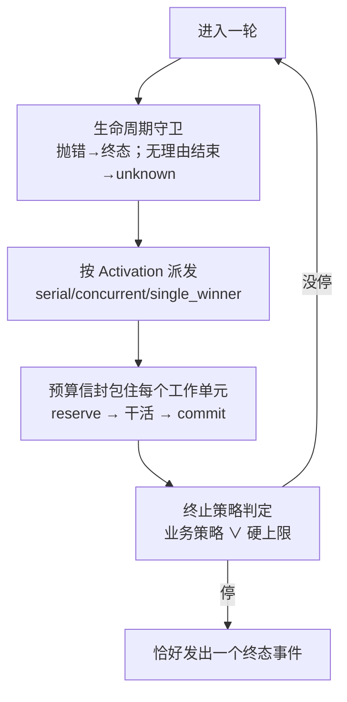
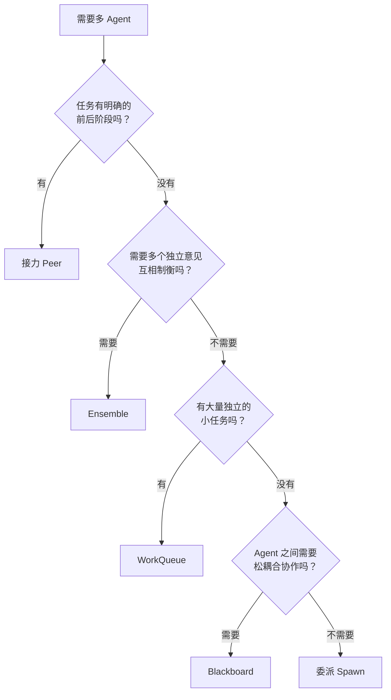
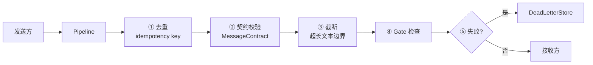
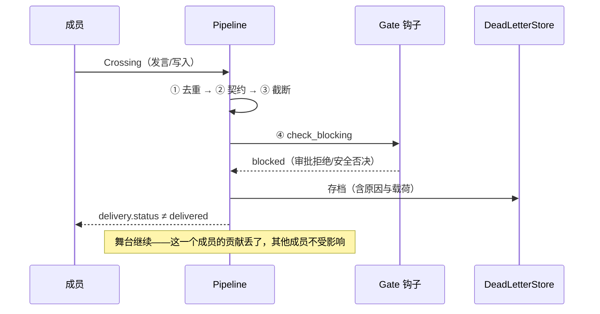
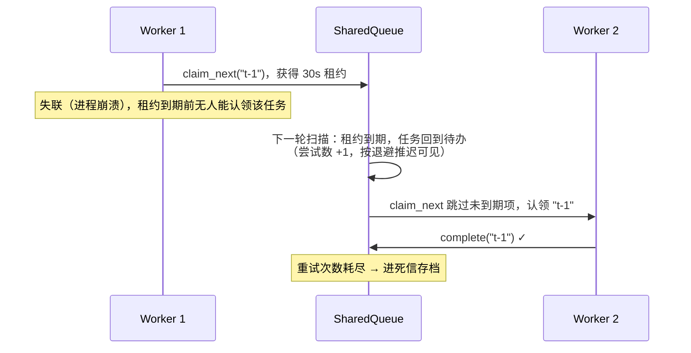

# 第 10 章 · 多 Agent 协作
> 阅读时间约 45 分钟。本章讲五种协作原语和统一消息平面，插曲补一块分布式基础：消息的三种失败。
>
> 本章主线一句话：**能不拆就不拆；真要拆，就把"协作语义"和"执行位置"彻底分开——五种拓扑只是"共享状态 × 激活策略"这张设计空间表里的五个格点，而所有跨 Agent 的消息都走同一条五段管道，在唯一的地方把"丢、重、乱"解决一次。**

本章前置：第 4 章的 BudgetLedger（多 Agent 的账在这里汇合）、第 7 章的幂等思想、第 9 章的 Gate 一笔带过的权限检查。上半场（第 2–9 章）的主角是单个 Agent，下半场开始，舞台变大。

---

## 10.1 第一个问题：什么时候该拆多 Agent

答案朴素得近乎扫兴：能不拆就不拆。

多 Agent 的成本清单不长，但每一条都实打实。更贵——多个 Agent 各自消耗 token。更慢——成员之间要通信、要互相等待。更难调试——出了问题，先要弄清是哪个 Agent 的错、消息在哪一环丢的。还有一类单 Agent 没有的新病：互相推诿的死循环，A 说这事归 B，B 说这事归 A，球在天上踢来踢去谁也不落地。

所以拆分要有过硬的理由，通常四选一：需要不同的专业能力（研究员、写手、审核员各司其职）；需要并行加速（同时查五个数据源）；需要互相制衡（多个意见投票或评审）；任务天然是流水线（A 的产出是 B 的原料）。**单 Agent 加上好的上下文管理（第 6 章）能搞定的事，就不要拆**——简单、便宜、好调试是真实的工程优点，不是妥协。

---

## 10.2 五种原语，和一张设计空间的地图

确定要拆之后，框架给的不是一种拓扑，而是五种可组合的原语。先一个一个看，再看它们在一张地图上的关系。

**委派（spawn）**：父 Agent 是项目经理，把子任务派给专家执行，专家完成后交报告。配置上给父 Agent 挂一个子 Agent 列表，框架自动生成 `spawn_<名字>` 工具，模型在对话中自己决定何时委派。子 Agent 有独立的消息历史和工具集，花销通过第 4 章的共享账本记入父账，审批可以传播到父那里统一处理（第 9 章的门在组织里继续有效）。

**接力（peer）**：流水线。每个 Agent 配置可交接的同侪列表，框架生成 `handoff_to_<名字>` 工具；A 调研完交接给写手，写手写完交接给审核。交接的是一张结构化的包裹（任务描述、引用句柄），当前 Agent 的运行以完成告终，下一个带着包裹继续。

**合议（ensemble）**：多个 Agent 共享一个 Floor（发言记录），围绕同一话题轮流发言。发言顺序有三种策略：轮流（RoundRobin）、主持人点名（Moderated，一个 picker 函数决定下一个发言者）、自由抢发（FreeForAll，每轮全员并发）。终止由策略决定：硬上限（最多几轮）加可选的业务条件（比如达成共识）。

**黑板（blackboard）**：一块版本化的共享黑板，每个专家绑定一个写入键；触发器声明"哪些键变化时激活哪些专家"——研究键写入触发写手，草稿键写入触发审核。触发有两种模式：事件式（所有匹配的专家并发执行）和抢答式（buzz_in，通过锁竞争只有一个执行）。写入走乐观并发，冲突可以配置"重读黑板、重算、重写"的重试，重试耗尽进死信。

**工作队列（work_queue）**：大量独立任务，多个工人并行处理。工人从队列领任务（领取即获得一个有时限的租约），完成销账，失败退回队列等待重试（带指数退避）；租约到期的任务视为工人已死，自动回收重新分发。

### 一张地图，和一个造新格子的方法

五种原语摆在一起，隐约有个结构，框架把它画成了显式的二维表：行是成员共享什么状态（无 / 追加式发言记录 / 版本化键值 / 租约队列），列是激活策略（一次性 / 链式 / 轮流 / 主持选人 / 并发扇出 / 抢答 / 拉取消费）。五个已实现的原语就是这张表上的五个格点，而空格的含义同样重要——没人需要的组合就不实现，等有人要了再说。

这张表的真正礼物是它给出了"造第六种拓扑"的标准姿势：拿一个现成的状态存储，配一个现成的激活策略，写一个几十行的驱动器子类。仓库的测试里就有一个例子——用黑板存储加轮流发言组装出一个"评审循环"（作者写稿、评审轮流改），五种原语都不覆盖它，但全部零件都是现成的，零新机械。

### 一套台基：被刻意下沉的公共机械

三种舞台形态差这么多，代码却整齐，秘密在公共机械的分层下沉。先看两个横向抽象。

第一个回答"这轮谁上、怎么上"，答案是一张统一的排班单：

```python
@dataclass(frozen=True)
class Activation:
    members: list[str]          # 这轮谁上
    dispatch: "serial" | "concurrent" | "single_winner"
    round_num: int = 0          # 第几轮
    label: str = ""             # 为什么叫他们（触发器名、顺序名，日志用）
```

三种派发方式各有主人：逐个按序（轮流发言、主持人点名），全体并发结果按成员序收集（自由抢发、黑板触发扇出、队列认领竞争），全体竞争只有一个执行、其余零开销（黑板抢答）。解释这张单子的代码全仓库只有一处——舞台驱动器的派发方法，并发批的快速失败取消、抢答的先抢锁再干活，都只写一遍。

第二个回答"何时散场"。终止永远是组合式的：一个硬上限（最多几轮——无人值守也保证会停）配一个可选的业务策略。内置三种业务策略：全员通过（上一轮大家全部说"没话说"，讨论自然收敛）、板面达标（谓词对黑板成立，产物够了）、队列排空（没有待办也没有在办，活干完了）。两者是"或"的关系，同时触发时业务原因优先上报——"讨论收敛"比"到轮数上限"信息量大。

有了排班和终止，三种舞台跑起来就是同一套生命周期骨架：



骨架由舞台驱动器一次实现：守卫、派发、终止判定、预算信封、崩溃后"恢复还是新开"的判断。三个舞台各自提供的只是**不同的一小块**——一轮具体干什么（合议挑发言者、黑板配触发器、队列扫租约）和为什么停。用设计模式的词汇说：骨架用模板方法固定，变化点用策略对象插拔。模块注释里有一条很成熟的克制：轮体和停止原因故意留在子类，强行统一会抹掉真实的语义差异——**把"形似而神不同"的东西硬合并，只会得到一个充满类型分支的伪复用**。由此得出一条可以带走的判据：抽走所有人以相同方式需要的东西，留下每个人以不同方式需要的东西；前者叫基础设施，后者叫语义。

共享的状态底座也分两层。最窄的读侧契约只要求数轮次、打快照、算活性指纹；在此之上，发言记录用追加式的单写者存储（天然不需要锁，轮次从发言数直接推出来），板面和队列用带锁带显式轮次的存储（每轮要并发扇出多个工人），需要崩溃恢复的再横向混入事件溯源（每次变更追加一条日志，复用第 7 章的乐观尾序号）——混入是一种不进继承主干、只叠加一小撮能力的手法，谁要耐久谁混入，比把持久化塞进基类灵活。最后还有收场的纪律：一条运行链无论中间经历什么，结束那一刻要做的事是固定的——校验结构化输出、把结果送回调用方、落检查点、跑完成门禁、发终态事件——这些"只发生一次且必须发生一次"的动作收进一个结算器，各驱动器不必各自记得收尾，也就不会出现"某条路径忘了落盘"的漏洞。

一句话总结这层设计：驱动器固定流程骨架，状态家族固定底座，结算器固定收场，"谁上、怎么停、一轮干什么"以策略和子类留下。你要新增第四种玩法（比如让一个 LLM 当主持人），要写的只是填空，而不是再抄一遍轮循环、预算和收尾——**好的抽象让新增变成填空题，而不是抄一遍问答题**。

### 模型自己开会

还有一种用法把舞台交到模型手里：把带名字的舞台声明挂在 Agent 配置上，框架自动生成工具，模型自己决定什么时候开会、什么时候派活——和调用委派工具是同一种体验。模型调用"开个合议"工具，成员在共享发言记录上轮流表态，完整记录作为工具结果返回；调用"跑个队列"工具，工人按租约认领，完成清单返回。规则简单：声明有名字才可调用（名字就是工具的句柄）。于是"开会"本身成了一种模型可调度的能力——附录示例地图里的 council 演的就是这一手。

最后，选型也有一棵决策树：



---

## 10.3 插曲：消息的三种失败

多个 Agent 通信，本质上是在做分布式系统里最古老的那些事。网络不可靠的后果归结为三种：消息丢了（发出去没到）、消息重了（到了两次）、消息乱了（后发的先到）。补一小节基础，把每种失败的原因和标准解法讲清楚。

**重复**几乎是注定的。发送方发出一条消息，等回音没等到，超时重发——但第一条其实到了，只是回音慢。于是接收方看到两条一样的消息。注意发送方的行为完全正确：不重发，就要承受真丢消息的后果。这个两难的学名是：网络不给"恰好一次"的承诺，只给"至少一次"（重发直到确认）或"至多一次"（发一次不管）二选一。工程上的标准答案是选"至少一次"，然后让**接收方去重**——每条消息带一个稳定的编号，接收方记住见过的编号，重复的标记后丢弃。你在第 7 章（工具幂等键）、第 9 章（审批单幂等）已经两次见过这个模式，现在是第三次：同一个问题的答案总是同一个。

**丢失**的解法不是"让网络不丢"，而是不丢尸体。处理失败的消息不蒸发，进**死信队列**——一个专门存放"处理不了的消息"的地方，等着人工排查或程序重放。死信保住的是可追查性：失败没有被吞掉，只是被搁置。

**乱序**要分情况。有些场合顺序无所谓（三个独立查询），有些场合顺序就是语义（先扣款后发货）。要顺序时的标准做法是给消息编号，接收方按编号重排；编号谁发？单一权威发（第 7 章日志的"存储盖章"）。框架的多 Agent 场景里，Floor 的发言记录天然有序（追加式），黑板靠版本号，队列靠租约——第 7 章的单调序思想在每种状态存储里的具体化。

---

## 10.4 统一消息平面：一条五段管道

上面三种失败的解法，框架没有散落在各处，而是收进一条所有跨 Agent 消息都要过的管道。每条消息装进统一格式的信封（携带方向、类别、收发双方、载荷、追踪号），依次过五道闸：



为什么所有拓扑共用一条管道？因为"不丢不重不乱序"是所有多 Agent 系统的共同需求，在一个地方解决一次，比在五种拓扑里各写一遍可靠。

第一道去重，凭消息编号识别重复，重复的标记后不再处理——网络重试的代价到此为止。第二道契约校验，消息必须符合预定义的格式契约，格式错误的直接拒绝——版本不兼容的坏消息不进入处理流。第三道截断，自由文本字段有长度上限，一个话痨成员不能撑爆其他成员的上下文（第 6 章的教训在组织间的应用）。第四道 Gate，权限检查，越权的交接被拦截。这道 Gate 不是消息管道独有的——框架在九个拦截点上都挂着同一个机制：工具调用、计划审批、Agent 交接、子 Agent 派生……一处实现，处处生效，和第 5 章的调度管线、第 9 章的审批门共享同一条 VETO 通道。第五道是死信：任何一道上失败的消息，进入死信存储，不阻塞后续消息的流动。

比清单更值得学的是管道之上的三个决定。

第一个决定：**闸门的顺序本身就是契约**。去重必须最先——重放不是过错（10.3 讲过，重试是正确行为），让后面的闸门在重放消息上空跑一遍是浪费；Gate 必须排在契约之后——安全检查应该看到已经过验证的形状，而不是替校验器兜底；审计必须最后——它记录的是确实越过了边界的东西，而不是试图越过的东西。一句话总结这个道理：管道里每一段的位置，都是它对其他段落的一组假设。

第二个决定：**机制与策略分离**。五道闸全是机械的：去重看编号、契约看字段、Gate 调总线——没有一段对消息内容做判断。语义策略（注入什么规则、怎么脱敏）挂在两个开放槽位上，由应用注入。框架交付机制，应用交付立场；把两者焊死，用户要么全盘接受框架的价值观，要么 fork。

第三个决定：**白名单靠构造，不靠清洗**。跨边界传递的交接包裹里有任务描述、硬约束、授权工具、引用句柄——唯独没有发送方的对话历史。下游能看到什么，由这个包裹**有哪些字段**决定，而不是由过滤掉了哪些内容决定。清洗是泄漏发生后的补救，构造让泄漏无从发生：一个不存在的字段，比一个被过滤的字段安全得多。这条原则在安全设计里的分量，值得你抄在笔记本上。

### 异常路径：两条最值得记住的时序

正常流程看组件图就够，出事的时候要看时序。两条最常被问的。

第一条：一条消息被 Gate 拒了会怎样？



第二条：工人领了任务后崩溃会怎样？



两条时序的共同点是本章最重要的一条不变量：**失败被隔离在单条消息、单个成员，舞台不死**。仓库里每个舞台的死信与准入测试套件，钉的就是这条。

---

## 10.5 激活的抽象：协作原语不感知位置

本章还有一个横向的抽象把五种原语缝在一起，单独指给你看：所有"让一个 Agent 干活"的动作——spawn 一个子 Agent、让一个成员发言、让一个工人领任务——在代码里都是同一个调用，一次**激活**（`RunnerPort.activate()`）。激活的入参只带可序列化的字段：哪个 Agent、什么任务、哪个运行、挂哪个账本。至于这个 Agent 在本进程执行还是在另一台机器上执行，由端口的实现决定，协作原语完全不感知。

这是端口思想在组织层的最后一击：协作的语义（谁跟谁、什么顺序、共享什么）和执行的物理（哪里跑、怎么通信）被彻底分开。想从单机搬上集群，换一个端口实现，五种原语一行不改。

激活还有一条配套机制处理"家产继承"：一个 Agent 派生子 Agent 或交接给同侪时，孩子需要继承父亲的一部分资源——预算上限、共享账本、检查点存储、事件日志、当前深度。装这份家产的对象刻意只携带**子集**：带下去的是 fork 出去的孩子真正需要的；父亲自己这一跳的状态（当前任务、run 号）不带，那是父亲自己的事。孩子共享必要的资源（所以预算才能全局汇总），又不继承父亲的临时状态，边界清清楚楚。与此配套，接力的实现不是函数递归调用——当前这一跳结束，驱动器拿着下一跳的描述再开一跳；正因为一跳是一个干净的边界，检查点才能落在跳与跳之间，崩溃恢复和预算结算才有明确的着力点。

---

## 10.6 治理：防甩锅、防越权、防打转

组织建起来后，三类故障会找上门：互相甩锅的死循环（A 说做不了推给 B，B 又推回 A）、越权操作（Agent 碰了不该碰的东西）、通信的丢重乱（10.3 和 10.4 已经解决）。前两类需要专门的治理设计。

防越权的机制是 Gate 检查器。框架不内建角色权限系统，而是在总线的 VETO 通道上提供通用拦截：你写一个检查函数，注册到某个拦截点，返回"拦截"就挡下。一个财务域的权限检查器长这样：

```python
from prodagent.kernel.bus import Gate, BlockingResult

async def my_auth_checker(call, tool, run):
    """工具调用前的权限检查。返回 BlockingResult(blocked=True) 拦截。"""
    if tool.meta.domain == "finance" and run.agent_name != "accountant":
        return BlockingResult(
            blocked=True,
            reason=f"Agent '{run.agent_name}' 不允许调用财务工具 {call.name}",
        )
    return BlockingResult(blocked=False)

hooks.register_checker(Gate.TOOL_CALL, my_auth_checker)
```

拦截点不止工具调用一处，全框架一共九个，覆盖运行的关键断面：

| Gate | 拦截时机 |
|------|---------|
| `TOOL_CALL` | 工具执行前 |
| `PLAN_APPROVAL` | 计划审批 |
| `SESSION_START` | 会话启动 |
| `CONTEXT_BUILD` | 上下文组装 |
| `TOOL_RESULT` | 工具结果返回后 |
| `RUN_COMPLETE` | Run 完成前 |
| `APPROVAL_REQUEST` | 审批请求（HIGH 副作用工具，第 9 章） |
| `AGENT_HANDOFF` | Agent 间交接（spawn/peer） |
| `DOCUMENT_ADD` | 文档写入记忆前 |

被拦截的调用不抛异常，而是返回一个结构化的"被拦截"结果——模型看到拦截原因后可以自己调整（换工具或放弃），和第 5 章"错误是反馈"一脉相承；同时每次拦截都经事件总线留痕，可审计。检查器本身抛异常时默认按拦截处理（fail-closed）——安全检查宁可错杀。

防打转的机制则是**五层兜底**，这个分层视图要整表记住，因为它把前面散在各章的防线收成了一张全景：

| 层级 | 机制 | 出处 |
|------|------|------|
| ① 预算硬上限 | 钱花完了必须停，最后一道防线 | 第 4 章 |
| ② 终止策略 | 合议的轮数上限、黑板的完成判断、队列的排空 | 本章 10.2 |
| ③ 消息去重 | 相同消息不循环——甩锅的球被编号认出 | 本章 10.4 |
| ④ 无进展检测 | 黑板/队列发现一轮下来指纹没变，主动终止 | 本章 10.2 |
| ⑤ 进度守卫 | 单 Agent 内的重复调用模式检测 | 第 3 章 |

设计哲学一句话：不依赖任何单一机制防死循环，每层都假设上面的层可能失效。纵深防御在安全领域是老话，在这里同样成立——A 推给 B、B 推回 A 的球，最快在第三层（消息去重认出重复）就该被拦下，就算漏过去，还有第四层第五层，最不济第一层的钱袋子永远守底。

### 代码定位

| 内容 | 源码位置 |
|------|---------|
| 委派 / 接力 | `coordination/spawn.py` / `peer.py` |
| 合议 / 黑板 / 队列 | `coordination/ensemble.py` / `blackboard.py` / `work_queue.py` |
| 舞台机械（派发/终止/耐久）与舞台工具 | `coordination/infra/stage.py` / `stage_tools.py` |
| 共享状态契约 + 事件溯源样板 | `coordination/infra/store.py` |
| 链终态纪律 Settler | `coordination/infra/settle.py` |
| 统一消息平面（Crossing 管道） | `coordination/messaging/` |
| 激活排班 / 激活端口 / AgentSpec | `ports/activation.py` / `runner.py` / `agent_spec.py` |
| 自定义拓扑组装证明 | `tests/runtime/test_composition_custom_topology.py` |

顺带一条目录规则：协作层顶层一个协作方式一个文件（规格、共享状态、驱动、成员适配全在一起），机械沉在 `infra/`，消息平面自成 `messaging/`——切分即语义。

---

## 动手环节

练习 1：开一场三人评审会。用三个假模型剧本（第 2 章的 `RoutingFakeLLM`，给三个成员各配一段发言），照 10.2 节合议的样子搭一个三轮的 Ensemble，用 `ensemble_stream` 收事件打印每个发言。跑通后把发言顺序从轮流换成自由抢发，观察事件流的形状变化。

练习 2：找到管道的闸门。运行 `ls src/prodagent/coordination/messaging/`，打开信封和管道所在的文件，找到去重拦截器——确认它判断的依据就是消息编号，并且重复消息的处置是"标记后放行到旁路"而不是"丢弃不留痕"。

---

## 下一章

组织建起来了，还缺一双看得见内部的眼睛：一次运行里发生了什么、每个成员干了什么、钱花在了哪一步。下一章讲可观测——追踪、事件、审计的完整视图，并回答一个问题：为什么第 12 章的"回放"不能只靠日志。

→ [第 11 章 · 可观测：运行不再黑箱](ch11.md)
