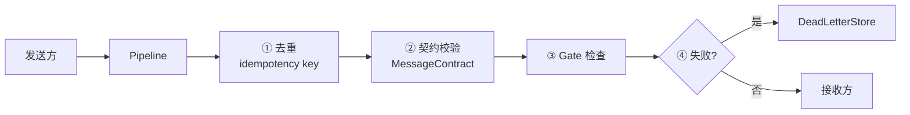

# 第 10 章 · 多 Agent 协作

> 阅读时间约 70 分钟。本章讲三种协作原语、一条治理管道和一个激活端口——用最少的原语覆盖业界已知的全部协作模式。
>
> 本章主线一句话：**能不拆就不拆；真要拆，原语要少到能全部装进脑子、又足够覆盖已知的每一种协作模式——三个原语映射五个业界模式，消息过一条治理管道，激活走一个端口，这是"协作语义"和"执行位置"的彻底分离。**

本章前置：第 4 章的 BudgetLedger（多 Agent 的账在这里汇合）、第 7 章的幂等思想、第 9 章的 Gate 一笔带过的权限检查。上半场（第 2–9 章）的主角是单个 Agent，下半场开始，循环变大。先释两个本章反复用的词：**拓扑**（topology）指成员之间"谁连谁、怎么协作"的结构形状；**原语**（primitive）指可组合的基础构件——像乐高的基础块，几种块能搭出很多种造型。

---

## 10.1 第一个问题：什么时候该拆多 Agent

答案朴素得近乎扫兴：能不拆就不拆。

多 Agent 的成本清单不长，但每一条都实打实。更贵——多个 Agent 各自消耗 token。更慢——成员之间要通信、要互相等待。更难调试——出了问题，先要弄清是哪个 Agent 的错、消息在哪一环丢的。还有一类单 Agent 没有的新病：互相推诿的死循环，A 说这事归 B，B 说这事归 A，球在天上踢来踢去谁也不落地。

所以拆分要有过硬的理由，通常四选一：需要不同的专业能力（研究员、写手、审核员各司其职）；需要并行加速（同时查五个数据源）；需要互相制衡（多个意见投票或评审）；任务天然是流水线（A 的产出是 B 的原料）。**单 Agent 加上好的上下文管理（第 6 章）能搞定的事，就不要拆**——简单、便宜、好调试是真实的工程优点，不是妥协。

还有一条反面教训值得单独说：如果发现自己在纠结"选哪种协作模式听起来更酷"，多半已经走偏了。Anthropic 在他们的多智能体协调指南里把这个陷阱讲得很清楚——**让协调的复杂度超过任务本身的复杂度，是事倍功半的经典配方**。正确的顺序是：从最简单的能解决问题的模式开始，跑起来，观察瓶颈在哪里，再逐步向更复杂的模式演进。本章的三种原语就是按这个顺序排列的。

---

## 10.2 三种原语，和五张地图

确定要拆之后，框架给的不是五种拓扑，而是三种。数字缩小的原因不是偷工减料，而是经过一轮认真的合并：之前有五种（委派、接力、合议、黑板、队列），后来发现**队列是黑板的一种触发器策略**（"有新任务就认领"和"某个键变了就运行"是同一件事的两种表述），合议则是"围绕一个话题轮流发言"的特化场景——它可以用黑板上的一个"发言记录"键加轮流策略组装出来，不值得独立占一个文件。砍掉的是重复，留下的是正交。

先一个一个看这三种原语，然后把它们摆到业界已知的五种协作模式上，你会发现三个点覆盖了全部五张地图。

**委派（spawn）**——Anthropic 叫它**编排器-子智能体**（orchestrator-subagent），也是他们推荐的起点。父 Agent 是项目经理，把子任务派给专家执行，专家完成后交报告。配置上给父 Agent 挂一个子 Agent 列表，框架自动生成 `spawn_<名字>` 工具，模型在对话中自己决定何时委派。子 Agent 有独立的消息历史和工具集，花销通过第 4 章的共享账本记入父账，审批可以传播到父那里统一处理（第 9 章的门在组织里继续有效）。

Claude Code 就是这个模式的日常形态：主 Agent 自己编码，同时在后台派发"搜索代码库"、"调查这个独立问题"等子任务，异步回收结果。它的关键特征是**子任务是临时的、有界的**——做完就散，不维持长期状态。

**接力（peer）**——流水线。每个 Agent 配置可交接的同侪列表，框架生成 `handoff_to_<名字>` 工具；A 调研完交接给写手，写手写完交接给审核。交接的是一张结构化的包裹（任务描述、引用句柄），当前 Agent 的运行以完成告终，下一个带着包裹继续。

接力本质上是一种**定向传递**：A 明确知道下一个是谁，控制权像接力棒一样沿链条传递。它不是消息总线（没有广播、没有订阅），而是"我知道这事该交给谁"的点对点治理。

**黑板（blackboard）**——一块版本化的共享黑板，每个专家绑定一个写入键；触发器声明"哪些键变化时激活哪些专家"——研究键写入触发写手，草稿键写入触发审核。触发有两种模式：事件式（所有匹配的专家并发执行）和抢答式（buzz_in，通过锁竞争只有一个执行）。写入走乐观并发，冲突可以配置"重读黑板、重算、重写"的重试，重试耗尽进死信。

黑板是三种原语中最重的一个，也是覆盖面最广的一个。Anthropic 的分类里**共享状态**（shared state，多个 Agent 直接读写同一个持久存储，实时看到彼此的发现）和**智能体团队**（agent team，一组持久化的 Agent 从共享任务队列里认领工作，在多次任务间保持激活状态）两种模式，黑板都能覆盖——前者是"事件触发"的黑板，后者是"有新任务就认领"的黑板（触发器盯着"待办"键，工人往"完成"键写）。之前独立存在的队列原语（租约认领、超时回收、死信退避）不删掉任何语义，全部由黑板配合适当的触发器和写入策略实现。

### 三个点，五张地图

现在把三种原语摆到 Anthropic 归纳的五种协作模式上：

| Anthropic 模式 | 什么意思 | 我们的覆盖 |
|---|---|---|
| 生成器-验证器 | 一个生成、一个检验，循环直到达标 | 委派（父 Agent 是验证器） |
| 编排器-子智能体 | 领导分发子任务、汇总结果 | **委派**（模式一对应） |
| 智能体团队 | 持久工人从队列认领工作 | **黑板**（触发器盯着待办键） |
| 消息总线 | 发布-订阅，事件驱动 | 接力（点对点）+ 治理管道 |
| 共享状态 | 所有 Agent 读写同一个存储 | **黑板**（事件触发） |

三个点覆盖五个模式，没有一个模式需要"再发明一种原语"才能表达。这张表的价值不在于"我们也有"，在于**选型逻辑**——遇到一个多 Agent 需求时，沿着表走一遍就够：

首先问：任务有没有明确的质量标准可以程序化验证？有 → 委派（父端验证）。其次：任务能不能拆成独立子任务？能 → 委派（模式二的推荐起点）；子任务长且多步 → 黑板（持久工人）。再次：Agent 之间是否需要实时共享发现？需要 → 黑板。不需要 → 接力（沿链条传递）。

### 底层的共用代码

黑板是本章唯一的"循环型"原语（有轮循环、有共享状态、有终止判定），所以共用代码的分层只围绕它讲，但结论对所有原语适用。

第一个抽象回答"这轮谁上、怎么上"——一张统一的调度表。派发方式三种：逐个按序（轮流写入）、全体并发（触发扇出）、抢答竞争（只有一个执行）。解释这张单子的代码全仓库只有一处——循环驱动器的派发方法。

终止永远是组合式的：一个硬上限（最多几轮——无人值守也保证会停）配一个可选的业务策略。内置业务策略：板面达标（谓词对黑板成立，产物够了）、全员通过（上一轮大家全部说"没话说"，讨论自然收敛）。两者是"或"的关系，同时触发时业务原因优先上报——"讨论收敛"比"到轮数上限"信息量大。

有了调度和终止，循环跑起来就是一套循环骨架：守卫 → 派发 → 预算信封 → 终止判定 → 没停就再来一轮。骨架由循环驱动器一次实现，黑板子类只需要填"一轮具体干什么"和"什么时候算完"这两个空——**好的抽象让新增变成填空题，而不是抄一遍问答题**。

共享的状态底层刻意分层：最窄的读侧契约只要求数轮次、打快照、算活性指纹（对当前状态算出的一个简短摘要，两次一样就说明状态没动，用于"无进展检测"）；在此之上，黑板用带锁带显式轮次的存储，需要崩溃恢复的再横向混入事件溯源（每次变更追加一条日志，复用第 7 章的乐观尾序号）。收场的纪律固定在收尾处理器里——校验结构化输出、把结果送回调用方、落检查点、跑完成门禁、发终态事件——这些"只发生一次且必须发生一次"的动作各驱动器不必各自记得。

还有一种用法把循环的控制权交给模型：把带名字的黑板声明挂在 Agent 配置上，框架自动生成 `run_blackboard` 工具，模型自己决定什么时候"开个会"。规则简单：声明有名字才可调用。

---

## 10.3 补课：消息的三种失败

多个 Agent 通信，本质上是在做分布式系统里最古老的那些事。网络不可靠的后果归结为三种：消息丢了（发出去没到）、消息重了（到了两次）、消息乱了（后发的先到）。补一小节基础，把每种失败的原因和标准解法讲清楚。

**重复**几乎是注定的。发送方发出一条消息，等回音没等到，超时重发——但第一条其实到了，只是回音慢。于是接收方看到两条一样的消息。注意发送方的行为完全正确：不重发，就要承受真丢消息的后果。这个两难的学名是：网络不给"恰好一次"的承诺，只给"至少一次"（重发直到确认）或"至多一次"（发一次不管）二选一。工程上的标准答案是选"至少一次"，然后让**接收方去重**——每条消息带一个稳定的编号，接收方记住见过的编号，重复的标记后丢弃。你在第 7 章（工具幂等键）、第 9 章（审批单幂等）已经两次见过这个模式，现在是第三次：同一个问题的答案总是同一个。

**丢失**的解法不是"让网络不丢"，而是不丢尸体。处理失败的消息不蒸发，进**死信队列**——一个专门存放"处理不了的消息"的地方，等着人工排查或程序重放。死信保住的是可追查性：失败没有被吞掉，只是被搁置。

**乱序**要分情况。有些场合顺序无所谓（三个独立查询），有些场合顺序就是语义（先扣款后发货）。要顺序时的标准做法是给消息编号，接收方按编号重排；编号谁发？单一权威发（第 7 章日志的"存储盖章"）。框架的多 Agent 场景里，黑板靠版本号，接力的交接包裹沿链条天然有序——第 7 章的单调序思想在每种传递机制里的具体化。

---

## 10.4 治理管道：一条四段闸门

三种失败的解法，框架没有散落在各处，而是收进一条所有跨 Agent 消息都要过的管道。每条消息装进统一格式的信封（携带方向、类别、收发双方、载荷、追踪号），依次过四道闸。



四道闸逐个过。第一道去重，凭消息编号识别重复，重复的标记后不再处理。第二道契约校验，消息必须符合预定义的格式契约，格式错误的直接拒绝。第三道 Gate，权限检查，越权的交接被拦截——和第 9 章共享同一条 VETO 通道。第四道是死信：任何一道上失败的消息，进入死信存储，不阻塞后续消息的流动。

比清单更值得学的是管道之上的三个决定。

第一个决定：**闸门的顺序本身就是契约**。去重必须最先——重放不是过错，让后面的闸门在重放消息上空跑一遍是浪费；Gate 必须排在契约之后——安全检查应该看到已经过验证的形状。管道里每一段的位置，都是它对其他段落的一组假设。

第二个决定：**机制与策略分离**。四道闸全是机械的：去重看编号、契约看字段、Gate 调总线——没有一段对消息内容做判断。语义策略（注入什么规则、怎么脱敏）挂在两个开放槽位上，由应用注入。框架交付机制，应用交付立场。

第三个决定：**白名单靠构造，不靠清洗**。跨边界传递的交接包裹里有任务描述、硬约束、授权工具、引用句柄——唯独没有发送方的对话历史。下游能看到什么，由这个包裹**有哪些字段**决定，而不是由过滤掉了哪些内容决定。清洗是泄漏发生后的补救，构造让泄漏无从发生。

---

## 10.5 激活的抽象：协作原语不感知位置

本章还有一个横向的抽象把所有原语缝在一起，单独指给你看：所有"让一个 Agent 干活"的动作——spawn 一个子 Agent、让一个成员发言——在代码里都是同一个调用，一次**激活**（`RunnerPort.activate()`）。激活的入参只带可序列化的字段：哪个 Agent、什么任务、哪个运行、挂哪个账本。至于这个 Agent 在本进程执行还是在另一台机器上执行，由端口的实现决定，协作原语完全不感知。

这是端口思想在多 Agent 层的最后一次应用：协作的语义（谁跟谁、什么顺序、共享什么）和执行的物理（哪里跑、怎么通信）被彻底分开。想从单机搬上集群，换一个端口实现，原语一行不改。

激活还有一条配套机制处理"资源继承"。一个 Agent 派生子 Agent 或交接给同侪时，孩子需要继承父亲的一部分资源——预算上限、共享账本、检查点存储、事件日志、当前深度。装这份资源的对象刻意只携带**子集**：带下去的是 fork 出去的孩子真正需要的；父亲自己当前这一步的状态不带。与此配套，接力的实现不是函数递归调用——当前这一步结束，驱动器拿着下一步的描述再启动一步。

---

## 10.6 治理：防甩锅、防越权、防打转

组织建起来后，三类故障会找上门：互相甩锅的死循环、越权操作、通信的丢重乱（10.3 和 10.4 已经解决）。前两类需要专门的治理设计。

防越权的机制是 Gate 检查器。框架不内建角色权限系统，而是在总线的 VETO 通道上提供通用拦截：你写一个检查函数，注册到某个拦截点，返回"拦截"就挡下。

```python
from prodagent.kernel.bus import Gate, BlockingResult
async def my_auth_checker(call, tool, run):
    if tool.meta.domain == "finance" and run.agent_name != "accountant":
        return BlockingResult(
            blocked=True,
            reason=f"Agent '{run.agent_name}' 不允许调用财务工具 {call.name}",
        )
    return BlockingResult(blocked=False)
hooks.register_checker(Gate.TOOL_CALL, my_auth_checker)
```

全框架一共九个拦截点，覆盖运行的关键节点：

| Gate | 拦截时机 |
|------|---------|
| `TOOL_CALL` | 工具执行前 |
| `PLAN_APPROVAL` | 计划审批 |
| `SESSION_START` | 会话启动 |
| `CONTEXT_BUILD` | 上下文组装 |
| `TOOL_RESULT` | 工具结果返回后 |
| `RUN_COMPLETE` | Run 完成前 |
| `APPROVAL_REQUEST` | 审批请求 |
| `AGENT_HANDOFF` | Agent 间交接 |
| `DOCUMENT_ADD` | 文档写入记忆前 |

被拦截的调用返回结构化的"被拦截"结果——模型看到拦截原因后可以自己调整，和第 5 章"错误是反馈"一脉相承。检查器本身抛异常时默认按拦截处理（fail-closed）——安全检查宁可错杀。

防打转的机制是**五层兜底**：

| 层级 | 机制 | 出处 |
|------|------|------|
| ① 预算硬上限 | 钱花完了必须停 | 第 4 章 |
| ② 终止策略 | 黑板的完成判断 | 本章 10.2 |
| ③ 消息去重 | 相同消息不循环 | 本章 10.4 |
| ④ 无进展检测 | 指纹没变，主动终止 | 本章 10.2 |
| ⑤ 进度守卫 | 重复调用模式检测 | 第 3 章 |

**纵深防御**——每层都假设上面的层可能失效。

### 代码定位

| 内容 | 源码位置 |
|------|---------|
| 委派 / 接力 | `coordination/spawn.py` / `peer.py` |
| 共享激活核心 activate_subagent | `coordination/activation.py` |
| 链终态纪律 Settler | `coordination/settle.py` |
| 治理管道（Crossing pipeline） | `coordination/messaging/` |
| 激活描述符 / RunnerPort / AgentSpec | `ports/execution.py` |

---

## 动手环节

练习 1：搭一块黑板。用两个假模型剧本（第 2 章的 `RoutingFakeLLM`），一个专家写 `research` 键，一个写 `draft` 键，加一个触发器声明"research 变化时激活 draft 专家"。用 `blackboard_stream` 收事件打印每次写入和触发。跑通后把触发模式从事件式换成抢答式，观察差别。

练习 2：找到管道的闸门。运行 `ls src/prodagent/coordination/messaging/`，打开管道文件，找到去重拦截器——确认它判断的依据就是消息编号，并且重复消息的处置是"标记后放行到旁路"而不是"丢弃不留痕"。

---

## 下一章

组织建起来了，还缺一双看得见内部的眼睛：一次运行里发生了什么、每个成员干了什么、钱花在了哪一步。下一章讲可观测——追踪、事件、审计的完整视图。

→ [第 11 章 · 可观测：运行不再黑箱](ch11.md)
