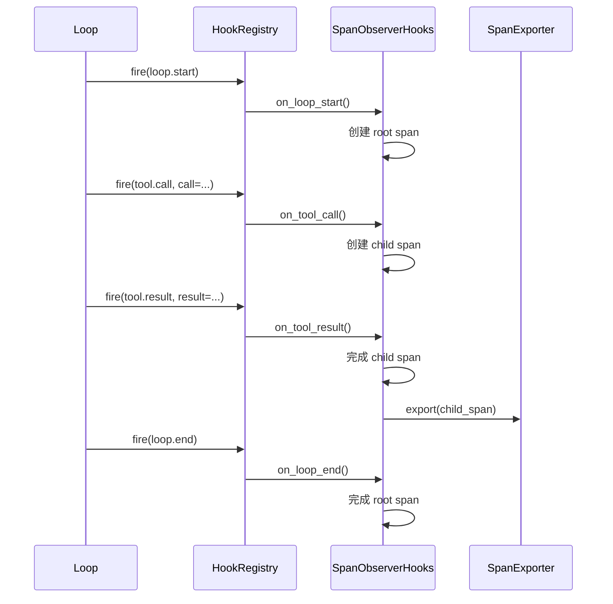

# 第 11 章 · 可观测：运行不再黑箱

> 阅读时间约 60 分钟。本章讲事件、追踪、指标三层视图，以及把 Agent 测试做成确定性的整套手艺，为第 12 章做好最后一块铺垫。
>
> 本章主线一句话：**print 日志回答不了"它为什么这么做"，所以框架让一切状态变更都发结构化事件，再从事件派生出三层视图——事件是底层（什么都发）、追踪回答单次运行的"为什么"、指标回答群体的"怎么样"、日志守护"发生过什么"；但要记住：看得见，不等于能重演。**

本章前置：第 3 章的事件流（本章的事件层是它的全景展开）、第 4 章的 RunMetrics 与账本、第 10 章的治理事件。

---

## 11.1 问题：Agent 是黑盒吗

一个 Agent 跑了二十轮，每轮调一次模型、执行几个工具，中间还有记忆召回、上下文压缩、预算记账。出了问题，五个问题立刻涌上来：它为什么做了这个决策？哪一步最耗时？哪个工具失败了、错在哪？token 花在了哪一步？多 Agent 场景下，消息在哪一环丢的？

靠翻 print 日志回答这些问题是绝望的——散落的文本行之间没有结构，没法查询、没法聚合、没法关联。第 1 章说过"结构化"的意思：每条记录是有固定字段的数据，程序可以直接统计。框架的答案是让可观测成为**结构化的第一等公民**：所有关键节点都发出结构化事件，追踪和指标从事件派生，不靠日志猜测。整套体系分三层，各答一类问题。

---

## 11.2 事件层：一切状态变更都发事件

第一层是地基。框架定义了一个事件枚举，二十九个事件点覆盖运行的全部关键节点，按生命周期分组看一遍就明白了它的覆盖面：会话与循环的开始结束、每轮的开始（`turn.start`）；模型的每次调用（`llm.request`）和流式思考（`llm.think`）；工具的每次执行前后（`tool.call` / `tool.result`）；审批挂起（`approval.request`）；计划的生成与重规划（`plan.ready` / `plan.replanned`）、DAG 步骤的状态变更；多 Agent 的委派与交接（`agent.spawn` / `peer.handoff`）；记忆召回、上下文组装、token 记账更新；还有专门的异常事件（检查点落盘失败、注入器失败）。

这些事件走的是一条三协议总线。你在前面章节已经见过它的三个通道各一次：观察通道（OBSERVE，事件广播，本章的主角）、收集通道（GATHER，向监听者收集信息，比如组装上下文时收集记忆）、否决通道（VETO，第 5 章的权限检查、第 9 章的审批门）。三个通道的语义刻意不同：观察是并发扇出、观察者失败只记日志不影响主流程；收集要等答案、按序汇总；否决是阻塞裁决、检查者抛异常默认拦截（fail-closed，安全检查宁可错杀）。为什么不用更常见的"中间件链"把横切能力串成一串？因为链式结构里每环都要显式调用下一环，漏调一环整条链断掉；总线是星形注册——一个中心点，各观察者独立挂上、互不相识——挂载点各自独立，谁掉了都不影响别人。三通道共用一套注册机制，是"横切能力"的基础设施——可观测、审计、安全都挂在这条总线上，而不侵入业务代码。

事件体系里还有一个容易让人困惑的裁决，说破它：**同一件事——比如"步骤完成"——在代码里有三个名字，而且刻意不合并**。总线上的 `step.completed`（广播给挂钩能力）、事件流的 `StepCompletedEvent`（发给流式消费者）、事件日志的 `StepCompleted`（落盘供回放）。不合并，因为三个通道要的东西不同：广播要扇出效率，流事件要携带活对象，日志要可重放的纯数据——合成一种，每种都做不好。但拼写必须一一对应，否则每读一处就得背一次暗号，于是立下约定：总线用小写点分，流事件用类名，日志用字符串值，词干相同。三个名字、一件事、一套拼写纪律。

顺带一条测试层的品味：这个仓库的测试名故意写得很长——`test_spawned_child_trips_on_spend_already_committed_by_a_sibling`（被派生的子 Agent 撞上兄弟已实扣的花销）、`test_work_queue_lease_timeout_requeue`（队列租约超时重新入队）。**测试名就是文档**：看到名字就知道它钉的是哪个场景、哪条边界，不需要读进测试体。

事件层的设计准则是**宁可多不可缺**：一个没发的事件，事后想补也补不回来（时间不会倒流，第 12 章之前的一切观测都是一次性的）；一个多发了的事件，顶多浪费一点存储。所以二十九个点位是一个偏全的清单。

---

## 11.3 追踪层：AgentSpan，决策的快照

事件说"什么时候发生了什么"，追踪层回答更难的那一问："**为什么**"。载体是 span——一次动作的完整快照；多个 span 用同一个 trace（追踪）号串起来，组成一次请求从头到尾的完整链路。定义在 `src/prodagent/base/observability.py`：

```python
@dataclass
class AgentSpan:
    # —— 身份与位置 ——
    span_id: str
    trace_id: str                        # 同一条 trace（可跨多 Agent）
    run_id: str
    parent_span_id: str | None = None    # 支持嵌套（spawn 子 Agent）
    action: str
    # —— 决策上下文：为什么模型这么选 ——
    input_payload: dict[str, Any]
    system_prompt_version: str = ""
    retrieved_context: list[str] = field(default_factory=list)
    llm_reasoning: str = ""
    # —— 结果与成本 ——
    output: Any = None
    error: str | None = None
    latency_ms: float = 0.0
    input_tokens: int = 0
    output_tokens: int = 0
    cost_usd: float = 0.0
```

字段分三组，每组回答一类问题。身份与位置：这段快照属于哪条追踪、哪个运行、嵌套在哪个父 span 下——`parent_span_id` 的存在让"父 Agent 委派子 Agent"的调用树可以完整重建，跨 Agent 的链路靠同一个 `trace_id` 串起来。决策上下文：当时的输入是什么、系统提示是哪个版本、召回了哪些记忆、模型的推理文本是什么——回答"它为什么这么选"。结果与成本：输出、错误、耗时、token、花费——回答"这一步值不值"。

"决策快照"这个定位值得掂量。多数追踪系统（数据库的慢查询日志、HTTP 的访问日志）记录的是行为和耗时；给 Agent 做追踪，光有行为不够——模型的行为是从上下文里长出来的，不记上下文，事后永远无法解释"它当时为什么调用那个工具"。`system_prompt_version`、`retrieved_context`、`llm_reasoning` 这三个字段，就是为"事后解释模型决策"专门准备的。这也是合规场景的刚需：监管问"Agent 当时为什么这么做"，答案就存在这三个字段里。

Span 的生成完全自动，不需要手动埋点（埋点指在业务代码里手动插观测调用——写过的人都记得那种到处撒代码又不敢删的滋味）：一个挂在总线上的观察墨盒监听事件，循环开始时开根 span，每次工具调用开子 span，结束时完成并导出。下面这张时序图展示了这个自动过程（读法同前：竖线是参与者，横向箭头是消息，时间向下）：



第 1 章的墨盒在这里兑现了一次：可观测是一枚自装配墨盒，插上即有，循环和组装根都不用改。开发时还有一枚可选的控制台墨盒，彩色打印每一步事件流，不用开调试器就能看 Agent 干活。

Span 的出口又是一个端口（`SpanExporter`）：默认实现写 JSONL 文件，生产可换 Postgres，自定义实现可以对接 OpenTelemetry——业界标准的追踪协议；Jaeger（一个开源的追踪查看平台）和各类观测平台都说这门语言。对接一次，Agent 的追踪就汇入整个系统的观测大盘，和数据库、服务的追踪放在一起看。

顺着出口还可以再问一层：这些数据在生产环境里究竟存在什么地方？以开源观测平台 Langfuse 为例，它自托管的部署用了四种存储，各自负责一类数据：PostgreSQL 存用户、项目这类需要事务保证的数据；ClickHouse（一种列式数据库：数据按列而不是按行存放，做聚合统计查询非常快）存 trace 和 observation，因为观测数据一旦写入就不再修改、读取时又以批量聚合为主，正好是列式数据库擅长的负载；Redis 负责队列和缓存；剩下的大文件——图片、音频、超过一定大小（约 1MB）的负载——写入 S3 这类对象存储（专门存大文件的云存储服务），数据库表里只保留一个引用。

这个划分顺便回答了一个实战中很快会遇到的问题：某个工具返回了两兆的 JSON，要不要原样塞进 span？技术上塞得进去，但观测数据的用途是让人看得见当时发生了什么，而不是把原始的大块数据完整装下来，所以业界的通行做法是把大块内容放进对象存储，span 里只留一个指针。理解了这条分界线，也就理解了 prodagent 的默认实现为什么可以这么简单——span 只是追加写入 `.prodagent/spans.jsonl` 这一个文件，因为把快照保持得小而薄本来就是设计目标，真到数据量大起来的时候，出口是端口，随时可以换。

---

## 11.4 指标层：从记账到聚合

第三层是数字。单个运行的 `RunMetrics` 你在第 4 章已经很熟：轮数、输入输出 token、缓存读写、花费、延迟，每轮结束经事件发出，前端可以实时画"已用多少对预算多少"。多 Agent 场景由共享账本把各成员的数字汇总。指标层的价值在聚合：一千次运行的平均成本、某工具的失败率走势、压缩触发前后的 token 曲线——单次运行的问题用追踪查，群体性的问题用指标看。

三层体系旁边还站着一个容易和追踪混淆的角色：第 7 章的事件日志。分工要说清：Span 导出的是**决策快照**——发生了什么、当时上下文什么样、耗时多少，服务追踪和分析；EventLog 记录的是**状态变更**——状态从 A 变成了 B、只追加不修改、带单调序号，服务审计和事件溯源重建。一个解释"为什么"，一个证明"发生过什么"。审计日志（所有工具调用、审批决定、Agent 交接、权限拦截）就落在后者上——可观测是给人看的，审计是给证据看的。三层合起来，各司其职：事件是底层（什么都发），追踪回答单次运行的"为什么"，指标回答群体性的"怎么样"，日志则守护"发生过什么"的不可抵赖。

---

## 11.5 观测的边界：看，不等于重演

本章的最后，把可观测的能力边界画清楚，因为它直接引出第 12 章。

三层体系能让你**看穿**一次运行：发生了什么、为什么、花了多少。但"看"和"重演"是两回事。假设凌晨三点的事故，你想在测试环境把那次运行**原样再跑一遍**——同样的模型输出、同样的工具结果、同样的时间与 id——观测数据做不到：事件和 span 是过去的**描述**，不是未来的**程序**。要让历史可以重演，需要的不是更多记录，而是运行时本身的可替换性：模型可以被换成"按剧本重放的模型"（第 2 章的 FakeLLM 已经是这个思路），时钟可以被冻结在录像带上（第 7 章的确定性端口），id 可以重放旧值。这些零件前面各章已经一一就位，第 12 章把它们装成一台完整的时光机。

---

## 11.6 测试与回归：把 Agent 测试做成确定性

可观测解决"看穿生产"，测试解决"看穿开发"。而 Agent 的测试有个先天难题：模型输出是非确定的，给定输入断言输出这条路走不通。用真实 API 跑测试，慢、贵、不稳定还有限流；只测工具函数不测循环，核心逻辑没有覆盖；把 LLM 调用整体 mock 掉（mock：测试替身，用一个假实现替换真实依赖），mock 又太脆弱、和真实行为脱节。

框架的答案你在第 2 章就认识了：FakeLLM 的剧本让模型输出变成预设脚本，于是 Agent 测试可以像普通单元测试一样写。常见的四种断言模式，难度递增：

- **断言最终输出**：跑完检查 `final_output` 和状态。
- **断言工具调用**：工具函数里记录收到的参数，跑完检查记录列表。
- **断言事件流**：收集 `stream()` 吐出的全部事件，检查事件序列。
- **断言预算**：剧本里放一百个"我要调工具"的响应，预算设三轮，断言运行以 turns 轴报错收场。

第四种最有意思——你在测试里制造了一场受控的烧钱事故，零成本、毫秒级、绝对可复现。**回归测试**（确认"以前验证过的行为没有因为后续改动而坏掉"的测试）的套路也由此而来：用剧本把一个场景钉死，断言关键行为，以后任何人改代码改坏了这个场景，测试当场变红——比如"审批被拒后模型改用站内信"这样的多轮行为，三行剧本加一个断言就固化成了永久资产。

### 从例子到定律：让不变式接受任意输入的检验

FakeLLM 给了你确定性，但例子测试有一道天花板：你只能验证自己想到的路径。一个用例是一次抽样，而系统里最重要的正确性往往不是"某条路径走对了"，而是一条**对所有输入都成立**的等式——序列化写进去什么读出来就必须是什么；从任意中间状态恢复必须等价于从头重放；各分项之和必须等于总额，无论操作以什么顺序发生。这类等式叫**不变式**（invariant），对待不变式，抽样是一种羞辱：一万次"这次也对"换不来一次"永远都对"。

**属性测试**把问题倒过来：你只声明等式，机器负责生成任意输入去挑战它。框架用自己的核心不变式喂给了属性测试库 Hypothesis（Python 最主流的属性测试库：你声明性质，它随机生成输入反复尝试证伪），五条定律一张表：

| 不变式 | 断言 | 它守护什么 |
|------|------|------|
| 往返律 | `load(json.loads(json.dumps(dump(x)))) == x`，任意持久化对象 | 快照的语义：持久化不改变事实 |
| 后缀律 | `get_after(k)` 恰好返回 `seq > k` 的后缀 | 恢复不丢事件、不重放事件 |
| 折叠可分解 | 任意事件序列、任意切分点：前缀折叠 + 尾部重放 ≡ 全量重放 | 恢复的可靠性是可证明的，而非习惯上成立 |
| 会计恒等 | 任意 reserve/commit/release 序列：`spent == committed + reserved` | 并发结算永远账实相符 |
| 最长后缀 | 压缩结果必是后缀、必在预算内、必是可行的最长 | "有界视图"在每个调用点含义相同 |

注意这些断言的形状：它们都是**代数等式**，不是行为描述——这正是属性测试的适用边界。"用户点击按钮后弹窗出现"是行为，只能用例子测；"部分和等于总和"是代数，就应该用定律证。行为验证你想过的路径，代数保护你没想过的路径。

属性测试失败时还会做一件例子测试永远做不到的事：把反例**收缩到最小**。一个五千字符的输入崩溃了，机器替你砍到只剩一个字符——那个字符往往就是答案。边界条件藏在某个接口的语义细则里、藏在你从没读过的 Unicode 类别里，例子测试等它们自己找上门，属性测试主动去翻。给一段逻辑补测试时要多问一句：这里有没有一条对所有输入都成立的等式？有的话不要抽样，把它写成定律——这是把正确性从"我验证过"升级为"它不可能错"的唯一路径。

### 一个刻意的缺席：为什么不内建评估框架

框架没有内建的 evaluation 模块——没有 LLM-as-judge（用模型给模型的输出打分）、没有指标聚合器。三个理由：评估需求高度场景化，客服 Agent 和代码 Agent 的评估标准完全不同，框架不该预设；FakeLLM 已经提供了最有价值的那层（确定性回归）；评估应该在框架之上构建——用 FakeLLM 加 pytest 跑确定性场景做回归，用真实模型跑少量场景做质量评估，两者各司其职。这也是端口思维的又一次体现：框架管机制，场景化的判断留给应用。

业界的后续发展恰好给这个裁决提供了注脚。Langfuse 把"观测数据变成测试数据"这条路直接做成了产品功能：任何一条生产 trace，在界面上点一下就能收进数据集（dataset），系统记下这条 trace 当时的输入和期望输出，并保留一个指回来源 trace 的链接；数据集本身带版本管理，每增加或修改一条记录都会产生一个新版本，跑实验时可以把实验固定在某个历史版本上，保证前后对比用的是同一批数据。

所谓跑实验，就是把你的应用程序在这批输入上重新执行一遍——这一遍是真实调用模型的，会产生新的 trace，然后由评估器打分、和旧版本的结果放在一起比较，整个过程也可以接入持续集成流水线。这样一来，凌晨出事的那条问题 trace，被收进数据集之后就变成了每次提交都会重新验证的对象，第 12 章要讲的"事故变成回归测试"，它的前半段在业界已经是现成功能。

但同样要看清楚它没做的那一半：这些实验重跑时调用的是此刻的真实模型，模型完全可能给出和当时不一样的答案，所以它复现的是当时的输入，而不是当时的执行。这两件事之间的差别，正是第 12 章整个设计的立足点。

这一千三百多个离线测试是全书一切的基础设施：第 1 章说"测试是答案册"，第 4、7 章的定律测试住在里面，你每个动手环节都在跑它们。理解一个机制最深刻的方式是调试它，而能调试的前提是它确定性可复现——这门手艺的名字，第 12 章就叫回放。

### 代码定位

| 内容 | 源码位置 |
|------|---------|
| AgentSpan（决策快照） | `base/observability.py` |
| SpanExporter 端口 | `ports/observability.py` |
| HookEvent 与三协议总线 | `kernel/bus.py` |
| 可观测墨盒 | `hooks/bundles/observability.py` |
| RunMetrics / 账本视图 | `kernel/state.py` / `ports/budget_ledger.py` |
| 测试体系 | `tests/`（全部离线，FakeLLM 驱动） |

---

## 动手环节

练习 1：亲手打开追踪。给第 2 章的 demo 换上生产配置（`AgentConfig(framework=production())`），跑一遍后去 `.prodagent` 目录（或配置指定的位置）找 span 的 JSONL 文件，打开看一条完整的 span：对照 11.3 的三组字段逐一找到它们。`trace_id` 和 `run_id` 分别是什么值，想想为什么需要两个。

练习 2：数一数事件点。打开 `src/prodagent/kernel/bus.py`，找到 `HookEvent` 枚举，数一数是不是二十九个。然后挑三个你在前面章节"遇到过"的事件（比如 `tool.call`、`approval.request`、`plan.replanned`），回想它们各自在哪一章的哪个机制里被发出——二十九个点位，你应该已经认识一小半了。

---

## 下一章

全书最后一块拼图。运行看得见了，还不够——工业级的终极问题是：出事之后，能不能按下倒带键。第 12 章把前面所有伏笔收拢：确定性端口、事件日志、FakeLLM 的剧本思想、幂等与补偿，装成一台完整的时光机——可回放、可回滚的运行时。

→ [第 12 章 · 可回放、可回滚的运行时](ch12.md)
