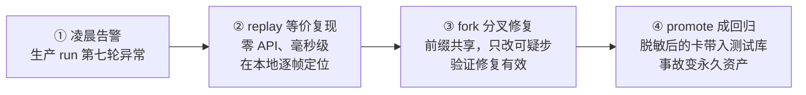

# 第 12 章 · 可回放、可回滚的运行时
> 阅读时间约 60 分钟。这是全书的最后一章。先说清楚一件事：本章一半是已落地的代码，一半是正在施工的路线图，文中会明确标注哪边是哪边——这个框架不许诺还没兑现的东西，包括在书里。
>
> 本章主线一句话：**生产 Agent 出事后最大的痛是"复现不了"，而解法是把一次运行录成一份只记边界问答的卡带——同一个内核由此长出五种视图：真实执行、离线复现、等价证明、故障演练、反向回滚；往前放是复现，往后放是回滚。**

本章前置：全书。确定性端口（第 7 章）、事件日志（第 7 章）、FakeLLM 的剧本（第 2 章）、幂等（第 7、9、10 章）、定律测试（第 4、7 章）——本章把所有伏笔收拢。

---

## 12.1 问题：出事之后，能按下倒带键吗

生产 Agent 的头号难题不是做不出功能，是出了事之后复现不了。把场景说具体一点：凌晨三点收到告警，你的 Agent 白天跑了六百次都很正常，偏偏那一次在第七轮做了一个奇怪的工具调用，把预算烧穿了，还给数据库写坏了一行数据。你需要在测试环境把那次运行原样重演一遍，盯着第七轮前后的每一帧，找出它为什么这么做。

第一个念头是把 temperature 调成零再跑一次。这条路走不通，而且原因值得说透：temperature 为零只是告诉模型"别采样，挑概率最高的词"，但这个请求到了服务商那边要经过调度、多卡并行、结果归约，浮点数相加的顺序都可能不同，最后的输出就可能不同。这不是服务商的 bug，是分布式计算的物理现实，所以没有任何一家模型服务商承诺"同样的请求一定得到同样的响应"。你在自己这边把参数固定得再死，也固定不了别人机房里的 GPU。

第二个念头是去翻第 11 章的观测数据。这条路也走不通，第 11 章末尾画过这条边界，这里把原因说得再具体一点。事件和 span 确实记下了当时发生的一切：模型收到了什么、答了什么、工具被传了什么参数、返回了什么。但那份记录只是躺在数据库里的文字，你可以读它、查它、拿它写报告，却没有任何办法"执行"它——就像你手里有整场球赛的文字直播，也绝无可能在球场上把那场球原样重踢一遍。观测数据是对过去的描述，不是可以重新运行的程序；看和重演，是两种完全不同的能力。

复现不了，往下的一切都变得昂贵：排查只能靠猜，回归测试写不出来，"它当时到底为什么这么做"永远是个悬案，修复之后你也无法证明"同样的情况不会再犯"。所以本章的主张是一句话：**一次运行应当是一份可重放的事实——往前放是复现，往后放是回滚。**

再强调一次边界，免得读到一半产生误会：12.2 到 12.4 讲的是设计的原则和形态，其中确定性端口和配套的定律已经落在仓库里（第 7 章你读过它的代码），cassette 格式与回放引擎还在施工，12.6 有一张诚实的进度清单。

---

## 12.2 录什么：边界问答对，不是状态快照

设计这样一台机器，第一个要回答的问题是录像带录什么。直觉的答案是"把每一步的状态都存下来"，但这个直觉恰好是错的，错在它没想清楚哪些东西可以事后重算。一次运行里的所谓状态——每一轮结束时的消息历史、预算余额、计划进度——全部是由两类东西推出来的：外部世界给过的答案，加上你自己的代码逻辑。代码逻辑不会变，它就写在仓库里；所以只要把外部世界给过的每个答案都录下来，任何时刻的状态都能在重放时一步一步重新算出来。真正无法重新计算的东西只有两类：模型每次被调用时给出的响应，和每个工具每次执行返回的结果。它们是运行和外部世界的问答——问什么（请求）、答什么（响应）录下来，运行就完整了；至于每一步之后内存里的状态长什么样，那是这些问答的确定性推论，不值得占用一寸磁带。这个"录输入不录状态"的原则你在第 6 章见过同款：模型看到的视图可以随时从完整历史重新组装，所以不另存一份。它同时也是卡带不会膨胀到失控的原因——不存那些自己能算出来的东西。

第二个原则是**录在语义边界，不录在传输边界**。录的是"框架视角下一次规范化的模型响应"，而不是某家 SDK 的原始 HTTP 报文。差别在寿命：报文格式跟着 SDK 的版本走，升级一次就废旧一批带子；语义格式跟着框架走，换模型厂商、升 SDK 版本，旧带子照样能放。变化快的东西，要离录像带远一点。

第三个原则你在第 7 章已经见过成品：**时间、随机数、id 走端口**。第 7 章的确定性端口把这三样收进了统一的闸口，为的就是这一刻——重放时把时钟冻结在带子录下的时刻、让 id 重放旧值，事件流里的序号和身份才能和当时一一对应。域内禁止直接调用标准库时钟的那条 lint 法律，守护的正是这一节的地基。

这份录像带有个专门的名字：**cassette（卡带）**。在展示它的样子之前，必须先回答一个理应被追问的问题：第 11 章的 span 里也记着模型和工具的输入输出，卡带再记一遍，边界问答岂不是被录了两次？任何像样的架构都不该把同一份事实录两遍，这里也一样——**边界问答只录一次**。录的位置在边界本身：每个问答发生的地方有一个唯一的记录点，录下来的这一份是唯一的事实源；span 导出器和卡带写入器都是它的下游投影，就像物化视图之于原表。两个投影读的是同一份数据，裁剪的尺度不同：观测投影（span）可以截断、可以省略，因为它的职责是让人看得见，少一截只是看得不全；重放投影（卡带）必须完整，因为它的职责是喂给机器重演，少一帧，重演到那里就断了，整盘带子作废。你感觉到的"重复"是投影的重叠，不是两次记录。而把两种投影分出主从还有一个方向上的理由：完整的那份能派生出截断的那份——重放一遍卡带、边放边发事件，观测视图就有了；截断的那份永远派生不出完整的那份。顺着这个视角，三者的一句话分工也就清楚了：span 给人看当时发生了什么，事件日志证明发生过什么（它记的是框架内部的状态变更），卡带承载外部世界答过什么、负责让机器重演当时。

格式上，卡带的默认形态是一份 **JSONL 文件**——不是一整个大 JSON，而是一行一个独立的 JSON 对象，追加写入，读取时只按 `\n` 切分（第 7 章讲过这套格式和它的纪律）。但有一个区分必须先立住：**记录的契约比文件的形态重要**。真正不可让步的是前述几条——完整、有序、语义规范化、带版本号；至于这份数据落成 JSONL 文件还是数据库的行，是存储后端的选择。卡带的后端和事件日志一样走端口，换成 Postgres 或对象存储不改变任何语义。默认选 JSONL 有三个工程理由：`promote` 的终点是把带子变成 git 里的测试资产，持续集成环境里没有你的生产数据库，带子必须是一个拷得走、提交得进仓库的文件；重放的访问模式是从头到尾顺序扫描，天然就是日志的形状；它和事件日志、检查点属于同一格式家族，读取纪律可以复用。如果你听过数据库的 WAL（write-ahead log，预写日志——数据库先把每次变更写进日志再动手，靠从头重放日志就能把状态一步步重建出来），会发现卡带就是这个思想在 Agent 运行上的落点：日志是真相，状态是重放的产物。第 7 章事件日志的那条折叠定律——任意切分点上，前缀折叠加尾部重放等价于全量重放——正是数据库"检查点加 WAL 尾部"的同构。区别只在两份日志各自记的层面：事件日志是状态变更的 WAL，服务崩溃恢复和审计；卡带是边界输入的 WAL，服务重演和回归。

下面是一份真实卡带的前几行，逐行加了注释（实际文件里没有注释）：

```jsonl
{"header": true, "schema_version": 1, "kernel_version": "1.2.0", "run_id": "r-7f3a", "config_hash": "a3f9c1", "tool_manifest": ["search", "send_email"]}
{"seq": 1, "kind": "clock", "value": 1789012345.678}
{"seq": 2, "kind": "llm", "req_hash": "77bc02", "request": {"messages": [{"role": "user", "content": "查一下 prodagent 并给我发封简报"}]}, "response": {"content": null, "tool_calls": [{"name": "search", "args": {"q": "prodagent"}}]}}
{"seq": 3, "kind": "tool", "req_hash": "d19e44", "request": {"tool": "search", "args": {"q": "prodagent"}}, "response": {"ok": true, "result": "prodagent 是一个工业级 Agent 框架……"}, "meta": {"idempotency_key": "r-7f3a#2#search"}}
{"seq": 4, "kind": "clock", "value": 1789012346.012}
{"seq": 5, "kind": "llm", "req_hash": "2a0b8f", "request": {"messages": ["……（含上一步工具结果的完整历史）"]}, "response": {"content": null, "tool_calls": [{"name": "send_email", "args": {"to": "me@x.com", "body": "……"}}]}}
```

接下来把每一行、每个字段说清楚，因为这份格式里几乎没有一个字段是随便放的。

第一行是**头记录**（header），它回答"这盘带子是哪台机器、什么配置、带着哪些工具录的"。`schema_version` 是格式版本号——第 7 章序列化那节讲过"数据比代码活得久"，一盘带子落盘之后可能要在多年后被新版本的读取端打开，格式中途一定会变，读取端靠这个版本号去迁移旧带子而不是拒绝它。`kernel_version` 是录带时的框架版本，它为第二个原则作证：语义格式跟着框架走，那么带子上就该记下录带时的框架是谁。`run_id` 是这次运行的身份证。`config_hash` 是运行配置的指纹——两盘带子能不能放在一起对比，先看这个指纹是否一致，配置都不同的两次运行，比对本身就没有意义。`tool_manifest` 是这次运行注册过的工具清单，回放器靠它知道该按什么形状准备工具。

第二行和第五行（seq 1、seq 4）是 **clock 记录**。确定性端口把时间收进闸口，卡带在这里兑现它：重放时 `now_wall()` 不再读真实时钟，而是按顺序吐出这些录好的值。值得留意的是，clock 记录只在代码真正用到时钟时才出现，不是每轮一条——录的永远是"被问到的每次时间"，没被问到就不录，这是"只录边界问答"在时间上的体现。

第三行和第六行（seq 2、seq 5）是 **llm 记录**。`request` 存完整的请求消息，这是"问"；`response` 存模型当时给出的回答，这是"答"。回放时根本不会真的去调模型 API：回放器按 `seq` 找到这条记录，把 `response` 原样交回去——零 API 花费、毫秒级完成、和当时逐事件一致。`req_hash` 是请求内容的指纹，它是下面"双键匹配"规则的原料。另外注意 seq 5 的 `request` 里含着上一步工具的结果——正因为每次录的都是完整请求，重放时不需要任何额外的拼装动作，照着带子念就够了。

第四行（seq 3）是 **tool 记录**，结构和 llm 记录同构，只是问答双方换成了工具：`request` 记工具名和参数，`response` 记返回值。`meta.idempotency_key` 是第 7 章那个"崩溃稳定的键"，它由 run、步数、工具名拼出来——示例里的 `r-7f3a#2#search` 一眼能读出：哪次运行、第几步、哪个工具。把它也录进带子，重放和下一节的补偿就都认得"这是同一次调用"。

这份格式背后立着四条硬规则，每一条都有明确的为什么。

第一，**录输入不录状态**。前面已经讲透了：状态是问答的确定性推论，重放时现场重算，既省磁带又保证一致。

第二，**双键匹配**。回放不是闭着眼按顺序把答案发出去，而是用 `(seq, req_hash)` 配对——一条记录既要排在第 N 个位置上，请求内容的指纹也要对得上。只用 seq 不够：如果代码改了而带子还是旧的，请求和答案会悄悄错位，错位本身不报错，回放出来的结果看起来还挺正常，这比直接失败危险得多。只用 req_hash 也不够：同一个请求在一次运行里出现两次（比如模型坚持重试同一个搜索），指纹相同，分不清该答哪一次。两个键一起用，第一处分歧就能被精确定位成"第 3 步请求了 A，但带子上录的是 B"，而不是含糊的一句"结果不一致"。

第三，**比较要做投影**。重放和原始运行做逐事件比对时，时间戳、耗时、事件 id 这类字段天然会变，比对前先把它们排除，只比真正承载语义的字段。没有这条投影，STRICT 比对会天天误报，而天天误报的告警最后一定被人静音——狼来了的故事在监控系统里天天上演。

第四，**虚拟时间**。回放和故障演练状态下，sleep、退避、超时全部快进，只保留因果上的先后。否则录的时候退避等了八秒，放的时候就要再真睡八秒，一次本该毫秒级的复现拖成几十秒，这台时光机就没人愿意用了。

最后还有一个现实问题要单独立在这里：**大的工具结果怎么办**。结论先行：可以截，但必须是指针式截断——记录里放一个凭它能取回原文的引用，重放时还原出完整答案就行；不可以丢，丢一个字节，重演到那里就断了。业界处理"记录必须完整、但体积可能很大"这类问题，通行做法正是内容寻址存储：正文按其内容的指纹单独存进对象库，记录里只保留指纹，用到时凭指纹取回。卡带的 `req_hash` 字段恰好就是现成的指纹挂点，而 span 与卡带两个投影可以指向同一份正文——又回到"只存一份"：大结果的本体在对象库里只存一次，观测要看、重放要用，都凭同一个指纹去取。这是设计上想清楚了、会写进施工清单的一行，如实说：它还没有实现。

---

## 12.3 怎么放：五视图，和一个定律

带子在手，怎么放取决于你要干什么。框架把这设计成同一个内核上的五种视图：

| 视图 | 干什么 | 你在哪见过 |
|---|---|---|
| LIVE | 真实执行，同时录像 | 全书 |
| REPLAY | 全部问答喂卡带，自由重放 | 第 2 章的 FakeLLM 就是它的原型 |
| STRICT | 重放并逐事件比对，证明等价 | 本节 |
| SIM | 工具换成故障注入，做混沌演练 | 第 5 章的熔断器测试思路 |
| COMPENSATE | 对已发生的副作用反向折叠 | 下一节 |

值得停一下的是 REPLAY 那一行。FakeLLM 按剧本演出（第 2 章），剧本和卡带的差别只在于：剧本是人手写的、给测试用；卡带是生产运行自动录下的。**假件和录像带是同一个机制的两个用途**——这解释了为什么第 2 章那个"不起眼的测试工具"值得用一整节讲。

REPLAY 之上立着这套系统的灵魂，一条定律：

```
strict(replay(cassette(run))) ≡ run
```

读法：把一次运行的卡带喂给回放器重演一遍，再逐事件比对重演和原始运行，两者必须等价。这不是一条普通的测试用例，是**定律**——第 4、7 章你见过这个词的分量：它进持续集成、永不跳过、任何改动都要在它面前证明自己没有破坏"历史可重演"这个承诺。比对按 12.2 的投影规则排除天然会变的字段，不会逐字节死磕。定律一旦立住，它守护的东西就可以开成支票：任何一次生产事故，都能在测试环境等价复现；任何一次复现，都能固化成永久的回归测试。

配套的还有一条**零出口律**：REPLAY 状态下，任何卡带上没有的真实外部调用直接失败，绝不"回退到真调用"。这条 fail-closed 的道理和第 9 章 Gate 抛异常默认拦截同源：回退一旦存在，复现就是假的，而假的复现比没有复现更危险——它会让你相信一个错误的结论。

### 一盘卡带的一生：从凌晨事故到永久回归

把上面这些零件串成一个故事，你就看清了这套系统的完整用法，也是它最打动人的地方：



第一步，生产出事，但 LIVE 视图一直在录像，卡带随检查点一起落了盘。第二步，你把这盘卡带拿到本地，一条 `replay` 命令等价重演——不花一分钱 API、不用等模型、结果和凌晨那次逐事件一致，你可以在第七轮前后反复看，根因无所遁形。第三步，用 fork 从怀疑的那条事件处分叉：前六步共享同一份前缀，只在分叉点换上修复后的逻辑或新的 prompt，对比两条轨迹，确认修复真的有效、且没有引入新问题。第四步，`promote` 把这盘卡带（经过脱敏，抹掉用户隐私和密钥）固化进测试库——从此每次提交都会重演这次事故，任何人改代码让它再次发生，CI 当场变红。凌晨的一次事故，到天亮变成了一条永远站岗的回归测试。这就是"可观测、审计、评估、测试是同一份录像带的四种读法"的含义。

---

## 12.4 怎么回滚：补偿是新的录像

往前放（复现）之外，这台机器还要会往后放（回滚）：一次运行跑到第八步发现整个方向错了，已经执行的前七步怎么办？

对纯读的步骤——搜索、查询、计算——什么都不用做，它们没有改变世界。对有副作用的步骤，答案是**补偿**：每个有副作用的动作声明自己的逆操作——发货的逆是取消发货，创建订单的逆是冲销。反向执行这些逆操作，把世界的状态折回去。三个设计要点，每一个都有前面章节的影子。

第一，补偿本身也是 effect，也被录进同一份卡带。回滚不是把录像带倒回去抹掉，而是在录像带上继续录：第十条记录是"补偿了第七条"。这样连回滚本身都是可回放、可审计的——和第 8 章"计划修订不删除旧版本"、第 6 章"被取代的记忆标记而不是删除"是同一种敬畏。而且因为补偿动作也在带子里，"当时是怎么一步步回滚的"将来也能等价重演。

第二，必须显式面对"半途而废"的副作用。进程死在工具执行的半路，副作用到底发生没有？没人知道（第 7 章的时间线讲过这个窗口）。这种悬而未决的状态叫 **in-doubt**：回滚遇到它，先查账——问外部系统"那笔到底成没成"——再决定补不补，绝不盲目补偿。盲目补偿会造出双倍的破坏：退了一笔根本没扣的款。这也是幂等键第二次救场：即使崩溃后续滚、同一笔补偿被执行了两次，幂等键也保证只冲销一次。

第三，逆操作不是总存在。发了就发的邮件，撤不回；这类动作叫**不可逆点（pivot）**。对它们，回滚系统不做假承诺，做的是第 9 章的老本行：在执行**之前**把不可逆点标出来，过审批门，让人在事前知情——事后能补救的交给补偿，事前能拦住的交给门，两边都管不了的，至少让它在日志里清清楚楚。系统的价值不是假装一切都能撤回，而是让"不可逆"这件事显形、并且在动手前被人看见。

---

## 12.5 业界对照：这个位置值得占吗

设计讲完之后、动工之前，值得停下来对照一下业界：同类的问题，别的框架做到了哪一步？本章设计的这套东西，究竟是一块别人没占的空地，还是别人踩过之后主动放弃的坑？这一节把两家代表性产品的做法摊开看一遍，再回来评估这件事该不该做。

先看 LangGraph，它是 LangChain 公司的开源 Agent 框架，配套的商业平台叫 LangSmith。这个框架把核心机制押在检查点（checkpoint）上：执行图每走完一步，就把当时的完整状态存成一份快照，而这一份存储同时服务三个用途——崩溃后恢复、人工审批时挂起等待、以及叫做"时光机"（time travel）的调试能力。时光机提供两个动作。第一个是 replay（重放）：从任意一个历史检查点继续往下跑，位于检查点之前的节点不会重新执行，因为它们的结果已经保存在快照里；而检查点之后的节点会真实地重新执行——LangGraph 的官方文档对此写得很直白：重新执行的部分包括全部模型调用和外部请求，它们完全可能给出和上次不同的结果。第二个是 fork（分叉）：在旧检查点上修改一份状态、从那里开出一条新分支，原来的执行历史原封不动地保留着。12.3 里讲的"分叉修复"，在业界已经是产品里现成的功能。

读到这里你可能已经注意到，LangGraph 采用的恰恰是 12.2 一开头就否掉的那个直觉方案：把每一步的状态完整存下来。它这么做并不是掉进了坑里，而是要解决的问题和本章不完全一样——它要的是"从某个点继续往下走"和"如果当时改了某个输入会怎样"，而不是"把当时那场运行完全重演一遍"。在它的设计里，过去已经被固化在快照中，所以是确定的；未来是重新真实执行的，所以是不确定的。对于"如果"这一类调试问题，这种方案实现成本低，也完全够用；它的代价在于状态快照比问答记录更占存储，而且从原理上就无法证明"重演等价于当时"。

再看 Langfuse，也就是第 11 章提过的那个开源观测平台，它选择在另一层打通：工作流。它的 trace 里，每次模型调用都记录了当时的输入和输出，换句话说，观测数据里天然带着构造测试所需的原料；界面上任何一条观测都可以一键收进数据集，变成一条测试记录，并保留指向来源 trace 的回链（第 11 章 11.6 讲过这条链路）；数据集带版本管理；跑实验时，系统拿录下来的这批输入把你的应用程序重新真实执行一遍，调用此刻的模型，产生新的 trace 和评分，用来和旧版本对比，也可以接入持续集成。它统一的是"测试素材直接来自生产数据"这个工作流程；它复现的是当时的输入集合，而不是当时的执行过程——模型此刻重新作答，答案可能已经不一样了。

说到这里必须正面回答一个很自然的疑问：Langfuse 的 trace 里既然也存着每次模型调用和工具调用的输入输出，那原料不是已经齐了吗？把数据存成 span 加对象存储，难道就不能确定性回放了吗？这个疑问的答案是：能。数据能不能支撑回放，取决于记录满足什么条件，而不取决于它存在哪种数据库、长成什么格式。把条件列出来一共三条。完整：每次边界问答都在场，要么原样在记录里，要么截断处放着能取回原文的指针。有序：全局顺序是记录下来的，不是事后靠时间戳去凑的——并发之下两个操作可能落在同一毫秒，事后从时戳里凑全序，不一定凑得出来。规范化：录的是语义边界的内容，不随 SDK 版本漂移。这三条条件跟 ClickHouse 还是 JSONL 没有任何关系，span 加对象存储的方案完全装得下这三条；装下了，它就是一盘合格的卡带，只是记录行住在列式数据库里、大结果住在对象存储里。

那 Langfuse 为什么不做？原因在契约和引擎这两层，都不在存储层。契约这一层：观测平台的记录契约是尽力而为——埋点是应用自己选的，上报可以截断、可以采样，平台对完整性不承诺，也不需要承诺，因为观测的职责是让人看得见，少一截只是看得不全。回放要的是完整性的承诺，而这个承诺必须由运行时自己来立：只有框架知道每一次边界问答都必然发生，才能保证每一次都被录下。引擎这一层：回放发生时，你的程序要重新跑起来，每到一个"该问模型了"的地方，实际执行的必须是一个会把录下的答案交回去的替身——这些替身只能长在框架的执行路径里，而 Langfuse 站在你的进程之外，它是数据的出口，不是执行的引擎：它可以让你的程序把数据发给它，但没有任何办法替你的程序跑代码。再补一层确定性：就算前两样都齐了，你的程序里只要有一处直接读了系统时钟、生成了真随机数、new 了 uuid，重演就从那里开始偏航——这条纪律（第 7 章的端口、那条 lint 法律）也只能由框架在自己代码里立。完整的契约、进程内的引擎、确定性的纪律，三样凑齐才能兑现回放；Langfuse 站在它的位置上一样都不沾，而且它不必为此遗憾：评估场景要的就是新模型的新答案，拿录下的输入重跑新模型，恰好是它把数据集和实验做成了产品。LangGraph 倒是握着执行路径，但它选了检查点这条更便宜的路，去服务"从某点继续"的调试需求。两家从各自的位置出发，都停在了完全重演的前一格——那一格，就是本章设计的落点。

写这本书的时候，业界还出现了一个立场更近的同行：DeepSeek 在 2026 年 8 月开源了 DeepSeek Harness（DSH），把"一切皆插件"推到极致——模型、工具、会话存储、沙箱、循环本身都是可替换的插件，和本书的端口哲学同宗。它的会话模型采用事件溯源（event sourcing，状态不落盘、由只追加的事件日志折叠派生）：一个会话就是一条只追加的日志（`session/event`），进模型请求的一切都必须可重建，官方把核心理念表述为"运行时语义与回放等价"——对照本章的等价律，你会发现这是同一个承诺的另一种措辞。它同样把两类通道分开：`session/event` 承载持久的回放事实，`agent/*` 承载队列、steering、错误处理这类实时协调，和本章"事实与投影分离"是同一种分法。差别在粒度：DSH 连流式输出的每个分块（`assistant/chunk`）都进日志，回放可以细到流；本章的卡带按 12.2 的第二条原则录在语义边界，不随 SDK 和流式协议漂移。粒度细换来调试的完整，粒度粗换来带子的寿命，两种取舍各自成立。

DSH 还给一个悬着的问题提供了现实参照：既然日志是真相，第 7 章的检查点存储是不是可以删了？数据库世界早就把这道题做过了：WAL 是真相，原则上从创世日志一路重放就能重建一切，但没有任何数据库真的这么做，因为恢复时间会随日志长度线性膨胀——所以数据库用基础备份把重放钳在尾部，快照不是真相，是恢复时间的界。DSH 选择了更激进的一端：至少在公开文档里看不到独立的状态快照，会话状态由事件日志折叠派生。本章的设计取中间：检查点保留，但角色降级——它不再是事实（事实在卡带和事件日志上），只是一份折叠的缓存，把崩溃恢复从重放整盘带子缩短为重放尾部。还有一个不能省的理由：崩溃恢复和离线重放是两种不同的动作——恢复是在真实世界里续跑，副作用不能重演、in-doubt 要查账（12.4），它要的是"我到哪了"这个位置和最快的到达路径，不是开一台回放机；裸配置本来就是内存后端无盘运行，检查点从来是可选的，选它的理由是速度，不是真相。

把这几家放在一起，差别就清楚了：

| | LangGraph / LangSmith | Langfuse | 本章的设计 |
|---|---|---|---|
| 统一发生在哪层 | 存储层：一份检查点三种用途 | 工作流层：trace 一键变测试记录 | 数据层：一份卡带，观测/审计/评估/测试是四种读法 |
| 记什么 | 每步的完整状态快照 | 模型调用的输入输出（附带在观测里） | 只录边界上的问答对 |
| "重放"实际是什么 | 续跑：之前用快照，之后真实执行 | 重跑：录下的输入 + 此刻的真实模型 | 复演：录下的答案喂回去，零真实外部调用 |
| 确定性 | 过去确定，未来不确定 | 输入确定，执行不确定 | 给定卡带即完全确定，由等价律看守 |
| 存放位置 | 检查点库，后端可替换 | Postgres + ClickHouse + 对象存储 | JSONL 文件起步，后端是端口 |

顺着存储这个话题再补两个落地的细节。其一，数据放在哪：Langfuse 自托管时四种存储各管一摊——PostgreSQL 管事务数据，ClickHouse（第 11 章讲过的列式数据库）管海量观测，Redis 管队列，对象存储管大件，超过约 1MB 的负载直接写对象存储、表里只留引用；而卡带按设计就是 JSONL 文件，和事件日志、span 属于同一种格式家族、遵守同一套追加与切分纪律，默认落在 `.prodagent` 目录下，后端是端口，随时可以换。其二，12.2 末尾留下的内容寻址问题，业界有现成先例可参考：正文按指纹进对象库、记录里只留指纹，正是 Langfuse 处理大负载的同一个思路，卡带只是把它用在了纪律更严的数据上，`req_hash` 就是那个指纹。

最后回到该不该做的评估。反对的理由是实实在在的：严格版的重放要求时钟、随机数、id 全部走端口，要求语义边界的格式长期保持稳定，要求零出口律兜底，每一项都是全库级别的纪律成本；而且业界两家不做严格版，各有各的道理——评估场景需要的就是新模型此刻的新表现，把旧答案喂回去恰好违背评估的目的；观测平台运行在你的进程之外，它既管不到你进程里的时钟，也管不到你的 id 生成。支持的理由只有一条，但这一条足够重：事故排查和回归测试需要的不是新答案，而是当时的答案。这一格两家都没有占，而且从架构上也占不了——"历史可以等价重演"这个承诺，只能由框架自己在进程内兑现，再用定律看守。所以本章的定位不是在 LangGraph 和 Langfuse 已经做好的事情上再赢一次，而是补上它们结构上够不到的那一格。至于这个赌注最终值不值，由下一节进度清单里第一个变绿的里程碑来回答。

---

## 12.6 诚实的进度清单

本章讲的是这个框架正在建设的旗舰能力，落到地面上的进度如下。

已经落地、你现在就能在仓库里读到代码的：确定性端口全套装（时间/随机数/id 的三个协议、可替换的闸口、异常安全的切换，第 7 章逐行读过）及其六个守护测试；域内禁止绕过闸口的 lint 法律——如实说，它目前处在报告不阻断的观察期，配置、`make lint-determinism` 和持续集成里的标注任务都在，何时翻红由观察期决定；还有承载这一切的更老家底——事件日志、检查点恢复、幂等键、FakeLLM 剧本、终态单咽喉。

正在施工的：cassette 的格式与编解码、回放器和 STRICT 比对器、大工具结果的内容寻址存储、等价律进持续集成。设计原则已定稿（本章 12.2 到 12.4 的内容就是定稿的原则），实现按里程碑推进，等价律变绿之前，对外不吹。

更远处排在路线图上的：冻结世界只换模型的受控实验、从任意事件点分叉的"时光机"、给卡带定一个开放标准。它们都建立在同一个地基上，而地基的每一块砖，你都在前面章节搬过。

---

## 12.7 收束：一门手艺，用了一本书

最后退后一步，看这本书真正教的是什么。

十二个模块，表面各不相同——预算、工具、恢复、规划、审批、协作、观测、回放——但把每一章的核心手法拎出来，你会发现反复出现的是同一门手艺的变奏：**把"必须永远成立的约束"从约定变成结构，再用机器检验锁死**。终态转移收进单咽喉方法，配对物从约定升格为结构（第 3 章）；预算等式是定律，随机操作序列锤不破（第 4 章）；架构方向是测试，import 错了当场红（第 1 章）；序列化往返是定律（第 7 章）；到最后，"历史可以重演"本身成了最大的那条定律（本章）。端口是这门手艺在结构上的表达，定律测试是它在验证上的表达，而幂等——你从工具键、审批单、消息管道三次遇到它——是它在不确定世界里的表达。

这就是"工业级"三个字的全部含义：不是功能多，是**每一个承诺都有结构背书、有机器看守**。你从十行 demo 出发，现在可以回答序章的那道检验题了：换你来设计一个工业级 Agent 框架，你知道从哪里下手——从那九个生产要求出发，一条一条地问"没有它会怎样"，然后为每一条，找到它的端口、它的单咽喉、它的定律。

接下来去哪？三条路。翻回[附录](appendix.md)的《关键取舍速查》——所有"为什么不用另一种方案"集中在那里，这本书讲了每个机制是什么，那张表讲它们不是什么。读别的框架——带着这套词汇去读 LangGraph、Temporal，你会看得见它们做了什么、没做什么。或者最好的那条：动手——给这个框架加一个工具、开一个端口、立一条你自己的定律。设计能力从动手里长出来，序章就说过。

### 代码定位

| 内容 | 源码位置 |
|------|---------|
| 确定性端口（时间/随机/id） | `base/determinism.py` |
| 端口的六个守护测试 | `tests/base/test_determinism.py` |
| 禁止绕过闸口的 lint 法律 | `pyproject.toml`（ruff TID251）+ `make lint-determinism` |
| 事件日志（回放的事实源） | `base/event_log.py` |
| FakeLLM（REPLAY 的原型） | `llm/fake.py` |
| 终态单咽喉（COMPENSATED 的挂点） | `kernel/state.py` |

---

## 动手环节

练习 1：重读时光机的地基。第 1 章你跑过 `uv run pytest tests/base/test_determinism.py -v`，现在带着全书的知识重读那六个测试。你会看到从前没看见的东西：override 的异常安全在守护谁（回放中途崩溃不泄漏冻结时钟）、任务隔离在守护谁（回放与真任务并行）、Event.make 的端口化在为谁铺路。

练习 2：亲手触发那条法律。运行 `make lint-determinism`，看它现在报什么（观察期内应该是一片干净或只有标注）。然后随便挑一个文件写一行 `time.time()`，再跑一次，读一遍报警文本——那是这台时光机对自己地基的看守方式。

练习 3（展望）：在纸上给一个你熟悉的多步任务设计它的卡带。列出每一步会产生哪几种记录（llm/tool/clock），哪些工具是纯读（回滚时跳过）、哪些需要 compensator、有没有撤不回的 pivot；再想想哪个工具的结果最大、它的指纹该指向哪里。你会发现 12.2 和 12.4 的分层在纸上就能跑一遍——这正是设计先行的意义。

---

## 结语

十二站走完。你带着 Python 基础出发，现在手里有了一张架构地图、一套设计词汇、一门"约束变结构、结构上机器"的手艺，和一千三百多个随时可以跑给你看的测试。剩下的路在动手里——去吧。
