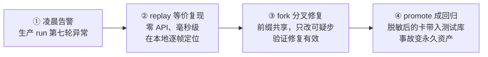

# 第 12 章 · 可回放、可回滚的运行时
> 阅读时间约 50 分钟。这是全书的最后一章。先说清楚一件事：本章一半是已落地的代码，一半是正在施工的路线图，文中会明确标注哪边是哪边——这个框架不许诺还没兑现的东西，包括在书里。
>
> 本章主线一句话：**生产 Agent 出事后最大的痛是"复现不了"，而解法是把一次运行录成一份只记边界问答的卡带——同一个内核由此长出五种视图：真实执行、离线复现、等价证明、故障演练、反向回滚；往前放是复现，往后放是回滚。**

本章前置：全书。确定性端口（第 7 章）、事件日志（第 7 章）、FakeLLM 的剧本（第 2 章）、幂等（第 7、9、10 章）、定律测试（第 4、7 章）——本章把所有伏笔收拢。

---

## 12.1 问题：出事之后，能按下倒带键吗

生产 Agent 的头号难题不是做不出功能，是出了事**复现不了**。

凌晨三点告警：那次运行在第七轮做了一个奇怪的工具调用，烧掉了预算，写坏了一行数据。你想在测试环境把它原样重演一遍，找出根因。第一个念头是把 temperature 调成零再跑一次——不行，模型服务商不给这个承诺：底层 GPU 的并行计算本身有非确定性，同样的输入可能产出不同的输出。第二个念头是翻观测数据（第 11 章）——也不行，第 11 章末尾画过这条边界：事件和 span 是对过去的**描述**，不是可以重新执行的**程序**。看着录像的文字稿，演不出那场戏。

复现不了，往下的一切都昂贵：排查靠猜，回归测试写不出，"当时它到底为什么这么做"成了悬案。所以有了本章的主张，一句话：**一次运行应当是一份可重放的事实——往前放是复现，往后放是回滚。**

往下讲的是实现这个主张的完整设计。再强调一次边界：12.2 到 12.4 讲的是设计的原则和形态，其中确定性端口和配套的定律已经落在仓库里（第 7 章你读过它的代码），cassette 格式与回放引擎在施工，12.5 有张诚实的进度清单。

---

## 12.2 录什么：边界问答对，不是状态快照

重放的第一问题是录像带录什么。直觉答案是"把每一步的状态都存下来"，这个直觉是错的——状态可以派生，问答不可以。

框架的原则：**只录边界上的问答对**。一次运行里，真正"从外面进来、无法重新计算"的东西只有两类：模型每次调用给出的响应，和每个工具每次执行返回的结果。它们是运行和外部世界的问答，问什么（请求）和答什么（响应）录下来，运行就完整了；至于每一步之后内存里状态长什么样，那是问答的确定性推论，重放时现场重算，不用录。这个"录输入不录状态"的原则你在第 6 章见过同款：模型看到的视图可以随时从完整历史重新组装，所以不另存一份。这也是卡带不会膨胀到失控的原因——不存那些能自己算出来的东西。

第二个原则：**录在语义边界，不录在传输边界**。录的是"框架视角下一次规范化的模型响应"，不是某家 SDK 的原始 HTTP 报文。差别在寿命：报文格式跟着 SDK 版本走，升级一次废旧一批带子；语义格式跟着框架走，换厂商、升 SDK，带子照放。变化快的东西离录像带远一点。

第三个原则你已经知道：**时间、随机数、id 走端口**。第 7 章的确定性端口就是为这里修的闸口——重放时把时钟冻结在录像带的时刻、让 id 重放旧值，事件的序号和身份才能和当时对上。域内禁止直接调用标准库时钟的那条 lint 法律，守护的就是这一节。

这份录像带有个专门的名字：**cassette（卡带）**。它是一份 JSONL 文件——第 7 章讲过，JSONL 就是"一行一个 JSON 对象"的追加式格式，读取只按 `\n` 切。下面是一份真实卡带的前几行，逐行加了注释（实际文件里没有注释）：

```jsonl
{"header": true, "schema_version": 1, "kernel_version": "1.2.0", "run_id": "r-7f3a", "config_hash": "a3f9c1", "tool_manifest": ["search", "send_email"]}
{"seq": 1, "kind": "clock", "value": 1789012345.678}
{"seq": 2, "kind": "llm", "req_hash": "77bc02", "request": {"messages": [{"role": "user", "content": "查一下 prodagent 并给我发封简报"}]}, "response": {"content": null, "tool_calls": [{"name": "search", "args": {"q": "prodagent"}}]}}
{"seq": 3, "kind": "tool", "req_hash": "d19e44", "request": {"tool": "search", "args": {"q": "prodagent"}}, "response": {"ok": true, "result": "prodagent 是一个工业级 Agent 框架……"}, "meta": {"idempotency_key": "r-7f3a#2#search"}}
{"seq": 4, "kind": "clock", "value": 1789012346.012}
{"seq": 5, "kind": "llm", "req_hash": "2a0b8f", "request": {"messages": ["……（含上一步工具结果的完整历史）"]}, "response": {"content": null, "tool_calls": [{"name": "send_email", "args": {"to": "me@x.com", "body": "……"}}]}}
```

逐行读，你会发现每一行都对应前面章节的某个决定。

第一行是**头记录**：`schema_version` 是第 7 章序列化那节的格式版本号（读取端靠它迁移旧带子），`config_hash` 是运行配置的指纹，`tool_manifest` 是这次运行注册过的工具清单。头记录回答"这盘带子是哪台机器、什么配置、带着哪些工具录的"。

第二、四行是 **clock 记录**：回放时 `now_wall()` 不再读真时钟，而是按顺序吐出这些值——这就是第 7 章确定性端口在卡带上的落点。注意它只在真正用到时钟时才出现，不是每轮一条。

第三、五行是 **llm 记录**：`request` 存完整的请求消息，`response` 存模型当时给的回答。回放时根本不会真的调用模型 API，而是按 `seq` 找到这条记录、把 `response` 原样交回去——零花费、毫秒级、结果和当时一模一样。`req_hash` 是请求内容的指纹，马上讲它的用处。

第四行是 **tool 记录**：结构和 llm 同构，只是问答双方换成了工具。`meta.idempotency_key` 就是第 7 章那个"崩溃稳定的键"——它同时被录进带子，让重放和重补偿都认得"这是同一次调用"。

这份格式背后立着四条硬规则，每一条都是踩过坑的：

1. **录输入不录状态**（前面讲过，状态回放时重算）。
2. **双键匹配**：回放不是"闭着眼按顺序发"，而是用 `(seq, req_hash)` 配对——既要排在第 N 条，请求内容的指纹也要对得上。这样第一处分歧能被精确定位成"第 3 步请求了 A，但带子上录的是 B"，而不是含糊地报一句"结果不一致"。
3. **比较要做投影**：时间戳、耗时这类派生字段天然会变，比对时把它们排除，只比真正承载语义的字段。没有投影，STRICT 会天天误报，最后被人当狼来了静音掉。
4. **虚拟时间**：回放和故障演练下，sleep、退避、超时全部快进，只保留因果先后——否则一次"毫秒级复现"会真的睡上几十秒。

每条记录带序号和内容指纹，头记录写明格式版本和运行环境指纹——第 7 章"数据比代码活得久、读取端要宽容"的全部纪律，同样适用于它。

---

## 12.3 怎么放：五视图，和一个定律

带子在手，怎么放取决于你要干什么。框架把这设计成同一个内核上的五种视图：

| 视图 | 干什么 | 你在哪见过 |
|---|---|---|
| LIVE | 真实执行，同时录像 | 全书 |
| REPLAY | 全部问答喂卡带，自由重放 | 第 2 章的 FakeLLM 就是它的原型 |
| STRICT | 重放并逐事件比对，证明等价 | 本节 |
| SIM | 工具换成故障注入，做混沌演练 | 第 5 章的熔断器测试思路 |
| COMPENSATE | 对已发生的副作用反向折叠 | 下一节 |

值得停一下的是 REPLAY 那一行。FakeLLM 按剧本演出（第 2 章），剧本和卡带的差别只在于：剧本是人手写的、给测试用；卡带是生产运行自动录下的。**假件和录像带是同一个机制的两个用途**——这解释了为什么第 2 章那个"不起眼的测试工具"值得用一整节讲。

REPLAY 之上立着这套系统的灵魂，一条定律：

```
strict(replay(cassette(run))) ≡ run
```

读法：把一次运行的卡带喂给回放器重演一遍，再逐事件比对重演和原始运行，两者必须等价。这不是一条普通的测试用例，是**定律**——第 4、7 章你见过这个词的分量：它进持续集成、永不跳过、任何改动都要在它面前证明自己没有破坏"历史可重演"这个承诺。比对也不是逐字节死磕——时间戳、事件 id 这类天然会变的字段按 12.2 的投影排除在外。定律一旦立住，它守护的东西可以开成支票：任何一次生产事故，都能在测试环境等价复现；任何一次复现，都能固化成永久的回归测试。

配套的还有一条**零出口律**：REPLAY 状态下，任何卡带上没有的真实外部调用直接失败——绝不"回退到真调用"。这条 fail-closed 的道理和第 9 章 Gate 抛异常默认拦截同源：回退一旦存在，复现就是假的，而假的复现比没有复现更危险，它会让你相信一个错误的结论。

### 一盘卡带的一生：从凌晨事故到永久回归

把上面这些零件串成一个故事，你就看清了这套系统的完整用法，也是它最打动人的地方：



第一步，生产出事，但 LIVE 视图一直在录像，卡带随检查点一起落了盘。第二步，你把这盘卡带拿到本地，一条 `replay` 命令等价重演——不花一分钱 API、不用等模型、结果和凌晨那次逐事件一致，你可以在第七轮前后反复看，根因无所遁形。第三步，用 fork 从怀疑的那条事件处分叉：前六步共享同一份前缀，只在分叉点换上修复后的逻辑或新的 prompt，对比两条轨迹，确认修复真的有效、且没有引入新问题。第四步，`promote` 把这盘卡带（经过脱敏，抹掉用户隐私和密钥）固化进测试库——从此每次提交都会重演这次事故，任何人改代码让它再次发生，CI 当场变红。**凌晨的一次事故，到天亮变成了一条永远站岗的回归测试。** 这就是"可观测、审计、评估、测试是同一份录像带的四种读法"的含义。

---

## 12.4 怎么回滚：补偿是新的录像

往前放（复现）之外，这台机器还要会往后放（回滚）：一次运行跑到第八步发现整个方向错了，已经执行的七步怎么办？

对纯读的步骤，什么都不用做。对有副作用的步骤，答案是**补偿**：每个有副作用的动作声明自己的逆操作——发货的逆是取消发货，创建订单的逆是冲销。反向执行这些逆操作，把世界的状态折回去。三个设计要点，每一个都有前面章节的影子。

第一，补偿本身也是 effect，也被录进同一份卡带。回滚不是把录像带倒回去抹掉，是在录像带上**继续录**：第十条记录是"补偿了第七条"。这样连回滚本身都是可回放、可审计的——和第 8 章"计划修订不删除旧版本"、第 6 章"被取代的记忆标记而不是删除"是同一个敬畏。而且因为补偿动作也在带子里，"当时是怎么一步步回滚的"将来也能逐位重演。

第二，必须显式面对"半途而废"的副作用。进程死在工具执行的半路，副作用到底发生没有？没人知道（第 7 章的时间线）。这种悬而未决的状态叫 **in-doubt**：回滚遇到它，先查账（问外部系统"那笔到底成没成"）再决定补不补，绝不盲目补偿。盲目补偿会造出双倍的破坏——退了一笔根本没扣的款。这也是幂等键第二次救场：即使崩溃后续滚、同一笔补偿被执行两次，幂等键也保证只冲销一次。

第三，逆操作不是总存在。发了就发了的邮件，撤不回；这类动作叫**不可逆点（pivot）**。对它们，回滚系统不做假承诺，做的是第 9 章的老本行：在执行**之前**把不可逆点标出来，过审批门，让人在事前知情——事后能补救的交给补偿，事前能拦住的交给门，两边都管不了的，至少让它在日志里清清楚楚。系统的价值不是假装一切都能撤回，而是让"不可逆"这件事显形、并且在动手前被人看见。

---

## 12.5 诚实的进度清单

本章讲的是这个框架正在建设的旗舰能力，落到地面上的进度如下。

已经落地、你现在就能在仓库里读到代码的：确定性端口全套装（时间/随机数/id 的三个协议、可替换的闸口、异常安全的切换，第 7 章逐行读过）；域内禁止绕过闸口的 lint 法律及其测试；还有承载这一切的更老家底——事件日志、检查点恢复、幂等键、FakeLLM 剧本、终态单咽喉。

正在施工的：cassette 的格式与编解码、回放器和 STRICT 比对器、等价律进持续集成。设计原则已定稿（本章 12.2 到 12.4 的内容就是定稿的原则），实现按里程碑推进，等价律变绿之前，对外不吹。

更远处排在路线图上的：冻结世界只换模型的受控实验、从任意事件点分叉的"时光机"、给卡带定一个开放标准。它们都建立在同一个地基上，而地基的每一块砖，你都在前面章节搬过。

---

## 12.6 收束：一门手艺，用了一本书

最后退后一步，看这本书真正教的是什么。

十二个模块，表面各不相同——预算、工具、恢复、规划、审批、协作、观测、回放——但把每一章的核心手法拎出来，你会发现反复出现的是同一门手艺的变奏：**把"必须永远成立的约束"从约定变成结构，再用机器检验锁死**。终态转移收进单咽喉方法，配对物从约定升格为结构（第 3 章）；预算等式是定律，随机操作序列锤不破（第 4 章）；架构方向是测试，import 错了当场红（第 1 章）；序列化往返是定律（第 7 章）；到最后，"历史可以重演"本身成了最大的那条定律（本章）。端口是这门手艺在结构上的表达，定律测试是它在验证上的表达，而幂等——你从工具键、审批单、消息管道三次遇到它——是它在不确定世界里的表达。

这就是"工业级"三个字的全部含义：不是功能多，是**每一个承诺都有结构背书、有机器看守**。你从十行 demo 出发，现在可以回答序章的那道检验题了：换你来设计一个工业级 Agent 框架，你知道从哪里下手——从那九个生产要求出发，一条一条地问"没有它会怎样"，然后为每一条，找到它的端口、它的单咽喉、它的定律。

接下来去哪？三条路。翻回[附录](appendix.md)的《关键取舍速查》——所有"为什么不用另一种方案"集中在那里，这本书讲了每个机制是什么，那张表讲它们不是什么。读别的框架——带着这套词汇去读 LangGraph、Temporal，你会看得见它们做了什么、没做什么。或者最好的那条：动手——给这个框架加一个工具、开一个端口、立一条你自己的定律。设计能力从动手里长出来，序章就说过。

### 代码定位

| 内容 | 源码位置 |
|------|---------|
| 确定性端口（时间/随机/id） | `base/determinism.py` |
| 端口的六个守护测试 | `tests/base/test_determinism.py` |
| 禁止绕过闸口的 lint 法律 | `pyproject.toml`（ruff TID251）+ `make lint-determinism` |
| 事件日志（回放的事实源） | `base/event_log.py` |
| FakeLLM（REPLAY 的原型） | `llm/fake.py` |
| 终态单咽喉（COMPENSATED 的挂点） | `kernel/state.py` |

---

## 动手环节

练习 1：重读时光机的地基。第 1 章你跑过 `uv run pytest tests/base/test_determinism.py -v`，现在带着全书的知识重读那六个测试。你会看到从前没看见的东西：override 的异常安全在守护谁（回放中途崩溃不泄漏冻结时钟）、任务隔离在守护谁（回放与真任务并行）、Event.make 的端口化在为谁铺路。

练习 2：亲手触发那条法律。运行 `make lint-determinism`，看它现在报什么（应该是一片干净）。然后随便挑一个文件写一行 `time.time()`，再跑一次，读一遍报警文本——那是这台时光机对自己地基的看守方式。

练习 3（展望）：在纸上给一个你熟悉的多步任务设计它的卡带。列出每一步会产生哪几种记录（llm/tool/clock），哪些工具是纯读（回滚时跳过）、哪些需要 compensator、有没有撤不回的 pivot。你会发现 12.4 的分层在纸上就能跑一遍——这正是设计先行的意义。

---

## 结语

十二站走完。你带着 Python 基础出发，现在手里有了一张架构地图、一套设计词汇、一门"约束变结构、结构上机器"的手艺，和一千三百多个随时可以跑给你看的测试。剩下的路在动手里——去吧。
