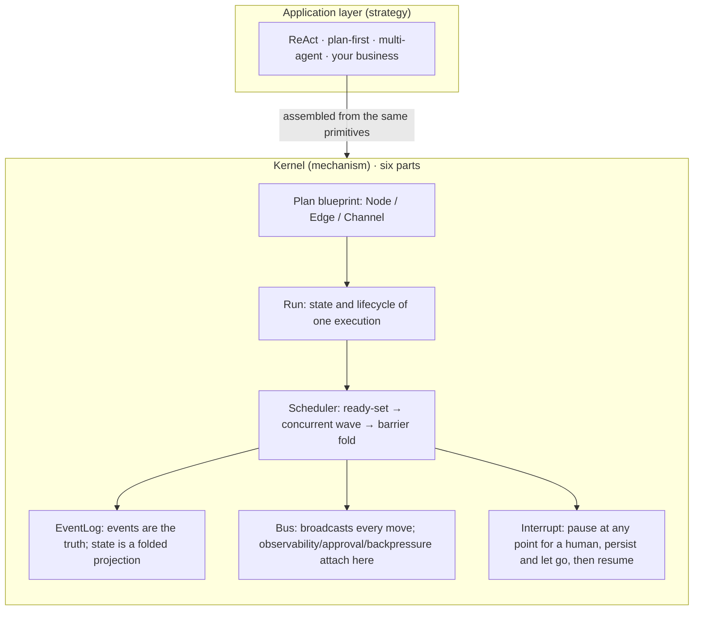

# Architecture: from a six-line loop to a machine

This page does one thing: give you the full picture of an agent-framework
kernel in about fifteen minutes. No jargon stacking — we start from the
simplest thing there is.

## The starting point: an agent is just a loop

Strip away every fancy name, and an agent that calls a model and uses tools is
essentially this loop:

```python
messages = [user_question]
while True:
    reply = call_model(messages)       # 1. let the model think one step
    if reply.requests_tools:           # 2. see what it wants
        result = run_tools(reply.tools) # 3. call the tools if asked
        messages.write_back(result)    # 4. feed results back in
    else:
        return reply.final_answer      # 5. nothing left to do, finish
```

With these few lines you already have an agent that "runs". So what does a
framework add?

## The problem: this loop's progress lives in memory

The catch is that halfway through, *how far it got*, its local variables, and
its call nesting all live in process memory — **implicit, ephemeral, impossible
to persist**. So these ordinary needs are all out of reach:

- if the process crashes mid-run, can we resume from the breakpoint instead of
  starting over?
- before a tool runs, can we pause for a human to click "approve"?
- can a slow step be moved to another machine?
- can we see where it is right now?

They share one prerequisite: **turn execution progress into explicit data that
can be saved, shipped, and restored.** The first job of a framework is to make
the implicit explicit. That takes three moves.

**First, make progress explicit state.** One object records how far we got, each
step's input/output, and what we're waiting for. It is plain data, serializable,
persistable — this is the `Run`.

**Second, make the relations between steps an explicit graph.** A while loop
hard-codes "what comes after what"; changing the orchestration means rewriting
the loop. A framework pulls the steps (`Node`), their links (`Edge`), and the
channels that say where data lives and how concurrent writes merge (`Channel`)
into one data blueprint (`Plan`) — nodes, edges, and channels are the parts
inside it. Changing orchestration means swapping the graph; the engine that
runs it stays the same.

**Third, write one generic engine that reads both.** It doesn't care whether a
node calls a model or adds numbers. It repeatedly computes one thing: "which
steps now have all their prerequisites and can run?" It runs them concurrently,
merges when they finish, and computes the next round. This is the `Scheduler`.

## Six parts, assembled into a machine

The three moves already give us `Plan`, `Run`, and `Scheduler`. To make
recovery/audit, suspension, and outward visibility solid, three more join them:
`EventLog`, `Bus`, and `Interrupt` — six in total. Here is the whole figure:



Each in one plain sentence:

| Part | The problem it solves |
|---|---|
| **Plan** (Node / Edge / Channel inside) | a reusable static blueprint: which steps exist, how they connect, how concurrent state writes merge |
| **Run** | how far *this* execution got — dynamic, one-shot, persistable and resumable |
| **Scheduler** | the single engine that repeatedly computes "who is ready now", wave by wave |
| **EventLog** | append-only facts; state isn't stored, it's folded out of the event stream |
| **Bus** | the engine announces every move; observability, audit, approval, backpressure all attach here |
| **Interrupt** | at any node, say "stop, wait for a human/external", persist and let go, then continue intact |

## The most important dividing line: mechanism inside, strategy outside

Notice the two layers. **The kernel provides only mechanism**: how to represent
the graph, compute readiness, guarantee concurrent consistency, persist and
resume. It **does not know ReAct, nor any "execution-mode enum".**

ReAct (think as you go), plan-first (plan then execute), and every multi-agent
collaboration are **strategy** — assembled on the application layer from the
kernel's small set of primitives. A different collaboration style needs not a
line of kernel change. This line is the soul of the project, and why so few
lines cover so many forms.

## The intuition you should leave with

An agent engine sounds complex, but at the bottom it is six parts, derived one
after another by the same problem: to recover you need an explicit Run; to
orchestrate flexibly you need an explicit Plan (nodes, edges, channels inside);
to drive the blueprint you need a scheduler; to audit and travel back, to pause
at any point, and to be visible and interceptable from outside, you grow an
event log, an interrupt, and a bus in that order. **No one invented six concepts
on a whim — the problems themselves demanded them.**

The next five [design notes](README.md)
walk through the key trade-off behind each: why it has to be this way, and what
you pay if you choose differently. How to write each one from scratch, line by
line, is built with you in the companion column.
