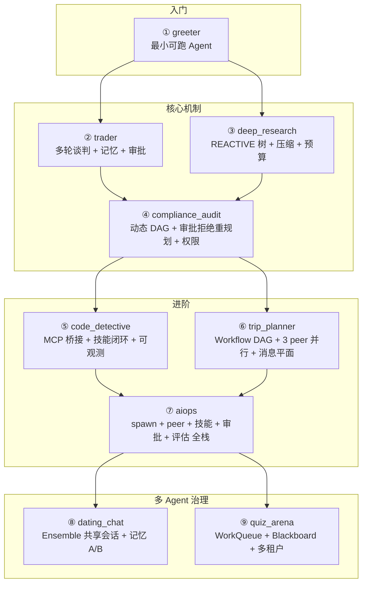
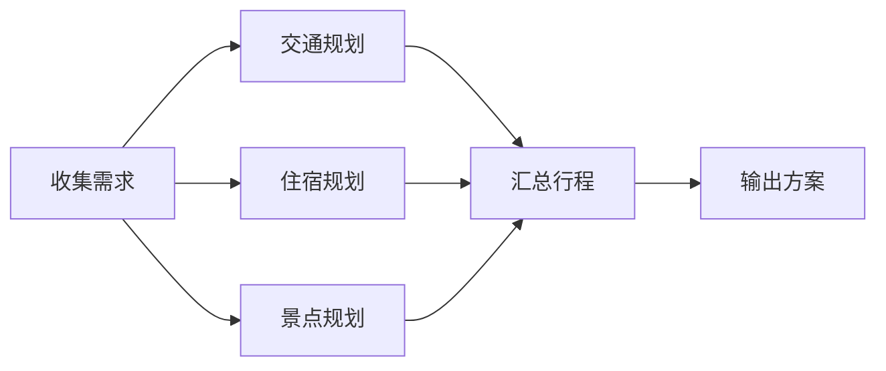

# 9 个端到端示例

> 不是玩具示例。每个都对应一个真实生产场景，教一个完整的机制组合。全部离线可跑（FakeLLM 精确到每轮工具调用）。

---

## 示例地图



---

## 逐个详解

### ① greeter — 最小可跑 Agent

**场景**：最简单的 Agent，一个工具，一轮对话。

**教什么**：
- `@tool` 装饰器的基本用法
- `Agent` 的最小配置
- `ExecutionMode.REACTIVE` 的执行流程
- FakeLLM 的脚本化响应

**代码骨架**：
```python
@tool(name="greet", readonly=True)
async def greet(name: str) -> str:
    return f"你好，{name}！"

agent = Agent("greeter", tools=[greet], mode=ExecutionMode.REACTIVE)
await agent.chat("向 Alice 打招呼")
```

**对应源码**：`examples/greeter/`

---

### ② trader — 奶茶代购协商

**场景**：Agent 扮演奶茶代购，和顾客多轮谈判价格，记忆顾客的偏好和预算，高价订单需要审批。

**教什么**：
- 多轮对话中的记忆约束（顾客说过"预算 20 元"，后续不能推荐超预算的）
- `SideEffectLevel.HIGH` 工具的审批挂起
- 审批拒绝后的增量重规划（不是从头开始）
- 记忆系统的规则通道和实体通道

**关键机制组合**：
```
记忆约束 → 防止 Agent 忘记顾客说过的话
审批门 → 高价订单挂起等人确认
增量重规划 → 审批被拒后，Agent 知道"这个价格不行"，换个方案
```

**对应源码**：`examples/trader/`

---

### ③ deep_research — 探索式研究

**场景**：Agent 围绕一个主题做深度研究，多轮搜索、阅读、总结，可能产生很长的上下文。

**教什么**：
- REACTIVE 模式的树状探索（搜索 → 读文章 → 再搜索 → 再读）
- **五级上下文压缩**——token 超阈值时自动分级压缩历史
- 预算硬上限——研究任务最容易失控，四轴预算同时生效
- 工具结果的 spill 存储——超长搜索结果不全部塞进上下文

**五级压缩策略**：
| 级别 | token 占比 | 牺牲什么 | 保留什么 |
|------|-----------|---------|---------|
| L0 | < 30% | 不压缩 | 全部 |
| L1 | 30-50% | 旧工具结果的细节 | 结果摘要 |
| L2 | 50-70% | 旧的推理过程 | 关键结论 |
| L3 | 70-85% | 较早的对话轮次 | 任务约束 + 最新轮次 |
| L4 | > 85% | 除系统提示和当前任务外全部压缩 | 不可丢失的约束 |

**对应源码**：`examples/deep_research/`

---

### ④ compliance_audit — 金融合规审计

**场景**：Agent 对一笔交易做合规审计，需要按步骤检查多个规则，某些检查需要人工审批，权限不足的操作要被拦截。

**教什么**：
- `ExecutionMode.PLAN_FIRST`——先输出审计 DAG，再按步骤执行
- 审批拒绝触发**增量重规划**——某一步被拒后，调整后续步骤而不是推倒重来
- **权限策略引擎**——RBAC + 操作级授权，越权操作拦截并审计
- DAG 的断点续跑——审计到一半中断，恢复后从断点继续

**关键设计**：
```
计划阶段：模型输出审计步骤 DAG
执行阶段：按依赖关系并行/串行执行
审批门：访问敏感数据的步骤挂起等人审批
权限校验：Agent 身份 → 工具权限 → 数据访问 三层检查
重规划：审批被拒 → 标记该步骤失败 → 模型调整后续依赖
```

**对应源码**：`examples/compliance_audit/`

---

### ⑤ code_detective — 自主修 bug

**场景**：Agent 自主定位和修复代码仓库中的 bug，使用 MCP 协议接入外部工具（文件读写、代码搜索、测试运行），成功的修复经验沉淀为技能。

**教什么**：
- **MCP 桥接**——外部工具经 stdio/HTTP 接入，不用为每个工具写适配层
- **技能闭环**——成功的 run 蒸馏成 runbook，下次同类任务按需加载
- **可观测追踪**——每一步操作都有 span，事后可以回放整个调试过程
- 工具调用的可靠性——参数校验、失败重试、错误分类

**技能闭环流程**：
```
成功修复 bug → 提取"问题→诊断→修复"模式 → 存为 runbook
下次遇到类似问题 → 技能召回 → 注入 system prompt → Agent 直接用经验
```

**对应源码**：`examples/code_detective/`

---

### ⑥ trip_planner — 旅行规划

**场景**：规划一次旅行，3 个 Agent 并行工作（交通、住宿、景点），最后汇总成完整行程。

**教什么**：
- `Workflow` 静态 DAG——预定义的规划流程
- 3 个 **peer 并行执行**——交通/住宿/景点同时规划
- **统一消息平面**——peer 间通过 Crossing 管道通信，不丢不重不乱序
- 并行结果的聚合和冲突解决

**DAG 结构**：


**对应源码**：`examples/trip_planner/`

---

### ⑦ aiops — 故障应急

**场景**：线上系统故障，Agent 自主排查、定位、修复，涉及 spawn 子 Agent、peer 接力、技能召回、审批门、评估反馈。

**教什么**：这是**全栈示例**，几乎用到了所有机制：
- `spawn`——派生子 Agent 查日志、查监控
- `peer`——排查 Agent 把上下文接力给修复 Agent
- **技能召回**——历史故障的 runbook 自动加载
- **审批门**——有副作用的修复操作（重启、回滚）挂起等人确认
- **评估**——修复后自动评估是否解决，没解决则继续排查

**这是最接近真实生产场景的示例。** 建议读完前面所有示例再看这个。

**对应源码**：`examples/aiops/`

---

### ⑧ dating_chat — Agent 相亲

**场景**：两个 Agent 扮演相亲对象聊天，用 Ensemble 共享会话，对比不同记忆策略的效果。

**教什么**：
- `Ensemble` 共享会话——多个 Agent 在同一个对话空间里交互
- **记忆 A/B 对比**——同一个对话，用不同记忆配置跑两次，对比效果
- 终止策略——对话自然结束的条件（MaxRounds、共识、预算）
- 多 Agent 的发言顺序控制（RoundRobin、Moderated）

**这个示例的趣味在于**：你可以直观看到"有记忆的 Agent"和"无记忆的 Agent"在对话中的差异——有记忆的会记住对方说过的话，无记忆的会反复问同样的问题。

**对应源码**：`examples/dating_chat/`

---

### ⑨ quiz_arena — 抢答竞赛

**场景**：多个 Agent 参加抢答竞赛，用 WorkQueue 分发题目，Blackboard 共享分数板，多租户隔离不同比赛。

**教什么**：
- `WorkQueue`——题目作为任务分发，Worker（Agent）领取回答
  - **租约机制**——Agent 领取题目后有时间限制，超时自动重新分发
  - **死信队列**——多次答错的题目进入死信，不阻塞其他题目
- `Blackboard`——共享分数板，Agent 抢答后更新分数
- **多租户隔离**——不同比赛的任务和分数互不干扰
- 并发控制——多个 Agent 同时抢答时的锁竞争

**对应源码**：`examples/quiz_arena/`

---

## 怎么跑这些示例

```bash
# 安装 playground 依赖
pip install "prodagent[playground]"

# 启动可视化 playground，浏览器里选示例运行
make playground

# 或者直接跑某个示例
python examples/greeter/run.py
python examples/deep_research/run.py
```

所有示例默认用 FakeLLM，**零 API key、零网络、完全离线可复现**。

---

## 示例与机制对照表

| 示例 | 预算 | 恢复 | 审批 | 权限 | 压缩 | 记忆 | 多Agent | 可观测 | 技能 | MCP | 评估 |
|------|------|------|------|------|------|------|---------|--------|------|-----|------|
| ① greeter | ✓ | | | | | | | | | | |
| ② trader | ✓ | | ✓ | | | ✓ | | | | | |
| ③ deep_research | ✓ | ✓ | | | ✓ | ✓ | | ✓ | | | |
| ④ compliance_audit | ✓ | ✓ | ✓ | ✓ | | | | ✓ | | | |
| ⑤ code_detective | ✓ | ✓ | | | | | | ✓ | ✓ | ✓ | |
| ⑥ trip_planner | ✓ | ✓ | | | | | ✓ | ✓ | | | |
| ⑦ aiops | ✓ | ✓ | ✓ | ✓ | ✓ | ✓ | ✓ | ✓ | ✓ | | ✓ |
| ⑧ dating_chat | ✓ | | | | | ✓ | ✓ | | | | |
| ⑨ quiz_arena | ✓ | ✓ | | | | | ✓ | ✓ | | | |

---

## 下一步

- 想深入某个机制？→ [第二部分 · 生产问题域 →](tour/index.md)
- 想看设计取舍？→ [设计取舍附录 →](decisions.md)
- 想查 API？→ [API 参考 →](reference.md)
