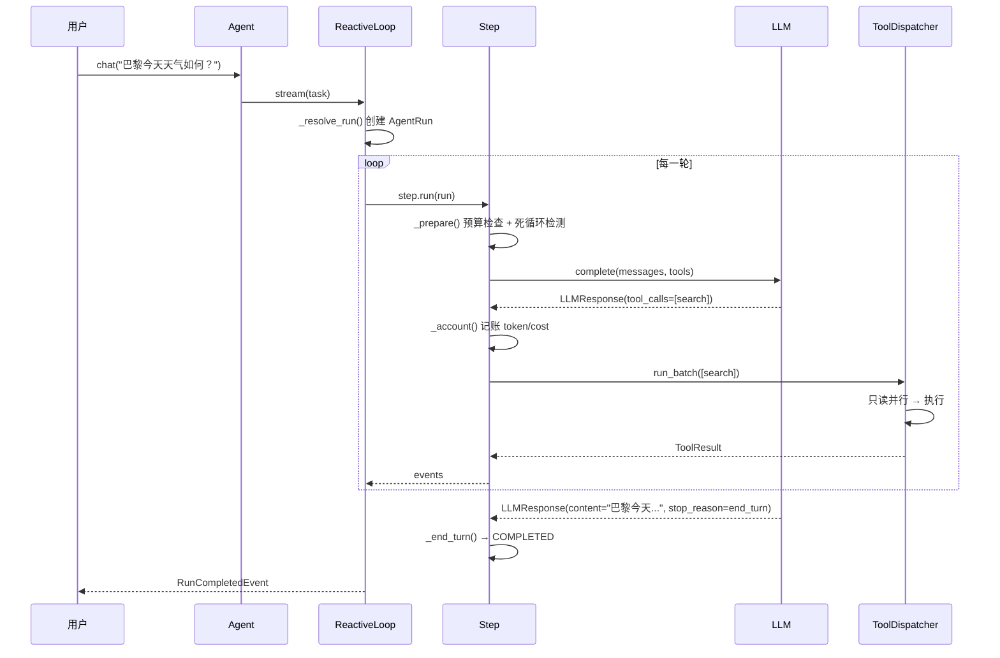

# 5 分钟上手

> 零配置、零外部依赖——跑通你的第一个 prodagent Agent，然后理解它背后的设计。

---

## 最小可跑示例

```python
import asyncio
from prodagent import Agent, AgentConfig, ExecutionMode, tool

@tool(name="search", readonly=True)
async def search(query: str) -> str:
    """搜索网络信息。"""
    return f"results for: {query}"

agent = Agent(
    "demo",
    system_prompt="你是一个 helpful assistant，使用工具回答问题。",
    tools=[search],
    mode=ExecutionMode.REACTIVE,
    config=AgentConfig(name="demo"),
)

asyncio.run(agent.chat("巴黎今天天气如何？"))
```

就这么多。没有配置文件，没有环境变量，没有外部服务。默认使用 FakeLLM（零 API key、零网络），你可以立即跑通。

---

## 发生了什么？

让我们拆开这 10 行代码背后发生的完整链路：



**关键观察**：即使是最简单的调用，也经过了预算检查、死循环检测、工具调度——这些不是可选插件，是默认开启的安全网。

---

## 连接真实模型

FakeLLM 适合学习和测试。要接入真实模型，配置 `LLMConfig`：

```python
from prodagent import AgentConfig
from prodagent.llm import LLMConfig

# OpenAI 兼容端点（DeepSeek、Moonshot、本地 vLLM 等）
llm_config = LLMConfig(
    model="deepseek-chat",
    temperature=0.0,
)

# 或通过环境变量自动检测：
#   LLM_BASE_URL / LLM_API_KEY / LLM_MODEL
#   ANTHROPIC_API_KEY（Anthropic 原生）

agent = Agent(
    "demo",
    tools=[search],
    config=AgentConfig(name="demo", llm=llm_config),
)
```

`LLMConfig` 会根据模型名自动查定价表，让预算的 cost 轴开箱即用。未知模型定价为 0，不影响其他三轴。

---

## 一键上生产全套

当你准备好上生产时，不需要重写代码，只需要换一个配置：

```python
from prodagent import Agent, AgentConfig
from prodagent.base.config import production

agent = Agent(
    "demo",
    tools=[search],
    config=AgentConfig(
        name="demo",
        framework=production(),  # ← 一键开启全套护甲
    ),
)
```

`production()` 开启了什么？

| 护甲 | 作用 |
|------|------|
| **落盘恢复** | 每轮 checkpoint 写入磁盘，进程被杀后从断点续跑 |
| **span 追踪** | 每轮推理、工具调用自动埋点，兼容 OpenTelemetry |
| **HIGH 工具审批门** | 高副作用工具挂起等人确认 |
| **LLM 缓存** | 提示缓存，重复请求不花钱 |
| **上下文压缩** | token 超阈值时自动五级压缩 |
| **事件日志** | 所有状态变更追加写入，可审计可回放 |

裸核（`bare()`）和生产（`production()`）是同一套内核的两种配置——不是两套代码。

---

## 两种执行模式 + Workflow

prodagent 根据任务复杂度提供不同的执行策略：

### 1. REACTIVE — 边走边想（默认）

```python
agent = Agent("demo", mode=ExecutionMode.REACTIVE)
```

- 每轮：想一步 → 做一步 → 看结果 → 再想
- 适合：探索式任务、不确定路径、需要根据中间结果调整
- 类比：开车去陌生地方，走一步看一步导航

### 2. PLAN_FIRST — 先规划后执行

```python
agent = Agent("demo", mode=ExecutionMode.PLAN_FIRST)
```

- 先让模型输出一个 DAG 计划，再按依赖关系执行
- 执行中可以增量重规划（审批被拒、步骤失败时）
- 适合：有明确步骤的复杂任务、需要并行执行的子任务
- 类比：装修前先出施工图，再按图施工

### 3. Workflow — 手写确定性 DAG

Workflow 不是第三种执行模式，而是一个**独立的计划构建器**——你用代码手写 DAG，模型不参与规划，只在 `llm_step` 中被调用：

```python
from prodagent.plan import Workflow

wf = Workflow()

@wf.step
async def fetch_data() -> str:
    return "raw data"

@wf.step(depends_on=["fetch_data"])
async def analyze(fetch_data: str) -> str:
    return f"analyzed: {fetch_data}"

@wf.llm_step(name="summarize", prompt="总结分析结果：{{analyze.output}}",
             depends_on=["analyze"], is_terminal=True)
def _summarize_cfg() -> None: ...

plan = wf.compile()

agent = Agent(
    "demo",
    tools=[...],
    workflow=wf,        # ← 绑定 Workflow
    config=AgentConfig(name="demo"),
)
```

- `@wf.step` 注册普通函数步骤，参数名与依赖名匹配时自动绑定 `{{dep.output}}`
- `wf.llm_step()` 注册一个调用 LLM 的步骤
- `wf.tool_step()` 注册一个调用已有工具的步骤
- 适合：确定性流程、合规要求固定路径的场景
- 类比：工厂流水线，每一步都是固定的

---

## 工具的副作用等级

不是所有工具都一样危险。prodagent 用两个正交维度描述工具的安全性：

```python
from prodagent import tool
from prodagent.kernel.types import SideEffectLevel, ToolMeta

# 只读工具——可以并行执行，不需要审批
@tool(name="search", readonly=True)
async def search(query: str) -> str:
    """搜索网络信息。"""
    ...

# 低副作用——串行执行，不需要审批
@tool(name="write_cache")
async def write_cache(key: str, value: str) -> str:
    ...

# 高副作用——串行执行，执行前挂起等人审批
@tool(
    name="send_email",
    meta=ToolMeta(
        name="send_email",
        side_effect_level=SideEffectLevel.HIGH,
        timeout_seconds=30.0,
        domain="communication",
    ),
)
async def send_email(to: str, body: str) -> str:
    ...
```

| 维度 | 值 | 并行 | 审批 | 典型场景 |
|------|-----|------|------|---------|
| `readonly=True` | 只读 | ✅ 并行 | 不需要 | 查询、搜索、读取 |
| `side_effect_level=LOW` | 低副作用 | ❌ 串行 | 不需要 | 缓存写入、临时文件 |
| `side_effect_level=MEDIUM` | 中等副作用 | ❌ 串行 | 不需要 | 非关键外部 API 调用 |
| `side_effect_level=HIGH` | 高副作用 | ❌ 串行 | **挂起等人** | 发邮件、下单、删除数据 |

> **注意**：`readonly=True` 和 `side_effect_level` 是正交的。`readonly=True` 隐含 `LOW` 副作用；要设置 HIGH 副作用，通过 `meta=ToolMeta(side_effect_level=SideEffectLevel.HIGH)` 传入。`@tool` 装饰器本身没有 `side_effect` 参数。

---

## 离线运行：FakeLLM

学习和测试时，你不需要真实的 API key。prodagent 内置了精确可复现的 FakeLLM：

```python
from prodagent import AgentConfig
from prodagent.kernel.types import LLMResponse, StopReason, ToolCall
from prodagent.llm.fake import FakeLLMAdapter, script

# 方式 1：预设响应序列（FIFO，每轮消费一个）
fake_llm = FakeLLMAdapter(responses=[
    LLMResponse(
        content="",
        tool_calls=[ToolCall(name="search", params={"query": "巴黎天气"})],
        stop_reason=StopReason.TOOL_USE,
    ),
    LLMResponse(
        content="巴黎今天晴，25°C。",
        stop_reason=StopReason.END_TURN,
    ),
])

# 方式 2：用 script() 工厂写简洁的多轮脚本
fake_llm = script(
    {"tool": "search", "params": {"query": "巴黎天气"}},
    {"content": "巴黎今天晴，25°C。"},
)

agent = Agent(
    "demo",
    tools=[search],
    config=AgentConfig(name="demo", llm=fake_llm),
)
```

**为什么这很重要？** 因为框架的 1,000+ 个测试全部用 FakeLLM，零 API key、零网络、零 flaky。你也可以用它精确复现某个 bug 场景。

多 Agent 场景下，用 `RoutingFakeLLM` 按 Agent 名称路由不同的响应序列：

```python
from prodagent.llm.fake import RoutingFakeLLM

fake = RoutingFakeLLM()
fake.add("researcher", [LLMResponse(content="研究结果...")])
fake.add("writer", [LLMResponse(content="写作结果...")])
```

---

## 四轴预算：默认就有的安全网

```python
from prodagent import HardBudget

budget = HardBudget(
    max_turns=20,         # 最多 20 轮
    max_seconds=120.0,    # 最多 120 秒
    max_tokens=100_000,   # 最多 10 万 billable token
    max_cost_usd=1.0,     # 最多 1 美元
)
```

四轴同时生效，任一触顶即停。默认值偏保守——无人值守的任务应该快速失败，而不是慢慢烧钱。详见 [四轴预算专题](topics/budget.md)。

---

## 下一步

- 想理解底层机制？→ [第一部分 · 一次调用的生命周期](tour/index.md)
- 想看真实场景？→ [9 个端到端示例](examples.md)
- 想深入某个生产问题？→ [第二部分 · 生产问题域](index.md)
- 想理解设计思想？→ [设计哲学](design-philosophy.md)
