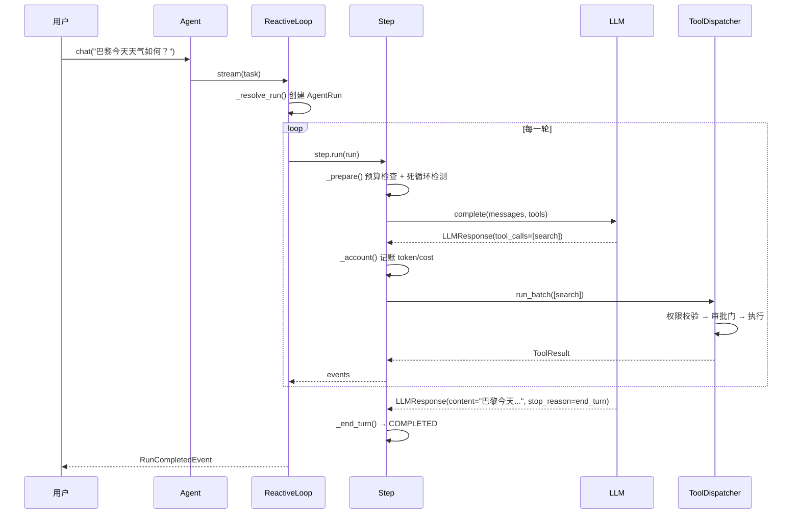

# 5 分钟上手

> 零文件、零旁路、零配置——跑通你的第一个 prodagent Agent。

---

## 最小可跑示例

```python
import asyncio
from prodagent import Agent, ExecutionMode, tool

@tool(name="search", readonly=True)
async def search(query: str) -> str:
    """搜索网络信息。"""
    return f"results for: {query}"

agent = Agent(
    "demo",
    system_prompt="你是一个 helpful assistant，使用工具回答问题。",
    tools=[search],
    mode=ExecutionMode.REACTIVE,
)

asyncio.run(agent.chat("巴黎今天天气如何？"))
```

就这么多。没有配置文件，没有环境变量，没有外部服务。

---

## 发生了什么？

让我们拆开这 10 行代码背后发生的完整链路：



**关键观察**：即使是最简单的调用，也经过了预算检查、死循环检测、工具调度、权限校验——这些不是可选的，是默认开启的安全网。

---

## 一键上生产全套

当你准备好上生产时，不需要重写代码，只需要换一个配置：

```python
from prodagent import Agent, AgentConfig
from prodagent.core.config import production

agent = Agent(
    "demo",
    tools=[search],
    config=AgentConfig(
        name="demo",
        framework=production(),  # ← 一键开启全套护甲
    ),
)
```

`production()` 开启了什么？

| 护甲 | 作用 |
|------|------|
| **落盘恢复** | 每轮 checkpoint 写入磁盘，进程被杀后从断点续跑 |
| **span 追踪** | 每轮推理、工具调用、消息穿越自动埋点 |
| **HIGH 工具审批门** | 有副作用的工具挂起等人确认 |
| **权限策略** | RBAC + 操作级授权，越权操作拦截并审计 |
| **LLM 缓存** | 语义缓存，重复请求不花钱 |
| **上下文压缩** | token 超阈值时自动分级压缩 |

---

## 三种执行模式

prodagent 不是"一种循环走天下"，它根据任务复杂度提供三种模式：

### 1. REACTIVE — 边走边想

```python
agent = Agent("demo", mode=ExecutionMode.REACTIVE)
```

- 每轮：想一步 → 做一步 → 看结果 → 再想
- 适合：探索式任务、不确定路径、需要根据中间结果调整
- 类比：开车去陌生地方，走一步看一步导航

### 2. PLAN_FIRST — 先规划后执行

```python
agent = Agent("demo", mode=ExecutionMode.PLAN_FIRST)
```

- 先让模型输出一个 DAG 计划，再按依赖关系执行
- 执行中可以增量重规划（审批被拒、步骤失败时）
- 适合：有明确步骤的复杂任务、需要并行执行的子任务
- 类比：装修前先出施工图，再按图施工

### 3. Workflow — 静态 DAG

```python
from prodagent.plan import Workflow, workflow_step

@workflow_step
def fetch_data(): ...

@workflow_step(depends_on=[fetch_data])
def analyze(): ...

workflow = Workflow([fetch_data, analyze])
```

- 完全预定义的 DAG，模型不参与规划
- 适合：确定性流程、合规要求固定路径的场景
- 类比：工厂流水线，每一步都是固定的

---

## 工具的副作用等级

不是所有工具都一样危险。prodagent 用 `SideEffectLevel` 区分：

```python
from prodagent import tool, SideEffectLevel

@tool(name="read_file", readonly=True)
async def read_file(path: str) -> str:
    """只读工具——可以并行执行，不需要审批。"""
    ...

@tool(name="send_email", side_effect=SideEffectLevel.HIGH)
async def send_email(to: str, body: str) -> str:
    """高副作用工具——执行前挂起等人审批。"""
    ...

@tool(name="delete_record", side_effect=SideEffectLevel.CRITICAL)
async def delete_record(id: str) -> str:
    """关键操作——需要二次确认 + 审计日志。"""
    ...
```

| 等级 | 并行 | 审批 | 审计 | 典型场景 |
|------|------|------|------|---------|
| READONLY | ✅ 并行 | 不需要 | 可选 | 查询、搜索、读取 |
| LOW | 串行 | 不需要 | 记录 | 缓存写入、临时文件 |
| HIGH | 串行 | **挂起等人** | 强制 | 发邮件、下单、调用外部 API |
| CRITICAL | 串行 | **二次确认** | 强制+告警 | 删除、转账、权限变更 |

---

## 离线运行：FakeLLM

学习和测试时，你不需要真实的 API key。prodagent 内置了精确可复现的 FakeLLM：

```python
from prodagent import FakeLLMAdapter, script
from prodagent.kernel.types import LLMResponse

# 方式 1：预设响应序列
fake_llm = FakeLLMAdapter(responses=[
    LLMResponse(content="", tool_calls=[{"name": "search", "args": {"query": "巴黎天气"}}]),
    LLMResponse(content="巴黎今天晴，25°C。", stop_reason="end_turn"),
])

# 方式 2：用 script 装饰器写可复现的多轮脚本
@script
def my_scenario():
    yield LLMResponse(tool_calls=[...])  # 第 1 轮
    yield LLMResponse(content="...")      # 第 2 轮

agent = Agent("demo", llm=fake_llm, tools=[search])
```

**为什么这很重要？** 因为 1,182 个测试全部用 FakeLLM，零 API key、零网络、零 flaky。你也可以用它精确复现某个 bug 场景。

---

## 下一步

- 想理解底层机制？→ [第一部分 · 一次调用的生命周期](tour/index.md)
- 想看真实场景？→ [9 个端到端示例](examples.md)
- 想深入某个生产问题？→ [第二部分 · 生产问题域](../index.md)
