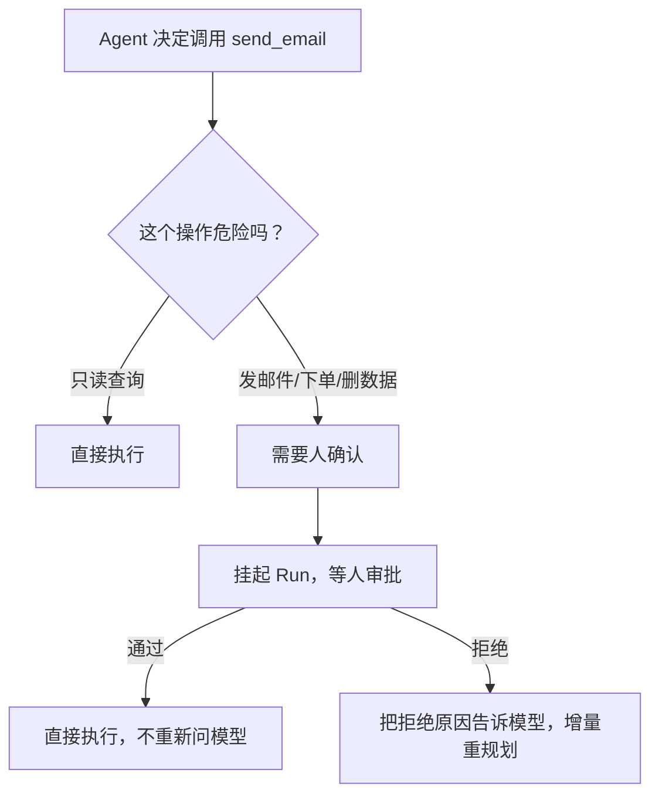
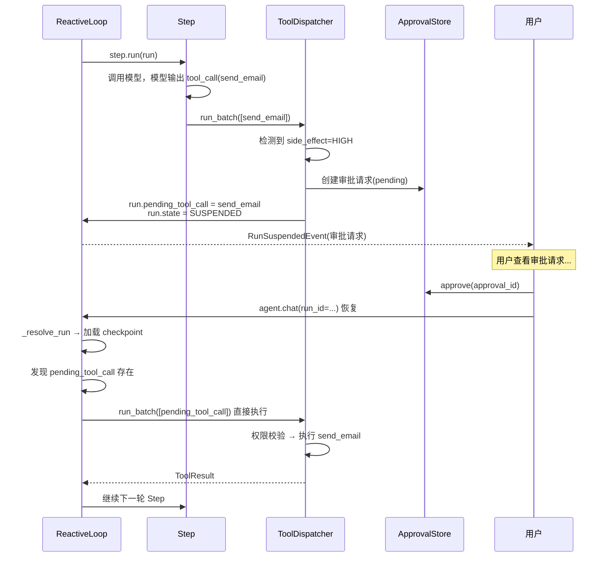
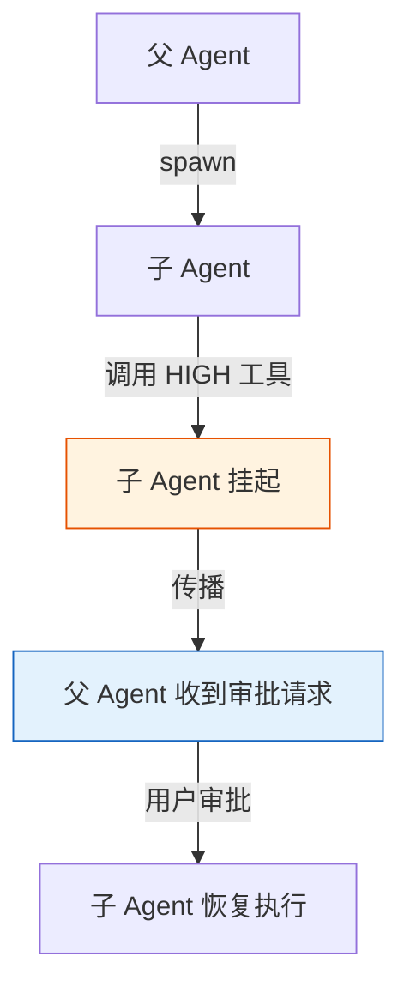

# HITL 审批：让危险操作挂起等人

> Agent 可以自主执行，但有些操作不能让它自己决定。这一站讲清楚审批门怎么工作、挂起后怎么恢复、审批拒绝后怎么增量重规划。

---

## 问题：Agent 能自己发邮件、删数据吗？



如果 Agent 可以自主执行任何操作，迟早会出事——发错邮件、删错数据、下错单。但如果每个操作都要人确认，Agent 就没有自主性了。

prodagent 的解法：**按副作用分级，只有 HIGH/CRITICAL 级别的操作需要审批。**

---

## 副作用等级

```python
from prodagent import tool, SideEffectLevel

@tool(name="read_file", readonly=True)
async def read_file(path: str) -> str: ...
# READONLY — 直接执行，可并行

@tool(name="write_cache", side_effect=SideEffectLevel.LOW)
async def write_cache(key: str, value: str) -> str: ...
# LOW — 直接执行，串行

@tool(name="send_email", side_effect=SideEffectLevel.HIGH)
async def send_email(to: str, body: str) -> str: ...
# HIGH — 挂起等人审批

@tool(name="delete_user", side_effect=SideEffectLevel.CRITICAL)
async def delete_user(user_id: str) -> str: ...
# CRITICAL — 二次确认 + 强制审计
```

| 等级 | 并行 | 审批 | 审计 | 典型场景 |
|------|------|------|------|---------|
| READONLY | ✅ | 不需要 | 可选 | 查询、搜索、读取 |
| LOW | ❌ 串行 | 不需要 | 记录 | 缓存写入、临时文件 |
| HIGH | ❌ 串行 | **挂起等人** | 强制 | 发邮件、下单、外部 API |
| CRITICAL | ❌ 串行 | **二次确认** | 强制+告警 | 删除、转账、权限变更 |

---

## 审批挂起的完整流程



### 关键设计 1：pending_tool_call

挂起时，把模型请求的工具调用存到 `run.pending_tool_call`：

```python
if tool.meta.side_effect >= SideEffectLevel.HIGH:
    run.pending_tool_call = call
    run.pending_approval_id = approval_id
    run.state = RunState.SUSPENDED
    yield RunSuspendedEvent(run=run)
    return  # 退出循环
```

为什么要存这个？因为审批通过后恢复时，**直接执行这个调用，不重新问 LLM**。

**为什么不重新问 LLM？**
- 重新问可能得到不同的结果（非确定性）
- 浪费 token 和时间
- 用户审批的是"这个具体的工具调用"，不是"重新生成一个"

### 关键设计 2：恢复时直接执行

```python
async def _loop_events(self, run):
    # 恢复 SUSPENDED run：重试挂起的工具调用，不重新问 LLM
    if run.pending_tool_call is not None:
        resumed_call = run.pending_tool_call
        run.pending_tool_call = None
        self._dispatcher.set_pending_approval_id(run.pending_approval_id)
        run.pending_approval_id = None
        async for evt in self._dispatcher.run_batch(run, [resumed_call]):
            yield evt
        self._check_budget(run)
        if run.state is RunState.SUSPENDED:
            yield RunSuspendedEvent(run=run)
            return
    # 正常循环...
```

恢复时检测到 `pending_tool_call`，跳过模型调用，直接执行工具。

---

## 审批拒绝：增量重规划

审批被拒时，不是把错误抛出去结束 Run，而是：

1. 把拒绝原因作为 ToolResult 写回消息历史
2. Run 保持 RUNNING 状态
3. 进入下一轮 Step，模型看到"这个操作被拒绝了，原因是 X"
4. 模型自己调整策略（换个方式、换个工具、或者放弃）

```python
# 审批拒绝
async def reject(approval_id, reason):
    approval = await store.get(approval_id)
    run = await checkpoint.load(approval.run_id)
    # 把拒绝原因作为工具结果写回
    result = ToolResult.from_error(
        ToolError.from_reason(
            ErrorReason.APPROVAL_REJECTED,
            message=f"审批被拒绝: {reason}",
            hint="请换一种方式完成任务，或者询问用户是否可以调整"
        )
    )
    run.messages.append({"role": "tool", "tool_call_id": ..., "content": str(result)})
    run.pending_tool_call = None
    run.state = RunState.RUNNING
    await checkpoint.save(run)
```

**为什么这样设计？**
- Agent 应该有能力从拒绝中恢复，而不是一被拒就崩溃
- "发邮件被拒"可能意味着"换个措辞再试"或"用站内信代替"
- 增量重规划比推倒重来更高效、更安全

> 这和 PLAN_FIRST 模式的增量重规划是同一个理念：失败不是终点，是调整的信号。

---

## 审批的持久化

审批请求通过 `ApprovalStore` 端口持久化：

```python
@runtime_checkable
class ApprovalStore(Protocol):
    async def create(self, request: ApprovalRequest) -> str: ...
    async def get(self, approval_id: str) -> ApprovalRequest | None: ...
    async def approve(self, approval_id: str, approver: str) -> None: ...
    async def reject(self, approval_id: str, reason: str, approver: str) -> None: ...
    async def list_pending(self) -> list[ApprovalRequest]: ...
```

默认用 MemoryApprovalStore（进程内），生产可以换 PostgresApprovalStore。

审批请求包含：
- `approval_id` — 唯一标识
- `run_id` — 关联的 Run
- `tool_name` / `tool_args` — 待执行的工具和参数
- `status` — pending / approved / rejected / expired
- `created_at` / `resolved_at` — 时间戳
- `approver` / `reason` — 审批人和原因

---

## 审批超时

审批不能无限等待。可以设置超时：

```python
# 审批请求 24 小时未处理则自动拒绝
approval = ApprovalRequest(..., expires_at=now + timedelta(hours=24))
```

超时后自动标记为 rejected，并触发增量重规划（和手动拒绝一样）。

---

## 多 Agent 场景的审批传播

父 Agent spawn 子 Agent 时，子 Agent 的 HIGH 工具审批可以传播到父 Agent 统一处理：



这样用户不需要在多个 Agent 之间切换审批，所有审批在父 Agent 层面统一处理。

---

## 与权限的关系

审批和权限是两个不同的机制：

| | 权限 | 审批 |
|---|------|------|
| **判断** | 这个 Agent 能不能做这个操作？ | 这个人同不同意这个具体操作？ |
| **时机** | 执行前自动检查 | 执行前挂起等人 |
| **结果** | 越权直接拒绝，不可恢复 | 可以通过或拒绝 |
| **类比** | 员工有没有权限访问财务系统 | 这笔 10 万的付款经理同不同意 |

两者是串联的：先过权限校验，再过审批门。权限不够的操作连审批都不会触发（直接拒绝）。

---

## 代码定位

| 内容 | 源码位置 |
|------|---------|
| SideEffectLevel | `kernel/types.py` |
| 审批门逻辑 | `tooling/dispatcher.py` |
| ApprovalStore 端口 | `ports/approval.py` |
| 审批 hooks | `hooks/approval/` |
| 挂起恢复 | `kernel/loop.py::_loop_events` |
| 审批拒绝处理 | `hooks/approval/reject.py` |
| Memory 后端 | `backends/memory/approval.py` |
| Postgres 后端 | `backends/postgres/approval.py` |

---

## 下一步

- 审批和恢复怎么配合？→ [崩溃恢复专题 →](recovery.md)
- 权限怎么和审批串联？→ [多 Agent 治理专题 →](governance.md)
- 想回到 tour？→ [第 ④ 站：工具系统 →](../tour/04-tools.md)
