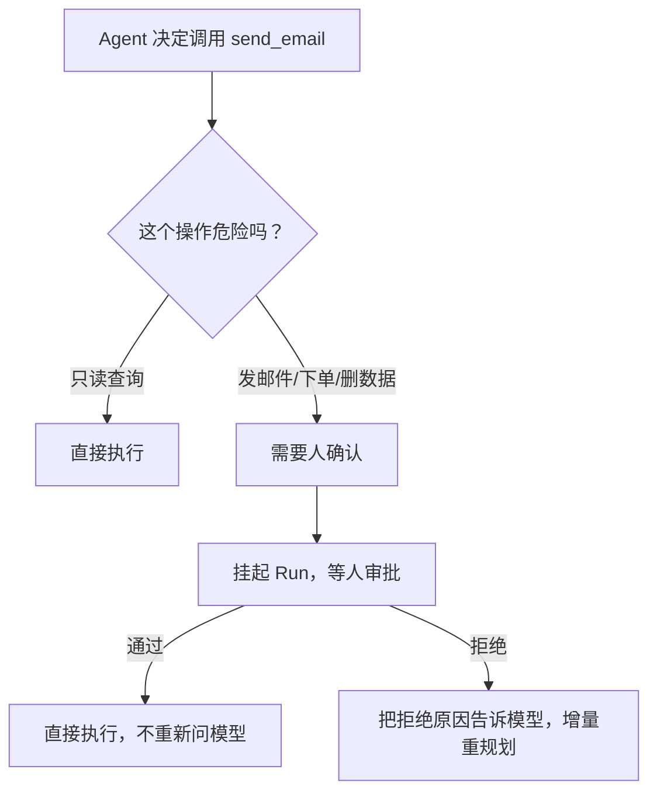
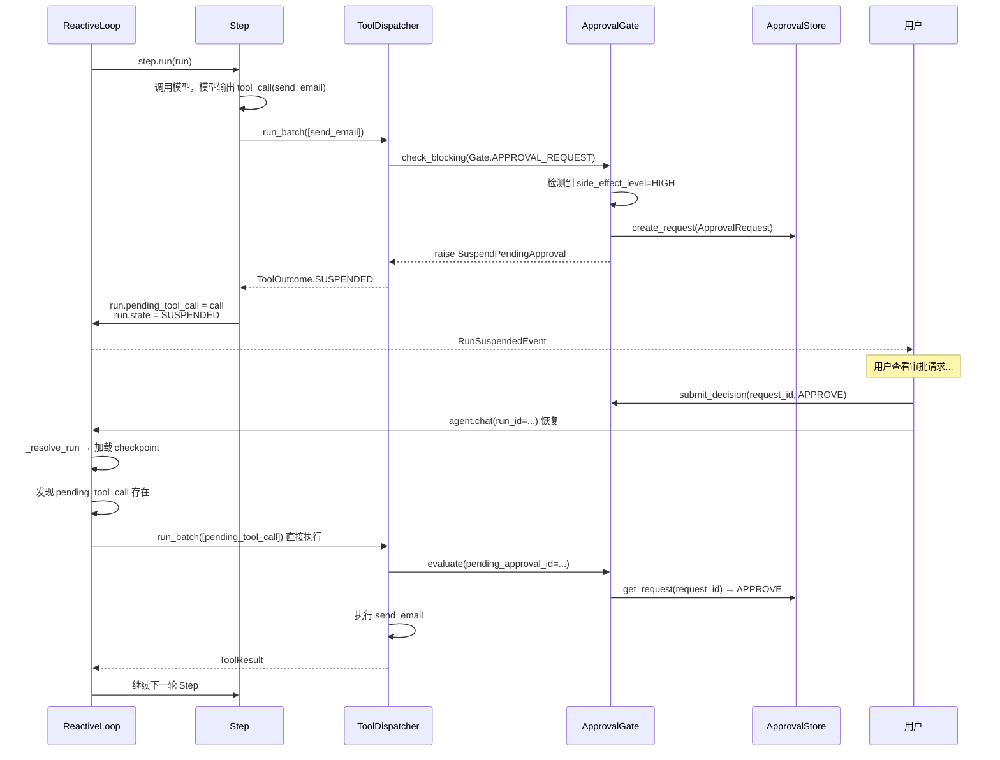

# HITL 审批：让危险操作挂起等人

> Agent 可以自主执行，但有些操作不能让它自己决定。这一站讲清楚审批门怎么工作、挂起后怎么恢复、审批拒绝后怎么增量重规划。

---

## 问题：Agent 能自己发邮件、删数据吗？



如果 Agent 可以自主执行任何操作，迟早会出事——发错邮件、删错数据、下错单。但如果每个操作都要人确认，Agent 就没有自主性了。

prodagent 的解法：**按副作用分级，只有 HIGH 级别的操作需要审批。**

---

## 副作用等级

```python
from prodagent import tool
from prodagent.kernel.types import SideEffectLevel, ToolMeta

@tool(name="search", readonly=True)
async def search(query: str) -> str:
    """只读工具——可并行，不需要审批。"""
    ...

@tool(name="write_cache")
async def write_cache(key: str, value: str) -> str:
    """LOW 副作用——串行执行，不需要审批。"""
    ...

@tool(
    name="send_email",
    meta=ToolMeta(name="send_email", side_effect_level=SideEffectLevel.HIGH),
)
async def send_email(to: str, body: str) -> str:
    """HIGH 副作用——执行前挂起等人审批。"""
    ...
```

| 等级 | 并行 | 审批 | 典型场景 |
|------|------|------|---------|
| `readonly=True` | ✅ 并行 | 不需要 | 查询、搜索、读取 |
| `LOW` | ❌ 串行 | 不需要 | 缓存写入、临时文件 |
| `MEDIUM` | ❌ 串行 | 不需要 | 非关键外部 API |
| `HIGH` | ❌ 串行 | **挂起等人** | 发邮件、下单、删除数据 |

> **注意**：SideEffectLevel 只有 LOW/MEDIUM/HIGH 三个值。只读不是第四个等级，而是 `ToolMeta.is_readonly: bool`。没有 CRITICAL 级别。

---

## 审批挂起的完整流程



### 关键设计 1：pending_tool_call

挂起时，把模型请求的工具调用存到 `run.pending_tool_call`。审批通过后恢复时，**直接执行这个调用，不重新问 LLM**。

**为什么不重新问 LLM？**
- 重新问可能得到不同的结果（非确定性）
- 浪费 token 和时间
- 用户审批的是"这个具体的工具调用"，不是"重新生成一个"

### 关键设计 2：恢复时直接执行

恢复时检测到 `pending_tool_call`，跳过模型调用，直接执行工具。审批 gate 通过 `pending_approval_id` 查到之前的审批决定。

---

## 审批拒绝：增量重规划

审批被拒时，不是把错误抛出去结束 Run，而是：
1. 把拒绝原因作为 ToolResult 写回消息历史
2. Run 保持 RUNNING 状态
3. 进入下一轮 Step，模型看到"这个操作被拒绝了，原因是 X"
4. 模型自己调整策略（换个方式、换个工具、或者放弃）

**为什么这样设计？**
- Agent 应该有能力从拒绝中恢复，而不是一被拒就崩溃
- "发邮件被拒"可能意味着"换个措辞再试"或"用站内信代替"
- 增量重规划比推倒重来更高效、更安全

> 这和 PLAN_FIRST 模式的增量重规划是同一个理念：失败不是终点，是调整的信号。

---

## ApprovalStore 端口

审批请求通过 `ApprovalStore` 端口持久化：

```python
@runtime_checkable
class ApprovalStore(Protocol):
    async def create_request(self, req: ApprovalRequest) -> None:
        """持久化新的待审批请求。对 request_id 幂等。"""
        ...

    async def get_request(self, request_id: str) -> ApprovalRequest | None:
        """返回请求，或 None。已决定的请求携带 decision 字段。"""
        ...

    async def submit_decision(
        self,
        request_id: str,
        decision: ApprovalDecision,  # APPROVE 或 REJECT
        approver_id: str = "",
    ) -> None:
        """记录审批决定。幂等：重复提交以最后一次为准。"""
        ...
```

```python
@dataclass
class ApprovalRequest:
    request_id: str           # 唯一标识（UUID）
    tool_name: str            # 待执行的工具名
    params: dict[str, object] # 工具参数
    context_summary: str      # 人类可读的上下文摘要
    run_id: str = ""          # 关联的 Run
    created_at: float = ...   # 创建时间戳
    decision: ApprovalDecision | None = None  # None=待审批
    decided_at: float | None = None
    approver_id: str | None = None

class ApprovalDecision(StrEnum):
    APPROVE = "approve"
    REJECT = "reject"
```

**多副本契约**：节点 A 挂起 Run 并写入审批请求，用户在任意节点 B 提交决定，节点 A（或任何从 checkpoint 恢复 Run 的节点）通过 `get_request` 读到决定后恢复。没有进程持有阻塞等待——恢复由重新调用 Run 驱动。

目前只有 memory 后端（`backends/memory/approval.py`）。生产环境需要多副本时，可以实现 `ApprovalStore` Protocol 接入 Redis/Postgres。

---

## 审批门的挂载

审批门通过三协议总线的 VETO 通道挂载：

```python
from prodagent.hooks.approval.gate import ApprovalGate
from prodagent.kernel.bus import Gate

gate = ApprovalGate(store=my_approval_store)
hooks.register_checker(Gate.APPROVAL_REQUEST, gate.evaluate)
```

`production()` profile 自动挂载审批门；`bare()` 不挂载。

---

## 与权限的关系

审批和权限是两个不同的机制：

| | 权限（Gate.TOOL_CALL） | 审批（Gate.APPROVAL_REQUEST） |
|---|---|---|
| **判断** | 这个 Agent 能不能做这个操作？ | 这个人同不同意这个具体操作？ |
| **时机** | 执行前自动检查 | 执行前挂起等人 |
| **结果** | 越权直接 BLOCKED，不可恢复 | 可以通过或拒绝，拒绝后可重规划 |
| **类比** | 员工有没有权限访问财务系统 | 这笔 10 万的付款经理同不同意 |

两者是串联的：先过权限校验，再过审批门。权限不够的操作连审批都不会触发（直接 BLOCKED）。

---

## 代码定位

| 内容 | 源码位置 |
|------|---------|
| SideEffectLevel / ToolMeta | `kernel/types.py` |
| 审批门 ApprovalGate | `hooks/approval/gate.py` |
| 审批上下文格式化 | `hooks/approval/formatter.py` |
| ApprovalStore 端口 | `ports/approval.py` |
| ApprovalRequest / ApprovalDecision | `ports/approval.py` |
| Memory 后端（唯一实现） | `backends/memory/approval.py` |
| 挂起/恢复逻辑 | `kernel/loop.py` `tooling/dispatcher.py` |
| SuspendPendingApproval 异常 | `base/errors.py` |

---

## 下一步

- 审批和恢复怎么配合？→ [崩溃恢复专题 →](recovery.md)
- 权限怎么和审批串联？→ [多 Agent 治理专题 →](governance.md)
- 想回到 tour？→ [第 ④ 站：工具系统 →](../tour/04-tools.md)
