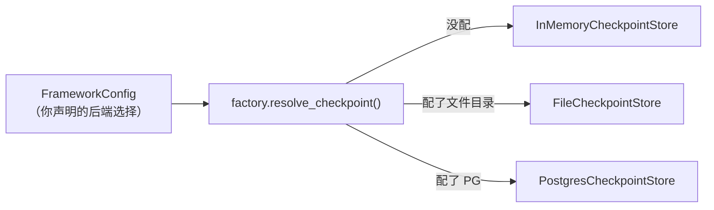
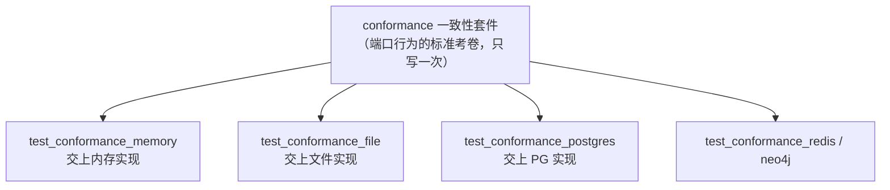

# 后端适配器：一个端口是怎么被"实现"出来的
> 端口只说"要什么能力"，后端回答"用什么介质落地"。这一篇看 prodagent 怎么让同一份能力，在内存、文件、Postgres、Redis、Neo4j 之间无缝替换，还保证行为不走样。

---

## 问题：换一个存储，凭什么不用改业务代码？
第 ② 站讲过，prodagent 的所有持久化能力都藏在端口（Protocol）后面：循环内核只认识 `CheckpointStore`、`CacheStore` 这些抽象，**完全不知道**数据到底放在内存、磁盘还是远端数据库。`backends/` 包就是这些端口的"实现集合"。它要同时回答三个问题：

1. 一个端口，怎么对应到多种介质上的实现？
2. 不同介质的并发特性天差地别（内存、文件锁、数据库事务、Redis 单线程），怎么各自保证正确性？
3. 凭什么相信"换了介质，行为完全一样"？

下面逐个拆开。

---

## 一张矩阵：每个端口有哪几种落地方式
prodagent 内置五族后端，按"介质从近到远"排列：

| 后端族 | 介质 | 实现了哪些端口 | 定位 |
|--------|------|---------------|------|
| `memory/` | 进程内 Python 对象 | 全部（checkpoint/session/event_log/document/graph/cache/dead_letter/approval/lock） | **默认值**：零依赖、最快，进程退出即消失，适合开发与测试 |
| `file/` | 本地磁盘文件（原子写） | checkpoint、session、event_log、document、experience、graph、span | 单机持久化，零外部服务，个人部署够用 |
| `postgres/` | Postgres 数据库 | checkpoint、session、event_log、document、span | 生产级多进程共享、可并发 |
| `redis/` | Redis | cache、dead_letter、lock | 高频缓存、队列与分布式锁 |
| `neo4j/` | Neo4j 图数据库 | graph | 实体关系复杂时的专用图引擎 |

注意这张表的**对角线设计**：不是"一个数据库包打天下"，而是**让每种介质干它最擅长的事**——缓存和锁天然适合 Redis，关系型状态适合 Postgres，图查询适合 Neo4j。而当你什么外部服务都没装时，`memory/` 族兜底，整个框架照样能跑。这和 LLM 的 Fake 兜底、记忆的哈希伪向量是同一种产品哲学：**默认零依赖可跑，生产环境按需升级，升级只换实现、不动业务。**

---

## factory：端口到实现的"总调度台"
谁来决定某个端口此刻用哪个实现？答案是 `backends/factory.py`——每个端口对应一个 `resolve_xxx()` 函数，从 `FrameworkConfig` 读出配置，返回对应实现：



这里有两个值得学的工程细节：

> **小白加餐：为什么用"函数内 import"？** 你会发现 `factory.py` 和 `registry.py` 里，真正 import redis/psycopg 驱动的语句都写在函数体内部，而不是文件顶部。这样一来，**没装 redis 依赖、也从不用 Redis 的人，根本不会因为缺这个包而报错**——只有当你真的走到 Redis 分支，那一行 import 才会执行。可选依赖因此不会变成强制门槛。

**辅助 LLM 也有独立解析。** 记忆分类、冲突裁决、技能蒸馏这些"后台杂活"用的是一个**辅助 LLM**（`resolve_aux_llm`），和主对话 LLM 分开；在离线、没配 key 的环境里，它拿到的不是会乱说话的 echo fake，而是一个固定返回 `{}` 的脚本适配器——因为这些后台任务的提示词本来就期待一个 JSON，`{}` 就是"本次无可提取内容"的空操作答案，安静而正确。

---

## registry：连接池只建一次，大家共用
Redis 客户端、Postgres 连接池都是**重资源**——建一条连接、开一个池都有不低的成本，绝不能每个 Store 各建一套。`backends/registry.py` 的 `BackendRegistry` 解决这件事：

```python
def redis_async_client(self):
    if self._redis_async is None:          # 第一次要才创建（懒加载）
        self._redis_async = redis_client_from_env(async_=True)
    return self._redis_async               # 之后都复用同一个
```

而且它是**"每份 FrameworkConfig 一个"**（`for_config` 挂在配置对象上）：同一套配置下的 checkpoint、cache、dead_letter 等多个 Store 共享同一批客户端/连接池；不同配置互不串扰。这是一个标准的"按需创建 + 缓存复用"模式，既避免了重复建连，又没有引入全局单例那种"谁都能改、难以隔离"的麻烦。

---

## _shared：把"与介质无关"的逻辑抽出来复用
文件后端和 Postgres 后端，介质完全不同，但有些逻辑是**一模一样**的，比如"一条记忆写进去时该补哪些字段、默认 TTL 怎么定"。这部分被抽到 `backends/_shared/`：

| 共享模块 | 被谁复用 | 抽出来的是什么 |
|---------|---------|---------------|
| `document_write.py` | file + postgres 的 DocumentStore | 把 `MemoryRecord` 构造成 `StoredMemory`、补默认 TTL 与时间戳的规则 |
| `graph_model.py` | file + memory 的 GraphStore | 同一套邻接表图模型（节点/边的增删查） |

判断标准和协作层的 `StageDriver` 如出一辙：**真正同构的逻辑只写一遍，真正依赖介质的部分（怎么落盘、怎么执行 SQL）留给各自后端。** 否则"记忆默认 TTL 是多少天"这种规则一旦在两处各写一份，迟早改漏一处，造成文件和数据库行为不一致。

---

## 正确性随介质而变：三种并发控制
这是后端适配里最有技术含量的部分。同一件事——"读出当前值 → 修改 → 写回"（read-modify-write）——在不同介质上要防的并发问题不同，prodagent 给出了三种各得其所的解法。

### 文件后端：flock 跨进程互斥锁
多个进程同时写同一个文件会互相覆盖。`file/_locking.py` 用操作系统提供的 `fcntl.flock` 给一次"读-改-写"全程上排他锁：

```python
@contextmanager
def _exclusive(lock_path):
    lf = lock_path.open("a+")
    _flock_exclusive(lf.fileno())   # 加锁，拿不到就等
    try:
        yield                        # 临界区：安全地读-改-写
    finally:
        _funlock(lf.fileno()); lf.close()
```

> **小白加餐：什么是读-改-写竞态？** 两个进程都读到余额=10，各自 +1 后写回，结果变成 11 而不是 12——这就是竞态。解法是把"读、改、写"三步变成一个**不可打断的整体**（临界区），flock 就是文件层面的这种保证，锁由操作系统在进程间生效，进程崩溃时 OS 也会自动释放。

一个诚实的降级：`fcntl` 是 POSIX 专属、Windows 没有。代码在 `ImportError` 时把锁降级为 **no-op（空操作）**，但同时用注释把**契约**讲清楚——Windows 上的文件后端只保证单进程使用，而单进程内 asyncio 事件循环本来就会把这段协程串行化，所以不需要锁。**不假装支持做不到的事，把边界写在明处**，这比留一个"看似跨平台、实则偶发丢数据"的实现负责得多。

### Postgres：事务级咨询锁 + 乐观版本号
数据库支持多连接并发，prodagent 在 `postgres/_versioned.py` 里用了"双保险"：

```sql
SELECT pg_advisory_xact_lock(hashtext(%s));   -- ① 按主键串行化写者，事务结束自动释放
-- ② 再比对版本号：若当前版本 ≠ 我预期的版本 → VersionConflict
```

- **咨询锁（advisory lock）** 让同一对象的写者排队，而且它绑定在事务上，`commit` 时自动释放——不产生需要清理的锁记录，进程崩了也不会留下死锁；
- **乐观版本号** 兜底：如果我读到的是第 3 版、准备基于它更新，却发现库里已经是第 4 版，说明有人抢先改了，直接抛 `VersionConflict`，而不是盲目覆盖。

为什么光有版本号还不够？模块注释点破了：**两个写者并发"插入"时，可能都读到"当前不存在（版本 0）"**，版本检查拦不住，必须靠咨询锁先把写者串行化。锁与版本，一个管排队、一个管发现冲突，缺一不可。

### Redis：键命名空间 + TTL
Redis 是共享的，多个应用、多套环境可能混用一个实例。`redis/keys.py` 给所有键统一加前缀：

```python
def namespaced_key(namespace, *parts):
    return ":".join(["prodagent", namespace, *parts])  # prodagent:{ns}:...
```

`prodagent:{namespace}:...` 的前缀让不同租户/环境的键互不撞车；缓存、死信这类"本就该过期"的数据再配上 TTL，到期自动清理，不依赖人工回收。这是用**约定 + 过期策略**代替重型锁，契合 Redis 单线程、擅长高频短数据的特性。

---

## 一致性测试：同一套考卷，谁都得考满分
前面说"换介质行为不走样"，这不是一句承诺，而是一套**可执行的测试**。`tests/backends/conformance/` 为每个端口定义了一份**一致性测试套件（conformance suite）**，规定"一个合格的 CheckpointStore 必须满足哪些行为"（版本递增、fork 隔离、并发冲突抛 VersionConflict……）。然后每个后端族只写一个薄薄的"考生入口"，把自己的实现送进同一套考题：



> **小白加餐：为什么这是很高级的设计？** 通常人测后端，会给每个后端各写各的测试，结果用例参差不齐，某个后端悄悄少实现了一种边界情况也没人发现。而"同一套考卷"把**端口契约变成了可执行的东西**：任何新后端（比如你想加一个 SQLite 实现）只要把实现填进同一套 conformance，跑过就证明它和既有后端行为一致。**抽象不再是文档里的一句话，而是一套能自动判分的测试。** 这正是端口/适配器架构能长期演进而不腐化的底气。

---

## 小结：后端适配层的三条设计审美
1. **默认零依赖、按需升级**：memory 兜底让框架离线可跑，重后端通过函数内 import 变成可选；
2. **同构只写一遍，异构各得其所**：`_shared` 复用与介质无关的规则，并发控制则尊重每种介质的真实特性（flock / 咨询锁+版本 / 命名空间+TTL）；
3. **契约可执行**：conformance 用同一套测试钉死"换介质不换行为"。

---

## 代码定位
| 内容 | 源码位置 |
|------|---------|
| 端口→实现解析总调度 | `backends/factory.py` |
| 共享客户端/连接池缓存 | `backends/registry.py` |
| 跨介质复用逻辑 | `backends/_shared/` |
| 文件锁（flock / Windows 降级） | `backends/file/_locking.py` |
| PG 咨询锁 + 乐观版本 | `backends/postgres/_versioned.py` |
| Redis 键命名空间 | `backends/redis/keys.py` |
| 五族后端实现 | `backends/{memory,file,postgres,redis,neo4j}/` |
| 一致性测试考卷 | `tests/backends/conformance/` |

---

## 下一步
- 外部工具怎么像本地工具一样接进来？→ [MCP 接入专题 →](mcp.md)
- 端口本身是怎么定义的？→ [第 ② 站：端口与适配器 →](../tour/02-ports.md)
- 底座的原子写、路径防火墙等工艺？→ [框架底座与装配 →](foundation.md)
