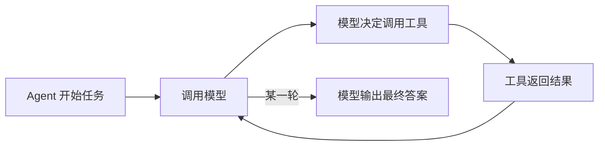
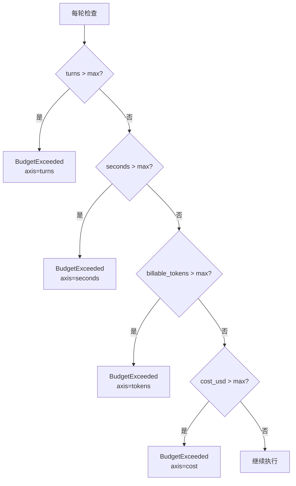
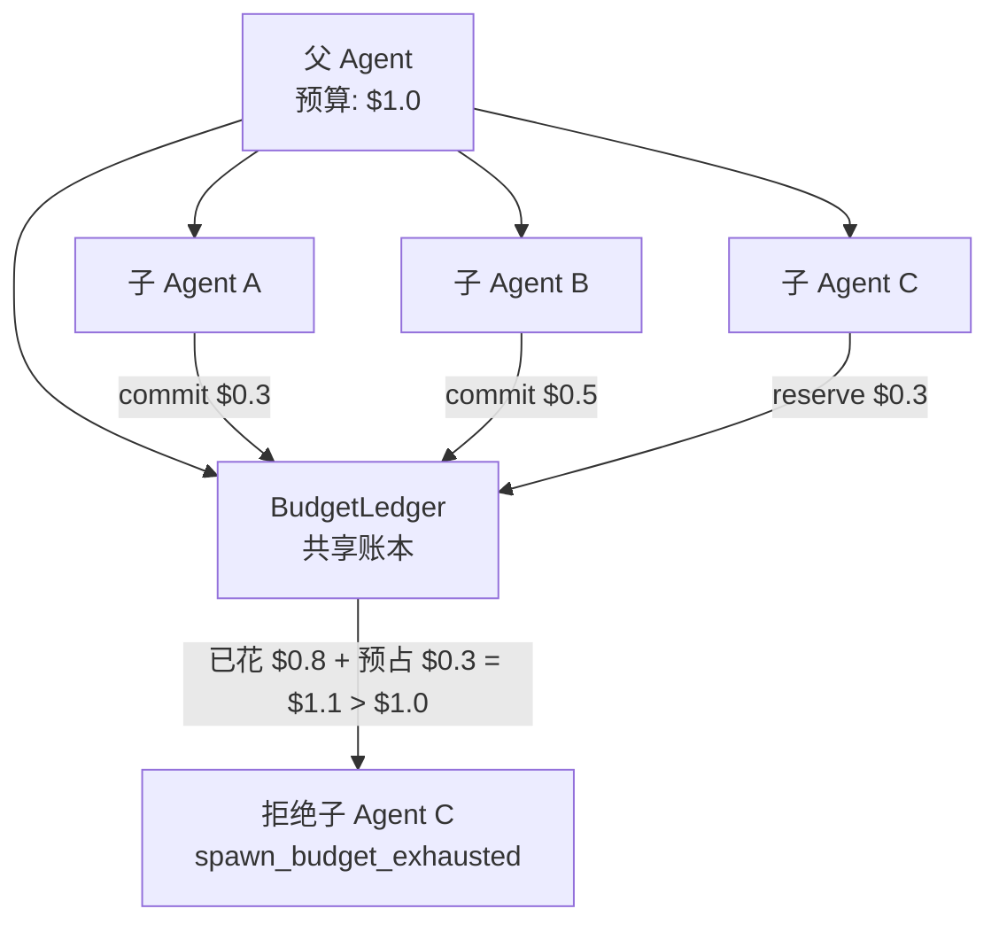

# 四轴预算：怎么让 Agent 不烧钱、不死循环

> 这是 prodagent 最有特色的机制。一个 `while True` 调模型的循环，没有预算就是定时炸弹。

---

## 问题：Agent 的成本为什么总是失控？



这个循环有三个失控风险：

1. **死循环** — 模型反复调用同一个工具，永远不输出答案
2. **烧 token** — 上下文越来越长，每轮 token 成本指数增长
3. **超时间** — 模型卡住了，请求挂着不返回

大多数框架的解法是一个 `max_iterations=10`。这够吗？远远不够。

---

## prodagent 的解法：四轴硬预算

```python
@dataclass
class HardBudget:
    max_turns: int = 20        # 最多多少轮
    max_seconds: float = 120.0 # 最多跑多久
    max_tokens: int = 100_000  # 最多消耗多少 billable token
    max_cost_usd: float = 1.0  # 最多花多少钱
```

**四轴同时生效，任一触顶即停。**



---

## 逐轴拆解

### 第一轴：turns — 轮数上限

最简单也最必要。`max_turns=20` 意味着最多调用 20 次模型。

**为什么不能只靠这个？** 因为 20 轮可能只花了 $0.01（短任务），也可能花了 $50（每轮都是 100k token 的长上下文）。轮数不能反映真实成本。

### 第二轴：seconds — 时间上限

```python
llm_timeout = max(0.1, self._budget.max_seconds - run.elapsed_seconds())
response = await asyncio.wait_for(coro, timeout=llm_timeout)
```

**关键点**：时间预算不是"跑完了再看超没超"，而是给每次模型调用设**硬超时**。剩余时间 = 总预算 - 已用时间，到点直接 `asyncio.wait_for` 掐断。

这防止了"模型 API 卡住了，Agent 挂了 10 分钟"的情况。

### 第三轴：tokens — billable token 上限

注意是 **billable tokens**，不是总 tokens：

```python
total_tokens = run.input_tokens + run.output_tokens + extra_tokens
billable_tokens = total_tokens - run.cache_read_tokens
```

**为什么减去 cache_read？**
- Anthropic 的 cache_read 只收 10% 费用
- OpenAI 的 cached input 只收 50% 费用
- 如果把 cache_read 全额计入预算，会出现"用了缓存反而更快耗尽预算"的反直觉行为

`cache_write` 呢？它是正常计费的（甚至有溢价），所以不减。

### 第四轴：cost — 真实美元成本

```python
def token_cost_usd(response, pricing):
    cache_read = response.cache_read_tokens or 0
    cache_write = response.cache_write_tokens or 0
    input_billed = max(0, response.input_tokens - cache_read - cache_write)
    return (
        input_billed / 1e6 * pricing.input_rate_per_million
        + response.output_tokens / 1e6 * pricing.output_rate_per_million
        + cache_read / 1e6 * pricing.input_rate_per_million * pricing.cache_read_discount   # 0.1x
        + cache_write / 1e6 * pricing.input_rate_per_million * pricing.cache_write_premium  # 1.25x
    )
```

这是最精确的轴。直接算美元，不同模型的费率差异自动体现。

**定价表从哪来？** `LLMConfig.__post_init__` 自动从模型名查定价表：
```python
if self.cost_per_million_input == 0.0 and self.cost_per_million_output == 0.0:
    from prodagent.llm.pricing import pricing_for_model
    table = pricing_for_model(self.model)
    if table is not None:
        self.cost_per_million_input = table.input_rate_per_million
        self.cost_per_million_output = table.output_rate_per_million
```

未知模型（包括 FakeLLM）定价为 0，cost 轴自动失效，不影响其他三轴。

---

## 检查时机：不是只查一次

```
Step.run()
├── _prepare()
│   └── _check_budget()  ← ① 这一轮还能不能开始？
├── _call_llm()
│   └── asyncio.wait_for ← ② 时间硬截止
├── _account()           ← 记账
├── _end_turn()?
└── runner.run_batch()
    └── _check_budget()  ← ③ 工具执行完还超不超？
```

**为什么查两次？**

| 检查点 | 防什么 |
|--------|--------|
| Step 开头 | 上一轮已经把预算花完了，这一轮不该开始 |
| 工具执行后 | 这一轮的模型调用可能消耗了大量 token，做完工具后可能已经超了 |

如果只在开头查，可能出现"开始时预算够，但这一轮模型调用花了 80k token，直接超了"的情况。

---

## 多 Agent 预算：BudgetLedger

单 Agent 的预算很简单。多 Agent 呢？如果父 Agent spawn 了 5 个子 Agent，每个子 Agent 各花各的预算，总预算怎么控制？

prodagent 的解法是 **BudgetLedger**——一个共享的账本，所有子 Agent 往里面记账。



### 三阶段记账：reserve / commit / release

```python
class BudgetLedger:
    async def reserve(self, *, member, turns=1, tokens=0, cost_usd=0):
        """预占——开始工作前先占位，让兄弟 Agent 看到这笔钱已经被预定了"""

    async def commit(self, *, member, turns, tokens, cost_usd,
                     reserved_turns=0, reserved_tokens=0, reserved_cost_usd=0):
        """实扣——工作完成后用真实花费替换预占"""

    async def release(self, *, member, reserved_turns=0, reserved_tokens=0, reserved_cost_usd=0):
        """退还——预占了但没实际花（比如锁竞争失败、任务重新入队）。
        只能退自己名下的预占：一个成员不能替别人释放额度"""
```

**为什么需要 reserve？**

想象 3 个子 Agent 并发执行，每个预计花 $0.4，总预算 $1.0：
- 没有 reserve：3 个同时开始，各花 $0.4，总共 $1.2 → 超预算了才发现
- 有 reserve：第 1 个 reserve $0.4（剩 $0.6），第 2 个 reserve $0.4（剩 $0.2），第 3 个 reserve $0.4 → 被拒绝

**reserve 是并发安全的闸门。**

### 数据结构

```python
@dataclass
class _Spend:
    turns: int = 0
    tokens: int = 0
    cost_usd: float = 0.0

@dataclass
class BudgetLedger:
    max: HardBudget
    _committed: _Spend = field(default_factory=_Spend)  # 永久实扣，只增不减
    _reserved: _Spend = field(default_factory=_Spend)   # 临时预占，commit 时冲销
    _reserved_by: dict[str, _Spend] = field(default_factory=dict)  # 按成员的预占明细
    _lock: asyncio.Lock = field(default_factory=asyncio.Lock)
```

- `_committed` — 已经实际花掉的，只增不减
- `_reserved` — 预占的，commit 时冲销，release 时退还
- `_reserved_by` — 按成员记账的预占明细，release 按持有者校验（账本不只是两个全局计数器）
- 检查时用 `committed + reserved` 与上限比较
- `seconds` 轴不参与 reserve/commit，直接用 wall-clock 时间
- 一个成员的执行中途崩溃：它占用的 turn 照记为已花（tokens/cost 无法得知记 0），而不是释放——否则崩溃循环的成员在 turns 轴上永远隐形

### 一个完整的生命周期

```
1. 子 Agent A 开始工作
   → ledger.reserve(member="A", cost_usd=0.3)
   → reserved: $0.3, committed: $0

2. 子 Agent B 开始工作
   → ledger.reserve(member="B", cost_usd=0.3)
   → reserved: $0.6, committed: $0

3. 子 Agent A 完成，实际花了 $0.25
   → ledger.commit(member="A", cost_usd=0.25, reserved_cost_usd=0.3)
   → reserved: $0.3（冲销了 A 的预占）, committed: $0.25

4. 子 Agent C 想开始，预计 $0.6
   → ledger.reserve(member="C", cost_usd=0.6)
   → 检查: committed $0.25 + reserved $0.3 + 新预占 $0.6 = $1.15 > $1.0
   → 拒绝，返回 spawn_budget_exhausted
```

### 结算信封：会计政策只有一个家

reserve → act → commit 这套纪律，spawn 的子 Agent、舞台的成员、接力链的每一跳都在执行。prodagent 把它封装成一个函数（`run_enveloped`），所有花钱的地方委托同一个信封。原因很朴素：**政策一旦有多处实现，就必然漂移**——今天两处一致，三个月后一处修了边界条件、另一处没跟上；差异不表现为报错，只表现为某一类成员悄悄多花或少花。

信封里最反直觉的一条：**失败的尝试也 commit，不 release**。崩溃成员占掉的那个 turn 槽是真实消耗——若归还，一个不断崩溃的成员会在 turns 轴上永远隐形，预算注视着一个并不存在的健康系统。记账的原则与日志同源：宁可多记一笔可核销的，不可漏记一笔真实的。

这条等式——任意操作序列下 `spent == committed + reserved`——如今作为定律接受任意输入的机器检验（见[测试与评估专题](evaluation.md)）。账目的可靠性不是被抽查的，是被证明的。

---

## 预算耗尽时发生什么？

```python
except BudgetExceeded as exc:
    yield await self._settle_terminated(run, exc)

async def _settle_terminated(self, run, exc):
    run.state = RunState.FAILED
    run.last_error = str(exc)
    run.error = classify_error(exc, layer=ErrorLayer.RUNTIME)
    await self._end_run_span(run, error=str(exc))
    return RunFailedEvent(run=run, error=str(exc))
```

- Run 标记为 `FAILED`
- 错误信息包含具体哪个轴超了、数值是多少、上限是多少
- span 追踪记录错误
- checkpoint 保存最终状态（可以事后分析为什么超预算）

**不会**：静默截断、丢失已完成的工作、影响其他并发的 Agent。

---

## 默认值的设计哲学

```python
SAFETY_NET_BUDGET = HardBudget(
    max_turns=20,
    max_seconds=120.0,
    max_tokens=100_000,
    max_cost_usd=1.0,
)
```

默认值偏保守。注释写得很清楚：

> *Conservative defaults: unattended runs fail fast rather than burning quota.*

**无人值守的任务应该快速失败，而不是慢慢烧钱。** 用户需要更大预算时显式配置，而不是反过来——默认无限、用户忘了配就烧 $100。

---

## 与其他框架的对比

| 框架 | 预算维度 | 多 Agent 共享 | 时间硬截止 | 缓存感知 |
|------|---------|-------------|-----------|---------|
| **prodagent** | turns/seconds/tokens/cost 四轴 | BudgetLedger reserve/commit | asyncio.wait_for | billable = total - cache_read |
| LangChain | max_iterations 单轴 | 无 | 无 | 无 |
| LangGraph | recursion_limit 单轴 | 无 | 无 | 无 |
| AutoGen | max_rounds 单轴 | 无 | 无 | 无 |
| CrewAI | max_iterations + 超时 | 部分 | 有 | 无 |

---

## 代码定位

| 内容 | 源码位置 |
|------|---------|
| HardBudget 定义 | `kernel/budget.py` |
| 单 Agent 预算检查 | `kernel/budget.py::check_budget` |
| BudgetLedger | `kernel/budget.py::BudgetLedger` |
| 四轴评估函数 | `kernel/budget.py::evaluate_axes` |
| 预算异常 | `base/errors.py::BudgetExceeded` |
| 定价表 | `llm/pricing.py` |
| 成本计算 | `ports/llm.py::token_cost_usd` |

---

## 下一步

- 想看崩溃恢复怎么和预算配合？→ [崩溃恢复专题](recovery.md)
- 想看审批挂起时预算怎么计时？→ [HITL 审批专题](approval.md)
- 想回到生命周期 tour？→ [第 ⑤ 站：循环内核](../tour/05-loop.md)
