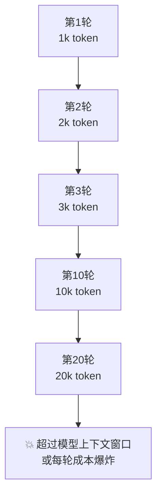
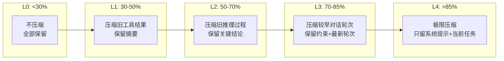
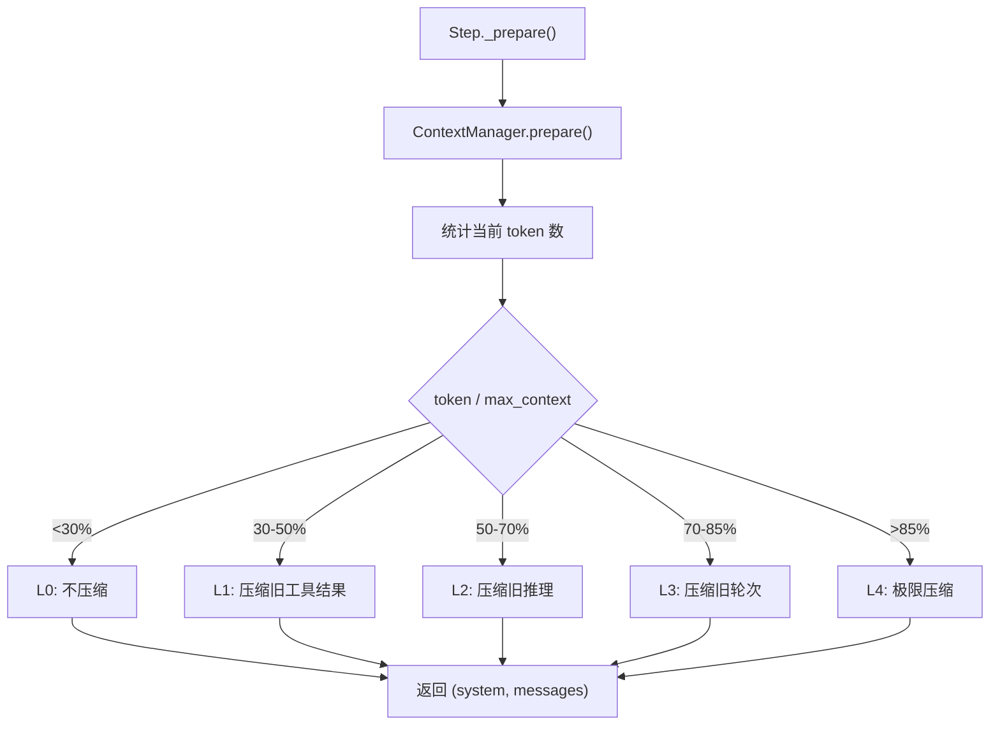

# 五级上下文压缩：让长任务不爆 token

> Agent 跑久了，上下文越来越长，每轮成本指数增长。这一站讲清楚为什么需要压缩、五级策略怎么分级、关键约束怎么保证不被压缩掉。

---

## 问题：上下文为什么会爆？



一个深度研究任务可能跑 20-50 轮。每轮的消息都追加到历史里，上下文长度线性增长，但**成本是超线性增长的**（因为每轮都要把整个历史发给模型）。

到第 20 轮时，单次模型调用可能就要处理 20k token，花费是第 1 轮的 20 倍。

---

## 解法：分级压缩

不是"到阈值了就一刀切"，而是**按 token 占比分五级，每级牺牲不同的东西，保留最关键的信息**。



---

## 五级策略详解

### L0：不压缩（< 30% 上下文）

```
系统提示 + 完整消息历史 + 工具结果 + 推理过程
```

上下文充裕时，什么都不压缩。模型看到完整的信息。

### L1：压缩旧工具结果（30-50%）

**牺牲**：较早轮次的工具结果详情
**保留**：工具结果的摘要（前 N 行或关键信息）

```
原始: search("巴黎天气") → "巴黎今天晴，25°C，湿度60%，风速10km/h，..." (500 token)
压缩后: search("巴黎天气") → "[工具结果摘要] 巴黎今天晴，25°C" (20 token)
```

**为什么先压缩工具结果？** 因为工具结果通常最长（搜索结果、文件内容可能几千 token），但模型通常只需要关键信息，不需要完整原文。

### L2：压缩旧推理过程（50-70%）

**牺牲**：较早轮次的 reasoning_content（思维链）
**保留**：模型的最终结论和决策

推理过程可能很长（特别是 R1 类模型），但对后续轮次来说，"模型是怎么想通的"不重要，"模型得出了什么结论"才重要。

### L3：压缩较早对话轮次（70-85%）

**牺牲**：较早的完整对话轮次（user + assistant + tool）
**保留**：
- 系统提示（永远保留）
- 当前任务（第一轮 user 消息，永远保留）
- 关键约束（用户说过的"预算 20 元"、"不要用 XX"等）
- 最近 N 轮的完整对话

```
[系统提示] ← 永远保留
[任务: 帮我规划巴黎旅行，预算 20 元] ← 永远保留
[第1-5轮: 已压缩为摘要] ← 牺牲
[第6-10轮: 完整保留] ← 保留
```

### L4：极限压缩（> 85%）

**牺牲**：除系统提示和当前任务外的几乎所有内容
**保留**：
- 系统提示
- 当前任务
- 不可丢失的约束（从历史中提取的关键规则）
- 最近 1-2 轮

这是最后的安全网。到了这个级别，说明任务已经非常长了，模型只能基于最近的上下文继续工作。

---

## 关键约束：什么绝对不能压缩？

不是所有内容都可以压缩。有些信息丢了会导致 Agent 行为异常：

| 不可压缩内容 | 原因 |
|-------------|------|
| 系统提示 | Agent 的行为准则，丢了就不知道自己该做什么 |
| 当前任务（第一条 user 消息） | 丢了就不知道自己在做什么 |
| 用户明确的约束和偏好 | "预算 20 元"、"不要发邮件"等，丢了会违反用户意愿 |
| 最近 1-2 轮完整对话 | 模型需要最近的上下文继续推理 |
| pending_tool_call 相关消息 | 审批挂起恢复时需要完整的工具调用信息 |

ContextManager 在压缩时会识别并保留这些内容。**约束提取**是关键——从历史消息中识别出"用户说过的硬约束"，单独保存，不被压缩掉。

---

## 压缩是怎么触发的？



每轮 Step 开始前，ContextManager 计算当前 token 占比，决定压缩级别，然后返回压缩后的 `(system, messages)`。

**注意**：压缩只影响"模型看到的视图"，不修改 `run.messages` 原始历史。原始消息完整保存在 Run 里，checkpoint 落盘的是完整历史。这样：
- 恢复时可以重新压缩（可能用不同的策略）
- 事后分析可以看到完整的对话
- 压缩是无副作用的只读操作

---

## Spill：超长工具结果的溢出存储

有些工具结果特别长（比如读取一个大文件、搜索返回 50 条结果），即使在 L0 级别也可能撑爆上下文。

`ToolResultSpillStore` 处理这种情况：
- 工具结果超过阈值时，完整内容存到外部存储（文件/数据库）
- 消息历史里只保留摘要 + spill_id
- 模型需要详情时，可以通过"读取 spill"工具获取完整内容

```
原始: read_file("big.log") → "10000 行日志..." (50k token)
Spill后: read_file("big.log") → "[结果已溢出，spill_id=abc123，摘要: 包含3个ERROR...]" (50 token)
```

这和压缩是互补的：压缩是"把已有内容变短"，spill 是"把超长内容移出去"。

---

## 与记忆系统的关系

压缩和记忆是两个不同的机制：

| | 压缩 | 记忆 |
|---|------|------|
| **时机** | 每轮动态计算，即时生效 | 跨 Run 持久化，召回时注入 |
| **范围** | 当前 Run 的消息历史 | 所有 Run 的经验和知识 |
| **目标** | 控制当前上下文长度 | 跨任务复用经验 |
| **存储** | 不存储，只修改视图 | 持久化到记忆存储 |

两者配合：压缩保证当前 Run 不爆 token，记忆保证跨 Run 不丢失重要信息。

---

## 代码定位

| 内容 | 源码位置 |
|------|---------|
| ContextManager | `cognition/context/manager.py` |
| 五级压缩策略 | `cognition/context/compressor.py` |
| 约束提取 | `cognition/context/constraints.py` |
| Spill 存储 | `cognition/context/spill.py` |
| ContextConfig | `core/config.py` |
| Step 中的调用 | `kernel/step.py::_prepare` |

---

## 下一步

- 压缩和记忆怎么配合？→ [四通道记忆专题 →](memory.md)
- 长任务的预算怎么控制？→ [四轴预算专题 →](budget.md)
- 想回到 tour？→ [第 ⑤ 站：循环内核 →](../tour/05-loop.md)
