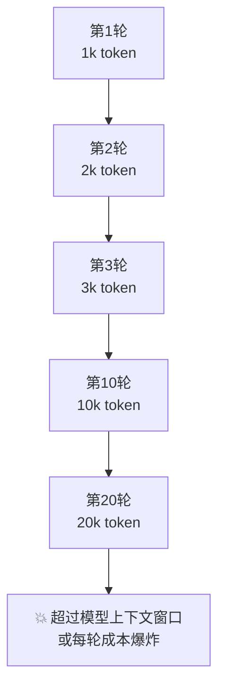
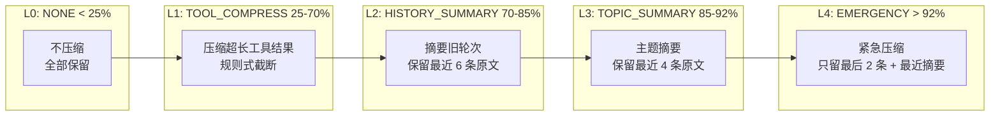
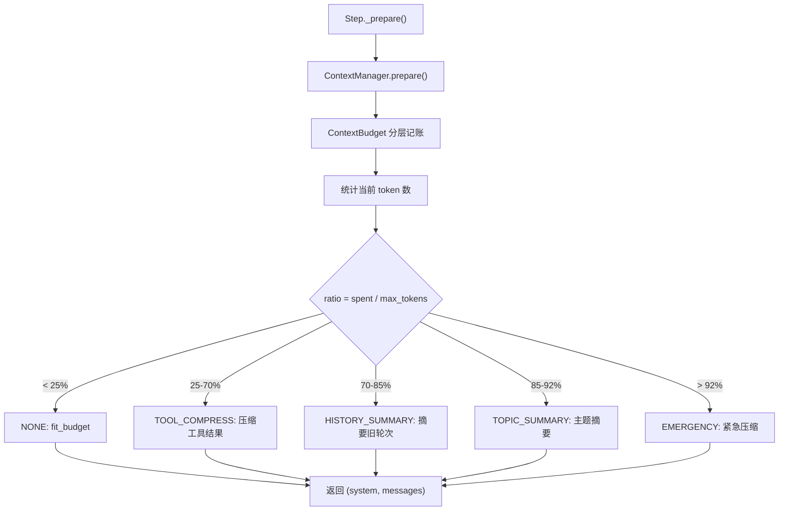

# 五级上下文压缩：让长任务不爆 token

> Agent 跑久了，上下文越来越长，每轮成本超线性增长。这一站讲清楚为什么需要压缩、五级策略怎么分级、关键约束怎么保证不被压缩掉。

---

## 问题：上下文为什么会爆？



一个深度研究任务可能跑 20-50 轮。每轮的消息都追加到历史里，上下文长度线性增长，但**成本是超线性增长的**（因为每轮都要把整个历史发给模型）。

到第 20 轮时，单次模型调用可能就要处理 20k token，花费是第 1 轮的 20 倍。

---

## 解法：分级压缩

不是"到阈值了就一刀切"，而是**按 token 占比分五级，每级牺牲不同的东西，保留最关键的信息**。



**触发阈值**（`ContextConfig` 默认值）：

| 级别 | 阈值（token / max_context） | 触发条件 |
|------|---------------------------|---------|
| NONE | < 25% | 上下文充裕，不压缩 |
| TOOL_COMPRESS | ≥ 25% | 工具结果开始挤占空间 |
| HISTORY_SUMMARY | ≥ 70% | 历史太长，需要摘要 |
| TOPIC_SUMMARY | ≥ 85% | 接近上下文窗口 |
| EMERGENCY | ≥ 92% | 极限情况，保命模式 |

---

## 五级策略详解

### L0：NONE — 不压缩（< 25%）

```
系统提示 + 完整消息历史 + 工具结果
```

上下文充裕时，什么都不压缩。但仍然会做 `fit_budget`——确保消息总量不超过分配给历史层的 token 预算（保留最长尾部）。

### L1：TOOL_COMPRESS — 压缩超长工具结果（25%-70%）

**牺牲**：超长工具结果的详情
**保留**：工具结果的关键字段（规则式提取，不调 LLM）

```
原始: search("巴黎天气") → "巴黎今天晴，25°C，湿度60%，风速10km/h，气压1013hPa，..." (500 token)
压缩后: search("巴黎天气") → "[工具结果摘要] 巴黎今天晴，25°C，湿度60%..." (50 token)
```

**为什么先压缩工具结果？** 因为工具结果通常最长（搜索结果、文件内容可能几千 token），但模型通常只需要关键信息。这一步是**纯规则式**的（`compress_tool_result`），不调用 LLM，零额外成本和延迟。

### L2：HISTORY_SUMMARY — 历史摘要（70%-85%）

**牺牲**：较早轮次的完整对话
**保留**：最近 6 条消息原文 + 旧消息的 LLM 生成摘要

```
[HISTORY SUMMARY]
用户要求调研 X 技术。第1-3轮搜索了官方文档和社区评价，
发现 X 适用于 Y 场景但不适合 Z。第4-8轮对比了3个替代方案...

[最近 6 条消息原文保留]
```

摘要是通过 LLM 调用生成的（`Summariser.summarise`），把旧消息压缩成一段连贯的摘要。`safe_tail_start` 确保尾部不会从 tool_result 中间切开（保持 tool_use/tool_result 配对完整）。

### L3：TOPIC_SUMMARY — 主题摘要（85%-92%）

**牺牲**：更多旧轮次
**保留**：最近 4 条消息原文 + 更激进的主题级摘要

和 L2 类似，但保留窗口更短（4 条 vs 6 条），摘要更凝练。这是"模型只能看到最近几轮 + 高度压缩的历史"的级别。

### L4：EMERGENCY — 紧急压缩（> 92%）

**牺牲**：除最后 2 条消息和最近摘要外的几乎所有内容
**保留**：
- 最后 2 条消息原文
- 最近的一条 HISTORY/TOPIC SUMMARY（如果存在）

```
[HISTORY SUMMARY]
...（之前的摘要保留）...

[最后 2 条消息原文]
```

这是最后的安全网。到了这个级别，说明任务已经非常长了，模型只能基于最近的上下文继续工作。

---

## 上下文分层：L0-L3 不是压缩级别

容易混淆的是：源码中还有 `Layer` 枚举（L0/L1/L2/L3），但这是**上下文窗口的分层预算**，不是压缩级别：

| 层 | 占比 | 内容 |
|---|---|---|
| L0 | 8% | 系统提示（永远保留） |
| L1 | 15% | 状态信息（当前任务、待办等） |
| L2 | 35% | 记忆注入 + 技能 + Floor/Board 视图 |
| L3 | 42% | 对话历史（压缩作用在这一层） |

ContextBudget 按层分配 token 预算，压缩器只处理 L3（历史层）。L0 的系统提示永远不会被压缩。

---

## 压缩是怎么触发的？



每轮 Step 开始前，`HistoryCompressor.run()` 从最温和的级别开始检查，选择第一个 `should_skip()` 返回 False 的级别执行。

**关键特性**：压缩只影响"模型看到的视图"，**不修改 `run.messages` 原始历史**。原始消息完整保存在 Run 里，checkpoint 落盘的是完整历史。这样：
- 恢复时可以重新压缩（可能用不同的策略）
- 事后分析可以看到完整的对话
- 压缩是无副作用的只读操作

---

## Spill：超长工具结果的溢出存储

有些工具结果特别长（比如读取一个大文件、搜索返回 50 条结果），即使在 L0 级别也可能撑爆上下文。

`ToolResultSpillStore` 处理这种情况：
- 工具结果超过阈值时，完整内容存到外部存储（文件/数据库）
- 消息历史里只保留摘要 + spill_id
- 模型需要详情时，可以通过内置的 `read_tool_result` 工具获取完整内容

```
原始: read_file("big.log") → "10000 行日志..." (50k token)
Spill后: read_file("big.log") → "[结果已溢出，spill_id=abc123，摘要: 包含3个ERROR...]" (50 token)
```

这和压缩是互补的：压缩是"把已有内容变短"，spill 是"把超长内容移出去"。

---

## 与记忆系统的关系

压缩和记忆是两个不同的机制：

| | 压缩 | 记忆 |
|---|------|------|
| **时机** | 每轮动态计算，即时生效 | 跨 Run 持久化，召回时注入 |
| **范围** | 当前 Run 的消息历史 | 所有 Run 的经验和知识 |
| **目标** | 控制当前上下文长度 | 跨任务复用经验 |
| **存储** | 不存储，只修改视图 | 持久化到记忆存储 |
| **注入层** | L3（历史层） | L2（记忆层） |

两者配合：压缩保证当前 Run 不爆 token，记忆保证跨 Run 不丢失重要信息。

---

## 代码定位

| 内容 | 源码位置 |
|------|---------|
| CompressionLevel 枚举 / TokenCounter / fit_within_budget | `cognition/context/budget.py` |
| Layer 枚举 / ContextBudget | `cognition/context/budget.py` |
| ContextManager | `cognition/context/manager.py` |
| 五级压缩管道（HistoryCompressor + 各 Stage） | `cognition/context/compression/pipeline.py` |
| 工具结果压缩（规则式） | `cognition/context/compression/formatting.py` |
| LLM 摘要器 | `cognition/context/compression/summarizer.py` |
| Spill 存储 | `cognition/context/spill.py` |
| ContextConfig（阈值配置） | `base/config.py` |

---

## 下一步

- 压缩和记忆怎么配合？→ [四通道记忆专题 →](memory.md)
- 长任务的预算怎么控制？→ [四轴预算专题 →](budget.md)
- 想回到 tour？→ [第 ⑤ 站：循环内核 →](../tour/05-loop.md)
