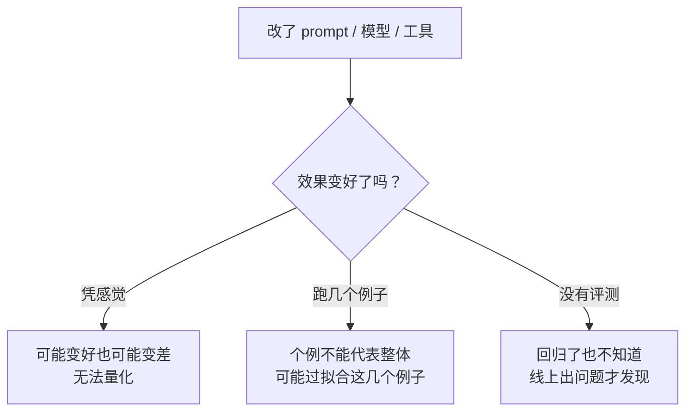
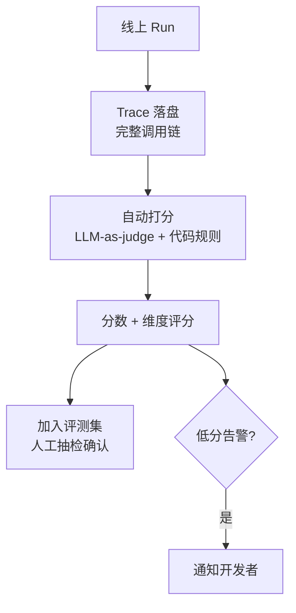
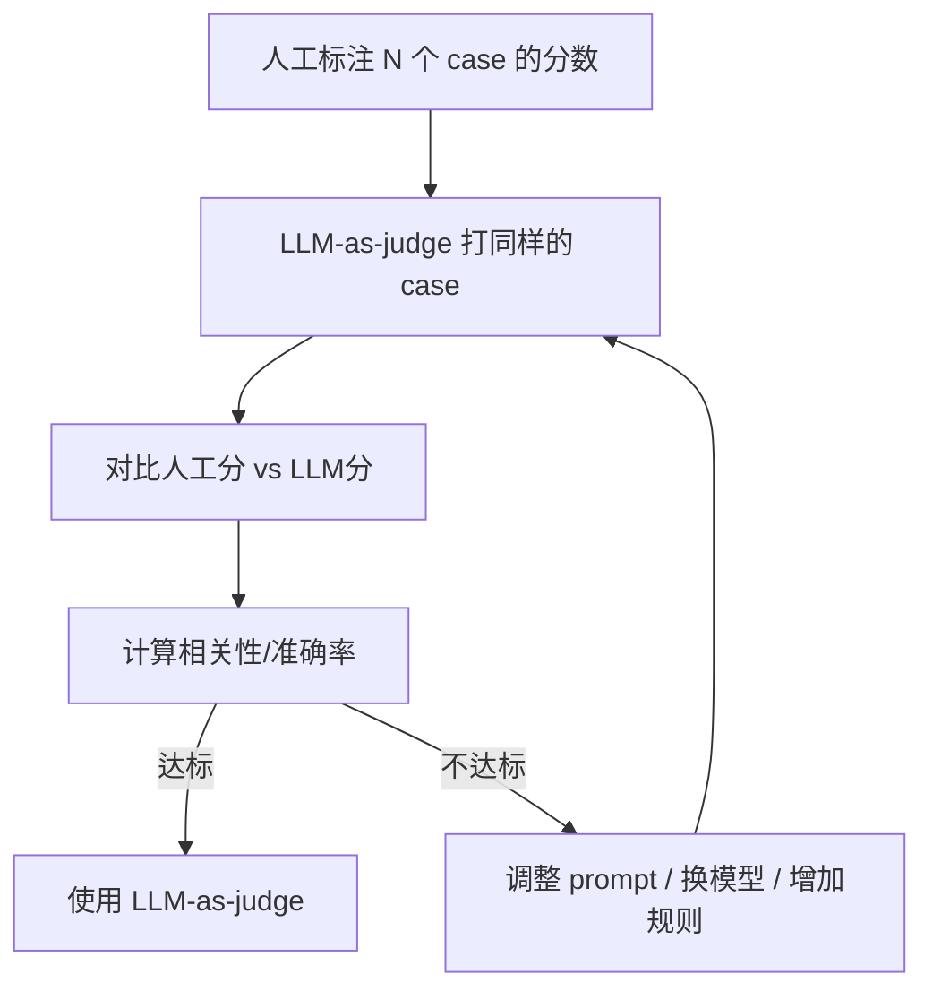
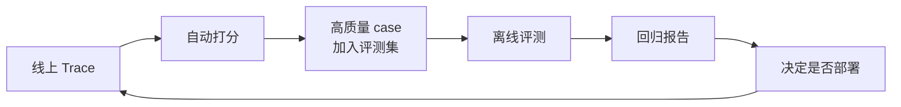

# 评估与回归：怎么知道改了一版是变好还是变差

> Agent 系统最难的不是写出来，是持续迭代。这一站讲清楚离线评测、线上 Trace 打分、LLM-as-judge 校准、评测集污染检测。

---

## 问题：改了一版 prompt，怎么知道变好还是变差？



传统软件有单元测试和集成测试，改了代码跑一遍就知道有没有回归。Agent 系统的输出是自然语言，"对不对"没有标准答案，评估要难得多。

prodagent 的解法：**离线评测 + 线上 Trace 自动打分 + 回归对比，三位一体。**

---

## 一、离线评测

### 评测集结构

```python
@dataclass
class EvalCase:
    case_id: str
    task: str                    # 给 Agent 的任务
    expected: str | None         # 期望输出（可选，有些任务没有标准答案）
    reference_tools: list[str]   # 期望调用的工具（可选）
    constraints: list[str]       # 必须满足的约束
    difficulty: str              # easy / medium / hard
    tags: list[str]              # 分类标签
```

评测集是结构化的，不是一堆散乱的 prompt。每个 case 有明确的评估维度。

### 评估维度

| 维度 | 评估方式 | 说明 |
|------|---------|------|
| **任务完成度** | LLM-as-judge / 人工 | 最终输出是否完成了任务 |
| **工具使用正确性** | 代码规则 | 是否调用了正确的工具、参数是否正确 |
| **约束满足** | 代码规则 / LLM-as-judge | 是否遵守了用户的约束（预算、格式等） |
| **效率** | 自动指标 | 用了多少轮、多少 token、多少钱 |
| **安全性** | 代码规则 | 是否有越权操作、是否触发了审批 |
| **恢复能力** | 代码规则 | 遇到错误是否能自我修正 |

### 运行评测

```bash
# 跑全部评测集
prodagent eval run --suite v1.0 --config agent_config.yaml

# 只跑某个分类
prodagent eval run --suite v1.0 --tags research

# 对比两个配置
prodagent eval compare --baseline config_v1.yaml --candidate config_v2.yaml
```

输出：
```
评测结果: suite=v1.0, cases=120
  任务完成度: 87.5% (baseline: 82.1%) ↑
  工具正确率: 94.2% (baseline: 91.7%) ↑
  平均轮数: 8.3 (baseline: 10.1) ↓ (更好)
  平均成本: $0.042 (baseline: $0.058) ↓ (更好)
  回归用例: 2 (需要关注)
  提升用例: 15
```

---

## 二、线上 Trace 自动打分

离线评测覆盖不了所有场景。线上的真实流量更有价值。



### 打分方式

1. **代码规则**（确定性，零成本）：
   - 工具调用是否成功
   - 是否触发了预算耗尽
   - 最终输出是否为空
   - 是否有越权操作被拦截

2. **LLM-as-judge**（需要模型调用，有成本）：
   - 任务完成度评分（1-5 分）
   - 输出质量评分
   - 是否遵守了约束

3. **人工标注**（最高质量，最高成本）：
   - 抽样人工审核
   - 用于校准 LLM-as-judge

---

## 三、LLM-as-judge 校准

LLM-as-judge 不是完美的。它有偏差：

| 偏差类型 | 表现 | 校准方法 |
|---------|------|---------|
| **位置偏差** | 更喜欢第一个选项 | 随机化顺序，多次打分取平均 |
| **宽松偏差** | 倾向于给高分 | 用校准集调整评分阈值 |
| **冗长偏差** | 更喜欢长答案 | 明确评分标准，不看长度看质量 |
| **自我偏好** | 更喜欢和自己风格像的答案 | 用不同模型做 judge，交叉验证 |

### 校准流程



**经验值**：LLM-as-judge 与人工评分的 Spearman 相关性 > 0.7 才可以用于自动打分。低于这个值需要调整。

---

## 四、评测集污染检测

最大的风险：评测集的内容泄露到了训练/微调数据中，导致分数虚高。

检测方法：

1. **n-gram 重叠检测** — 评测集的 task 和模型训练数据的重叠率
2. **保留集** — 永远保留一个"从未见过"的秘密评测集，只在最终发布前用
3. **时间分割** — 评测集用最近的案例，模型训练数据用更早的
4. **对抗样本** — 定期生成新的评测 case，替换旧的

```python
# 污染检测
contamination = check_contamination(
    eval_suite="v1.0",
    training_data_corpus="model_training_data/",
    threshold=0.3,  # n-gram 重叠超过 30% 标记为可能污染
)
# 输出: 120 个 case 中，3 个可能被污染，建议替换
```

---

## 五、回归对比

每次改动后，跑评测集，和 baseline 对比：

```
回归对比报告:
  Baseline: config_v1.yaml (commit abc123)
  Candidate: config_v2.yaml (commit def456)

  总体:
    完成度: 82.1% → 87.5% (+5.4%) ✅
    平均轮数: 10.1 → 8.3 (-1.8) ✅
    平均成本: $0.058 → $0.042 (-27.6%) ✅

  回归用例 (2):
    - case_042 (research/deep): 完成度 5→3 ❌ 原因: 新 prompt 导致过早停止
    - case_078 (tool/complex): 工具正确率 100%→80% ❌ 原因: 参数格式变化

  显著提升 (5):
    - case_015, case_023, case_056, case_089, case_112

  结论: 整体提升，但有 2 个回归需要修复后再合并。
```

**回归用例必须修复才能合并**——这和传统软件的"测试不过不能合并"是一个道理。

---

## 六、评估与可观测性的打通

评估不是独立的系统，它和可观测性打通：



线上的真实 case 经过自动打分 + 人工抽检后，加入离线评测集。离线评测的结果指导部署决策。部署后又产生新的 Trace——形成闭环。

---

## 代码定位

| 内容 | 源码位置 |
|------|---------|
| EvalCase 结构 | `evaluation/case.py` |
| 评测运行器 | `evaluation/runner.py` |
| LLM-as-judge | `evaluation/judge.py` |
| 校准工具 | `evaluation/calibration.py` |
| 污染检测 | `evaluation/contamination.py` |
| 回归对比 | `evaluation/compare.py` |
| 线上打分 | `evaluation/online_scoring.py` |
| 评测集格式 | `evaluation/suite.py` |

---

## 下一步

- 评估数据从哪来？→ [全链路可观测专题 →](observability.md)
- 评估怎么指导迭代？→ [技能闭环专题 →](skills.md)
- 想回到 tour？→ [第 ⑦ 站：多 Agent 协作 →](../tour/07-multiagent.md)
