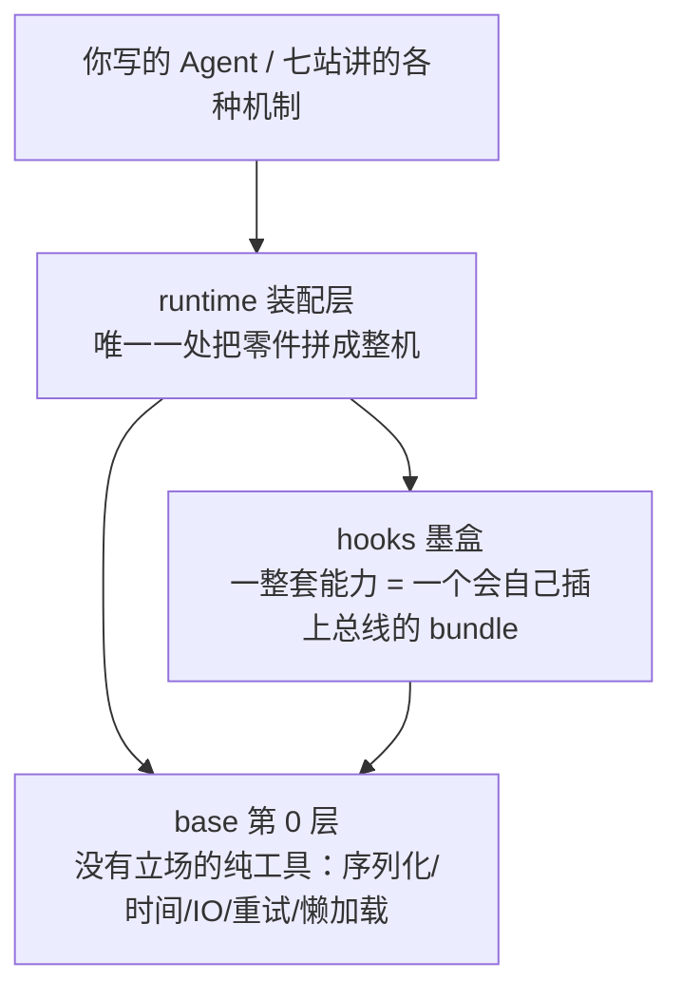
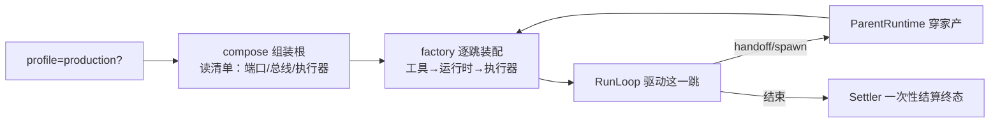
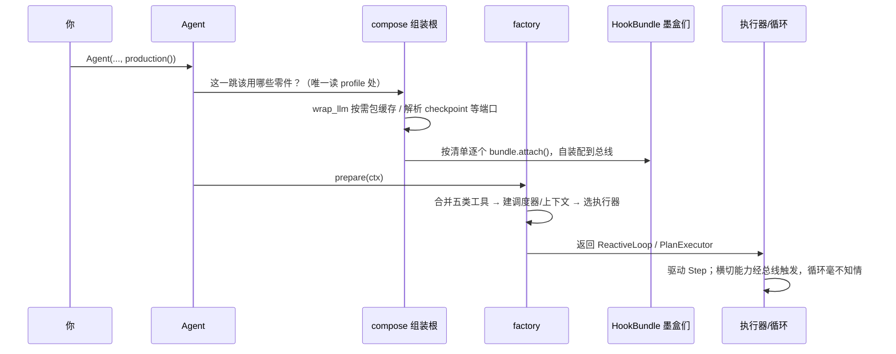

# 框架底座与装配：从一行工具，到一个生产 Agent

> 走完七站，你看到的都是"机制"——循环、预算、工具、协作。但机制下面还垫着一层东西：对象怎么序列化、时间从哪来、为什么 `import prodagent` 这么轻、一个"生产级 Agent"究竟是**被谁、在哪、按什么顺序**拼起来的。
>
> 这一页补上这块拼图。它讲三个主角：最底层的 `base/`、全仓库唯一的装配处 `runtime/compose.py`、以及把一整套横切能力打包成"插上即用"的 `HookBundle`。这三处不直接产生 Agent 行为，却决定了框架好不好读、好不好改、会不会在生产里"阴沟翻船"。

---

## 问题：框架的"地基"长什么样？

先看一个容易被忽略的现象：你写下 `from prodagent import Agent` 的瞬间，到底加载了多少东西？为什么核心可以只有 4 个依赖、离线就能跑？为什么 `bare()` 和 `production()` 只差一行，行为却像两个框架？

这些问题的答案不在七站的任何一站里，而在三层"底座"中：



我们自底向上，先看最不起眼、却最能体现工程审美的 `base/`。

---

## 一、base：没有"立场"的第 0 层

`base/__init__.py` 的模块说明里有一句很关键的自我约束，翻译过来是：

> 这里放的是**机械的辅助工具**；任何"带策略、有立场"的东西，都应该放在上一层。

什么叫"没有立场"？比如"怎么把一个 dataclass 变成 dict"是机械的，放 base；而"预算超了该不该停"是策略，放 kernel。正因为 base 没有立场，**任何包都可以放心 import 它，而它不 import 任何业务包**——依赖方向永远单向。这也是整个七层架构能成立的最底层前提。

下面挑 8 个最能体现"工艺"的点讲。它们都是几十行的小工具，但每一个背后都藏着一个真实踩过的坑。

### 1. 让 `import prodagent` 保持轻：模块级懒加载

**先说小白背景。** 平时我们 `from xxx import yyy`，Python 会立刻把 `xxx` 模块从头到尾执行一遍。如果一个包的顶层 `__init__.py` 一口气 import 了所有子模块，那么哪怕你只想用一个 `Agent` 类，也会把模型适配、数据库驱动、协作模块……全部拉进内存，启动变慢、依赖变重。

prodagent 的顶层导出了四十多个符号（`Agent`、`HardBudget`、`Ensemble`……），却不想为此付出"全部立即加载"的代价。它用了 Python 的一个特性：**模块也可以定义 `__getattr__`（PEP 562）**——当你访问一个模块里找不到的属性时，Python 会调用这个 `__getattr__`，于是"第一次用到时再真正 import"成为可能：

```python
# base/lazy.py —— 整个懒加载模式只有十几行
def lazy_package(sources: dict[str, str]):
    import importlib
    def __getattr__(name: str):
        source = sources.get(name)            # 这个符号住在哪个模块？
        module = importlib.import_module(source)   # 用到才加载
        value = getattr(module, name)
        globals()[name] = value               # 缓存到全局，第二次直接命中
        return value
    return __getattr__, __dir__
```

```python
# prodagent/__init__.py —— 只登记"谁住在哪"，并不真正 import
_SYMBOL_SOURCES = {
    "Agent": "prodagent.runtime.agent",
    "HardBudget": "prodagent.kernel.budget",
    "Ensemble": "prodagent.coordination.ensemble",
    # ...
}
__getattr__, __dir__ = lazy_package(_SYMBOL_SOURCES)
```

> **类比**：这像图书馆的"闭架取书"。检索目录（符号表）一直摊在你面前，但书（真正的模块）要等你点名要哪本，管理员才去库房取，取过一次就放在你手边（写进 `globals()`）。

**为什么这是设计而不是小聪明？** 因为它让"对外只暴露一个整洁入口"和"内部按需加载、核心极轻"这两件本来矛盾的事同时成立。仓库里甚至有一个 `test_import_weight` 测试，像给体重上秤一样，防止 `import prodagent` 的重量随版本悄悄反弹。

### 2. 别手写一百遍 `to_dict`：字段驱动的序列化 codec

**小白背景：dataclass。** Python 的 `@dataclass` 能帮你自动生成 `__init__`，让一个类主要变成"一组有类型的字段"，非常适合做数据载体。prodagent 里几乎所有需要落盘/传输的对象都是 dataclass。

这些对象都要能"变成 JSON 存盘、再从 JSON 还原"。手写 `to_dict/from_dict` 的话，每加一个字段就要在两处各改一行，几十个类写下来全是重复劳动，还容易漏。`base/codec.py` 把这件"机械活"一次性收口：**遍历 dataclass 的字段，按类型注解决定怎么转换**——枚举取它的值、嵌套 dataclass 就递归、`list[X]` 就逐个处理 X：

```python
# 伪代码：注解驱动的加载
for f in dataclasses.fields(cls):
    value = data.get(f.name, f.default)   # 线上缺了就用默认
    kwargs[f.name] = coerce(value, type_hint_of(f))   # 按注解递归还原
```

这里有一个特别成熟的取舍，值得划重点：**通用 codec 只接管"机械镜像"，而"策展投影"坚持手写。** 什么意思？

- 普通对象：字段和落盘内容一一对应，交给通用 `dump/load`；
- `AgentRun`：落盘时只存"可持久化子集"（有些运行中的活对象不该存）；
- 事件线格式：要靠一个 `type` 字段区分事件类型。

后两者的"投影形状"是带着立场、经过设计的，所以保留手写。模块说明里原话是：*机械的镜像才委托给通用 codec，策展的投影留给手写。* 这是一种很高级的工程判断——**不追求"全部自动化"的整齐，而在"重复劳动"和"需要表达意图"之间划清边界。**

> **顺带一个小白知识点**：类型注解默认不会被执行，但 `get_type_hints()` 能在运行时把它们取出来用；codec 还做了"懒解析"，这样前向引用（定义时引用了还没定义的类）也不会报错。

### 3. 错误，是"一个概念的三个面"

一个框架要描述"失败"，通常需要三样东西：

1. **一套受控词表**（`ErrorReason`：鉴权失败 / 限流 / 超时 / 预算耗尽……）——决定"要不要重试、严重程度、恢复提示"；
2. **一棵异常类树**（`AgentError` 及其子类）——这是 `raise` 时抛出的东西；
3. **一个分类器**（`classify_error`）——把任意第三方异常（比如 httpx 抛的网络错误）映射回上面的词表。

很多项目把这三样拆在三个文件里，结果"新增一种失败模式"要改三个地方、还容易漏。prodagent 的判断是：**它们本质是同一个概念，于是全部放进 `base/errors.py` 一个文件**——新增失败模式，只改这一处。

其中有一个"默认值方向"的设计非常值得学：

```python
NON_RETRYABLE_REASONS = frozenset({ AUTH_INVALID, BILLING, FORMAT_ERROR, ... })
# 注释原话：不在这个集合里，就"推定是瞬时故障"。
# 因为对一个永久性错误重试，只会白烧预算、推迟用户看到失败。
```

也就是说，**"能不能重试"的举证责任，落在"把它标记为永久失败"这边**；默认假设故障是暂时的、值得重试，但对那些明确没救的（密钥错了、余额没了），绝不浪费一次重试。安全的默认方向，永远偏向"不做无用功、不掩盖真错误"。

> **小白知识点：`StrEnum`。** 它既是枚举（有固定成员、能做类型检查），又是字符串（`ErrorReason.TIMEOUT == "timeout"`），序列化、打日志都天然友好。

### 4. 文件不是"写进去"就完事了：原子写与路径防火墙

这是最有"极客时间味道"的一节，因为它处理的都是极端但致命的边界。

**坑一：写到一半的"撕裂文件"（torn write）。** 假设你正把一个 checkpoint JSON 覆盖写盘，写了 60% 时进程被 `kill -9` 或断电，磁盘上就留下半个无法解析的 JSON，下次恢复直接崩。`base/io.py` 的解法是**先写临时文件，再原子改名**：

```python
# write-temp-then-rename：POSIX 的 rename 是原子的
tmp.write_text(payload)          # 1. 先写旁边的 .tmp
os.replace(tmp, path)            # 2. 一次性"改名"到位
```

因为 POSIX 的 `rename/replace` 是原子操作，任何一个并发读者，要么看到**完整的旧文件**，要么看到**完整的新文件**，永远不会看到写了一半的状态。

更细的是 `fsync` 被做成了**可选**：checkpoint 这种"丢了要命"的，写完还要 `fsync` 数据文件、再 `fsync` 父目录（否则极端情况下连"改名"本身都可能没落到磁盘）；而缓存这种"丢了无所谓、重算即可"的，就不付这个磁盘代价。**耐用性也是分级的，不为不重要的数据花重要数据的钱。**

**坑二：路径穿越（path traversal）。** `run_id`、`session_id` 最终会被拼进文件路径。如果 id 里混进 `../` 这样的片段，就可能写到预期目录之外。`io.py` 在**数据进入的接缝处**用白名单拦截：

```python
_SAFE_FILENAME = re.compile(r"^[A-Za-z0-9_.:\-]+$")
def safe_filename_component(s: str) -> str:
    # 注释原话：这是路径穿越防火墙——在接缝处校验，而不是等逃出去再追
    if not _SAFE_FILENAME.match(s):
        raise ValueError(...)
    return s
```

注意它的设计哲学是"**在接缝处设防，而不是逃出去再拦**"——安全校验离入口越近越好，不要指望下游每个人都记得检查。

**坑三（最隐蔽）：JSONL 为什么只按 `\n` 分行，不用 Python 的 `splitlines()`？** 因为 JSON 以 `ensure_ascii=False` 写入时，字符串里可能原样保留 `U+2028 / U+2029` 这两个 Unicode 行分隔符，而 `splitlines()` 会把它们也当成换行——于是一条合法 JSON 被静默切成两半、两半都解析失败，等于凭空丢了一条事件。所以写入方只认 `\n` 换行，读取方也只按 `\n` 切，**双方必须达成明确契约**。这种"读和写对同一件事的理解必须严格一致"的细节，正是生产级和玩具的分水岭。

### 5. 指纹必须稳定：`stable_serialize`

死循环检测（见[第 ⑤ 站](../tour/05-loop.md)）要给"每次工具调用"算一个指纹：连续多次指纹相同，就说明 Agent 在原地打转。但算指纹有两个障碍：字典的键顺序不保证一致、`datetime/Decimal/Path` 这类对象不能直接 JSON 化。`stable_serialize` 就是统一的"预序列化器"，把各种类型先变成确定的字符串形态，从而保证**语义相同的输入，永远得到相同的指纹**。它和 codec 是一对：codec 负责"能还原"，stable_serialize 负责"可比较"。

### 6. 中文没有空格：CJK 切词的取巧之道

英文天然按空格切词，中文没有词边界。正经做法是接一个中文分词器，但那会带来不小的依赖和体积。`base/text.py` 的选择很务实：**对连续中文片段取 2~3 字的 n-gram（相邻字组合）来换召回率，把精度交给后面的 embedder**。比如"上海天气"切成"上海、海天、天气……"这些小块，做关键词/语义匹配时足够用了。注释原话：*不背一个分词器，召回先用 n-gram 拿到，精度是 embedder 的事。* 这是典型的"在合适的层解决合适的问题"。

### 7. 重试别"齐步走"：full jitter 打散惊群

`base/retry.py` 默认的退避策略不是固定间隔，也不是朴素指数退避，而是 **带完整抖动的指数退避（full jitter）**：等待时间在 `[0, min(上限, 基数×2^n)]` 里随机取。

为什么非要随机？设想 10 个子 Agent 同时撞上上游限流，如果大家都"等 1 秒再重试"，那么 1 秒后它们会**齐刷刷地再次同时打过去**，把本来就喘不过气的上游再次打垮——这叫**惊群效应（thundering herd）**。加一个随机抖动，重试时刻被自然打散，上游才有喘息空间。一个 `random.uniform`，解决的是分布式系统里的经典故障模式。

### 8. 时间只有一个来源

`base/time.py` 只暴露 `now_utc()`（带时区的 UTC 时间）和 `now_timestamp()`。为什么要统一？第一，**带时区的时间相减才安全**，混用本地时间和 UTC 是无数 bug 的源头；第二，当你想在测试里"快进时间"时，只需要在唯一一处打桩，而不是满仓库搜 `time.time()`。**把不可控的东西（当前时间、随机数、UUID）收敛到一个出口，是可测试性的通用心法。**

> **小结**：base 层这 8 个点，单看都不起眼，合起来是同一种审美——把重复的、机械的、容易踩坑的事，在最底层、离接缝最近的地方，一次性、有默认方向地解决掉。

---

## 二、runtime：全仓库唯一的"装配根"

看完底座，往上走一层。零件（端口实现、循环、工具、各种 hook）都有了，**谁负责把它们拼成一个能跑的 Agent？** prodagent 的答案非常克制：全仓库只有一个地方有权回答这个问题，它就是 `runtime/compose.py`，也叫**组装根（Composition Root）**。

### 为什么"对象图"必须只在一处组装

依赖注入走到尽头，会得到一个看似平常、实则决定性的结论：**决定"用哪些零件"的代码，必须收敛在唯一一处。**

反例很常见：A 文件里"生产环境就挂缓存"，B 文件里又写了一遍类似判断，C 文件忘了挂。它们各自都"看起来对"，但组合起来就会出现那种最折磨人的 bug——**测试环境和生产环境行为不一致，而且不报错**，你得花一下午去猜到底哪处装配不一样。组装根的价值，就是把"一个生产 Agent 由什么构成"从散落各处的 `if`，变成**一处可以通读的清单**。

### 三个"插座"：新能力没有第四扇暗门

`compose.py` 的模块说明直接宣告了扩展能力的全部三种方式：

| 插座 | 你要做什么 | 典型例子 |
|------|-----------|---------|
| **端口替换** | 实现一个 Protocol | 模型适配器、缓存包装器、各种存储后端 |
| **总线挂载** | 在 HookRegistry 上注册 | 观察者、审批/权限门禁、记忆/技能注入器 |
| **执行器替换** | 实现 `LeafExecutor` | PLAN_FIRST 就是迭代 Step 的第二种策略 |

这份清单的价值不在"列了什么"，而在"**划了边界**"：任何新能力必然落进三者之一，**不存在第四扇需要你逆向源码才能发现的暗门**。一个框架的可扩展性，约等于它的插座清单——插座越少、越明确，就越可信。

### 函数内 import：bare 绝不替 production 买单

注意 compose 里一个反复出现的写法——import 不写在文件顶部，而写在函数体里：

```python
def wrap_llm(llm, fw):
    if fw.profile != "production":
        return llm                       # 裸核：原样返回，一层都不多包
    from prodagent.llm.cache import CachingLLMClient   # 用到才 import
    return CachingLLMClient(llm, ...)
```

这和第一节的懒加载是同一套心法：**bare profile 不该为它用不到的生产能力付出加载成本**。同时这句代码还藏着一个观点——*提示缓存是一个"带可观测副作用的优化"，不是循环本身的一部分*，所以它被实现为"包在 LLM 外面的一层"，而不是塞进循环内核。想理解这种"包一层而不改内核"的手法，可以回看[第 ③ 站模型层](../tour/03-llm.md)。

### factory：为"每一跳"造一个执行器

组装根负责"用什么"，`runtime/factory.py`（`LeafExecutorFactory`）负责"怎么拼"。它为 RunLoop 的**每一跳（hop）**准备执行器，步骤固定为自上而下三段：**tools → runtime → executor**，并且刻意不写"过路转发"的冗余层。第一步合并工具时你能看到一条完整的来源链：

```
内联工具 + 注册表里的工具 + MCP 远端工具 + spill 回读工具 + spawn/peer/舞台工具
```

其中多 Agent 协作工具（spawn、peer、ensemble 等）并不是 runtime 直接 `import coordination` 硬编码进来的，而是通过一个叫 `tool_assemblers`（工具装配器）的"缝"注入。这样分层纪律就守住了：**整个 runtime 里，只有组装根 compose 这一个文件被允许点名 coordination 的能力**，其余地方都面向缝编程。为什么要这么严？因为架构腐化都是从"我就跨层 import 一次"开始的。

### parent_runtime：把父级上下文"穿"给 fork 出去的孩子

当一个 Agent spawn 子 Agent、或 handoff 给下一个 peer 时，孩子需要继承父亲的一部分"家产"：预算上限、共享账本、checkpoint、事件日志、LLM、hooks、当前深度。`ParentRuntime` 就是装这份家产的对象。它的设计有个很讲究的点——**刻意只携带"子集"**：

> 带下去的是 fork 出去的孩子真正需要的（预算、账本、存储、深度）；父亲自己"这一跳"的状态（当前任务、run_id、它自己的 spec）不带，那是父亲自己的事。

这就是"上下文传播（context propagation）"：既让孩子共享必要的资源（这样预算才能全局汇总，见[预算专题](budget.md)），又不把父亲的临时状态泄漏给孩子，边界清清楚楚。

### runner：一跳一跳地，把 peer 串成链

最后是 `RunLoop`（`runtime/runner.py`）这个驱动器。它的自我定位是"**一次驱动一个 agent hop，并能跨 peer 接力成链**"。理解它的关键是：多 Agent 之间的 handoff **不是函数递归调用**，而是"当前这一跳结束、驱动器拿着下一跳的描述再开一跳"。正因为一跳是一个干净的边界，检查点才能落在跳与跳之间，崩溃恢复、预算结算才有了明确的着力点（见[崩溃恢复专题](recovery.md)）。



---

## 三、HookBundle：把一整套能力做成"插上即用的墨盒"

第二节说总线挂载是三个插座之一。[第 ⑤ 站](../tour/05-loop.md)和[可观测专题](observability.md)已经讲过三协议总线（fire/check/collect）这个"插座"长什么样。这一节讲另一个问题：**一个完整能力往往要同时挂好几个钩子，能不能把它们打包，并且让它"知道怎么把自己插上去"？**

### 从"逐个注册"到"一个墨盒"

以"可观测"为例，它可能要在 `LOOP_START` 挂一个、`TOOL_CALL` 挂一个、`TOKEN_UPDATE` 再挂一个。如果让组装根逐个注册，组装根就得了解每个能力的内部细节，耦合又回来了。prodagent 的解法是定义一个极简的协议 `HookBundle`：

```python
# hooks/bundles/base.py
@runtime_checkable
class HookBundle(Protocol):
    """Self-wiring capability bundle —— 会自己接线的能力包。"""
    def attach(self, agent, fw, registry) -> None: ...
```

一个 bundle 就是一个"**自装配墨盒（cartridge）**"：你不需要知道它内部挂了哪几个钩子，只要在组装时调用它的 `attach(...)`，它自己会把整套东西接到总线上。记忆是一个墨盒、学习闭环是一个墨盒、安全审批是一个墨盒、可观测又是一个墨盒。

### 清单即配置：bare 与 production 差在哪

组装根里的 `default_bundles()` 就是"**这个 profile 该插哪些墨盒**"的一张清单：

| 墨盒 | 作用 | bare | production |
|------|------|:----:|:----------:|
| `ConsoleDefaultBundle` | 彩色终端观察 | 仅在显式开启时 | 仅在显式开启时 |
| `LearningDefaultBundle` | 技能蒸馏闭环 | 仅当传了 `skills=` | 仅当传了 `skills=` |
| `CacheMonitorDefaultBundle` | 缓存命中率告警 | — | ✅ |
| `SpanDefaultBundle` | Span/审计导出 | — | ✅ |
| `ApprovalDefaultBundle` | HIGH 工具审批门 | — | ✅ |

两个细节特别能体现素养：

1. **一个库默认应当对 stdout 保持安静。** 控制台打印是 opt-in 的——要么显式传 `console_observer=True`，要么设 `PRODAGENT_CONSOLE=1`。因为你的库可能跑在别人的服务里，没经过同意就刷屏是很糟糕的体验。REPL 和 playground 才会显式打开它。
2. **不重复挂载。** `ApprovalDefaultBundle` 在挂审批门前会先扫一遍用户自己传的 `extensions=`：如果你已经手动给了一个审批 hook，它就不再重复挂。**默认值要懂得给用户的显式选择让路。**

### 为什么是"清单 + 自装配"，而不是一堆 if-else

对比一下两种写法：如果用 if-else 在组装根里写死每个能力的注册细节，那么每加一个能力都要改组装根、让它了解新能力的内部结构，组装根会不断膨胀。而"清单 + 自装配"下，**新增一个能力 = 写一个新墨盒 + 在清单里加一行**；组装根永远只面对 `HookBundle` 这一个简单协议，根本不关心墨盒内部。这就是"开闭原则"最朴素的落地：对扩展开放（加墨盒），对修改封闭（组装根不用动）。

---

## 四、把三层串起来：一次 `production()` 装配的完整顺序



读完这张图，你应该能回答开篇的三个问题了：

- **为什么核心这么轻？** 因为懒加载（base/lazy + 函数内 import）让 bare 只加载它真正用到的东西；
- **为什么测试和生产不会"悄悄不一致"？** 因为"用什么"只在组装根 compose 一处决定，是一张可以通读的清单；
- **为什么加一个横切能力这么干净？** 因为它被做成一个自装配墨盒，挂到三协议总线上即可，循环和组装根都不用改。

**底座的美感，是一种"克制"的美感**：把机械的事沉到最底、把装配的权收到一处、把成组的能力封进墨盒。机制层因此可以专注表达"Agent 该怎么思考"，而不必分心于杂物。这也是为什么七站讲的那些机制，能各自独立、又能严丝合缝地拼成整机。

---

## 五、叶子模块 playground：用工具把分层边界"钉死"
最后看一个特殊的包——`playground/`（那个可视化 Demo 网页）。它站在整棵依赖树的最顶端：**它可以依赖框架里的任何包，但任何包都不许反过来依赖它。** 这条边界不是靠口头约定，而是写进 `pyproject.toml` 的一条 importlinter 契约（forbidden contract），CI 里一旦有人让 base/kernel 之类的底层包 `import playground`，构建直接失败。

> **小白加餐：为什么"约定"还要用工具强制？** 因为架构腐化从来不是一次性的大破坏，而是"我就跨层引用一次、就这一次"累积出来的。人会忘、评审会漏，但一条自动化契约不会。**能被测试/工具执行的架构规则，才是真正的规则**——这和后端"一致性考卷"、往返律是同一种思路：把纪律变成代码。

playground 自身还有两个值得一看的设计：

1. **HTTP 层无状态。** 它是一个 FastAPI 应用，但**运行状态绝不放在进程内存里**——run 的真相在 checkpoint/session 存储中。进程里的 `driving` 字典只缓存"此刻正被本进程驱动的 run"，它是一个并发保护，不是存在性依据；任何它不认识的 `run_id`，都通过 `RunRegistry.reconstruct` 回头去 session 和 checkpoint 存储里反查重建。这让"网页刷新、进程重启后还能接着看同一个 run"成为可能，也是对前面"状态外置到端口"原则的一次自证。
2. **用"适配器 + 驱动器"消灭特判。** 多 Agent 示例各有各的事件流，早期曾为某个例子专门写了一对路由和前端分支，很快发现不可扩展。现在的做法是：每个示例写一个适配器，把自己的原始事件归一化成统一的 `MultiAgentEvent` 信封；一个与具体玩法无关的驱动器（`MultiAgentRun`）统一负责"抽事件 → 归一化 → 推进 SSE 队列"，连适配器崩溃都兜底成一个终态 `failed` 信封。**变化的部分做成适配器，不变的流程只写一次**——你会发现这和协作层的 `StageDriver`、后端的 conformance 是反复出现的同一个母题。

---

## 代码定位

| 内容 | 源码位置 |
|------|---------|
| 懒加载模式 | `base/lazy.py`，顶层符号地图 `prodagent/__init__.py` |
| 字段驱动序列化 | `base/codec.py` |
| 错误词表/异常树/分类器 | `base/errors.py` |
| 原子写 / 路径防火墙 / JSONL | `base/io.py` |
| 稳定指纹序列化 | `base/types.py::stable_serialize` |
| CJK 切词 / 抖动退避 / 统一时间 | `base/text.py` `base/retry.py` `base/time.py` |
| 组装根（唯一读 profile、三个插座、bundle 清单） | `runtime/compose.py` |
| 逐跳执行器工厂 | `runtime/factory.py` |
| 父级上下文传播 | `runtime/parent_runtime.py` |
| 运行驱动器（hop / peer 链） | `runtime/runner.py` |
| 墨盒协议与默认装配 | `hooks/bundles/base.py` `hooks/bundles/default_wiring.py` |
| 分层/无环/重量的强制约束 | `tests/base/test_layering_contract.py` `test_kernel_purity.py` `test_no_import_cycles.py` `test_import_weight.py` |
| 叶子隔离契约（importlinter） | `pyproject.toml` `[tool.importlinter]` |
| 无状态 HTTP 表面 / run 反查重建 | `playground/server.py` `playground/registry.py` |
| 多 Agent 事件归一化（适配器+驱动器） | `playground/multiagent.py` |

---

## 下一步

- 想回头看"插座"本身怎么工作？→ [第 ② 站：端口与契约 →](../tour/02-ports.md) / [第 ⑤ 站：循环内核 →](../tour/05-loop.md)
- 想看横切能力怎么经总线触发？→ [全链路可观测 →](observability.md)
- 想看一个"端口"在外部是怎么被实现出来的？→ [后端适配器 →](backends.md) / [MCP 外部工具 →](mcp.md)
- 想从上帝视角再看一遍整张架构？→ [架构全景 →](../architecture.md)
