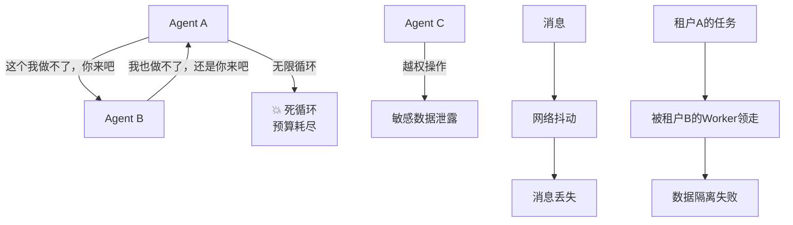
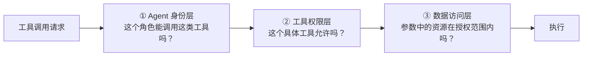
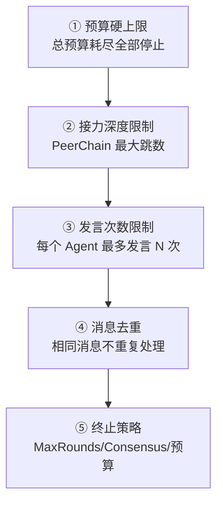
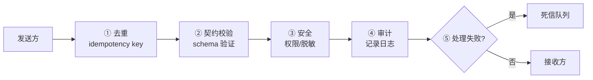
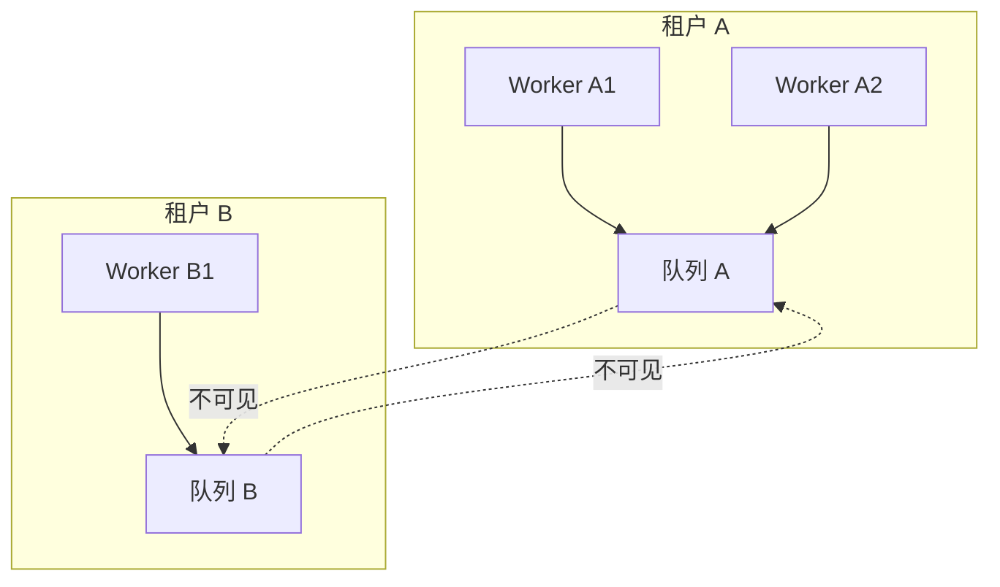

# 多 Agent 治理：防止互相甩锅和死循环

> 多 Agent 不是"人多力量大"，搞不好就是"三个和尚没水喝"。这一站讲清楚权限策略、死循环兜底、消息可靠性、多租户隔离。

---

## 问题：多 Agent 系统最容易怎么死？



多 Agent 系统有四类典型故障：
1. **死循环** — A 推给 B，B 推回 A
2. **越权** — Agent 做了它不该做的操作
3. **消息丢失/重复/乱序** — 通信不可靠
4. **租户隔离失败** — 多租户时数据串了

治理就是针对这四类故障的防护机制。

---

## 一、权限策略引擎

### 三层授权



#### ① Agent 身份层（RBAC）

每个 Agent 有角色，角色有权限组：

```python
agent = Agent(
    "researcher",
    role="researcher",  # 角色
    tools=[search, read_file, send_email],
)

# 角色权限定义
role_permissions = {
    "researcher": {
        "allowed_tools": ["search", "read_file"],  # send_email 不在列表里
        "max_side_effect": "READONLY",  # 只能调用只读工具
    }
}
```

即使 Agent 配置了 `send_email`，如果角色不允许，调用时会被拦截。

#### ② 工具权限层

更细粒度的工具级控制：
- 某个工具在特定上下文中禁用
- 某个工具的调用频率限制
- 某个工具需要特定条件才能用

#### ③ 数据访问层

最细粒度——检查工具参数中的资源：

```python
# Agent 调用 read_file("/etc/passwd")
# 权限引擎检查：这个 Agent 允许访问 /etc/passwd 吗？
if not policy.can_access(agent_id, resource="/etc/passwd", action="read"):
    return ToolResult.from_error(SecurityViolation(...))
```

这一层防止"Agent 有 read_file 权限，但读了不该读的文件"。

### 越权处理

越权不抛异常，返回结构化错误：
```python
ToolResult.from_error(
    ToolError.from_reason(
        ErrorReason.SECURITY_VIOLATION,
        message="Agent 'researcher' 不允许调用 send_email",
        hint="请使用允许的工具，或请求管理员提升权限"
    )
)
```

模型看到错误后可以自己调整（换个工具、或者放弃）。同时所有越权尝试记录审计日志。

---

## 二、死循环兜底

多层防护，从外到内：



| 层级 | 机制 | 作用 |
|------|------|------|
| ① | 四轴预算 | 最后一道防线，钱花完了必须停 |
| ② | 接力深度 | PeerChain 最多 N 跳，防止无限接力 |
| ③ | 发言次数 | Ensemble 中每个 Agent 最多发言 N 次 |
| ④ | 消息去重 | Crossing 管道的 idempotency key，相同消息不循环 |
| ⑤ | 终止策略 | Ensemble 的 MaxRounds、Consensus 等主动终止 |

**设计哲学**：不依赖单一机制防死循环，而是多层兜底。即使某一层失效，下一层还能拦住。

---

## 三、消息可靠性：Crossing 管道

所有多 Agent 通信走统一的 Crossing 管道，五道关卡：



### ① 去重

每条消息有稳定的 idempotency key（基于发送方 + 时间 + 内容哈希）。接收方维护已处理消息 ID 集合，重复消息直接丢弃。

**解决**：网络重试导致的消息重复。

### ② 契约校验

消息必须符合预定义的 schema（HandoffPacket、BoardWrite、WorkItem 等）。格式错误的消息直接拒绝，不进入处理流程。

**解决**：版本不兼容、格式错误的消息。

### ③ 安全

- 权限检查：接收方是否有权接收这类消息
- 敏感信息脱敏：消息中的密钥、个人信息自动脱敏

**解决**：越权通信、数据泄露。

### ④ 审计

所有消息（包括成功和失败的）记录审计日志，包含：
- 发送方、接收方
- 消息类型、时间戳
- 处理结果（成功/失败/拒绝）

**解决**：事后追溯、问题排查。

### ⑤ 死信队列

处理失败的消息（接收方报错、超时）不丢弃，进入死信队列。可以：
- 人工查看失败原因
- 手动重试
- 分析失败模式

**解决**：消息不丢失。

---

## 四、多租户隔离

WorkQueue 等场景支持多租户。隔离机制：

| 维度 | 隔离方式 |
|------|---------|
| 任务隔离 | 每个租户的任务有独立的命名空间，Worker 只能领本租户的任务 |
| 数据隔离 | 黑板、记忆、checkpoint 按租户分目录/分表 |
| 预算隔离 | 每个租户有独立的 BudgetLedger，一个租户超预算不影响其他 |
| 权限隔离 | 租户间不可见彼此的 Agent 和任务 |



---

## 五、治理的可观测性

治理不是"设了规则就不管了"。所有治理事件都可观测：

| 事件 | 记录内容 |
|------|---------|
| 越权拦截 | Agent ID、工具名、参数、时间 |
| 审批挂起/通过/拒绝 | 审批 ID、工具、审批人、原因 |
| 死循环终止 | 终止原因、涉及的 Agent、最后 N 轮消息 |
| 消息死信 | 消息内容、失败原因、重试次数 |
| 预算耗尽 | 哪个轴超了、数值、涉及的 Agent |

这些事件通过事件总线触发，可观测系统可以实时展示和告警。

---

## 代码定位

| 内容 | 源码位置 |
|------|---------|
| 权限策略引擎 | `hooks/authorization/` |
| 审批 hooks | `hooks/approval/` |
| 审计 | `hooks/audit.py` |
| Crossing 消息平面 | `coordination/messaging/` |
| 死信队列端口 | `ports/dead_letter.py` |
| 终止策略 | `coordination/termination.py` |
| 多租户隔离 | `coordination/work_queue.py` |
| 锁/幂等键 | `ports/lock.py` |

---

## 下一步

- 消息管道的细节？→ [第 ⑦ 站：多 Agent 协作 →](../tour/07-multiagent.md)
- 可观测性怎么落地？→ [全链路可观测专题 →](observability.md)
- 审批和权限的关系？→ [HITL 审批专题 →](approval.md)
