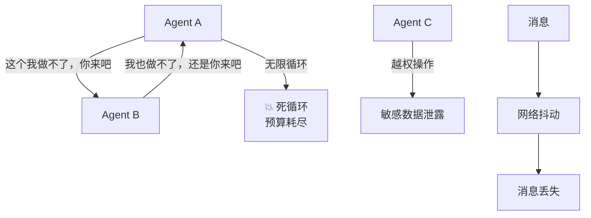
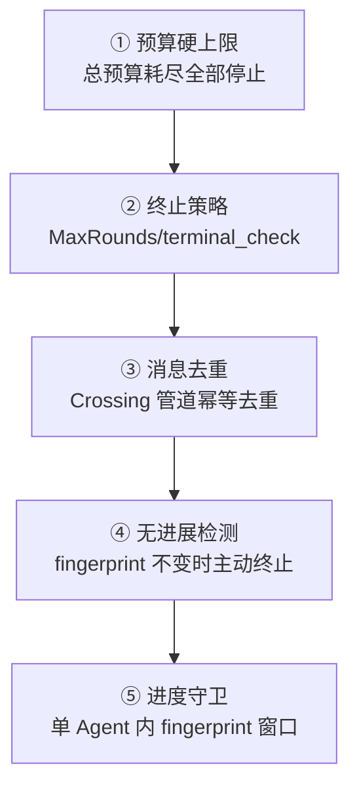
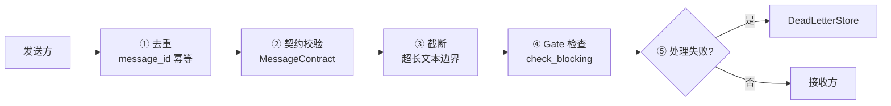

# 多 Agent 治理：防止互相甩锅和死循环

> 多 Agent 不是"人多力量大"，搞不好就是"三个和尚没水喝"。这一站讲清楚权限策略、死循环兜底、消息可靠性、预算隔离。

---

## 问题：多 Agent 系统最容易怎么死？



多 Agent 系统有三类典型故障：
1. **死循环** — A 推给 B，B 推回 A
2. **越权** — Agent 做了它不该做的操作
3. **消息丢失/重复/乱序** — 通信不可靠

治理就是针对这些故障的防护机制。

---

## 一、权限策略：Gate 检查器

prodagent 没有内建 RBAC 系统，而是通过三协议总线的 **VETO 通道**提供通用的权限拦截机制：

```python
from prodagent.kernel.bus import Gate, BlockingResult

async def my_auth_checker(call, tool, run):
    """工具调用前的权限检查。返回 BlockingResult(blocked=True) 拦截。"""
    if tool.meta.domain == "finance" and run.agent_name != "accountant":
        return BlockingResult(
            blocked=True,
            reason=f"Agent '{run.agent_name}' 不允许调用财务工具 {call.name}",
        )
    return BlockingResult(blocked=False)

hooks.register_checker(Gate.TOOL_CALL, my_auth_checker)
```

### 可用的 Gate 拦截点

| Gate | 拦截时机 |
|------|---------|
| `TOOL_CALL` | 工具执行前 |
| `PLAN_APPROVAL` | 计划审批 |
| `SESSION_START` | 会话启动 |
| `CONTEXT_BUILD` | 上下文组装 |
| `TOOL_RESULT` | 工具结果返回后 |
| `RUN_COMPLETE` | Run 完成前 |
| `APPROVAL_REQUEST` | 审批请求（HIGH 副作用工具） |
| `AGENT_HANDOFF` | Agent 间交接（spawn/peer） |
| `DOCUMENT_ADD` | 文档写入记忆前 |

### 安全 bundle

`hooks/bundles/security/` 提供了预构建的安全检查 bundle，包括审批门集成。`production()` profile 自动挂载。

### 越权处理

越权不抛异常，返回 `ToolResult.blocked_by(reason)`：

```python
# 工具被拦截后，模型看到的是结构化错误
{"blocked": true, "reason": "Agent 'researcher' 不允许调用 send_email"}
```

模型看到错误后可以自己调整（换个工具、或者放弃）。同时所有拦截通过事件总线记录，可审计。

---

## 二、死循环兜底

多层防护，从外到内：



| 层级 | 机制 | 作用 |
|------|------|------|
| ① | 四轴预算 | 最后一道防线，钱花完了必须停 |
| ② | 终止策略 | Ensemble 的 MaxRounds、Blackboard 的 terminal_check、WorkQueue 的 drained |
| ③ | 消息去重 | Crossing 管道的 idempotency key，相同消息不循环 |
| ④ | 无进展检测 | Blackboard/WorkQueue 检测 fingerprint 一轮不变时终止 |
| ⑤ | 进度守卫 | 单 Agent 内 ProgressMonitor 检测重复工具调用模式 |

**设计哲学**：不依赖单一机制防死循环，而是多层兜底。即使某一层失效，下一层还能拦住。

---

## 三、消息可靠性：Crossing 管道

所有多 Agent 通信走统一的消息平面——`Crossing` 信封 + `Pipeline` 拦截器链：



### ① 去重

每条消息有稳定的 `message_id`。接收方通过 `admission_pipeline` 的去重拦截器判断是否重复，重复消息标记为 `"duplicate"` 不重复处理。

**解决**：网络重试导致的消息重复。

### ② 契约校验

消息必须符合预定义的 `MessageContract`（如 `DEFAULT_CHILD_CONTRACT`）。格式错误的消息直接拒绝，不进入处理流程。

**解决**：版本不兼容、格式错误的消息。

### ③ 截断

自由文本字段有长度上限（`CROSSING_OUTPUT_MAX_CHARS`、`PUBLIC_TURN_TEXT_MAX_CHARS`），一个冗长的成员不能撑爆其他成员的上下文。

### ④ Gate 检查

通过 `check_blocking(Gate.AGENT_HANDOFF)` 执行交接权限检查。checker 抛异常时默认 fail-closed（拦截）。

### ⑤ 死信队列

处理失败的消息（被契约拒绝、Gate 拦截、版本冲突）进入 `DeadLetterStore`，不阻塞其他消息。支持 memory 和 redis 后端。

**解决**：消息不丢失。

### 管道之外：三个更深的决定

拦截器清单之上还有三层不显眼的选择，它们才是这条管道的骨架。

**槽序是契约的一部分。** 去重必须最先——重放不是过错，让策略在重放的消息上空转只是浪费；Gate 必须排在契约之后——安全检查应该看到已经过验证的形状，而不是替校验器兜底；审计必须最后——它记录的是「确实越过了边界的东西」，而非「试图越过的东西」。顺序不是实现细节：**每一段管道的位置，都是它对其他段落的一组假设。**

**机制与策略分离。** 内置拦截器全部是机械的：去重看 ID、契约看字段、Gate 调总线、审计发事件——没有一个对内容做判断。语义策略（注入规则、裁判模型、脱敏）挂在两个开放槽位上，由应用注入。框架交付机制，应用交付立场；把两者焊死，用户要么接受框架的价值观，要么 fork。

**白名单靠构造，不靠清洗。** 跨边界传递的 `HandoffPacket` 有任务描述、硬约束、授权工具、引用句柄——唯独没有发送方的对话历史。下游能看到什么，由这个包**有哪些字段**决定，而不是由过滤掉了哪些内容决定。清洗是泄漏发生后的补救，构造让泄漏无从发生：**一个不存在的字段，比一个被过滤的字段安全得多。**

---

## 四、预算隔离

多 Agent 场景下，预算通过 `BudgetLedger` 共享：

| 场景 | 隔离方式 |
|------|---------|
| spawn 子 Agent | 子 Agent 的 reserve/commit 计入父的共享账本 |
| Ensemble | 所有成员共享一个 BudgetLedger，一个成员超预算不影响已完成的发言 |
| WorkQueue | 可选传入 BudgetLedger；不传入时无预算限制 |
| Blackboard | 可选传入 BudgetLedger |

reserve 机制保证并发安全：多个子 Agent 同时开始工作时，预占机制防止总花费超预算。详见 [四轴预算专题 →](budget.md)。

---

## 五、治理的可观测性

治理不是"设了规则就不管了"。所有治理事件都通过事件总线发出：

| 事件 | 记录内容 |
|------|---------|
| 工具拦截 | Agent ID、工具名、拦截原因、时间 |
| 审批挂起/通过/拒绝 | 审批 ID、工具、审批人 |
| 死循环终止 | 终止原因、涉及的 Agent、最后 N 轮消息 |
| 消息死信 | 消息内容、失败原因 |
| 预算耗尽 | 哪个轴超了、数值、涉及的 Agent |

这些事件通过 `HookEvent` 触发，可观测系统可以实时展示和告警。审计日志通过 `hooks/audit.py` 记录。

---

## 代码定位

| 内容 | 源码位置 |
|------|---------|
| Gate 枚举 / BlockingResult | `kernel/bus.py` |
| 安全 bundle | `hooks/bundles/security/` |
| 审计 | `hooks/audit.py` |
| Crossing 消息平面 | `coordination/messaging/` |
| 消息契约 | `coordination/messaging/contract.py` |
| 管道拦截器 | `coordination/messaging/pipeline.py` |
| 死信队列端口 | `ports/dead_letter.py` |
| 终止策略 | `coordination/infra/stage.py` |
| 预算账本 | `kernel/budget.py::BudgetLedger` |
| 进度守卫 | `kernel/progress.py` |

---

## 下一步

- 消息管道的细节？→ [第 ⑦ 站：多 Agent 协作 →](../tour/07-multiagent.md)
- 可观测性怎么落地？→ [全链路可观测专题 →](observability.md)
- 审批和权限的关系？→ [HITL 审批专题 →](approval.md)
