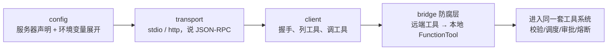
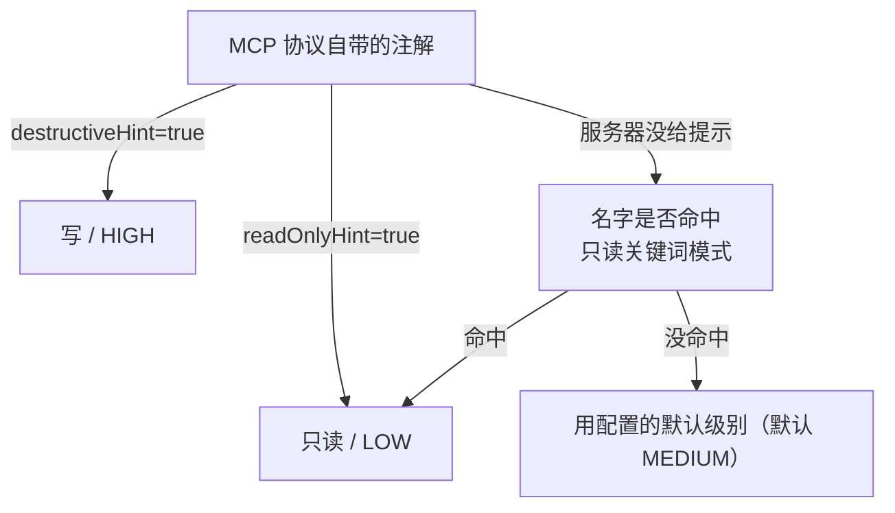
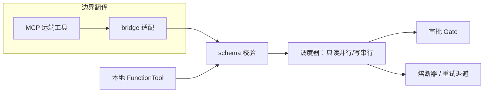

# MCP：把外部工具变成"一等公民"
> 别人写好的工具，接进来之后应该和你手写的工具毫无分别——直到网络真的出问题的那一刻。这一篇看 prodagent 怎么用一层薄薄的"防腐层"做到这件事。

---

## 问题：外部工具千千万，核心循环凭什么不用为它们改一行？
MCP（Model Context Protocol）是一个让模型调用"外部进程/远程服务提供的工具"的标准协议。生态里已经有大量现成的 MCP 服务器（搜索、数据库、文件系统……）。一个幼稚的实现会在核心调度循环里到处写 `if 这是 MCP 工具: 走网络 else: 走本地`——核心很快就被各种外部世界的细节污染。

prodagent 的答案是：**在边界上做一次彻底的翻译，让远端工具跨过边界后，就是一个普通的本地 `FunctionTool`。** 模块注释把目标说得很干脆——*a remote tool is indistinguishable from a local one until the wire fails*（在传输真正失败之前，你分不出一个工具是本地的还是远端的）。整条链路分四层：



---

## 第 1 层 config：声明服务器，敏感信息走环境变量
`mcp/config.py` 负责读入服务器定义（可以直接传 dict，也可以给一个配置文件路径）。每个 `MCPServerConfig` 描述一个服务器：用哪种传输（stdio/http）、启动命令或 URL、参数、环境变量等。

一个贴心的细节是 `expand_env`：配置里的 `${VAR}` / `$VAR` 会递归地用环境变量展开，**没设置的变量保持原样而不是报错或变成空串**。这样 API key、token 这类秘密就不必写死在配置文件里，只在运行时从环境注入——配置文件可以安全地提交进仓库，秘密留在环境中。

---

## 第 2 层 transport：把"怎么连"抽象成一个端口
和框架其他地方一样，"传输方式"也被抽象成一个 Protocol（`transports/_base.py`）：只要实现 `connect / send / notify / close` 四个方法，就是一个合格的传输通道。内置两种：

| 传输 | 物理形态 | 怎么收发 |
|------|---------|---------|
| `StdioTransport` | **拉起一个子进程** | 往子进程的 stdin 写一行 JSON、从 stdout 读一行 JSON（换行分隔的 JSON-RPC）；关闭时杀掉整个进程组，不留孤儿进程 |
| `HttpTransport` | 连一个远程 HTTP 服务 | 用 httpx 发请求，必要时从 SSE 流里按请求 id 抽出对应响应 |

> **小白加餐：什么是 JSON-RPC？** 它是一种极简的远程调用格式：请求就是一个 JSON，里面写着"我要调的方法名 `method`、参数 `params`、本次请求编号 `id`"；服务端回一个带相同 `id` 的 JSON，要么给 `result` 要么给 `error`。`id` 的作用是"对号入座"——多个请求并发出去，回来的顺序可能乱，靠 `id` 才知道哪个响应对哪个请求。`transports/_rpc.py` 的 `RPCError` 就是"对方回了一个错误"时的异常，它带着标准的 JSON-RPC 错误码。

注意这里的审美：核心只依赖 `Transport` 这个抽象，将来加一种 WebSocket 传输，只要再实现这四个方法，上层 client 一行不改。**端口思维从业务层一直贯穿到了最边缘的网络层。**

---

## 第 3 层 client：握手、列工具、调工具
`mcp/client.py` 的 `MCPClient` 在传输通道之上说 MCP 的"方言"：

1. **握手**：连上后先发 `initialize`，上报自己支持的协议版本（`2025-06-18`），并核对服务端版本是否一致，再发一个 `notifications/initialized` 完成初始化——和人与人之间"先对暗号、再办事"是一个道理；
2. **列工具** `list_tools()`：拿回每个远端工具的名字、描述、**入参 JSON Schema**，以及三个风险提示（是否只读 `read_only_hint`、是否破坏性 `destructive_hint`、是否幂等），封装成 `MCPToolInfo`；
3. **调工具** `call_tool(name, arguments)`：把一次调用编码成 JSON-RPC 请求发出去、取回结果。

---

## 第 4 层 bridge：真正的主角——防腐层
`mcp/bridge.py` 的 `adapt_mcp_tools` 把每个 `MCPToolInfo` 翻译成一个本地 `FunctionTool`。这一层是整个设计的精华，软件架构里称之为**防腐层（Anti-Corruption Layer, ACL）**：外部世界的"方言"在这一层被翻译成内部的"标准语言"，内部核心因此永远不需要知道外部长什么样。它做了四件翻译：

### ① 名字翻译：加前缀、做清洗
```python
def qualified_name(server, tool):
    return f"mcp__{sanitize(server)}__{sanitize(tool)}"  # mcp__服务器__工具
```
`mcp__server__tool` 的限定名一眼能看出工具来自哪个服务器；非法字符统一替换成下划线。它同时解决了两个问题：**避免不同服务器的同名工具打架**，以及**让工具来源可追溯**（审批日志里看到这个名字就知道是远端工具）。这也正好接上第 ④ 站讲的"多来源合并、同名先到先得"规则。

### ② 风险翻译：让远端工具也能被正确调度
本地工具靠 `ToolMeta` 上的 `is_readonly / side_effect_level` 决定"只读并行还是写串行、要不要审批"。远端工具的这些属性从哪来？`_classify_risk` 的优先级是：


**优先信任协议自己的注解，服务器没说才退化为名字匹配，再不行用保守默认值。** 翻译完成后，远端工具就带着和本地工具一模一样的 `ToolMeta` 进入系统——于是"只读并行、写串行"的调度器、HIGH 级工具的审批门（Gate）、熔断器，**全都自动对它生效，无需任何特判。**

### ③ 并发翻译：每个远端工具自带准入证
每个适配出来的工具都持有一个独立的 `asyncio.Semaphore(max_concurrency=8)`，防止模型对同一个远端服务发起过量并发把它压垮——和第 ④ 站的只读并发上限是同一种自我保护。

### ④ 错误翻译：把"黑盒错误码"映射进框架的词表
远端服务器是黑盒，它抛的是 JSON-RPC 错误码，框架内部讲的是 `ErrorReason`（瞬时/永久、该不该重试）这一套。`_translate_mcp_error` 在边界上完成映射：比如 `-32601（方法不存在）`、`-32602（参数非法）` 属于**再试多少次都不会成功的永久错误**，直接标红；网络超时这类则归为可重试。模块注释点出了关键——*正是这层映射，让重试策略跨过边界依然有意义。* 如果原样把远端错误抛进核心，核心根本不知道该不该重试，熔断和退避都会失灵。

> **小白加餐：适配器模式 vs 防腐层。** 适配器模式解决"接口形状对不上"（把方的包成圆的）；防腐层更进一步，除了形状，还要翻译**风险语义、错误语义、命名**，确保外部的混乱不会渗进内部。你可以把它想成出国旅行时的同传译员：外面的人说什么语言都行，进到你的会场里，听到的永远是统一、规范、可决策的母语。

---

## registry：N 个连接的管家，一个挂了不连累别人
`mcp/registry.py` 的 `MCPRegistry` 是一个异步上下文管理器，统一持有到多个 MCP 服务器的连接。它用 `asyncio.gather` **并发**连接所有服务器，但关键在于**失败被逐个隔离**：某个服务器连不上、或列工具失败，只在 `failures / discovery_failures` 里给它记一笔，其余服务器的工具照常接入。

这是一种很重要的健壮性取向：**外部依赖是不可靠的，框架不能因为一个可选的远端服务器挂了就整体启动失败。** 关闭时同样用 `gather(..., return_exceptions=True)` 保证"一个服务器关闭异常不会挡住其他服务器的清理"。

---

## 串起来：为什么这是"一等公民"
经过这四层，一个远端 MCP 工具跨过边界后拥有：本地统一的 `FunctionTool` 接口、标准 JSON Schema、`ToolMeta` 风险级别、框架错误词表、独立并发上限。于是它和你手写的工具**共用同一条流水线**：



本地工具和远端工具在这条流水线上**完全合流**。这就是"一等公民"的真正含义——不是给外部工具开一条特殊通道，而是让它们**通过翻译后享受与本地工具完全相同的治理能力**。好的边界设计，最终会让边界"消失"。

---

## 代码定位
| 内容 | 源码位置 |
|------|---------|
| 服务器配置与环境变量展开 | `mcp/config.py` |
| Transport 端口 / stdio / http / RPC 错误 | `mcp/transports/` |
| 握手与调用客户端（协议版本） | `mcp/client.py` |
| 防腐层：名字/风险/并发/错误翻译 | `mcp/bridge.py` |
| 多连接管理与失败隔离 | `mcp/registry.py` |

---

## 下一步
- 本地工具的注册、调度、熔断？→ [第 ④ 站：工具系统 →](../tour/04-tools.md)
- 框架自己的存储后端怎么适配端口？→ [后端适配器专题 →](backends.md)
- 端口与 Protocol 的设计？→ [第 ② 站：端口与适配器 →](../tour/02-ports.md)
