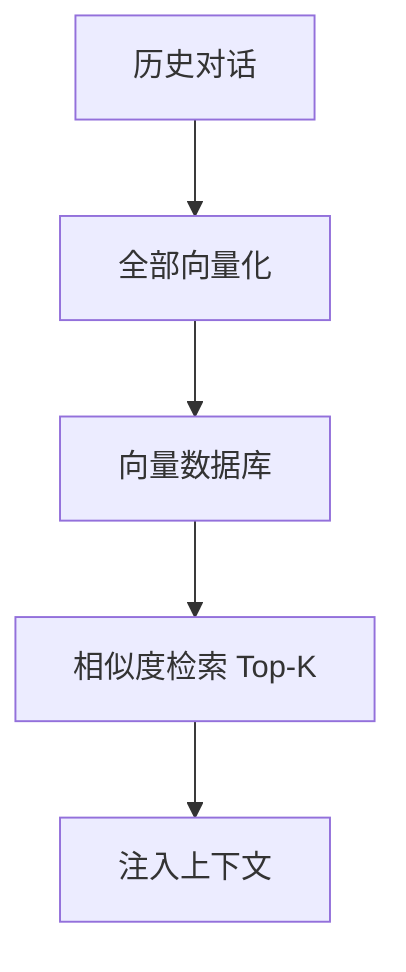
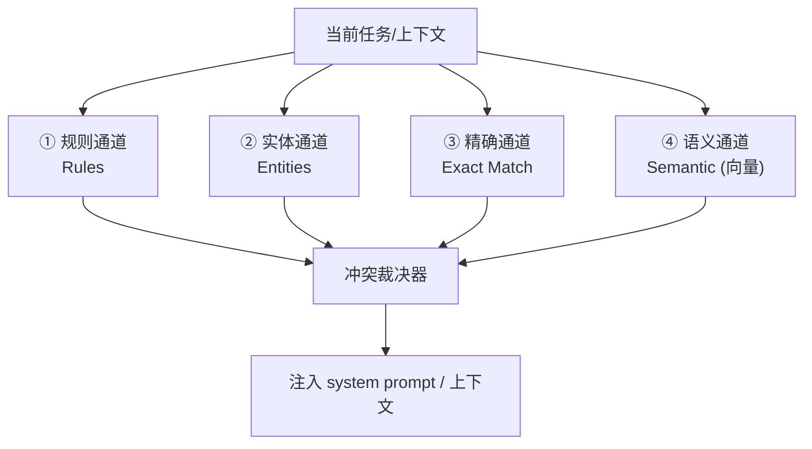
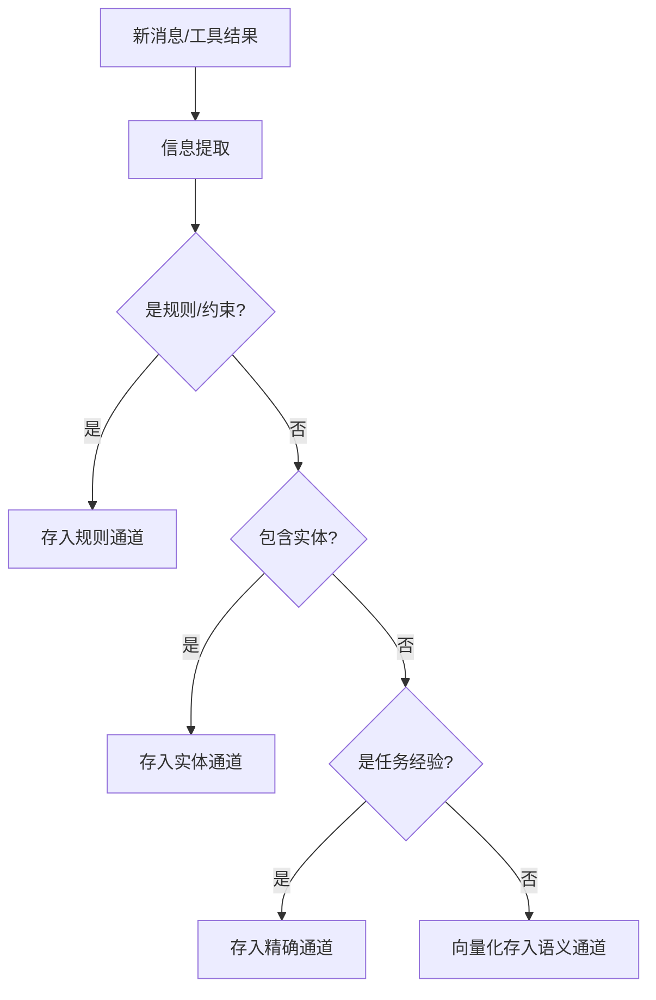

# 四通道记忆：让 Agent 记住该记住的

> 不是所有记忆都一样。规则、实体、精确事实、语义关联需要不同的存储和召回方式。这一站讲清楚四通道记忆怎么分工、冲突怎么裁决、遗忘曲线怎么工作。

---

## 问题：向量检索就是记忆吗？

很多 Agent 框架的"记忆"就是一个向量数据库——把历史对话向量化，需要时检索最相似的。



这够吗？不够。因为不同类型的记忆需要不同的处理方式：

- **"用户说预算不能超过 20 元"** — 这是规则，必须精确匹配，不能靠相似度
- **"用户叫张三，在上海工作"** — 这是实体，需要结构化存储
- **"上次这个任务用了 X 方法成功了"** — 这是精确事实，需要按任务匹配
- **"类似的问题通常需要先查文档"** — 这是语义关联，适合向量检索

prodagent 的解法：**四通道并行召回 + 冲突裁决。**

---

## 四通道架构



四个通道并行召回，结果汇总后经过冲突裁决，注入到模型的上下文。

---

## 逐通道详解

### ① 规则通道（Rules）

**存什么**：用户明确表达的约束、偏好、禁令。
- "预算不能超过 20 元"
- "不要发邮件，用站内信"
- "回答用中文"
- "每次操作前先确认"

**怎么存**：结构化的规则列表，每条有条件和动作。

**怎么召回**：不是相似度检索，而是**条件匹配**——当前任务满足规则的触发条件时，规则自动生效。

**为什么单独一个通道**：规则是硬约束，不能靠相似度"差不多匹配"。"预算不超过 20"和"预算不超过 30"是完全不同的规则，向量检索可能混淆。

### ② 实体通道（Entities）

**存什么**：关于用户和世界的结构化事实。
- 用户姓名、职位、所在地
- 项目名称、技术栈、关键人员
- 常用工具、偏好的模型

**怎么存**：类似知识图谱——实体 + 属性 + 关系。

```
用户: 张三
  ├─ 职位: 工程师
  ├─ 所在地: 上海
  └─ 项目: ProdAgent
       ├─ 技术栈: Python
       └─ 团队: 5人
```

**怎么召回**：根据当前任务中提到的实体，拉取相关的属性和关联实体。

**为什么单独一个通道**：实体有明确的结构（属性、关系），用向量检索会丢失结构信息。"张三的项目"和"张三在项目里的角色"是不同的查询。

### ③ 精确通道（Exact Match）

**存什么**：历史任务的精确记录——什么任务、用了什么方法、结果如何。
- "任务 X 用了方法 Y，成功了"
- "任务 Z 尝试了方法 A，失败了，原因是 B"
- "这个 API 的调用方式是..."

**怎么存**：按任务特征（任务类型、关键词、工具组合）建立索引。

**怎么召回**：当前任务与历史任务的特征精确匹配时召回。不是语义相似度，而是特征匹配（任务类型相同、关键词重叠、工具集相似）。

**为什么单独一个通道**：成功/失败的经验需要精确匹配。"上次修这个 bug 用了 X 方法"——如果靠语义检索，可能召回一个"看起来相似但实际不同"的任务经验，误导模型。

### ④ 语义通道（Semantic）

**存什么**：模糊的、关联性的知识和经验。
- "类似的问题通常需要先查文档"
- "这个领域的术语有..."
- 一般性的背景知识

**怎么存**：向量数据库，文本向量化后存储。

**怎么召回**：标准的相似度检索，Top-K 最相关的片段。

**为什么需要这个通道**：不是所有记忆都能结构化。有些经验是模糊的、关联性的，适合向量检索。这是大多数框架唯一的记忆通道，prodagent 把它作为四个通道之一。

#### 默认不依赖任何模型：哈希伪向量
很多人以为"语义检索 = 调一个 embedding 大模型 API"。prodagent 的默认实现偏偏不——`cognition/memory/embedder.py` 的 `HashEmbedder` 用经典的**哈希技巧（hashing trick）**在本地、离线、确定性地造出向量：

```python
def embed(self, text):
    vec = [0.0] * 256                              # 固定 256 维
    for token in tokenize_cjk(text):              # 复用底座的中英文分词
        idx = blake2b(token) % 256                # 每个词哈希到某一维
        vec[idx] += 1.0                           # 该维 +1（词袋）
    return L2 归一化(vec)                          # 之后用余弦相似度比较
```

两篇文本用到的词越接近，落到相同维度的次数就越多，余弦相似度（`cosine`）就越高——用零依赖、零网络的方式近似了"语义相近"。它当然不如真正的神经网络 embedding 准，但对个人助手这种规模的记忆库完全够用，而且**让整个记忆系统离线可跑、测试零 flaky**（和 FakeLLM 是同一种追求）。更关键的是它只是个**默认值**：`MemoryManager(embedder=...)` 支持构造器注入，生产环境你可以换成任意真实 embedding 客户端，四个通道一行都不用改——又一次"默认够用、升级换实现"的端口思维。

> **小白加餐：什么是余弦相似度？** 把一段文本看成高维空间里的一个箭头（向量），两个箭头方向越一致、夹角越小，就越相似。余弦相似度算的就是这个夹角的余弦，范围 -1~1，越接近 1 越像。因为比较的是"方向"而不是"长度"，长文本和短文本也能公平比较，所以要先做 L2 归一化把长度拉成 1。

---

## 冲突裁决

四个通道可能返回矛盾的信息。比如：
- 规则通道说"预算不超过 20"
- 语义通道召回了"类似任务通常花 50"

裁决器的优先级：

```
规则 > 实体 > 精确 > 语义
```

| 优先级 | 通道 | 理由 |
|--------|------|------|
| 1（最高） | 规则 | 用户明确说的硬约束，不可违反 |
| 2 | 实体 | 关于当前用户/项目的确切事实 |
| 3 | 精确 | 历史同类任务的经验 |
| 4（最低） | 语义 | 模糊的关联知识 |

冲突时，高优先级通道的信息覆盖低优先级的。同时记录冲突日志，可观测系统可以分析"为什么这次召回了矛盾的信息"。

---

## 记忆的写入

不是所有对话都写入记忆。写入有筛选机制：



写入时自动分类到合适的通道。用户也可以显式标记"记住这个"。

---

## 遗忘曲线

记忆不是无限增长的。每个通道有自己的遗忘策略：

| 通道 | 遗忘策略 |
|------|---------|
| 规则 | 不自动遗忘，用户显式删除才移除 |
| 实体 | 长期保留，可更新属性 |
| 精确 | 按时间衰减，超过 N 天未召回的降低权重 |
| 语义 | 标准的向量库 TTL，超过 N 天自动清理 |

**为什么需要遗忘？**
- 旧经验可能过时（技术栈变了、项目换了）
- 记忆太多会降低召回精度（噪声增加）
- 控制存储成本

遗忘不是删除，而是降低权重——重要的记忆如果被频繁召回，权重不会降。

### 激活：衰减、频率与近期

权重的计算遵循认知科学里经典的激活模型（ACT-R 一脉）：

```
activation = 指数衰减（按 TTL） + 频率加成（按召回次数） + 近期加成（7 天内被碰过）
```

三因子各有分工：衰减回答「这条记忆多老了」，频率回答「它被证明有用过多少次」，近期回答「它还热不热」。合在一起得到一个反直觉的性质——**一条记忆可以靠持续有用赎回自己的寿命**：衰减在走，但每次召回都在往回加。这正是人类记忆的行为，公式只是把它写了下来。两类记忆被刻意排除在这套算术之外：硬约束和实体事实恒为满激活——**该记住的东西，不允许被时间稀释。**

### 召回即强化，但强化不阻塞召回

每次召回成功，被召回的记忆要记一笔「访问次数 +1」——这是下一次激活的燃料。但这笔记账走后台队列异步落盘，检索路径上没有一次写盘。原则是：**读操作保持纯读，副作用异步落地**——否则召回越有用、记忆库越热，检索反而越慢，好的行为会惩罚自己。

具体实现是 `cognition/memory/touch_worker.py` 的 `TouchBackWorker`：召回时只把记忆 id `put_nowait` 进一个内存队列就立刻返回；一个后台 `asyncio.Task` 串行地从队列取 id、调用 `touch_memory` 落盘。两个细节值得学：

> **小白加餐：asyncio 后台任务。** `asyncio.create_task` 会把一个协程扔到事件循环里"抽空并行跑"，主流程不必 `await` 它——这正是"不阻塞召回"的实现方式。但后台任务绝不能反噬主流程：它内部 `try/except` 把写盘失败降级成一条 warning（强化是锦上添花，失败了不该让召回报错），关闭时用 `aclose()` 取消任务并干净收尾。**把"重要但不紧急、失败可容忍"的副作用挪到后台，是让关键路径又快又稳的通用手法。**

写入侧还有两个容易忽略的角色：`MemoryClassifier` 用一次轻量 LLM 调用把原始文本提炼成结构化 `MemoryRecord`（输入长度、输出 token 都被严格限界，避免分类本身烧钱）；`FactStore` 则是图存储 `GraphStore` 之上的**异步门面**——因为后端可能是网络另一头的 Neo4j，所以它的每个方法都是 async，绝不让一次网络阻塞卡住记忆流水线。

### 可逆的遗忘

冲突裁决的败者不被告别——被打上 `superseded` 标记，留在原地。两种时候你会感谢这个设计：审计时想追问「这条记忆为什么不再生效」（答案在胜者身上，链条完整）；以及裁决误判时想整体回滚（败者还在，恢复是改一个布尔值，不是做数据恢复）。**删除毁掉历史，淘汰保留历史**——对一套会自主学习的系统，历史就是它做过的所有决定的证据链。

---

## 记忆与压缩的配合

| | 压缩 | 记忆 |
|---|------|------|
| **范围** | 当前 Run 的消息历史 | 跨 Run 的持久化知识 |
| **目标** | 控制当前上下文长度 | 跨任务复用经验 |
| **时机** | 每轮动态计算 | 写入时分类，召回时并行查询 |
| **存储** | 不存储，只修改视图 | 持久化到记忆存储 |

**配合方式**：
1. 长任务中，压缩保证当前 Run 不爆 token
2. 任务结束后，重要信息从 Run 中提取并写入记忆
3. 下次任务开始时，记忆召回注入上下文
4. 压缩时，"已存入记忆的内容"可以更激进地压缩（因为记忆里还有备份）

---

## 代码定位

| 内容 | 源码位置 |
|------|---------|
| MemoryManager | `cognition/memory/manager.py` |
| 四通道（Rule/Entity/Exact/Semantic） | `cognition/memory/channels.py` |
| 记忆分类 | `cognition/memory/classification.py` |
| 冲突裁决 | `cognition/memory/conflict.py` |
| 嵌入器（默认哈希伪向量，可换真 embedding） | `cognition/memory/embedder.py` |
| 后台强化工人（不阻塞召回） | `cognition/memory/touch_worker.py` |
| 事实存储 | `cognition/memory/facts.py` |
| 遗忘曲线 | `cognition/memory/forgetting.py` |
| 存储模型（MemoryRecord/MemoryType） | `ports/document.py` |
| 记忆后端 | `backends/file/` `backends/postgres/`（DocumentStore） |

---

## 下一步

- 记忆和技能有什么区别？→ [技能闭环专题 →](skills.md)
- 记忆和压缩怎么配合？→ [五级压缩专题 →](compression.md)
- 想回到 tour？→ [第 ① 站：核心词汇 →](../tour/01-core.md)
