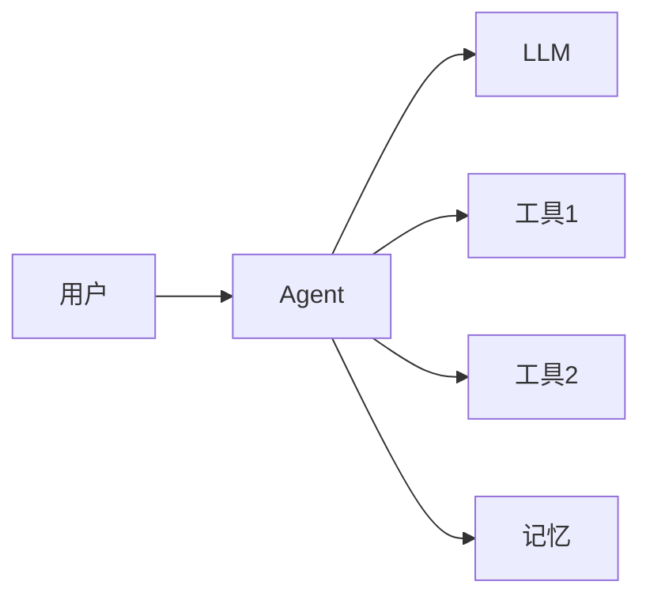
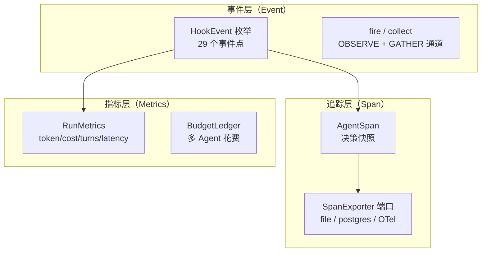
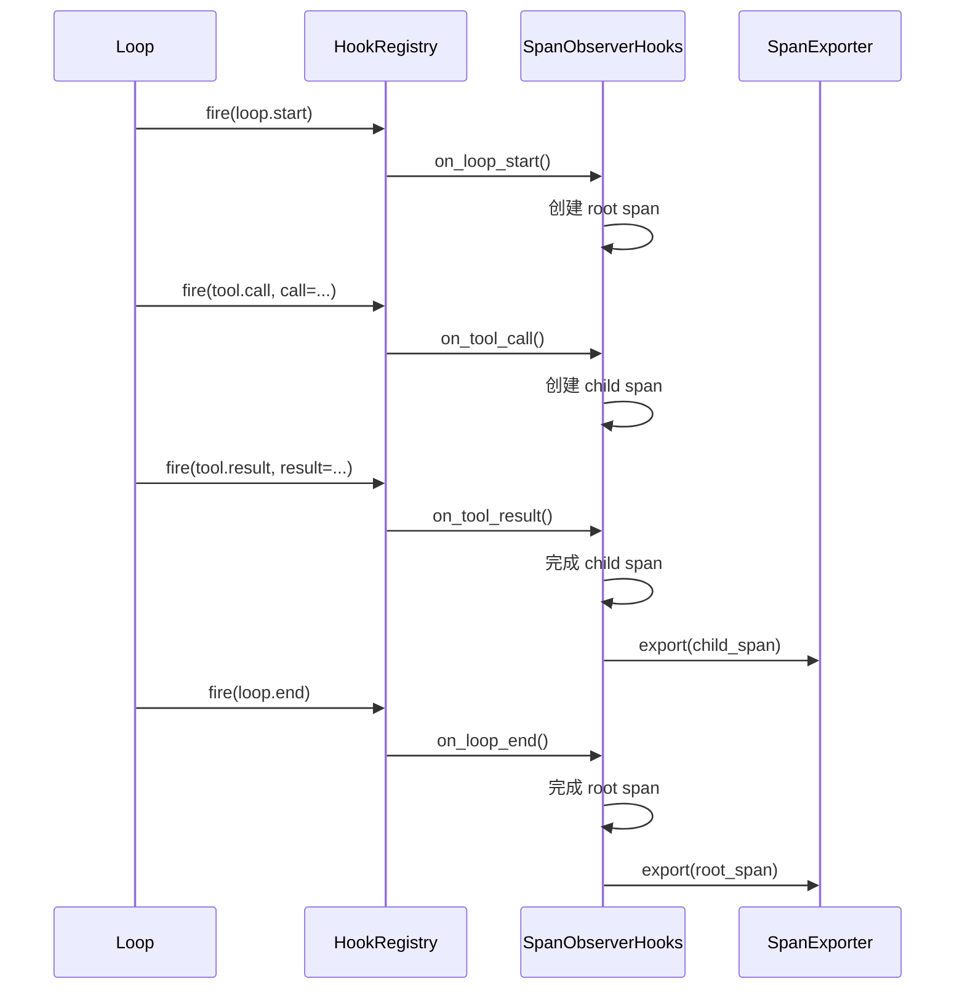

# 全链路可观测：Span、事件、指标

> Agent 跑起来后，你怎么知道它在干什么？出了问题怎么定位？这一站讲清楚三协议总线的事件流、Span 追踪、指标采集。

---

## 问题：Agent 是黑盒吗？



一个 Agent 可能跑 20 轮，每轮调一次模型、执行多个工具。出了问题：
- 它为什么做了这个决策？
- 哪一步花了最多时间？
- 哪个工具失败了？
- token 花在哪了？
- 多 Agent 场景下，消息在哪丢了？

prodagent 的可观测性建立在三协议总线上——**所有状态变更都通过事件发出，不依赖 print 或日志猜测。**

---

## 三层可观测体系



---

## 一、事件层：29 个 HookEvent

所有关键节点都有事件。`HookEvent` 枚举定义在 `kernel/bus.py`：

### 生命周期事件

| 事件 | 触发时机 |
|------|---------|
| `session.start` / `session.end` | 会话开始/结束 |
| `loop.start` / `loop.end` | 循环开始/结束 |
| `turn.start` | 每轮 Step 开始 |
| `run.complete` / `run.failed` | Run 完成/失败 |

### 模型与工具事件

| 事件 | 触发时机 |
|------|---------|
| `llm.request` | 调用模型前 |
| `llm.think` | 流式 token 到达（思维链/打字机） |
| `tool.call` | 工具执行前 |
| `tool.result` | 工具执行后 |
| `approval.request` | 审批挂起 |

### 规划与步骤事件

| 事件 | 触发时机 |
|------|---------|
| `plan.ready` | 计划生成完成 |
| `plan.replanned` | 增量重规划 |
| `step.started` / `step.completed` / `step.failed` | DAG 步骤状态变更 |

### 多 Agent 事件

| 事件 | 触发时机 |
|------|---------|
| `agent.spawn` / `agent.result` | 子 Agent 委派/返回 |
| `peer.handoff` | Peer 接力 |
| `skill.load` / `skills.ready` | 技能加载 |

### 上下文与记忆事件

| 事件 | 触发时机 |
|------|---------|
| `context.build` | 上下文组装 |
| `memory.recall` / `memory.classify` | 记忆召回/分类 |
| `learning.synthesize` | 经验合成 |
| `budget.token_update` | token 记账更新 |

### 异常事件

| 事件 | 触发时机 |
|------|---------|
| `injection.failed` | 注入器失败 |
| `checkpoint.failed` | checkpoint 落盘失败 |

---

## 二、追踪层：AgentSpan

Span 是**决策快照**——记录"在什么上下文下做了什么决策、结果如何"。

```python
# base/observability.py
@dataclass
class AgentSpan:
    # —— 身份与位置 ——
    span_id: str
    trace_id: str                 # 同一条 trace（可跨多 Agent）
    run_id: str
    parent_span_id: str | None = None   # 支持嵌套（spawn 子 Agent）
    action: str                   # 这一步在做什么（对应触发的动作）
    # —— 决策上下文：为什么模型这么选 ——
    input_payload: dict[str, Any] # 输入快照
    system_prompt_version: str = ""
    retrieved_context: list[str] = field(default_factory=list)
    llm_reasoning: str = ""
    # —— 结果与成本 ——
    output: Any = None
    error: str | None = None
    latency_ms: float = 0.0
    input_tokens: int = 0
    output_tokens: int = 0
    cost_usd: float = 0.0
    sampled: bool = True          # 是否被采样保留
    timestamp: float
```

字段分三组，正好对应"决策快照"这个定位：**身份与位置**（它属于哪条 trace、哪个 run、挂在哪个父 span 下）、**决策上下文**（当时的输入、召回了什么、模型的推理是什么——回答"为什么这么选"）、**结果与成本**（输出、错误、耗时、token、花费）。落日志时 `to_log_line()` 只摘出定位和成本等关键字段，避免每行都写入庞大的输入快照。

### SpanExporter 端口

```python
@runtime_checkable
class SpanExporter(Protocol):
    async def export(self, span: AgentSpan) -> None: ...
    async def shutdown(self) -> None: ...
```

内置实现：
- **file** — 写入 JSONL 文件（默认，production profile）
- **postgres** — 写入数据库，支持查询
- 自定义实现可以对接 OpenTelemetry、Jaeger、LangSmith 等

### Span 的生命周期



`SpanObserverHooks`（`hooks/bundles/observability.py`）自动把事件转换为 Span，用户不需要手动埋点。

---

## 三、指标层：RunMetrics

每个 Run 维护一个 `RunMetrics` 对象：

```python
@dataclass
class RunMetrics:
    turn_count: int = 0
    input_tokens: int = 0
    output_tokens: int = 0
    cache_read_tokens: int = 0
    cache_write_tokens: int = 0
    cost_usd: float = 0.0
    started_at: float = ...
    completed_at: float | None = None
```

每轮 Step 结束后更新，通过 `budget.token_update` 事件发出。前端可以实时展示：
- 已用轮次 / 预算轮次
- 已用 token / 预算 token
- 已花费 / 预算金额
- 已用时间 / 预算时间

多 Agent 场景下，`BudgetLedger` 汇总所有子 Agent 的花费，父 Agent 的预算检查包含子 Agent 的已提交花费。

---

## 四、事件日志：EventLog

除了 Span（决策快照），还有 EventLog（状态变更日志）：

```python
@runtime_checkable
class EventLog(Protocol):
    async def append(self, event: Event, expected_seq: int | None = None) -> int: ...
    async def get_events(self, stream_id: str) -> list[Event]: ...
    async def get_after(self, stream_id: str, seq: int) -> list[Event]: ...
```

- **append-only** — 只追加，不修改不删除
- **单调 LSN** — 每个事件有全局递增的日志序列号
- **乐观并发** — `expected_seq` 防止并发写入冲突
- **事件溯源** — Plan 状态可以通过重放事件重建

EventLog 和 SpanExporter 的区别：
- SpanExporter 导出的是**决策快照**（发生了什么、耗时多久），适合追踪和分析
- EventLog 记录的是**状态变更**（状态从 A 变成 B），适合审计和事件溯源重建

---

## 五、控制台观察者

`hooks/observers/` 提供了开发时用的控制台输出：

| 观察者 | 作用 |
|--------|------|
| `ConsoleHooks` | 彩色打印事件流（Agent 名、工具调用、结果） |
| `CacheMonitorHooks` | 监控 LLM 缓存命中率 |

```python
from prodagent.hooks.observers.console import ConsoleHooks

hooks = HookRegistry()
ConsoleHooks().attach(hooks)
```

开发时可以实时看到 Agent 的每一步操作，不需要打开调试器。

---

## 六、审计

`hooks/audit.py` 提供审计日志：
- 所有工具调用（参数、结果、耗时、是否被拦截）
- 所有审批决定（通过/拒绝、审批人）
- 所有 Agent 间交接（spawn/peer/handoff）
- 所有权限拦截

审计日志通过 SpanExporter 持久化，支持事后追溯。

---

## 代码定位

| 内容 | 源码位置 |
|------|---------|
| HookEvent / Gate / HookRegistry | `kernel/bus.py` |
| AgentSpan | `base/observability.py` |
| SpanExporter 端口 | `ports/span.py` |
| SpanObserverHooks | `hooks/bundles/observability.py` |
| 控制台观察者 | `hooks/observers/console.py` |
| 缓存监控 | `hooks/observers/cache_monitor.py` |
| 审计 | `hooks/audit.py` |
| EventLog 端口 | `ports/event_log.py` |
| Event 数据模型 | `base/event_log.py` |
| RunMetrics | `kernel/state.py` |
| BudgetLedger | `kernel/budget.py` |

---

## 下一步

- 想知道事件怎么驱动扩展？→ [架构详解 →](../architecture.md)
- 多 Agent 治理事件怎么用？→ [多 Agent 治理专题 →](governance.md)
- 想回到 tour？→ [第 ⑤ 站：循环内核 →](../tour/05-loop.md)
