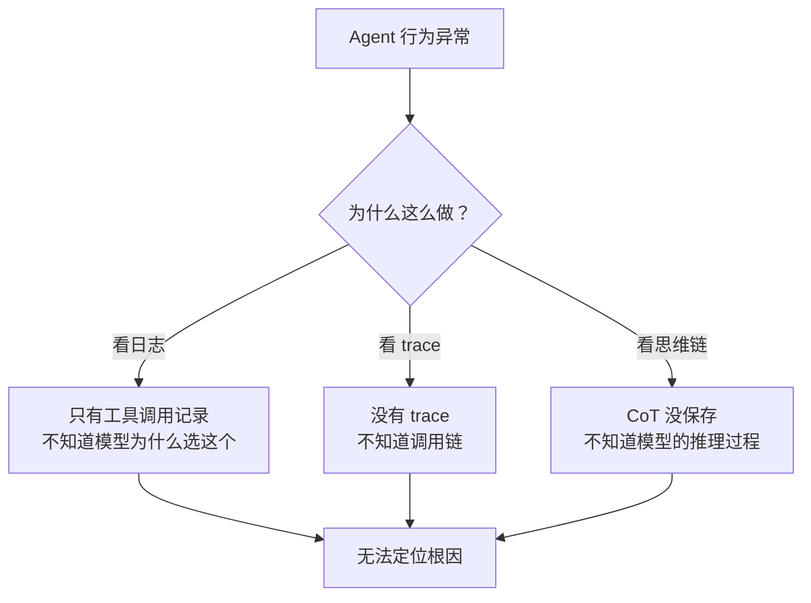
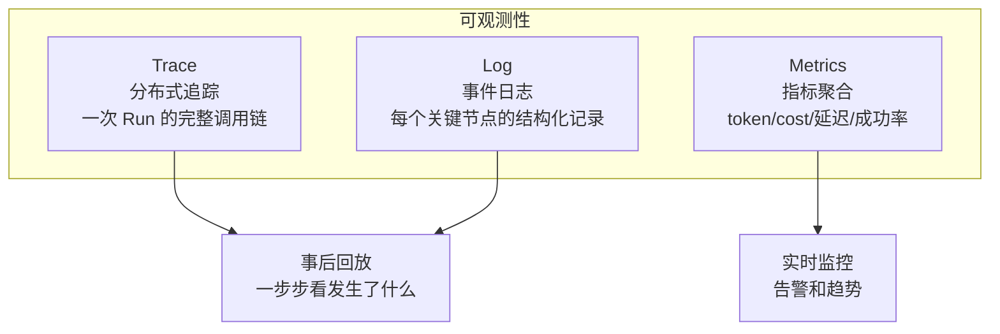
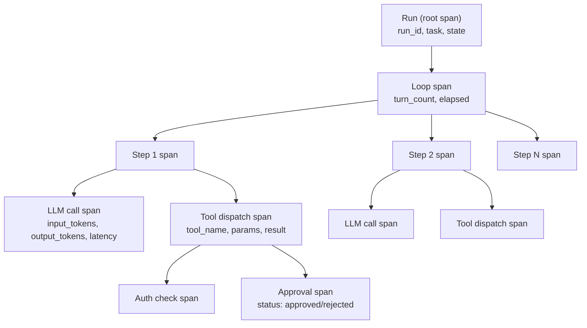

# 全链路可观测：出了问题能回放

> Agent 系统最难调试的地方是"模型在想什么"。这一站讲清楚 span 追踪、事件日志、思维链落盘、Trace/Log/Metrics 三位一体。

---

## 问题：Agent 出了问题怎么排查？



传统应用的可观测性（日志、指标、追踪）对 Agent 不够。因为 Agent 的核心决策是"模型想了什么"，如果不记录思维链，出了问题只能猜。

---

## 三位一体：Trace / Log / Metrics



| 维度 | 回答什么问题 | 典型用途 |
|------|------------|---------|
| Trace | 这次 Run 经历了什么？ | 事后排查、性能分析 |
| Log | 某个时刻发生了什么？ | 实时调试、审计 |
| Metrics | 整体表现如何？ | 监控告警、成本分析 |

---

## 一、Span 追踪

### OpenTelemetry 兼容

prodagent 的追踪系统兼容 OpenTelemetry 语义，可以接入 Jaeger、Zipkin、Datadog 等标准工具。

### 一次 Run 的 Span 树



每个 Span 记录：
- `span_id` / `parent_span_id` — 层级关系
- `name` — 操作名称（llm.call、tool.execute、approval.request）
- `start_time` / `end_time` — 耗时
- `attributes` — 结构化属性（token 数、工具名、参数摘要）
- `status` — OK / ERROR

### 关键 Span 类型

| Span | 属性 | 作用 |
|------|------|------|
| `agent.run` | run_id, task, mode, state | 整个 Run 的根 span |
| `agent.step` | turn, elapsed_seconds | 一轮 Step |
| `llm.call` | model, input_tokens, output_tokens, cache_read, cache_write, cost_usd, latency | 模型调用 |
| `llm.chunk` | token_length | 流式 chunk（可选，量大时采样） |
| `tool.execute` | tool_name, side_effect, params_hash, result_length, latency | 工具执行 |
| `tool.auth` | allowed, reason | 权限校验 |
| `tool.approval` | approval_id, status, approver | 审批 |
| `budget.check` | axis, value, limit | 预算检查 |
| `checkpoint.save` | version, size_bytes | checkpoint 落盘 |
| `memory.recall` | channel, count | 记忆召回 |
| `context.compress` | level, before_tokens, after_tokens | 上下文压缩 |

---

## 二、事件总线：HookEvent

内核在关键节点触发事件，可观测系统通过订阅事件收集数据：

```python
class HookEvent(Enum):
    LOOP_START = "loop_start"
    LOOP_END = "loop_end"
    TURN_START = "turn_start"
    LLM_REQUEST = "llm_request"
    THINK = "think"                    # 思维链 token
    TOKEN_UPDATE = "token_update"      # token/cost 统计
    TOOL_CALL = "tool_call"
    TOOL_RESULT = "tool_result"
    APPROVAL_REQUEST = "approval_request"
    APPROVAL_RESOLVED = "approval_resolved"
    CHECKPOINT_SAVE = "checkpoint_save"
    BUDGET_EXCEEDED = "budget_exceeded"
    # ...
```

**为什么用事件总线而不是直接调用可观测 API？**
- 核心不依赖可观测系统（可观测是可选的）
- 多个订阅者可以同时监听（一个写日志，一个写 span，一个发告警）
- 测试时可以不注册任何订阅者，零开销

---

## 三、思维链落盘

这是 Agent 可观测性最关键也最容易被忽略的部分。

```python
async def _on_chunk(text: str):
    await _fire(self._bus, HookEvent.THINK, text=text, run_id=run.run_id)
    token_events.append(ThinkTokenEvent(token=text, run_id=run.run_id))
```

模型的每一个输出 token（包括 reasoning_content）都通过 THINK 事件发出。可观测系统可以：
- 实时展示思维链（playground 的调试视图）
- 落盘保存（事后回放模型的完整思考过程）
- 分析（"模型在第 3 轮为什么改变了策略"）

**支持 reasoning 的模型**（Claude、DeepSeek-R1 等）的 `reasoning_content` 也会被记录。这是排查"模型为什么做出这个决策"的最直接证据。

---

## 四、Metrics：聚合指标

从 Span 和事件中聚合出的指标：

| 指标 | 类型 | 标签 | 用途 |
|------|------|------|------|
| `agent_runs_total` | Counter | mode, state, agent_name | Run 数量、成功率 |
| `agent_run_duration_seconds` | Histogram | mode, agent_name | 延迟分布 |
| `agent_tokens_total` | Counter | model, type(input/output/cache_read/cache_write) | token 消耗 |
| `agent_cost_usd_total` | Counter | model, agent_name | 成本 |
| `agent_tool_calls_total` | Counter | tool_name, side_effect, result(success/error) | 工具调用统计 |
| `agent_approvals_total` | Counter | tool_name, status(approved/rejected/expired) | 审批统计 |
| `agent_budget_exceeded_total` | Counter | axis(turns/seconds/tokens/cost) | 预算耗尽统计 |
| `agent_context_compression_level` | Gauge | level | 压缩级别分布 |

这些指标可以接入 Prometheus / Grafana，做实时监控和告警。

---

## 五、事后回放：从 Trace 重建完整过程

有了 Span + 事件 + 思维链，可以完整回放一次 Run：

```
时间线回放:
  T+0.0s  Run 开始: task="调研 prodagent"
  T+0.1s  记忆召回: 规则通道 2 条, 语义通道 3 条
  T+0.2s  上下文组装: 1200 token, 压缩级别 L0
  T+0.5s  LLM 调用开始: model=claude-3-5, input=1200 token
  T+0.5s  [CoT] "我需要先搜索 prodagent 的基本信息..."
  T+2.1s  LLM 返回: output=150 token, tool_calls=[search("prodagent github")]
  T+2.1s  工具调用: search, params={"query":"prodagent github"}
  T+2.2s  权限校验: allowed (readonly)
  T+2.5s  工具返回: 5000 token 结果
  T+2.6s  记账: total_tokens=6350, cost=$0.012
  T+2.7s  预算检查: turns=1/20, tokens=6350/100000, cost=$0.012/$1.0 ✓
  ...
```

这比"看日志猜发生了什么"高效得多。

---

## 六、可观测性是可选的护甲

和审批、权限一样，可观测性是可选的 hook：

```python
# 裸核：零可观测开销
agent = Agent("demo", tools=[search])

# 生产：全套可观测
from prodagent.base.config import production
agent = Agent("demo", tools=[search], config=AgentConfig(framework=production()))
# production() 自动注册 span 追踪、事件日志、指标收集
```

裸核模式下，事件总线没有订阅者，`_fire` 直接返回，零开销。生产模式下注册订阅者，全链路追踪。

---

## 代码定位

| 内容 | 源码位置 |
|------|---------|
| HookEvent 定义 | `kernel/events.py` |
| 事件总线 | `kernel/bus.py` |
| SpanStore 端口 | `ports/span.py` |
| EventLog 端口 | `ports/event_log.py` |
| 可观测 hooks | `hooks/observers/` |
| Span 实现 | `backends/file/span.py` `backends/postgres/span.py` |
| 事件日志实现 | `backends/file/event_log.py` |
| CoT 记录 | `kernel/step.py::_call_llm` |
| 缓存指标聚合 | `hooks/observers/cache_monitor.py` |

---

## 下一步

- 可观测数据怎么用于评估？→ [评估与回归专题 →](evaluation.md)
- 治理事件怎么接入可观测？→ [多 Agent 治理专题 →](governance.md)
- 想回到 tour？→ [第 ⑤ 站：循环内核 →](../tour/05-loop.md)
