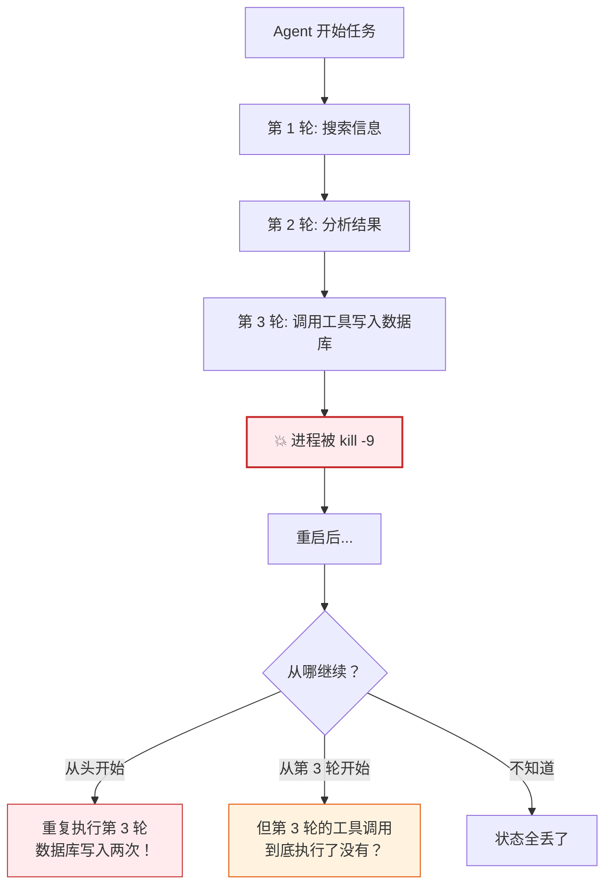
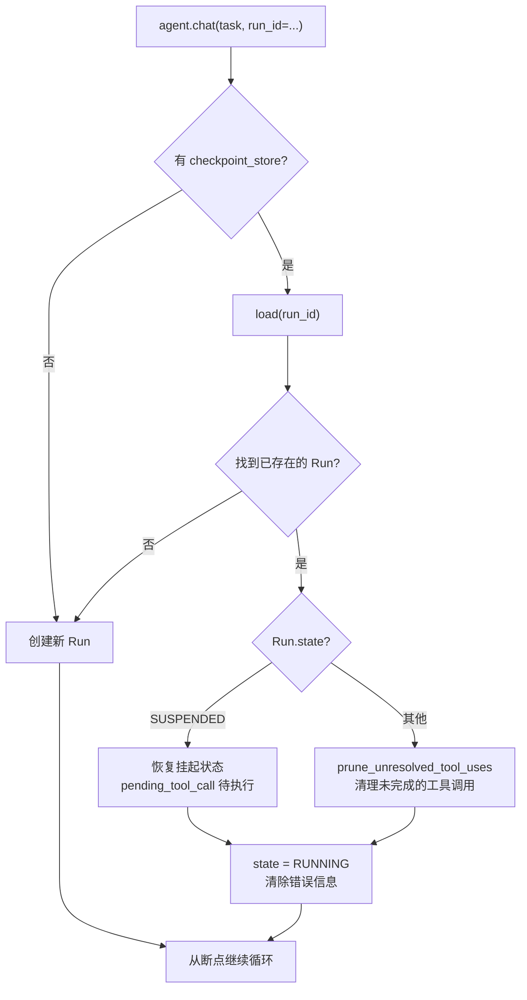
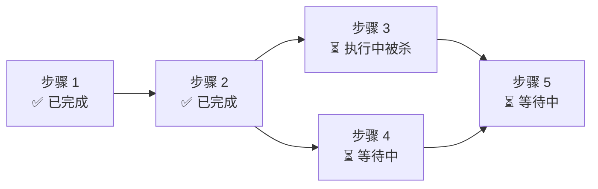

# 崩溃恢复：kill -9 之后怎么从断点续跑

> 长任务跑到一半，进程被杀了。重启后怎么从断点继续，不丢状态、不重复执行？这是生产级 Agent 和玩具的分水岭。

---

## 问题：为什么恢复这么难？



难点在于：
1. **状态在哪？** — 如果状态散落在局部变量里，进程死了就全丢了
2. **幂等性** — 工具调用可能已经执行了，重复执行会造成副作用（发两封邮件、扣两次款）
3. **并发安全** — 两个进程可能同时恢复同一个 Run，造成冲突

---

## prodagent 的解法：可序列化的 Run + 乐观并发 checkpoint

### 核心思想

```
所有状态都收敛到 AgentRun 对象 → 每轮结束后序列化落盘 → 恢复时加载对象继续
```

不是"记录操作日志然后重放"，而是"直接保存整个状态对象"。更简单，也更可靠。

---

## AgentRun：可序列化的状态容器

```python
@dataclass
class AgentRun:
    run_id: str                    # 唯一标识
    task: str                      # 原始任务
    state: RunState                # RUNNING / COMPLETED / SUSPENDED / FAILED
    messages: MessageList          # 完整对话历史
    metrics: RunMetrics            # token/cost/turns 统计
    pending_tool_call: ToolCall | None  # 审批挂起时的待执行调用
    pending_approval_id: str | None     # 关联的审批请求 ID
    pending_handoff: PendingHandoff | None  # 多 Agent 接力的待交接包
    checkpoint_version: int        # 乐观并发版本号
    last_error: str | None
    error: ClassifiedError | None
```

**整个对象可以直接 JSON 序列化**，存到文件或数据库。恢复时反序列化，继续跑。

> 为什么用 dataclass 而不是更复杂的 ORM？因为状态对象需要频繁序列化/反序列化，dataclass + JSON 最简单、最透明、最容易调试。需要数据库时，把 JSON 存到一个字段里就行。

---

## checkpoint 端口

```python
@runtime_checkable
class CheckpointStore(Protocol):
    async def save(self, run: AgentRun, expected_version: int | None = None) -> None:
        """幂等原子持久化。expected_version 启用乐观并发。"""

    async def load(self, run_id: str, version: int | None = None) -> AgentRun | None:
        """返回 Run 或 None。version=None 表示最新。"""

    async def list_run_ids(self) -> list[str]: ...

    # 可选能力
    async def fork(self, run_id, at_version, new_run_id=None) -> str: ...
    async def list_versions(self, run_id) -> list[int]: ...
```

### 乐观并发控制

```python
async def save(self, run, expected_version=None):
    if expected_version is not None:
        current = await self._get_version(run.run_id)
        if current != expected_version:
            raise VersionConflict(
                f"Expected version {expected_version}, found {current}",
                run_id=run.run_id,
            )
    # 原子写入
    run.checkpoint_version += 1
    await self._atomic_write(run)
```

**为什么用乐观并发而不是锁？**
- 分布式锁难实现、易死锁
- Agent Run 的写入冲突概率很低（通常一个 Run 只有一个执行者）
- 乐观并发：读版本 → 改 → 写时检查版本，不一致就报错重试
- 更适合云原生、无状态的执行环境

---

## 保存时机：每轮结束，无论结果

```python
async def stream(self, task, *, run_id=None):
    run = await self._resolve_run(task, run_id=run_id)
    try:
        async for event in self._loop_events(run):
            yield event
    except BudgetExceeded as exc:
        yield await self._settle_terminated(run, exc)
    except InfiniteLoopDetected as exc:
        yield await self._settle_terminated(run, exc)
    except Exception as exc:
        await self._settle_unexpected(run, exc)
        raise
    else:
        await self._end_run_span(run)
    finally:
        # ← 关键：无论成功、失败、异常，都保存 checkpoint
        if self._checkpoint_store is not None:
            await save_and_fire_checkpoint(self._checkpoint_store, run, self._hooks)
```

`finally` 块保证了：即使抛异常，状态也会落盘。

---

## 恢复流程



### 关键细节 1：SUSPENDED 状态的恢复

```python
if run.pending_tool_call is not None:
    resumed_call = run.pending_tool_call
    run.pending_tool_call = None
    self._dispatcher.set_pending_approval_id(run.pending_approval_id)
    run.pending_approval_id = None
    # 直接执行之前挂起的工具调用，不重新问 LLM
    async for batch_evt in self._dispatcher.run_batch(run, [resumed_call]):
        yield batch_evt
```

审批挂起时，`pending_tool_call` 保存了模型请求的工具调用。审批通过后恢复时，**直接执行这个调用，不重新问 LLM**。

为什么？因为：
- 重新问 LLM 可能得到不同的结果（非确定性）
- 浪费 token 和时间
- 用户审批的是"这个具体的工具调用"，不是"重新生成一个"

### 关键细节 2：prune_unresolved_tool_uses

```python
@staticmethod
def _prune_unresolved_tool_uses(run: AgentRun) -> None:
    msgs = run.messages
    if not msgs:
        return
    last = msgs[-1]
    if last.get("role") == "assistant" and run.pending_tool_call is not None:
        msgs.pop()  # 移除未完成的 assistant 消息
    run.pending_tool_call = None
```

如果进程在"模型输出了 tool_calls，但工具还没执行完"的时候被杀了，最后一条 assistant 消息引用了不存在的 tool result。恢复时要把这条消息删掉，让模型重新决策。

这是为了保持消息列表的一致性——OpenAI API 要求 tool_calls 必须有对应的 tool result，否则报错。

---

## 幂等性：工具重复执行怎么办？

checkpoint 解决了"状态不丢"，但没解决"工具会不会执行两次"。

```
时间线：
  T1: 模型输出 tool_call（send_email）
  T2: 工具开始执行
  T3: 💥 进程被杀（邮件可能发了，也可能没发）
  T4: 恢复，prune 删掉了 assistant 消息
  T5: 模型重新决策，可能再次调用 send_email
  T6: 邮件发了两次！
```

prodagent 的解法是 **idempotency key**：

```python
# ports/lock.py
class IdempotencyKey:
    """框架的唯一职责是 mint 一个崩溃稳定的幂等键。
    具体的去重逻辑由工具实现者决定——框架不知道你的工具是不是幂等的。"""
```

每个工具调用有一个稳定的幂等键（基于 run_id + turn + tool_name + 参数哈希）。工具实现者可以：
- 在工具内部检查这个 key 是否已经执行过
- 用数据库的唯一约束防止重复写入
- 对于天然幂等的操作（查询、读取），不需要处理

> 框架不假设所有工具都是幂等的——这是工具作者的责任。框架提供的是稳定的标识符和清晰的恢复语义，让工具作者能正确实现幂等。

---

## PLAN_FIRST 模式的恢复：DAG 断点续跑

PLAN_FIRST 模式更复杂，因为有一个 DAG：



恢复时：
1. 加载 DAG 状态（每个步骤的状态：PENDING / RUNNING / COMPLETED / FAILED）
2. 已完成的步骤**不重复执行**
3. RUNNING 状态的步骤标记为 PENDING，重新执行（因为不知道执行到哪了）
4. 按依赖关系继续执行后续步骤

DAG 的状态也存在 AgentRun 里，和消息历史一起序列化。

---

## 文件后端的实现

```python
# backends/file/checkpoint.py
class FileCheckpointStore:
    def __init__(self, base_dir: Path):
        self.base_dir = base_dir

    async def save(self, run, expected_version=None):
        path = self.base_dir / f"{run.run_id}.json"
        # 原子写入：先写临时文件，再 rename
        tmp = path.with_suffix(".tmp")
        tmp.write_text(json.dumps(asdict(run)))
        tmp.rename(path)  # POSIX rename 是原子的

    async def load(self, run_id, version=None):
        path = self.base_dir / f"{run_id}.json"
        if not path.exists():
            return None
        data = json.loads(path.read_text())
        return AgentRun(**data)
```

**原子写入**是关键：先写 `.tmp` 文件，再 `rename`。POSIX 的 rename 是原子的，不会出现"写了一半的文件"。

---

## 与其他方案的对比

| 方案 | 原理 | 优点 | 缺点 |
|------|------|------|------|
| **prodagent checkpoint** | 每轮保存完整状态对象 | 简单、可调试、恢复快 | 状态大时序列化慢 |
| Event Sourcing | 保存所有事件，恢复时重放 | 可追溯、可时间旅行 | 重放慢、实现复杂 |
| 定期快照 + WAL | 定时快照 + 操作日志 | 平衡性能和恢复速度 | 实现复杂度高 |
| 无恢复（大多数框架） | 从头开始 | 最简单 | 长任务不可用 |

---

## 代码定位

| 内容 | 源码位置 |
|------|---------|
| AgentRun 状态 | `kernel/state.py` |
| CheckpointStore 端口 | `ports/checkpoint.py` |
| 文件后端 | `backends/file/checkpoint.py` |
| Postgres 后端 | `backends/postgres/` |
| 恢复逻辑 | `kernel/loop.py::_resolve_run` |
| 挂起恢复 | `kernel/loop.py::_loop_events` |
| 版本冲突异常 | `base/errors.py::VersionConflict` |
| 幂等键 | `ports/lock.py` |

---

## 下一步

- 预算和恢复怎么配合？→ [四轴预算专题](budget.md)
- 审批挂起时怎么恢复？→ [HITL 审批专题](approval.md)
- 想回到生命周期 tour？→ [第 ⑤ 站：循环内核](../tour/05-loop.md)
