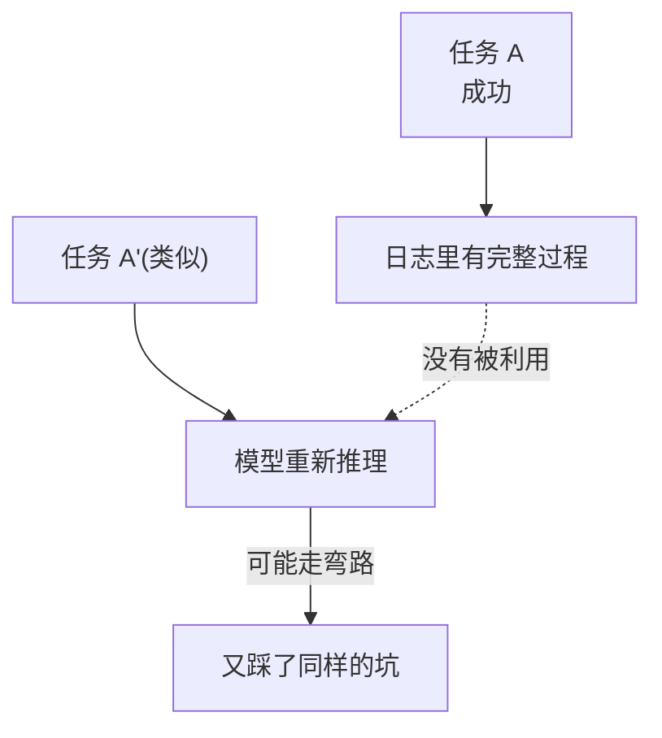
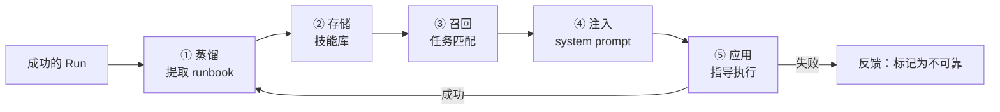
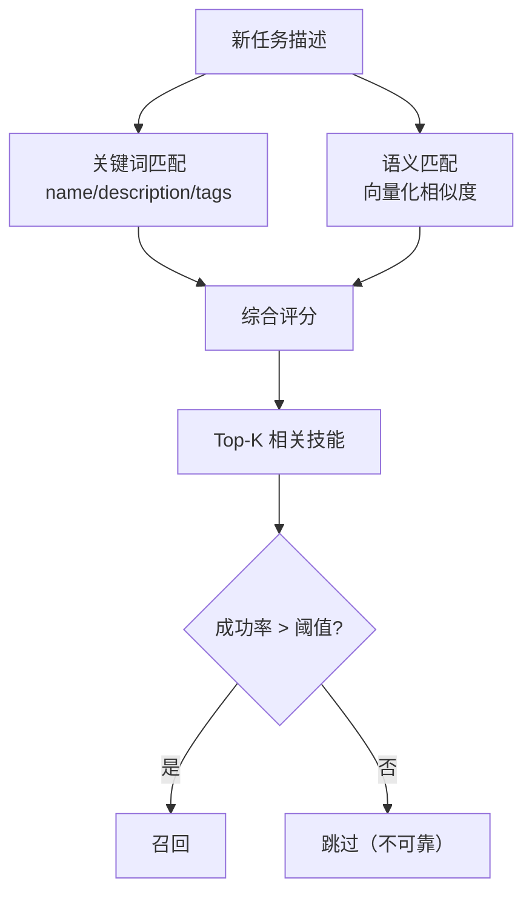

# 技能闭环：让 Agent 越用越稳

> 成功的经验不该只存在于日志里。这一站讲清楚 runbook 怎么蒸馏、怎么召回、怎么避免"学会了错误的经验"。

---

## 问题：Agent 每次都从零开始吗？



Agent 完成了一个复杂任务，过程中可能试了好几种方法、踩了坑、最终找到正确路径。但下一次遇到类似任务，它又从零开始，可能再踩同样的坑。

记忆系统存的是"事实和规则"，技能系统存的是**"怎么做某类任务的方法论"**。

---

## 技能闭环：蒸馏 → 存储 → 召回 → 应用



---

## ① 蒸馏：从成功 Run 提取 runbook

不是所有成功的 Run 都值得变成技能。蒸馏有筛选条件：

| 条件 | 说明 |
|------|------|
| 任务复杂度 | 至少 N 轮，涉及多个工具调用 |
| 成功率 | 同类任务成功过至少 K 次（避免偶然成功） |
| 可泛化性 | 方法适用于一类任务，不是只适用于这一个 |
| 用户确认 | 可选：用户标记"这个方法很好" |

蒸馏过程：
1. 分析 Run 的完整轨迹（每轮做了什么、用了什么工具、结果如何）
2. 提取"关键决策点"——在哪一步选择了什么方法、为什么
3. 总结成结构化的 runbook：
   - **适用场景**：什么任务该用这个技能
   - **步骤**：按顺序做什么
   - **工具**：用哪些工具、参数怎么设
   - **注意事项**：容易踩的坑、备选方案

```yaml
# 一个 runbook 的结构
skill: debug-python-import-error
description: 解决 Python import 错误的标准流程
适用场景:
  - ModuleNotFoundError
  - ImportError
步骤:
  1. 检查模块是否安装: pip list | grep <module>
  2. 检查 Python 路径: python -c "import sys; print(sys.path)"
  3. 检查虚拟环境: which python
  4. 如果是相对导入: 检查 __init__.py 和包结构
工具:
  - run_command
  - read_file
注意事项:
  - 不要直接修改 site-packages
  - 优先用虚拟环境隔离
```

---

## ② 存储：技能库

runbook 存储在 `ExperienceStore` 端口中，默认文件后端，生产可换 Postgres。

每个技能有：
- `skill_id` — 唯一标识
- `name` / `description` — 用于召回匹配
- `runbook` — 结构化的方法论
- `success_count` / `failure_count` — 应用历史统计
- `tags` — 分类标签
- `created_at` / `last_used_at` — 时间戳

---

## ③ 召回：任务匹配

新任务开始时，`SkillResolver` 根据任务描述从技能库中召回相关技能：



**召回不是只看相似度**，还要看技能的历史成功率。一个"看起来相关但从来没成功过"的技能不会被召回。

---

## ④ 注入：system prompt 增强

召回的技能注入到 system prompt 中：

```
你是一个 helpful assistant。

【可用技能】
- debug-python-import-error: 解决 Python import 错误的标准流程
  步骤: 1. 检查模块是否安装 2. 检查 Python 路径 ...

当前任务: 我的 Python 代码报 ModuleNotFoundError
```

模型看到技能后，可以选择"按照这个流程做"或者"自己想办法"。技能是建议，不是强制。

---

## ⑤ 应用与反馈

技能被应用后，记录结果：
- 任务成功 → `success_count += 1`，技能权重提升
- 任务失败 → `failure_count += 1`，技能权重降低
- 连续失败 N 次 → 自动标记为"不可靠"，不再召回

**这是闭环的关键**：技能不是"写死的手册"，而是有生命周期的——用得好的技能权重越来越高，用得不好的技能自动退役。

---

## 修订的语法：矛盾不覆盖，分流

技能是活的文档，会被新经验不断修订。prodagent 给修订定下的语法只有一条铁律：**当新证据与已有步骤矛盾时，不是新覆盖旧，而是把两者都保留为条件分支**——

```
当观察到 X：执行旧做法。
当观察到 Y（新证据中出现的形态）：执行新做法。
```

为什么这么苛刻？因为技能文件的每一行都会注入未来的每一次执行。静默覆盖意味着：新证据对了一次，就永久注销了旧证据曾经对的整个场景——那不是学习，是失忆。条件分支让两种经验并存，由现场观察决定走哪一边；矛盾本身也被记录成结构化条目（旧建议 / 新证据 / 分辨条件），可审计、可复盘。

被替换的版本进入历史归档，版本号单调递增，任何一次修订都可回滚。技能库的修订系统与代码库的修订系统遵守同一条原则：**历史不可变，只可追加。**

---

## 与记忆的区别

| | 记忆（Memory） | 技能（Skill） |
|---|---------------|--------------|
| **存什么** | 事实、规则、实体、经验 | 做某类任务的方法论（runbook） |
| **粒度** | 单条信息 | 完整的操作流程 |
| **召回方式** | 四通道并行召回 | 关键词+语义匹配，按成功率过滤 |
| **生命周期** | 遗忘曲线衰减 | 成功率反馈，自动退役 |
| **注入位置** | 上下文/系统提示 | 系统提示的"可用技能"区 |
| **类比** | 人的知识和记忆 | 人的工作手册和 SOP |

> 记忆回答"我知道什么"，技能回答"我该怎么做"。

---

## 防止"学会错误的经验"

技能闭环最大的风险是：把偶然成功的错误方法变成了技能。防护机制：

1. **成功率门槛** — 同类任务成功至少 K 次才蒸馏
2. **应用反馈** — 每次应用后记录成功/失败，连续失败自动退役
3. **人工审核**（可选） — 蒸馏出的技能先标记为"待审核"，用户确认后才生效
4. **版本管理** — 技能可以更新，旧版本保留，新版本失败时可以回滚

---

## 代码定位

| 内容 | 源码位置 |
|------|---------|
| SkillResolver | `tooling/skill_resolver.py` |
| 技能蒸馏 | `skills/skill_synthesizer.py` |
| 技能存储端口 | `ports/experience.py` |
| 技能文件格式 | `skills/registry.py` |
| 召回与评分 | `skills/registry.py` |
| 反馈与退役 | `skills/registry.py` |

---

## 下一步

- 技能和记忆怎么配合？→ [四通道记忆专题 →](memory.md)
- 技能怎么被工具系统调用？→ [第 ④ 站：工具系统 →](../tour/04-tools.md)
- 想回到 tour？→ [第 ⑤ 站：循环内核 →](../tour/05-loop.md)
