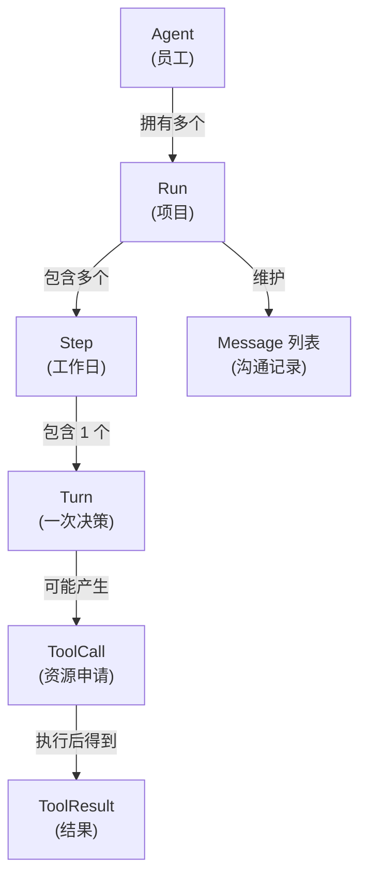
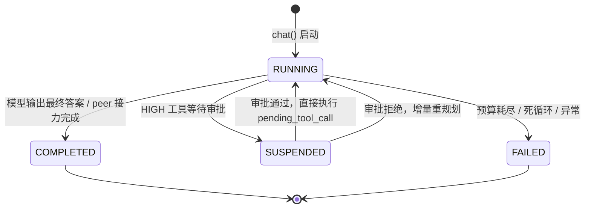

# 第 ① 站：核心词汇

> 在深入任何机制之前，先把词汇表对齐。Agent 领域最容易混淆的就是这些"看起来差不多"的概念。

---

## 一句话定义

| 概念 | 一句话 | 类比 |
|------|--------|------|
| **Agent** | 一个有身份、有系统提示、有工具集的实体 | 一个员工 |
| **Run** | 一次任务执行的完整生命周期 | 员工接的一个项目 |
| **Step** | 一次模型调用 + 至多一轮工具执行 | 项目里的一个工作日 |
| **Turn** | 模型的一次输出（可能含工具调用） | 工作日里的一次决策 |
| **Message** | 对话历史中的一条消息 | 沟通记录 |
| **ToolCall** | 模型请求调用一个工具 | 员工申请使用某个资源 |
| **ToolResult** | 工具执行后的返回 | 资源使用的结果 |

---

## 它们的包含关系



---

## 逐个拆解

### Agent — 有身份的执行者

```python
agent = Agent(
    name="researcher",            # 身份标识
    system_prompt="你是一个...",   # 行为准则
    tools=[search, fetch],        # 可用工具
    mode=ExecutionMode.REACTIVE,  # 执行模式
    config=AgentConfig(name="researcher"),  # 框架配置（LLM、预算、后端等）
)
```

**关键点**：
- Agent 是**无状态的配置对象**——它不保存某次任务的进度
- 同一个 Agent 可以同时跑多个 Run（并发）
- Agent 的身份（name）会出现在日志、审计、多 Agent 协作中
- LLM 客户端、预算、后端等通过 `AgentConfig` 传入，不是 Agent 的构造参数

> 为什么 Agent 不保存状态？因为这样才能支持并发和恢复。状态属于 Run，不属于 Agent。

### Run — 一次任务的完整生命周期

```python
@dataclass
class AgentRun:
    run_id: str              # 唯一标识
    task: str                # 用户的原始任务
    state: RunState          # RUNNING / COMPLETED / SUSPENDED / FAILED
    messages: MessageList    # 完整对话历史
    metrics: RunMetrics      # token / cost / turns 统计
    pending_tool_call: ToolCall | None  # 审批挂起时保存待执行的调用
    pending_approval_id: str | None     # 关联的审批请求 ID
    pending_handoff: PendingHandoff | None  # 多 Agent 接力的待交接包
    checkpoint_version: int  # 乐观并发控制版本号
```

**Run 的状态机**：



**关键点**：
- Run 是**可序列化的**——整个对象可以存到磁盘，下次加载继续跑
- `pending_tool_call` 是恢复的关键：审批挂起时保存工具调用，通过后直接执行，不重新问 LLM
- `checkpoint_version` 用于乐观并发，防止两个进程同时写同一个 Run
- `pending_handoff` 用于 peer 接力：当前 Agent 完成后把任务交给下一个 Agent

### Step — 代理的原子单位

这是 prodagent 最核心的抽象。**一个 Step = 一次模型调用 + 至多一轮工具执行。**

**`Step.run()` 内部依次执行：**

1. **`_prepare()`**
   - 预算检查（turns/tokens/cost/seconds 四轴）
   - 死循环检测（fingerprint 窗口比对）
   - 上下文组装（记忆召回 → 压缩 → 系统提示 + 消息）
2. **`_call_llm()`**
   - 硬超时（`max_seconds - elapsed`，`asyncio.wait_for` 掐断）
   - 流式 chunk 回调（思维链 token 实时发出）
   - 提示缓存边界标记
3. **`_account()`**
   - token/cost 记账（含缓存感知的 billable token 计算）
   - assistant 消息写入历史
   - `TOKEN_UPDATE` 事件
4. **`_end_turn()` 判断**
   - `stop_reason == END_TURN` → `RunState.COMPLETED`，返回
   - `stop_reason == TOOL_USE` → 继续执行工具
5. **`runner.run_batch(tool_calls)`**
   - 只读工具并行 / 写工具串行
   - 审批门 → 执行 → 结果写回
6. **再次预算检查**

**为什么 Step 是原子的？**

因为它是**可恢复的最小单位**。如果进程在 Step 中间被杀，下次恢复时：
- 如果 `pending_tool_call` 存在（审批挂起）→ 直接执行这个工具调用，不重新问 LLM
- 否则 → 最后一条未完成的 assistant 消息被 prune，模型重新决策

> 对比：很多框架把"多轮循环"写成一个大函数，中间状态散落在局部变量里，根本无法恢复。prodagent 把每一步的状态都收敛到 `AgentRun` 对象里，这是可恢复的前提。

### Turn — 模型的一次输出

Turn 是 Step 内部的概念。一个 Step 恰好包含一个 Turn（一次模型调用的输出）。

```python
@dataclass
class LLMResponse:
    content: str                    # 文本输出
    tool_calls: list[ToolCall]      # 请求的工具调用
    stop_reason: StopReason         # END_TURN / TOOL_USE / MAX_TOKENS / CONTENT_FILTER
    input_tokens: int = 0
    output_tokens: int = 0
    model: str = ""
    cache_read_tokens: int = 0      # 提示缓存命中的 token
    cache_write_tokens: int = 0     # 写入缓存的 token
    reasoning_content: str = ""     # 思维链纯文本投影
    thinking_blocks: list[dict] = field(default_factory=list)  # 原始思维块（含签名）
    from_cache: bool = False        # 是否由缓存客户端直接返回

    @property
    def total_tokens(self) -> int:   # property，不是字段
        return self.input_tokens + self.output_tokens
```

**StopReason 的含义**（以 Anthropic 词汇为规范）：

| 值 | 含义 | 下一步 |
|---|---|---|
| `END_TURN` | 模型说完了，没有工具调用 | Step 结束，Run 完成 |
| `TOOL_USE` | 模型要调用工具 | 执行工具，然后进入下一个 Step |
| `MAX_TOKENS` | 输出被截断了 | 通常意味着需要继续（或调整 max_tokens） |
| `CONTENT_FILTER` | 内容被安全过滤 | Run 失败 |

> **注意**：`StopReason` 是 StrEnum，值为 `"end_turn"` / `"tool_use"` / `"max_tokens"` / `"content_filter"`。不是 `"tool_calls"`。

### ToolCall — 模型的工具调用请求

```python
@dataclass
class ToolCall:
    name: str                    # 工具名
    params: dict[str, Any]       # 参数字典（注意是 params，不是 args）
    call_id: str = ""            # 唯一标识，用于关联 tool result
    metadata: dict = field(default_factory=dict)

    @property
    def params_hash(self) -> str:  # 参数的 SHA256 哈希前 16 位，用于幂等键
        ...
```

### Message — 对话历史

Message 就是 OpenAI 格式的消息字典，没有额外封装：

```python
Message = dict[str, Any]  # {"role": "user"|"assistant"|"tool", "content": ...}

# user 消息
{"role": "user", "content": "巴黎今天天气如何？"}

# assistant 消息可能带 tool_calls
{"role": "assistant", "content": "", "tool_calls": [
    {"id": "call_abc", "type": "tool_use", "name": "search",
     "input": {"query": "巴黎天气"}}
]}

# tool 消息必须带 tool_call_id
{"role": "tool", "tool_call_id": "call_abc", "content": "搜索结果..."}
```

**为什么不封装成类？**
- 与 LLM API 格式直接对齐，减少转换层
- 序列化/反序列化零成本
- 上下文压缩时操作字典比操作对象灵活

---

## ToolOutcome：工具执行后的六种结局

工具执行后，`ToolDispatcher` 返回 `ToolResult`，其 `outcome` 字段告诉循环该怎么做：

```python
class ToolOutcome(StrEnum):
    OK = "ok"              # 成功，结果写回消息历史，继续下一轮
    RETRY = "retry"        # 可重试错误（YELLOW），模型看到错误后自行调整
    ABORT = "abort"        # 不可重试错误（RED），Run 失败
    BLOCKED = "blocked"    # 被权限/策略拦截，模型看到拦截原因
    SUSPENDED = "suspended"  # 审批挂起，Run 暂停等人
    HANDOFF = "handoff"    # peer 接力，当前 Run COMPLETED，交给下一个 Agent
```

这六种结局覆盖了工具执行的所有可能——不是只有"成功"和"失败"两种。

---

## 容易混淆的点

### Q: Step 和 Turn 有什么区别？

**A: Turn 是模型的一次输出，Step 是"一次输出 + 工具执行"的完整原子。** 一个 Step 包含一个 Turn。你可以理解为：Turn 是模型的"思考结果"，Step 是"思考 + 行动"的完整一轮。

### Q: Run 和 Session 有什么区别？

**A: Run 是一次任务执行，Session 是跨多次 Run 的持久上下文。** Session 通过 `SessionStore` 端口持久化对话历史，同一个 session 中的多次 `chat()` 共享历史记忆。

### Q: 为什么预算检查在 Step 的开头和结尾各做一次？

**A: 开头检查是"这一轮还能不能开始"，结尾检查是"这一轮做完后还能不能继续"。** 中间的模型调用可能消耗了大量 token/cost，所以执行完工具后必须再查一次。

### Q: SideEffectLevel 有哪些值？

**A: LOW / MEDIUM / HIGH 三个值**，加上 `ToolMeta.is_readonly: bool` 表示只读。没有 CRITICAL，也没有 READONLY 这个枚举值——只读通过 `readonly=True` 或 `is_readonly=True` 表示。详见 [第 ④ 站：工具系统](04-tools.md)。

---

## 代码定位

| 概念 | 源码位置 |
|------|---------|
| Agent | `runtime/agent.py` |
| AgentRun | `kernel/state.py` |
| Step | `kernel/step.py` |
| ReactiveLoop | `kernel/loop.py` |
| LLMResponse / ToolCall / StopReason / ToolMeta / ToolResult | `kernel/types.py` |
| RunState / ExecutionMode / Message | `base/types.py` |
| HardBudget | `kernel/budget.py` |

---

## 下一步

👉 **[第 ② 站：端口与契约 →](02-ports.md)** — 为什么用 Protocol 而不是继承？17 个端口怎么分工？
