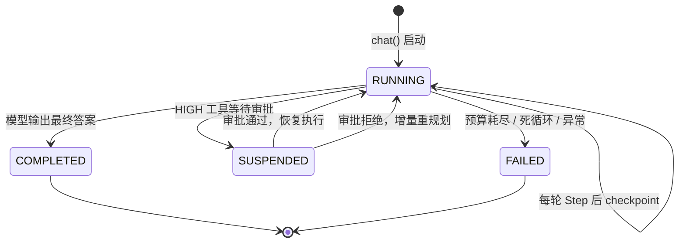

# 第 ① 站：核心词汇

> 在深入任何机制之前，先把词汇表对齐。Agent 领域最容易混淆的就是这些"看起来差不多"的概念。

---

## 一句话定义

| 概念 | 一句话 | 类比 |
|------|--------|------|
| **Agent** | 一个有身份、有系统提示、有工具集的实体 | 一个员工 |
| **Run** | 一次任务执行的完整生命周期 | 员工接的一个项目 |
| **Step** | 一次模型调用 + 至多一轮工具执行 | 项目里的一个工作日 |
| **Turn** | 模型的一次输出（可能含工具调用） | 工作日里的一次决策 |
| **Message** | 对话历史中的一条消息 | 沟通记录 |
| **ToolCall** | 模型请求调用一个工具 | 员工申请使用某个资源 |
| **ToolResult** | 工具执行后的返回 | 资源使用的结果 |

---

## 它们的包含关系


---

## 逐个拆解

### Agent — 有身份的执行者

```python
agent = Agent(
    name="researcher",           # 身份标识
    system_prompt="你是一个...",  # 行为准则
    tools=[search, fetch],       # 可用工具
    mode=ExecutionMode.REACTIVE, # 执行模式
)
```

**关键点**：
- Agent 是**无状态的配置对象**——它不保存某次任务的进度
- 同一个 Agent 可以同时跑多个 Run（并发）
- Agent 的身份（name）会出现在日志、审计、多 Agent 协作中

> 为什么 Agent 不保存状态？因为这样才能支持并发和恢复。状态属于 Run，不属于 Agent。

### Run — 一次任务的完整生命周期

```python
@dataclass
class AgentRun:
    run_id: str              # 唯一标识
    task: str                # 用户的原始任务
    state: RunState          # RUNNING / COMPLETED / SUSPENDED / FAILED
    messages: MessageList    # 完整对话历史
    metrics: RunMetrics      # token / cost / turns 统计
    pending_tool_call: ...   # 审批挂起时保存待执行的调用
    checkpoint_version: int  # 乐观并发控制版本号
```

**Run 的状态机**：



**关键点**：
- Run 是**可序列化的**——整个对象可以存到磁盘，下次加载继续跑
- `pending_tool_call` 是恢复的关键：审批挂起时保存工具调用，通过后直接执行，不重新问 LLM
- `checkpoint_version` 用于乐观并发，防止两个进程同时写同一个 Run

### Step — 代理的原子单位

这是 prodagent 最核心的抽象。**一个 Step = 一次模型调用 + 至多一轮工具执行。**

**`Step.run()` 内部依次执行：**

1. **`_prepare()`**
   - 预算检查（turns/tokens/cost/seconds）
   - 死循环检测（fingerprint 窗口比对）
   - 上下文组装（system + messages）
2. **`_call_llm()`**
   - 硬超时（max_seconds - elapsed）
   - 流式 chunk 回调
   - cache_boundary 标记
3. **`_account()`**
   - token/cost 记账
   - assistant 消息写入历史
   - TOKEN_UPDATE 事件
4. **`_end_turn()`**
   - 是 → `RunState.COMPLETED`，返回
   - 否 → 继续执行工具
5. **`runner.run_batch(tool_calls)`**
   - 权限 → 审批 → 执行 → 结果写回
6. **再次预算检查**

**为什么 Step 是原子的？**

因为它是**可恢复的最小单位**。如果进程在 Step 中间被杀，下次恢复时：
- 如果模型调用已完成但工具未执行 → 从 `pending_tool_call` 恢复，直接执行工具
- 如果模型调用未完成 → 重新执行整个 Step（模型调用是幂等的吗？不一定，但这是唯一安全的选择）

> 对比：很多框架把"多轮循环"写成一个大函数，中间状态散落在局部变量里，根本无法恢复。prodagent 把每一步的状态都收敛到 `AgentRun` 对象里，这是可恢复的前提。

### Turn — 模型的一次输出

Turn 是 Step 内部的概念。一个 Step 恰好包含一个 Turn（一次模型调用的输出）。

```python
@dataclass
class LLMResponse:
    content: str                    # 文本输出
    tool_calls: list[ToolCall]      # 请求的工具调用
    stop_reason: StopReason         # end_turn / tool_calls / max_tokens
    input_tokens: int
    output_tokens: int
    reasoning_content: str          # 思维链（如果模型支持）
```

**StopReason 的含义**：
- `end_turn` — 模型说完了，没有工具调用 → Step 结束，Run 可能完成
- `tool_calls` — 模型要调用工具 → 执行工具，然后进入下一个 Step
- `max_tokens` — 输出被截断了 → 通常意味着需要继续

### Message — 对话历史

Message 就是 OpenAI 格式的消息字典，没有额外封装：

```python
Message = dict[str, Any]  # {"role": "user"|"assistant"|"tool", "content": ...}

# assistant 消息可能带 tool_calls
{"role": "assistant", "content": "", "tool_calls": [{"id": "...", "function": {...}}]}

# tool 消息必须带 tool_call_id
{"role": "tool", "tool_call_id": "...", "content": "搜索结果..."}
```

**为什么不封装成类？**
- 与 LLM API 格式直接对齐，减少转换层
- 序列化/反序列化零成本
- 上下文压缩时操作字典比操作对象灵活

---

## 容易混淆的点

### Q: Step 和 Turn 有什么区别？

**A: Turn 是模型的一次输出，Step 是"一次输出 + 工具执行"的完整原子。** 一个 Step 包含一个 Turn。你可以理解为：Turn 是模型的"思考结果"，Step 是"思考 + 行动"的完整一轮。

### Q: Run 和 Session 有什么区别？

**A: Run 是一次任务执行，Session 是跨多次 Run 的持久上下文。** 比如你和客服聊了 3 天，每天的对话是一个 Run，但它们共享同一个 Session（记住你的订单信息、偏好）。

### Q: 为什么预算检查在 Step 的开头和结尾各做一次？

**A: 开头检查是"这一轮还能不能开始"，结尾检查是"这一轮做完后还能不能继续"。** 中间的模型调用可能消耗了大量 token/cost，所以执行完工具后必须再查一次。如果只在开头检查，可能出现"这一轮开始时预算够，但做完后已经超了"的情况。

---

## 代码定位

| 概念 | 源码位置 |
|------|---------|
| Agent | `runtime/agent.py` |
| AgentRun | `kernel/state.py` |
| Step | `kernel/step.py` |
| LLMResponse / Message | `kernel/types.py` |
| RunState / StopReason | `kernel/types.py` |

---

## 下一步

👉 **[第 ② 站：端口与契约 →](02-ports.md)** — 为什么用 Protocol 而不是继承？14 个端口怎么分工？
