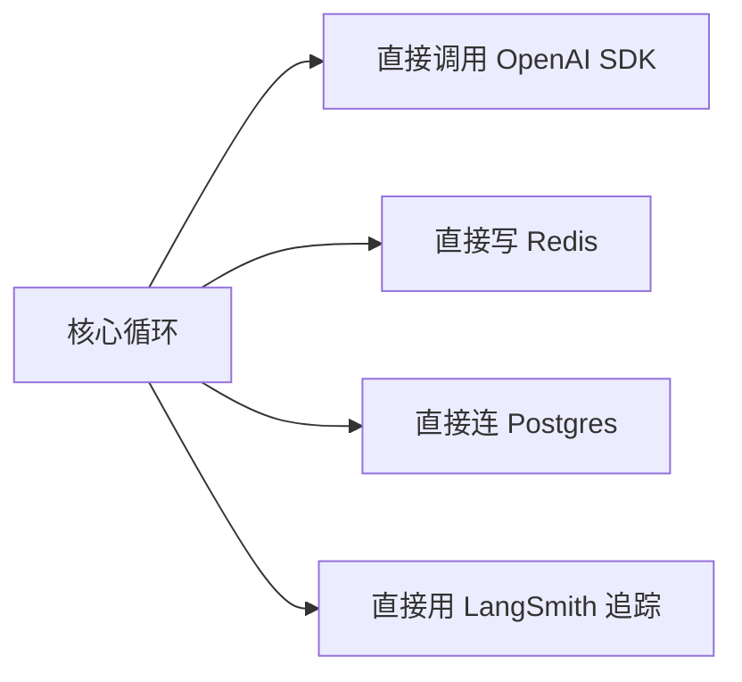
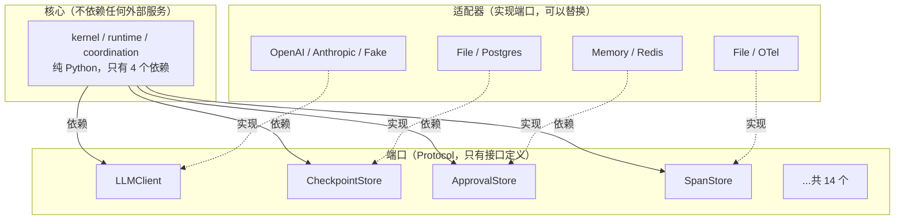

# 第 ② 站：端口与契约

> 为什么 prodagent 核心只有 4 个依赖？因为所有"会变的东西"都被隔离在端口后面。这一站讲清楚六边形架构在这个项目里是怎么落地的。

---

## 问题：Agent 框架最容易死在哪？



这样写的问题：
1. **换模型要改核心代码** — 从 OpenAI 换到 Anthropic，到处都是 `openai.ChatCompletion.create`
2. **测试要连真实服务** — 跑个单元测试得起 Redis、Postgres
3. **依赖爆炸** — 核心包间接依赖了十几个 SDK
4. **用户被绑架** — 想用这个框架就得用它选定的技术栈

prodagent 的解法：**端口-适配器模式（Ports & Adapters）**，也叫六边形架构。

---

## 核心思想



**核心只依赖端口（接口），不依赖具体实现。** 实现可以在运行时注入，也可以按需安装。

---

## 为什么用 Protocol 而不是 ABC？

Python 有两种定义接口的方式：

```python
# 方式 1：抽象基类（ABC）
from abc import ABC, abstractmethod

class LLMClient(ABC):
    @abstractmethod
    async def complete(self, messages, ...): ...

# 方式 2：结构类型（Protocol）
from typing import Protocol, runtime_checkable

@runtime_checkable
class LLMClient(Protocol):
    async def complete(self, messages, ...): ...
```

prodagent 全部用 Protocol。原因：

| 维度 | ABC | Protocol |
|------|-----|----------|
| 继承要求 | 必须 `class OpenAIClient(LLMClient)` | 不需要，只要方法签名匹配 |
| 第三方适配 | 需要改第三方类的继承关系 | 直接用，零修改 |
| 运行时检查 | `isinstance(x, LLMClient)` 检查继承链 | `isinstance(x, LLMClient)` 检查结构 |
| 组合 | 单继承限制 | 一个类可以同时满足多个 Protocol |

> 简单说：ABC 是"你必须是我的子类"，Protocol 是"你只要长得像我就行"。对于框架来说，Protocol 的侵入性低得多。

---

## 14 个端口全景

prodagent 定义了 14 个端口，按职责分组：

### 模型与推理

| 端口 | 职责 | 默认实现 | 生产实现 |
|------|------|---------|---------|
| `LLMClient` | 调用大模型，支持流式 | FakeLLM | OpenAI / Anthropic |
| `LLMConfig` | 模型配置 + 定价表 | 内置 | 按模型填充 |

### 持久化与恢复

| 端口 | 职责 | 默认实现 | 生产实现 |
|------|------|---------|---------|
| `CheckpointStore` | Run 状态快照，支持乐观并发 | FileCheckpoint | PostgresCheckpoint |
| `SessionStore` | 跨 Run 的会话上下文 | FileSession | PostgresSession |
| `DocumentStore` | RAG 文档存储 | MemoryDocument | Neo4jDocument |
| `ExperienceStore` | 技能/经验存储 | FileExperience | PostgresExperience |

### 消息与协作

| 端口 | 职责 | 默认实现 | 生产实现 |
|------|------|---------|---------|
| `MessageBus` | 跨 Agent 消息管道 | InMemory | Redis / NATS |
| `DeadLetterStore` | 失败消息存档 | Memory | Postgres |
| `Lock` | 分布式锁 | InMemory | Redis / Postgres advisory |

### 可观测与治理

| 端口 | 职责 | 默认实现 | 生产实现 |
|------|------|---------|---------|
| `SpanStore` | 链路追踪落盘 | FileSpan | OpenTelemetry |
| `EventLog` | 事件日志 | MemoryEventLog | File / Postgres |
| `ApprovalStore` | 审批请求持久化 | MemoryApproval | PostgresApproval |
| `Cache` | LLM 语义缓存 | MemoryCache | Redis |

### 执行

| 端口 | 职责 | 默认实现 | 生产实现 |
|------|------|---------|---------|
| `LeafExecutor` | 单步执行器（用于 DAG） | 内置 | 可自定义 |

---

## 深入一个端口：CheckpointStore

这是最能体现"端口设计功力"的例子。

```python
@runtime_checkable
class CheckpointStore(Protocol):
    # ── BASE（必须实现）──────────────────────────
    async def save(self, run: AgentRun, expected_version: int | None = None) -> None:
        """幂等原子持久化。expected_version 启用乐观并发。"""
        ...

    async def load(self, run_id: str, version: int | None = None) -> AgentRun | None:
        """返回 Run 或 None。version=None 表示最新。"""
        ...

    async def list_run_ids(self) -> list[str]:
        """所有有 checkpoint 的 run id。"""
        ...

    # ── EXTENDED（可选实现）──────────────────────
    async def fork(self, run_id: str, at_version: int, new_run_id: str | None = None) -> str:
        """从历史快照创建新 Run。没有版本历史的实现可以抛 NotImplementedError。"""
        ...

    async def list_versions(self, run_id: str) -> list[int]:
        """可用版本号，升序。"""
        ...
```

**设计亮点：**

1. **BASE / EXTENDED 分级** — 不是所有后端都支持版本历史（fork），但所有后端都必须支持基础的 save/load。这样 file 后端可以快速上线，postgres 后端可以提供完整能力。

2. **`expected_version` 乐观并发** — 不是"加锁"，而是"我以为当前版本是 N，如果不是就报错"。这比分布式锁更轻量，也更适合云原生环境。

3. **`load` 返回 `None` 而不是抛异常** — 不存在是正常情况，用 None 表示，调用方用 `if store is not None` 处理，比 try/except 更清晰。

4. **注释说明了契约** — "Idempotent atomic persist" 告诉实现者：save 必须是幂等的、原子的。这不是建议，是契约。

---

## 后端工厂：按需装配

```python
# backends/factory.py
def build_backends(config: FrameworkConfig) -> BackendBundle:
    """根据配置装配所有后端。未配置的用默认实现。"""
    return BackendBundle(
        checkpoint=build_checkpoint(config.checkpoint),
        session=build_session(config.session),
        span=build_span(config.span),
        # ...
    )
```

用户只需要配置想用的后端，没配置的自动用 memory/file 默认值：

```python
# 只用 postgres 做 checkpoint，其他全默认
config = FrameworkConfig(
    checkpoint=PostgresConfig(dsn="..."),
    # session、span、cache 等自动用 memory/file
)
```

---

## 这对你意味着什么？

### 场景 1：我想换向量数据库

不需要改核心代码。实现 `DocumentStore` Protocol，注册到工厂，完事。核心循环根本不知道你用的是 Neo4j 还是 Milvus。

### 场景 2：我想接入公司内部的模型服务

实现 `LLMClient` Protocol，只要有一个 `async def complete(...)` 方法。不需要继承任何基类，不需要导入框架的任何东西。

### 场景 3：我想做单元测试

用 FakeLLM + MemoryStore，零外部依赖，1,182 个测试全离线跑。这就是为什么 prodagent 的测试不 flaky。

---

## 与其他框架的对比

| 框架 | 接口方式 | 换后端成本 | 核心依赖数 |
|------|---------|-----------|-----------|
| **prodagent** | Protocol（结构类型） | 实现一个接口，零继承 | 4 |
| LangChain | ABC + 大量基类 | 通常需要继承并重写多个方法 | 数十个（间接） |
| LlamaIndex | ABC + 特定基类 | 需要适配层 | 数十个（间接） |
| AutoGen | 直接依赖特定 SDK | 高 | 多 |

---

## 代码定位

| 内容 | 源码位置 |
|------|---------|
| 所有端口定义 | `ports/` |
| 后端实现 | `backends/file/` `backends/memory/` `backends/postgres/` 等 |
| 后端工厂 | `backends/factory.py` |
| 后端注册表 | `backends/registry.py` |

---

## 下一步

👉 **[第 ③ 站：模型层 →](03-llm.md)** — LLMClient 端口怎么设计？流式回调、缓存边界、定价模型怎么工作？
