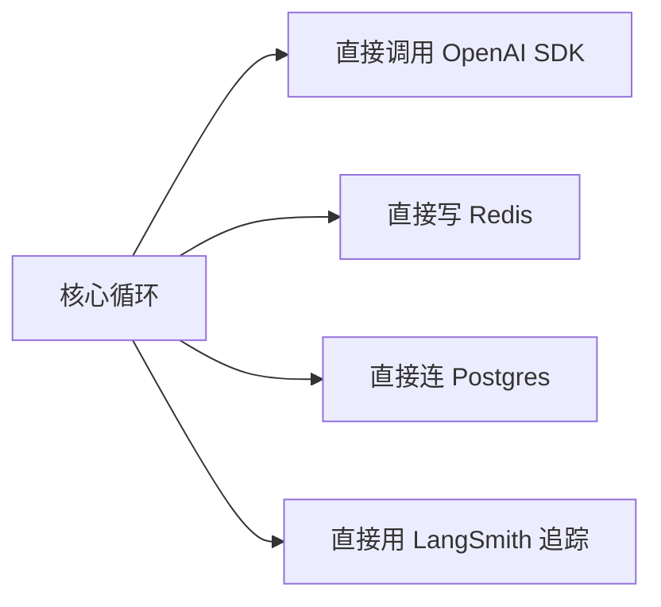
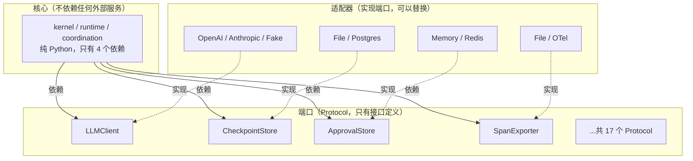

# 第 ② 站：端口与契约

> 为什么 prodagent 核心只有 4 个依赖？因为所有"会变的东西"都被隔离在端口后面。这一站讲清楚六边形架构在这个项目里是怎么落地的。

---

## 问题：Agent 框架最容易死在哪？



这样写的问题：
1. **换模型要改核心代码** — 从 OpenAI 换到 Anthropic，到处都是 `openai.ChatCompletion.create`
2. **测试要连真实服务** — 跑个单元测试得起 Redis、Postgres
3. **依赖爆炸** — 核心包间接依赖了十几个 SDK
4. **用户被绑架** — 想用这个框架就得用它选定的技术栈

prodagent 的解法：**端口-适配器模式（Ports & Adapters）**，也叫六边形架构。

---

## 核心思想



**核心只依赖端口（接口），不依赖具体实现。** 实现可以在运行时注入，也可以按需安装。

---

## 为什么用 Protocol 而不是 ABC？

Python 有两种定义接口的方式：

```python
# 方式 1：抽象基类（ABC）
from abc import ABC, abstractmethod
class LLMClient(ABC):
    @abstractmethod
    async def complete(self, messages, ...): ...

# 方式 2：结构类型（Protocol）
from typing import Protocol, runtime_checkable
@runtime_checkable
class LLMClient(Protocol):
    async def complete(self, messages, ...): ...
```

prodagent 全部用 Protocol。原因：

| 维度 | ABC | Protocol |
|------|-----|----------|
| 继承要求 | 必须 `class OpenAIClient(LLMClient)` | 不需要，只要方法签名匹配 |
| 第三方适配 | 需要改第三方类的继承关系 | 直接用，零修改 |
| 运行时检查 | `isinstance(x, LLMClient)` 检查继承链 | `isinstance(x, LLMClient)` 检查结构 |
| 组合 | 单继承限制 | 一个类可以同时满足多个 Protocol |

> 简单说：ABC 是"你必须是我的子类"，Protocol 是"你只要长得像我就行"。对于框架来说，Protocol 的侵入性低得多。

---

## 17 个端口全景

prodagent 在 `ports/__init__.py` 中导出了 17 个可替换的 Protocol 端口（`ports/` 目录下一共 20 个 Protocol，另 3 个是内部协作契约 `StageStore` / `ActivationPolicy` / `SpendView`；外加 `LockToken` 这样的非 Protocol 辅助类型），按职责分组：

### 模型与执行

| 端口 | 职责 | 内置实现 |
|------|------|---------|
| `LLMClient` | 调用大模型，支持流式和思维链 | FakeLLM / OpenAI 兼容 / Anthropic |
| `Tool` | 工具的统一接口（FunctionTool 是主要实现） | `@tool` 装饰器生成 |
| `LeafExecutor` | DAG 中单个步骤的执行器 | 内置默认实现，可自定义 |
| `RunnerPort` | 激活一个 agent 执行一次 run（spawn 子任务、舞台成员发言） | `InProcessRunner`（本进程）/ `InProcessChatRunner`（成员会话） |

### 持久化与记忆

| 端口 | 职责 | 支持的后端 |
|------|------|-----------|
| `CheckpointStore` | Run 状态快照，支持乐观并发和版本历史 | `file` / `postgres` |
| `SessionStore` | 跨 Run 的会话上下文持久化 | `file` / `postgres` |
| `DocumentStore` | RAG 文档存储（记忆的文档通道） | `file` / `postgres` |
| `GraphStore` | 知识图谱存储（实体-关系） | `file` / `neo4j` |
| `ExperienceStore` | 技能/经验存储 | `file` |

### 消息与协作

| 端口 | 职责 | 支持的后端 |
|------|------|-----------|
| `Transport` | 多 Agent 消息平面（Crossing 管道） | 进程内实现（`coordination/messaging/`） |
| `DeadLetterStore` | 失败消息/任务存档 | `memory` / `redis` |
| `LockStore` | 分布式锁 + 幂等键（含 `LockToken`） | `memory` / `redis` |

### 可观测与治理

| 端口 | 职责 | 支持的后端 |
|------|------|-----------|
| `SpanExporter` | 链路追踪导出 | `file` / `postgres` |
| `EventLog` | 事件日志（追加写入，可回放） | `file` / `postgres` |
| `ApprovalStore` | 审批请求持久化 | `memory` |
| `CacheStore` | LLM 响应缓存 | `memory` / `redis` |

### 预算

| 端口 | 职责 | 内置实现 |
|------|------|---------|
| `BudgetLedgerPort` | 多 Agent 共享预算账本（含 `SpendView`） | 内核 `BudgetLedger` |

> **注意**：`LLMConfig` 是和 `LLMClient` 定义在同一个文件里的 dataclass，不是 Protocol 端口。它是端口契约的一部分——配置即契约。

### 另外 3 个 Protocol：不是给你换后端用的
`ports/` 目录下一共 20 个 Protocol，除了上面 17 个"可替换端口"，还有 3 个**框架内部协作时用的契约**：`StageStore`（三种舞台共享状态的存储约定）、`ActivationPolicy`（这轮谁发言的排班策略）、`SpendView`（预算账本对外暴露的只读视图）。它们平时不直接面向使用者，但**同样放在 ports 而不是实现层**，原因和下面的跨进程定义一致——协作层（coordination）只依赖契约、不依赖某个具体实现，将来把协作搬到分布式进程里时，换一个实现就行，协作代码一行不改。这也说明判断"该不该放 ports"的标准不是"用户会不会换它"，而是"**上层是不是只该依赖它的抽象**"。

> **小白加餐：`@runtime_checkable` 是什么？** 普通 Protocol 主要用于静态类型检查；加上 `@runtime_checkable` 后，你还能在运行时用 `isinstance(x, LLMClient)` 判断"x 是不是长得像这个端口"。注意它检查的是**结构**（有没有要求的方法），不是继承关系——这正是"结构化子类型（鸭子类型的静态版本）"的含义：不要求你"是我的子类"，只要求你"有我要的样子"。

---

## 跨进程传递的定义也在 ports

端口解决"换后端"的问题。还有一类相邻的问题：一个对象要跨进程传递，它的定义放哪？放在业务层，远端就得跟着 import 你的业务代码。prodagent 把这类定义也放在 ports：

| 定义 | 内容 | 位置 |
|------|------|------|
| `AgentSpec` | Agent 的可序列化投影：名字、提示、模式、预算、工具 schema、子/同伴规格，`to_dict` / `from_dict` 无损往返 | `ports/agent_spec.py` |
| `AgentEvent` + 编解码 | 九种流事件和 `event_to_wire` / `event_from_wire`；JSON-able 载荷无损往返，其他对象降级为文本 | `ports/agent_events.py` |
| `Activation` / `HandoffActivation` | 舞台拓扑每轮的排班（成员 + 派发方式）；接力链的下一跳 | `ports/activation.py` / `ports/runner.py` |

`AgentConfig` 持有的是 LLM 客户端、hooks、存储这些活对象，序列化不了；`Agent.spec()` 投影出的 `AgentSpec` 才能发到远端，接收方拿它对 roster 解析。事件同理：执行器输出、playground、远端平面共享同一份定义，`kernel/types.py` 只是重导出，消费方的导入路径不用改。

---

## 后端配置：BackendConfig

所有后端通过 `BackendConfig` 选择，用字符串字面量类型约束可选值：

```python
@dataclass
class BackendConfig:
    # 持久化类 — file 或 postgres
    document:   Literal["file", "postgres"] = "file"
    checkpoint: Literal["file", "postgres"] = "file"
    event_log:  Literal["file", "postgres"] = "file"
    span:       Literal["file", "postgres"] = "file"
    session:    Literal["file", "postgres"] = "file"
    experience: Literal["file"] = "file"            # 目前仅 file

    # 瞬时状态类 — memory 或 redis
    cache:       Literal["memory", "redis"] = "memory"
    lock:        Literal["memory", "redis"] = "memory"
    dead_letter: Literal["memory", "redis"] = "memory"
    approval:    Literal["memory"] = "memory"       # 目前仅 memory

    # 图存储
    graph: Literal["file", "neo4j"] = "file"
```

**为什么分两组？** 注释写得很清楚：
- **持久化状态**（document/checkpoint/event_log/span/session）→ 关系型或文件，需要 durability
- **瞬时状态**（cache/lock/approval/dead_letter）→ 单机 memory 或多副本 redis
- **图结构**（graph）→ 天然适合图数据库 neo4j

### 两种 profile

```python
from prodagent.base.config import bare, production

# bare()：裸核 — 无持久化、无审批、无缓存、无压缩
# 适合：单元测试、CLI 一次性任务
config = FrameworkConfig(backend=bare())

# production()：全套 — file 后端 + 压缩 + spill + 审批门 + 缓存
# 适合：生产部署
config = FrameworkConfig(backend=production())
```

| 能力 | bare() | production() |
|------|--------|-------------|
| checkpoint | 不开启（None） | file |
| event_log | 不开启 | file |
| session_store | memory | file |
| span 导出 | 不开启 | file |
| 审批门 | 不挂载 | 挂载 |
| LLM 缓存 | 不开启 | 开启 |
| 上下文压缩 | 不开启 | 开启 + spill |

---

## 深入一个端口：CheckpointStore

这是最能体现"端口设计功力"的例子。

```python
@runtime_checkable
class CheckpointStore(Protocol):
    """Durable snapshot path — save and resume a run.

    Capabilities:
      BASE (required): save, load, list_run_ids
      EXTENDED (optional): fork, list_versions
    """

    # ── BASE（必须实现）──────────────────────────
    async def save(self, run: AgentRun, expected_version: int | None = None) -> None:
        """幂等原子持久化。expected_version 启用乐观并发。"""
        ...

    async def load(self, run_id: str, version: int | None = None) -> AgentRun | None:
        """返回 Run 或 None。version=None 表示最新。"""
        ...

    async def list_run_ids(self) -> list[str]:
        """所有有 checkpoint 的 run id。"""
        ...

    # ── EXTENDED（可选实现）──────────────────────
    async def fork(self, run_id: str, at_version: int, new_run_id: str | None = None) -> str:
        """从历史快照创建新 Run。没有版本历史的实现可以抛 NotImplementedError。"""
        ...

    async def list_versions(self, run_id: str) -> list[int]:
        """可用版本号，升序。"""
        ...
```

**设计亮点：**

1. **BASE / EXTENDED 分级** — 不是所有后端都支持版本历史（fork），但所有后端都必须支持基础的 save/load。file 后端可以快速上线，postgres 后端可以提供完整能力。
2. **`expected_version` 乐观并发** — 不是"加锁"，而是"我以为当前版本是 N，如果不是就报错"。这比分布式锁更轻量，也更适合云原生环境。
3. **`load` 返回 `None` 而不是抛异常** — 不存在是正常情况，用 None 表示，调用方用 `if run is not None` 处理，比 try/except 更清晰。
4. **注释说明了契约** — "Idempotent atomic persist" 告诉实现者：save 必须是幂等的、原子的。这不是建议，是契约。

---

## 后端工厂：resolve_* 系列

后端通过 `backends/factory.py` 中的 `resolve_*` 函数按需装配：

```python
from prodagent.backends.factory import (
    resolve_checkpoint,    # → CheckpointStore
    resolve_session_store, # → SessionStore
    resolve_event_log,     # → EventLog
    resolve_span_exporter, # → SpanExporter
    resolve_document,      # → DocumentStore
    resolve_cache,         # → CacheStore
    resolve_approval,      # → ApprovalStore
    resolve_lock,          # → LockStore
    resolve_dead_letter,   # → DeadLetterStore
    resolve_graph,         # → GraphStore
    resolve_experience,    # → ExperienceStore
    resolve_llm,           # → LLMClient
)
```

每个函数接受 `FrameworkConfig | None`，未配置时返回合理的默认值。Agent 构造时自动调用这些函数，用户通常不需要直接接触。

---

## 这对你意味着什么？

### 场景 1：我想换向量数据库

实现 `DocumentStore` Protocol，在 `BackendConfig` 中注册，完事。核心循环根本不知道你用的是什么后端。

### 场景 2：我想接入公司内部的模型服务

实现 `LLMClient` Protocol，只要有一个 `async def complete(...)` 方法。不需要继承任何基类，不需要导入框架的任何东西。

```python
class MyInternalLLM:
    async def complete(self, messages, *, system="", tools=None,
                       config=None, on_chunk=None) -> LLMResponse:
        # 调用内部模型服务，返回标准化的 LLMResponse
        ...
```

### 场景 3：我想做单元测试

用 FakeLLM + memory 后端，零外部依赖，1,300+ 个测试全离线跑。这就是为什么 prodagent 的测试不 flaky。

---

## 与其他框架的对比

| 框架 | 接口方式 | 换后端成本 | 核心依赖数 |
|------|---------|-----------|-----------|
| **prodagent** | Protocol（结构类型） | 实现一个接口，零继承 | 4 |
| LangChain | ABC + 大量基类 | 通常需要继承并重写多个方法 | 数十个（间接） |
| LlamaIndex | ABC + 特定基类 | 需要适配层 | 数十个（间接） |
| AutoGen | 直接依赖特定 SDK | 高 | 多 |

---

## 代码定位

| 内容 | 源码位置 |
|------|---------|
| 所有端口定义 | `ports/` |
| 端口导出汇总 | `ports/__init__.py` |
| 后端实现 | `backends/file/` `backends/memory/` `backends/postgres/` `backends/redis/` `backends/neo4j/` |
| 后端工厂 | `backends/factory.py` |
| BackendConfig | `base/config.py::BackendConfig` |
| bare() / production() | `base/config.py` |

---

## 下一步

👉 **[第 ③ 站：模型层 →](03-llm.md)** — LLMClient 端口怎么设计？流式回调、缓存边界、定价模型怎么工作？
